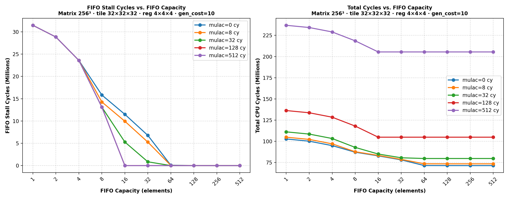
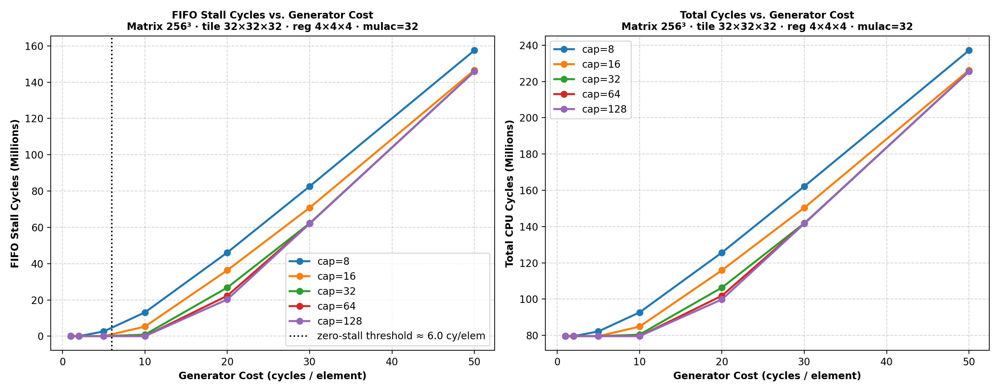

# PRNG FIFO Stall Analysis

Two experiments sweeping the FIFO parameters that affect stall behaviour:

1. **Stalls vs. FIFO capacity** — for different `mulac_cycles` values
2. **Stalls vs. generation cost** — for different FIFO capacities

> [!NOTE]
> **Base Hardware Configuration:**
> * **Matrix Size:** $256 \times 256 \times 256$
> * **Operand Precision:** Asymmetric ($A, C = 8$ bytes, $B = 2$ bytes)
> * **L1 Cache:** 8 KB capacity, 8B line size, 4-way associativity, 4-cycle access, LRU replacement, Write-Back policy.
> * **L2 Cache:** 128 KB capacity, 64B line size, 8-way associativity, 15-cycle access, LRU replacement, Write-Back policy.
> * **DRAM Latency:** 180 cycles.
> * **Register Tile:** $4 \times 4 \times 4$ ($R_M \times R_N \times R_K$), compute cycles swept/fixed (mulac_cycles).
> * **PRNG FIFO Device:** Capacity swept (Experiment 1) or fixed (Experiment 2), generation cost swept (Experiment 2) or fixed (Experiment 1).


---

## Experiment 1 — Stalls vs. FIFO Capacity



**Fixed parameters:** matrix 256³, tile 32×32×32, reg tile 4×4×4, B precision 2 bytes,
`gen_cost = 10` cycles/element, C-stationary, `--Bfifo`.

### What the graph shows

The curves fall into three regimes:

**Small capacity (cap = 1–4): all mulac lines overlap**

The A register-tile load takes roughly 64 cycles (16 elements × L1 hit cost).
During those 64 cycles the FIFO can generate `floor(64 / gen_cost) = 6` elements.
For cap ≤ 4, the FIFO already reaches full capacity before mulac begins,
so the generator pauses for the entire mulac period regardless of how long mulac takes.
Extra mulac cycles buy zero additional buffering.

The threshold below which mulac is irrelevant:
```
cap × gen_cost  ≤  A_reg_load_cycles   →   cap ≤ floor(64 / 10) = 6
```

At cap = 1 we can verify the stall count analytically:
- Pattern per B tile: 1 element pre-buffered (free) + 15 elements each stalling `gen_cost - access_cycles = 8` cycles
- Stall cycles per B tile: `15 × 8 = 120`
- Total B tile reads: `8³ tile_groups × 8³ reg_tiles_per_group = 262,144`
- **Predicted:** `262,144 × 120 = 31,457,280`  — matches the simulation exactly.

**Medium capacity (cap = 8–32): lines diverge**

Once `cap × gen_cost > A_load_cycles`, the mulac period can contribute additional
pre-buffered elements. Higher mulac → more generation time → the FIFO has more
elements ready before each B tile read → fewer stalls. The lines fan out clearly.

At cap = 16:
- mulac = 128: gap between B reads = 64 + 128 = 192 cy → generates 19 elements ≥ 16 needed → **0 stalls**
- mulac = 32:  gap = 64 + 32 = 96 cy → generates 9 elements < 16 → stalls remain

**Large capacity: all lines reach zero**

Given enough buffer space, pre-fill from the FIFO session start (A/C cache tile loads
before the first B tile read) covers the initial burst, and higher generation per gap
keeps the FIFO replenished for subsequent tiles.

### Why mulac = 128 and mulac = 512 share the same saturation point

Both generate more than 16 elements per inter-B-tile gap (`192 cy → 19` and
`576 cy → 57` respectively). Once the gap generation rate exceeds consumption (16 per tile),
the FIFO capacity just needs to cover the startup transient — which is the same for both.
Hence both lines drop to zero at cap = 16.

---

## Experiment 2 — Stalls vs. Generation Cost



**Fixed parameters:** same matrix/tile/reg as above, `mulac_cycles = 32`,
FIFO capacity swept as lines, gen_cost swept on x-axis.

### What the graph shows

**Higher gen_cost → more stalls** — confirmed.

| gen_cost (cy/elem) | cap=8 stalls (M) | cap=16 | cap=32 | cap=64 | cap=128 |
|:-:|:-:|:-:|:-:|:-:|:-:|
| 1  | 0     | 0     | 0     | 0     | 0    |
| 2  | 0     | 0     | 0     | 0     | 0    |
| 5  | 2.62  | 0     | 0     | 0     | 0    |
| 10 | 13.11 | 5.29  | 0.85  | 0     | 0    |
| 20 | 46.11 | 36.34 | 26.79 | 22.28 | 20.25|
| 30 | 82.61 | 70.82 | 62.24 | **62.06** | **62.06** |
| 50 |157.57 |146.69 |**145.95**|**145.95**|**145.95**|

**There is a hard zero-stall threshold on gen_cost.**

The CPU consumes one B element per `access_cycles = 2` cycles during a B tile read,
and the inter-tile gap (A reg-tile load + mulac) takes `64 + 32 = 96` cycles.
Total time to process one B tile ≈ `16 × 2 + 96 = 128` cycles.
For the generator to keep up:
```
gen_cost  ≤  (A_load_cycles + mulac_cycles) / elements_per_B_tile
           ≈ (64 + 32) / 16  =  6 cycles/element
```
Below this threshold (gen_cost = 1 or 2 in the table), zero stalls regardless of FIFO size.
Above it, stalls grow roughly linearly with gen_cost.

**Larger FIFO stops helping once gen_cost is high enough.**

At gen_cost = 30 and 50, the stall counts for cap ≥ 32 converge to the **same value** (bold
in the table). The FIFO capacity becomes irrelevant because the generator is so slow that
the buffer never accumulates enough elements to matter — only the generation rate limits
throughput. Making the FIFO larger than the number of elements generated per full session
startup buys nothing.

The crossover: at gen_cost = 20, increasing cap from 8 → 128 still helps (~2× stall
reduction). At gen_cost = 30 and above, the cap=64 and cap=128 curves are
indistinguishable — pure generation-rate bottleneck.
