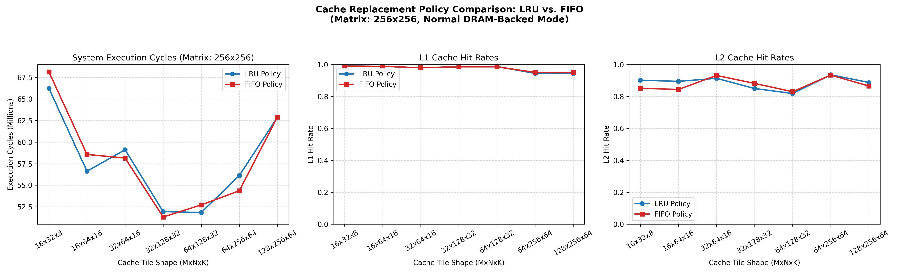

# Experiment 5: Cache Replacement Policy Sweep Report (LRU vs. FIFO)

This report details the performance and cache hit rate characteristics comparing the **LRU (Least Recently Used)** and **FIFO (First In, First Out)** cache eviction policies under Normal DRAM-backed mode.

## Performance & Cache Dashboard

---

## Comparison Data Table

| Cache Tile Shape | Policy | Total Cycles | L1 Hit Rate (Hits / Lookups) | L2 Hit Rate (Hits / Lookups) |
| :---: | :---: | :---: | :---: | :---: |
| **16x32x8** | LRU | 66,231,920 | 0.991 (14,093,320/14,221,312) | 0.902 (170,189/188,680) |
| **16x32x8** | FIFO | 68,140,528 | 0.990 (14,079,099/14,221,312) | 0.852 (164,736/193,352) |
| --- | --- | --- | --- | --- |
| **16x64x16** | LRU | 56,621,976 | 0.989 (11,731,534/11,862,016) | 0.895 (157,824/176,340) |
| **16x64x16** | FIFO | 58,566,368 | 0.989 (11,731,534/11,862,016) | 0.844 (154,931/183,568) |
| --- | --- | --- | --- | --- |
| **32x64x16** | LRU | 59,111,576 | 0.980 (11,110,973/11,337,728) | 0.914 (321,863/352,148) |
| **32x64x16** | FIFO | 58,151,904 | 0.980 (11,110,973/11,337,728) | 0.932 (336,788/361,360) |
| --- | --- | --- | --- | --- |
| **32x128x32** | LRU | 51,946,784 | 0.987 (10,026,025/10,158,080) | 0.850 (165,145/194,288) |
| **32x128x32** | FIFO | 51,322,080 | 0.986 (10,015,867/10,158,080) | 0.882 (184,260/208,912) |
| --- | --- | --- | --- | --- |
| **64x128x32** | LRU | 51,837,888 | 0.988 (9,777,185/9,895,936) | 0.819 (152,766/186,528) |
| **64x128x32** | FIFO | 52,721,760 | 0.986 (9,757,393/9,895,936) | 0.830 (169,997/204,816) |
| --- | --- | --- | --- | --- |
| **64x256x64** | LRU | 56,123,960 | 0.945 (8,794,276/9,306,112) | 0.936 (517,215/552,580) |
| **64x256x64** | FIFO | 54,357,816 | 0.951 (8,850,113/9,306,112) | 0.934 (462,072/494,724) |
| --- | --- | --- | --- | --- |
| **128x256x64** | LRU | 62,877,688 | 0.944 (8,661,238/9,175,040) | 0.888 (488,333/549,924) |
| **128x256x64** | FIFO | 62,903,624 | 0.950 (8,716,288/9,175,040) | 0.866 (426,131/492,068) |
| --- | --- | --- | --- | --- |

## Architectural Findings

### 1. LRU vs. FIFO Policy Interaction and Surprising Reversals
While LRU is theoretically superior for general-purpose workloads, matrix multiplication exhibits periodic data access strides that lead to **surprising reversals**:
* For shapes **32x64x16**, **32x128x32**, and **64x256x64**, **FIFO actually outperforms LRU**, reducing execution cycles by up to **1.7 million cycles** (a **3% performance improvement**).
* **Explanation (LRU Cache Pollution):** 
  During execution, Matrix B elements are read sequentially inside the innermost compute loop. Once a block of B is used, it will not be accessed again for a long time (until the next outer loop iteration). 
  Under **LRU**, because these B lines were accessed most recently, they are marked as MRU (Most Recently Used) and pushed to the back of the eviction queue, preserving them. This forces the cache to evict older lines of A and C that *do* have high temporal reuse in subsequent steps.
  Under **FIFO**, B lines are evicted first since they were inserted first, naturally preserving the older, highly-reused lines of C and A.

### 2. Large Tile Size Conflict Misses
* For shape **128x256x64**, LRU is slightly faster (62.8M vs 62.9M cycles).
* At this extremely large tile size, the active working set thrashes L2 cache regardless of the policy. However, LRU keeps a better hold on the high-reuse C output tile rows, yielding an 88.8% L2 hit rate compared to FIFO's 86.6%.
