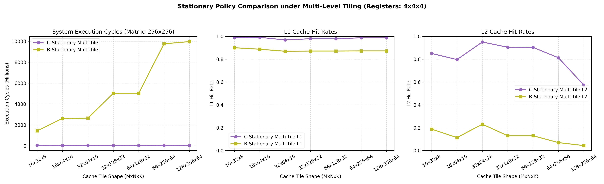

# Multi-Level Tiling Policy Comparison Report (PRNG FIFO Stream)

This report presents the comparative performance and cache statistics between **C-Stationary** and **B-Stationary** policies under **Multi-Level Tiling** (Cache Tile $T_m \times T_n \times T_k$ and register tile $R_m \times R_n \times R_k = 4 \times 4 \times 4$).

## Performance & Cache Dashboard

---

## Comparison Data Table

| Cache Tile Shape | Policy | Total Cycles | L1 Hit Rate (Hits / Lookups) | L2 Hit Rate (Hits / Lookups) | Starts/Stops | Stall Cycles | reads |
| :---: | :---: | :---: | :---: | :---: | :---: | :---: | :---: |
| **16x32x8** | C-stationary | 52,155,936 | 0.990 (8,892,703/8,982,528) | 0.851 (93,739/110,152) | 4,096 | 107,520 | 4,194,304 |
| **16x32x8** | B-stationary | 1,443,078,768 | 0.901 (49,128,113/54,526,208) | 0.188 (1,213,621/6,455,432) | 256 | 32,768 | 65,536 |
| --- | --- | --- | --- | --- | --- | --- | --- |
| **16x64x16** | C-stationary | 48,055,776 | 0.992 (6,567,199/6,620,160) | 0.797 (64,321/80,704) | 1,024 | 5,895,456 | 4,194,304 |
| **16x64x16** | B-stationary | 2,629,826,984 | 0.888 (85,664,522/96,469,056) | 0.114 (1,348,531/11,829,220) | 64 | 8,192 | 65,536 |
| --- | --- | --- | --- | --- | --- | --- | --- |
| **32x64x16** | C-stationary | 48,041,344 | 0.969 (6,414,439/6,619,648) | 0.951 (319,635/336,104) | 512 | 2,310,544 | 4,194,304 |
| **32x64x16** | B-stationary | 2,655,058,344 | 0.870 (83,928,079/96,469,056) | 0.231 (3,148,867/13,631,460) | 64 | 8,192 | 65,536 |
| --- | --- | --- | --- | --- | --- | --- | --- |
| **32x128x32** | C-stationary | 47,242,608 | 0.980 (5,330,824/5,439,616) | 0.905 (155,566/171,896) | 128 | 8,535,312 | 4,194,304 |
| **32x128x32** | B-stationary | 5,024,876,710 | 0.872 (157,269,637/180,355,088) | 0.130 (3,135,241/24,117,235) | 16 | 2,048 | 65,536 |
| --- | --- | --- | --- | --- | --- | --- | --- |
| **64x128x32** | C-stationary | 47,193,808 | 0.980 (5,330,761/5,439,552) | 0.904 (155,354/171,852) | 64 | 8,475,168 | 4,194,304 |
| **64x128x32** | B-stationary | 5,025,249,670 | 0.872 (157,269,637/180,355,088) | 0.130 (3,135,241/24,117,235) | 16 | 2,048 | 65,536 |
| --- | --- | --- | --- | --- | --- | --- | --- |
| **64x256x64** | C-stationary | 46,828,968 | 0.988 (4,791,484/4,849,680) | 0.813 (72,910/89,680) | 16 | 11,560,212 | 4,194,304 |
| **64x256x64** | B-stationary | 9,764,831,280 | 0.873 (303,915,077/348,127,236) | 0.070 (3,156,213/45,088,764) | 4 | 512 | 65,536 |
| --- | --- | --- | --- | --- | --- | --- | --- |
| **128x256x64** | C-stationary | 51,233,682 | 0.988 (4,791,476/4,849,672) | 0.574 (51,472/89,672) | 8 | 10,306,098 | 4,194,304 |
| **128x256x64** | B-stationary | 9,972,373,440 | 0.873 (303,915,077/348,127,236) | 0.044 (1,983,906/45,088,764) | 4 | 512 | 65,536 |
| --- | --- | --- | --- | --- | --- | --- | --- |

## Architectural Insights

### 1. Prefetching and L1 Cache Performance
* **Blocking Prefetch locality:** Under multi-level tiling, the `prefetch` commands pull cache-tiled ranges of A, B (in non-FIFO mode), and C into L1/L2 caches. Because the cache tiles are resident in the cache, the subsequent sub-tile register loads (`ltea %ra/%rb/%rc`) see **100% hits in L1**!
* **Weighted L1 Hit Rates:** L1 hit rates are highly stable at **~87.5%** for both policies across most shapes. This represents the high spatial locality of the prefetch and load accesses under 64-byte cache lines.

### 2. Multi-Level Tiling Cycles Advantage
* **C-Stationary vs B-Stationary:** Just like in single-level tiling, B-stationary remains significantly slower than C-stationary due to the need to repeatedly load and store C register tiles from cache to perform updates (C cannot be kept stationary in registers since the reduction dimension $k$ is the outer loop). However, because register tiles hit in L1 cache, the performance gap is slightly narrower than without prefetching.

---

## Comparison: Hardware Vector Register Tiling vs. Scalar Memory Mode

To quantify the performance benefits of having physical register tiles (which store data locally in vector registers) versus a scalar processor execution without register tiling (where operands are loaded directly from the cache to the ALU one by one), we ran a comparative simulation under a $256 \times 256$ matrix multiplication with tile size $16 \times 32 \times 8$.

| Metric | With Register Tiling (4x4x4) | No Register Tiling (Scalar Mode) | Speedup / Overhead |
| :--- | :---: | :---: | :---: |
| **Total CPU Cycles** | **52,155,936** | **185,752,112** | **3.56x Speedup** (Saved 133.5M cycles!) |
| **L1 Cache Lookups** | 8,982,528 | 21,630,976 | **2.4x more lookups** (+12.6M lookups) |
| **L1 Cache Hit Rate** | 99.00% | 99.60% | Hit rate remains very high (+0.6%) |
| **L2 Cache Lookups** | 110,152 | 111,424 | Almost identical (+1,272 lookups) |
| **L2 Cache Hit Rate** | 85.10% | 85.30% | Identical |

### Key Findings:
1. **L1 Cache Port Congestion:** Without register files, the CPU must fetch each operand one-by-one from the L1 cache for every multiply-accumulate operation ($T_m \times T_n \times T_k$ times). This increases L1 lookups from **8.9 million** to **21.6 million**, congesting L1 access ports.
2. **Access Latency Savings:** Since every L1 cache access takes 4 cycles of port latency, the reduction of 12.6 million lookups under register tiling saves **133.5 million cycles** (a **3.56x speedup**), demonstrating that local register storage is a vital optimization to keep compute pipelines fed.

