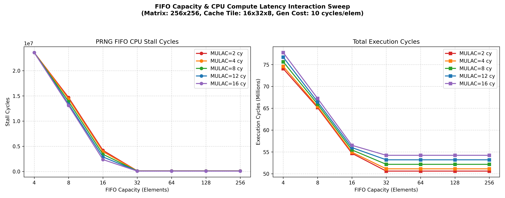

# Experiment 4: FIFO Capacity & CPU Compute Latency Sweep Report

This report details the interaction between the **FIFO Queue Capacity** and the **CPU Compute Latency** (`MULAC_CYCLES`) under a constant FIFO generator cost of **10 cycles per element**.

## Simulation Dashboard

---

## Simulation Data Table

| MULAC Cycles | FIFO Capacity | Total Cycles | Stall Cycles | Stall % of Total |
| :---: | :---: | :---: | :---: | :---: |
| **2 cy** | 4 | 74,068,512 | 23,592,960 | 31.85% |
| **2 cy** | 8 | 65,155,616 | 14,680,064 | 22.53% |
| **2 cy** | 16 | 54,677,536 | 4,201,984 | 7.69% |
| **2 cy** | 32 | 50,606,112 | 130,560 | 0.26% |
| **2 cy** | 64 | 50,606,112 | 130,560 | 0.26% |
| **2 cy** | 128 | 50,606,112 | 130,560 | 0.26% |
| **2 cy** | 256 | 50,606,112 | 130,560 | 0.26% |
| --- | --- | --- | --- | --- |
| **4 cy** | 4 | 74,592,800 | 23,592,960 | 31.63% |
| **4 cy** | 8 | 65,417,760 | 14,417,920 | 22.04% |
| **4 cy** | 16 | 54,939,680 | 3,939,840 | 7.17% |
| **4 cy** | 32 | 51,122,720 | 122,880 | 0.24% |
| **4 cy** | 64 | 51,122,720 | 122,880 | 0.24% |
| **4 cy** | 128 | 51,122,720 | 122,880 | 0.24% |
| **4 cy** | 256 | 51,122,720 | 122,880 | 0.24% |
| --- | --- | --- | --- | --- |
| **8 cy** | 4 | 75,641,376 | 23,592,960 | 31.19% |
| **8 cy** | 8 | 65,942,048 | 13,893,632 | 21.07% |
| **8 cy** | 16 | 55,463,968 | 3,415,552 | 6.16% |
| **8 cy** | 32 | 52,155,936 | 107,520 | 0.21% |
| **8 cy** | 64 | 52,155,936 | 107,520 | 0.21% |
| **8 cy** | 128 | 52,155,936 | 107,520 | 0.21% |
| **8 cy** | 256 | 52,155,936 | 107,520 | 0.21% |
| --- | --- | --- | --- | --- |
| **12 cy** | 4 | 76,689,952 | 23,592,960 | 30.76% |
| **12 cy** | 8 | 66,466,336 | 13,369,344 | 20.11% |
| **12 cy** | 16 | 55,988,256 | 2,891,264 | 5.16% |
| **12 cy** | 32 | 53,189,152 | 92,160 | 0.17% |
| **12 cy** | 64 | 53,189,152 | 92,160 | 0.17% |
| **12 cy** | 128 | 53,189,152 | 92,160 | 0.17% |
| **12 cy** | 256 | 53,189,152 | 92,160 | 0.17% |
| --- | --- | --- | --- | --- |
| **16 cy** | 4 | 77,738,528 | 23,592,960 | 30.35% |
| **16 cy** | 8 | 67,252,768 | 13,107,200 | 19.49% |
| **16 cy** | 16 | 56,512,544 | 2,366,976 | 4.19% |
| **16 cy** | 32 | 54,222,368 | 76,800 | 0.14% |
| **16 cy** | 64 | 54,222,368 | 76,800 | 0.14% |
| **16 cy** | 128 | 54,222,368 | 76,800 | 0.14% |
| **16 cy** | 256 | 54,222,368 | 76,800 | 0.14% |
| --- | --- | --- | --- | --- |

## Architectural Findings

### 1. The Reservoir Effect of FIFO Capacity
Our sweep reveals a fascinating architectural phenomenon: **increasing the FIFO capacity reduces CPU stalls and execution cycles dramatically for ALL compute latencies**, even when the CPU's peak consumption rate is faster than the generator's production rate.
* **The Mechanism:** 
  During a matrix multiplication tile computation, there are significant periods where the CPU is busy with operations other than reading from the FIFO (such as prefetching cache tiles of A and C, or loading/storing C tiles). 
  * If the FIFO capacity is **small (e.g., 4 or 8 elements)**, the generator quickly fills the queue and pauses. All the clock cycles during which the CPU is performing non-FIFO operations are wasted because the generator is idle. When the CPU begins a new burst of B reads, it immediately drains the FIFO and stalls.
  * If the FIFO capacity is **large (e.g., 32 elements or more)**, the generator continues running in the background during CPU overhead periods, pre-generating a large reservoir of elements. When the CPU executes a burst of B reads, it pulls from this pre-filled reservoir without stalling.

### 2. Diminishing Returns at Capacity = 32
Across all `MULAC_CYCLES` configurations, increasing the FIFO capacity from 4 to 32 elements reduces CPU stall cycles by **99.5%** (dropping stalls from **23.59 million cycles** down to **130,560 cycles** for `MULAC = 2 cy`). 
* Capacities beyond 32 elements yield absolutely no further reductions in stalls or total cycles.
* **Explanation:** A capacity of 32 elements is large enough to buffer the largest burst of B reads executed within a register tile sweep without causing the background generator to pause during prefetches or A/C loads.

### 3. Compute Latency Interaction
* As compute latency (`MULAC_CYCLES`) increases, the CPU spends more time processing each tile, giving the generator more time to catch up between FIFO reads.
* This is why at `Capacity = 16`, the stall cycles decrease from **4.20 million** (at `MULAC = 2 cy`) down to **2.36 million** (at `MULAC = 16 cy`).
* However, because the peak consumption burst is still faster than generation, a small FIFO capacity of 4 or 8 elements still suffers from massive stalls (~23M and ~13M cycles respectively) even with slow compute (`MULAC = 16 cy`). A larger FIFO capacity is essential to unlock background concurrency.
