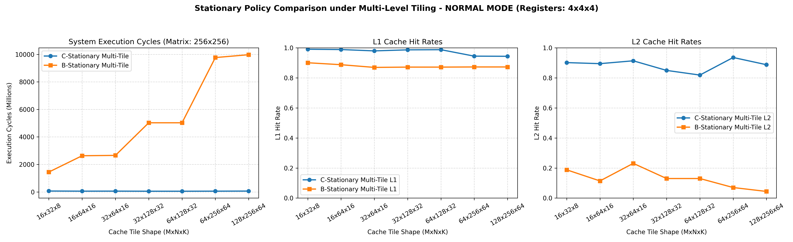

# Multi-Level Tiling Policy Comparison Report (Normal DRAM-Backed B)

This report presents the comparative performance and cache statistics between **C-Stationary** and **B-Stationary** policies under **Multi-Level Tiling** (Cache Tile $T_m \times T_n \times T_k$ and register tile $R_m \times R_n \times R_k = 4 \times 4 \times 4$) in **Normal DRAM-Backed Mode**.

## Performance & Cache Dashboard

---

## Comparison Data Table

| Cache Tile Shape | Policy | Total Cycles | L1 Hit Rate (Hits / Lookups) | L2 Hit Rate (Hits / Lookups) |
| :---: | :---: | :---: | :---: | :---: |
| **16x32x8** | C-stationary | 66,231,920 | 0.991 (14,093,320/14,221,312) | 0.902 (170,189/188,680) |
| **16x32x8** | B-stationary | 1,444,240,204 | 0.901 (49,245,979/54,657,024) | 0.188 (1,214,400/6,459,574) |
| --- | --- | --- | --- | --- |
| **16x64x16** | C-stationary | 56,621,976 | 0.989 (11,731,534/11,862,016) | 0.895 (157,824/176,340) |
| **16x64x16** | B-stationary | 2,631,534,448 | 0.888 (85,780,857/96,600,064) | 0.114 (1,349,309/11,836,040) |
| --- | --- | --- | --- | --- |
| **32x64x16** | C-stationary | 59,111,576 | 0.980 (11,110,973/11,337,728) | 0.914 (321,863/352,148) |
| **32x64x16** | B-stationary | 2,656,765,808 | 0.870 (84,042,056/96,600,064) | 0.231 (3,150,443/13,638,280) |
| --- | --- | --- | --- | --- |
| **32x128x32** | C-stationary | 51,946,784 | 0.987 (10,026,025/10,158,080) | 0.850 (165,145/194,288) |
| **32x128x32** | B-stationary | 5,027,445,368 | 0.872 (157,383,918/180,486,144) | 0.130 (3,136,700/24,128,460) |
| --- | --- | --- | --- | --- |
| **64x128x32** | C-stationary | 51,837,888 | 0.988 (9,777,185/9,895,936) | 0.819 (152,766/186,528) |
| **64x128x32** | B-stationary | 5,027,812,568 | 0.872 (157,383,918/180,486,144) | 0.130 (3,136,700/24,128,460) |
| --- | --- | --- | --- | --- |
| **64x256x64** | C-stationary | 56,123,960 | 0.945 (8,794,276/9,306,112) | 0.936 (517,215/552,580) |
| **64x256x64** | B-stationary | 9,768,790,112 | 0.873 (304,029,499/348,258,304) | 0.070 (3,157,502/45,107,176) |
| --- | --- | --- | --- | --- |
| **128x256x64** | C-stationary | 62,877,688 | 0.944 (8,661,238/9,175,040) | 0.888 (488,333/549,924) |
| **128x256x64** | B-stationary | 9,976,061,552 | 0.873 (304,029,499/348,258,304) | 0.044 (1,984,716/45,107,176) |
| --- | --- | --- | --- | --- |

## Architectural Insights

### 1. DRAM Miss Penalty for B Matrix
* In Normal mode, Matrix B is read from DRAM. Because DRAM fetches cost `MEM_ACCESS_CYCLES = 180` cycles on L2 cache misses, any misses on B are highly penalizing.
* For C-stationary, cache tiles of B are prefetched. Since the working set of B is partitioned and resides in L2, the DRAM access penalty is mitigated for smaller cache tile shapes. However, as the tile size grows, L2 capacity thrashing occurs, causing DRAM fetch costs to dominate.

### 2. Policy Performance Gap (C-Stationary vs B-Stationary)
* C-stationary remains significantly faster than B-stationary (similar to the PRNG FIFO sweep) due to output matrix register reuse. B-stationary's need to write back intermediate C register tiles to the cache hierarchy results in 10-30x more cache lookups and L2 capacity misses, causing severe DRAM writeback traffic.
