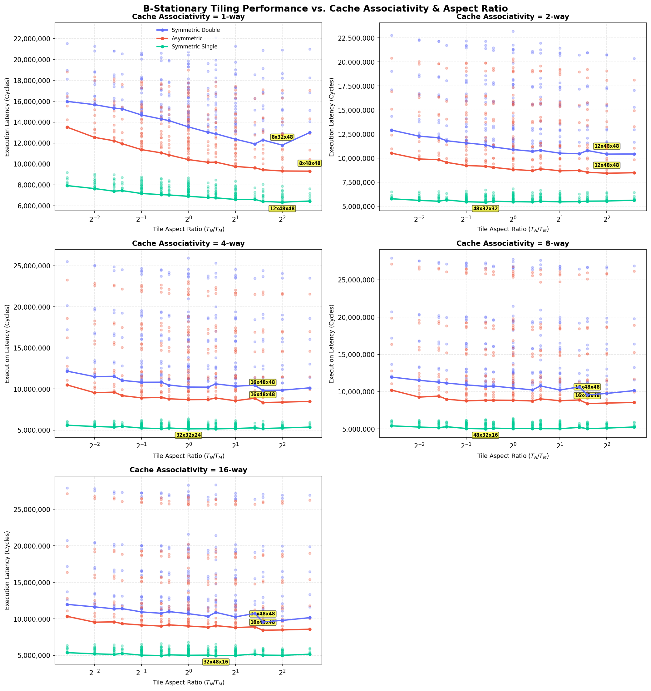

# B-Stationary Cache Associativity Empirical Tiling Sweeps

This directory contains the results of empirical tile sweeps for a **$96 \times 96 \times 96$ matrix** multiplication under **B-stationary** loop ordering, sweeping cache associativity $A_1 \in \{1, 2, 4, 8, 16\}$-way with 16B cache lines and 16 KB L1 size.

> [Safe/Hardware Parameters]
> * **Matrix Size:** $96 \times 96 \times 96$.
> * **Loop Nesting:** B-stationary.
> * **Cache Line Size:** 16B.
> * **L1 Cache:** 16 KB capacity, LRU replacement, Write-Back policy.
> * **L2 Cache:** 64 KB capacity, LRU replacement, Write-Back policy.
> * **DRAM Latency:** 180 cycles.
> * **Register Tile:** $4 \times 4 \times 4$, 8-cycle compute (`tmulac`).

## 1. Summary of Optimal Tile Shapes by Cache Associativity (B-Stationary)

| Cache Associativity | Precision Config | Optimal Tile Shape ($T_M \times T_N \times T_K$) | Ratio ($T_N/T_M$) | Footprint (KB) | L1 Hit Rate | L2 Hit Rate | DRAM Traffic (KB) | Total Cycles |
| :---: | :---: | :---: | :---: | :---: | :---: | :---: | :---: | :---: |
| 1-way | Symmetric Double | 8x32x48 | 4.000 | 17.0 KB | 0.907 | 0.685 | 913.1 KB | 11,800,520 |
| 1-way | Asymmetric | 8x48x48 | 6.000 | 10.5 KB | 0.961 | 0.464 | 656.4 KB | 9,311,396 |
| 1-way | Symmetric Single | 12x48x48 | 4.000 | 13.5 KB | 0.969 | 0.611 | 316.1 KB | 6,341,620 |
| 2-way | Symmetric Double | 12x48x48 | 4.000 | 27.0 KB | 0.916 | 0.669 | 750.5 KB | 10,420,508 |
| 2-way | Asymmetric | 12x48x48 | 4.000 | 13.5 KB | 0.964 | 0.508 | 526.1 KB | 8,436,956 |
| 2-way | Symmetric Single | 48x32x32 | 0.667 | 16.0 KB | 0.972 | 0.668 | 224.7 KB | 5,428,312 |
| 4-way | Symmetric Double | 16x48x48 | 3.000 | 30.0 KB | 0.927 | 0.621 | 703.1 KB | 9,846,504 |
| 4-way | Asymmetric | 16x48x48 | 3.000 | 16.5 KB | 0.965 | 0.471 | 528.5 KB | 8,357,268 |
| 4-way | Symmetric Single | 32x32x24 | 1.000 | 10.0 KB | 0.973 | 0.730 | 181.2 KB | 5,156,272 |
| 8-way | Symmetric Double | 16x48x48 | 3.000 | 30.0 KB | 0.927 | 0.645 | 655.6 KB | 9,583,584 |
| 8-way | Asymmetric | 16x48x48 | 3.000 | 16.5 KB | 0.964 | 0.472 | 536.4 KB | 8,412,572 |
| 8-way | Symmetric Single | 48x32x16 | 0.667 | 11.0 KB | 0.969 | 0.812 | 155.8 KB | 5,016,896 |
| 16-way | Symmetric Double | 16x48x48 | 3.000 | 30.0 KB | 0.926 | 0.646 | 656.0 KB | 9,588,432 |
| 16-way | Asymmetric | 16x48x48 | 3.000 | 16.5 KB | 0.963 | 0.473 | 540.5 KB | 8,445,172 |
| 16-way | Symmetric Single | 32x48x16 | 1.500 | 11.0 KB | 0.969 | 0.814 | 152.0 KB | 4,972,352 |

---

## 2. Details for Associativity = 1-way

### Symmetric Double (1-way)

#### Top 3 Optimal Tile Shapes

| Rank | Tile Shape ($T_M \times T_N \times T_K$) | Ratio ($T_N/T_M$) | Footprint (KB) | L1 Hit Rate | L2 Hit Rate | DRAM Traffic (KB) | Total Cycles |
| :---: | :---: | :---: | :---: | :---: | :---: | :---: | :---: |
| 1 | 8x32x48 | 4.000 | 17.0 KB | 0.907 | 0.685 | 913.1 KB | 11,800,520 |
| 2 | 12x32x48 | 2.667 | 19.5 KB | 0.904 | 0.670 | 944.8 KB | 11,921,148 |
| 3 | 8x24x48 | 3.000 | 13.5 KB | 0.903 | 0.680 | 971.8 KB | 12,289,376 |

### Asymmetric (1-way)

#### Top 3 Optimal Tile Shapes

| Rank | Tile Shape ($T_M \times T_N \times T_K$) | Ratio ($T_N/T_M$) | Footprint (KB) | L1 Hit Rate | L2 Hit Rate | DRAM Traffic (KB) | Total Cycles |
| :---: | :---: | :---: | :---: | :---: | :---: | :---: | :---: |
| 1 | 8x48x48 | 6.000 | 10.5 KB | 0.961 | 0.464 | 656.4 KB | 9,311,396 |
| 2 | 12x48x48 | 4.000 | 13.5 KB | 0.954 | 0.542 | 654.3 KB | 9,324,588 |
| 3 | 16x48x48 | 3.000 | 16.5 KB | 0.946 | 0.596 | 661.9 KB | 9,441,312 |

### Symmetric Single (1-way)

#### Top 3 Optimal Tile Shapes

| Rank | Tile Shape ($T_M \times T_N \times T_K$) | Ratio ($T_N/T_M$) | Footprint (KB) | L1 Hit Rate | L2 Hit Rate | DRAM Traffic (KB) | Total Cycles |
| :---: | :---: | :---: | :---: | :---: | :---: | :---: | :---: |
| 1 | 12x48x48 | 4.000 | 13.5 KB | 0.969 | 0.611 | 316.1 KB | 6,341,620 |
| 2 | 16x48x48 | 3.000 | 15.0 KB | 0.969 | 0.576 | 334.7 KB | 6,405,560 |
| 3 | 12x48x32 | 4.000 | 9.8 KB | 0.969 | 0.634 | 319.9 KB | 6,434,142 |

---

## 2. Details for Associativity = 2-way

### Symmetric Double (2-way)

#### Top 3 Optimal Tile Shapes

| Rank | Tile Shape ($T_M \times T_N \times T_K$) | Ratio ($T_N/T_M$) | Footprint (KB) | L1 Hit Rate | L2 Hit Rate | DRAM Traffic (KB) | Total Cycles |
| :---: | :---: | :---: | :---: | :---: | :---: | :---: | :---: |
| 1 | 12x48x48 | 4.000 | 27.0 KB | 0.916 | 0.669 | 750.5 KB | 10,420,508 |
| 2 | 8x48x48 | 6.000 | 24.0 KB | 0.907 | 0.714 | 710.1 KB | 10,434,996 |
| 3 | 12x32x48 | 2.667 | 19.5 KB | 0.923 | 0.626 | 771.7 KB | 10,455,072 |

### Asymmetric (2-way)

#### Top 3 Optimal Tile Shapes

| Rank | Tile Shape ($T_M \times T_N \times T_K$) | Ratio ($T_N/T_M$) | Footprint (KB) | L1 Hit Rate | L2 Hit Rate | DRAM Traffic (KB) | Total Cycles |
| :---: | :---: | :---: | :---: | :---: | :---: | :---: | :---: |
| 1 | 12x48x48 | 4.000 | 13.5 KB | 0.964 | 0.508 | 526.1 KB | 8,436,956 |
| 2 | 8x48x48 | 6.000 | 10.5 KB | 0.968 | 0.474 | 516.0 KB | 8,486,420 |
| 3 | 16x48x48 | 3.000 | 16.5 KB | 0.957 | 0.580 | 538.4 KB | 8,537,442 |

### Symmetric Single (2-way)

#### Top 3 Optimal Tile Shapes

| Rank | Tile Shape ($T_M \times T_N \times T_K$) | Ratio ($T_N/T_M$) | Footprint (KB) | L1 Hit Rate | L2 Hit Rate | DRAM Traffic (KB) | Total Cycles |
| :---: | :---: | :---: | :---: | :---: | :---: | :---: | :---: |
| 1 | 48x32x32 | 0.667 | 16.0 KB | 0.972 | 0.668 | 224.7 KB | 5,428,312 |
| 2 | 48x32x48 | 0.667 | 21.0 KB | 0.971 | 0.638 | 233.0 KB | 5,440,528 |
| 3 | 24x32x32 | 1.333 | 10.0 KB | 0.974 | 0.655 | 224.3 KB | 5,454,860 |

---

## 2. Details for Associativity = 4-way

### Symmetric Double (4-way)

#### Top 3 Optimal Tile Shapes

| Rank | Tile Shape ($T_M \times T_N \times T_K$) | Ratio ($T_N/T_M$) | Footprint (KB) | L1 Hit Rate | L2 Hit Rate | DRAM Traffic (KB) | Total Cycles |
| :---: | :---: | :---: | :---: | :---: | :---: | :---: | :---: |
| 1 | 16x48x48 | 3.000 | 30.0 KB | 0.927 | 0.621 | 703.1 KB | 9,846,504 |
| 2 | 12x48x48 | 4.000 | 27.0 KB | 0.919 | 0.672 | 675.4 KB | 9,870,472 |
| 3 | 8x48x48 | 6.000 | 24.0 KB | 0.904 | 0.735 | 660.1 KB | 10,145,604 |

### Asymmetric (4-way)

#### Top 3 Optimal Tile Shapes

| Rank | Tile Shape ($T_M \times T_N \times T_K$) | Ratio ($T_N/T_M$) | Footprint (KB) | L1 Hit Rate | L2 Hit Rate | DRAM Traffic (KB) | Total Cycles |
| :---: | :---: | :---: | :---: | :---: | :---: | :---: | :---: |
| 1 | 16x48x48 | 3.000 | 16.5 KB | 0.965 | 0.471 | 528.5 KB | 8,357,268 |
| 2 | 12x48x48 | 4.000 | 13.5 KB | 0.967 | 0.454 | 529.8 KB | 8,411,468 |
| 3 | 8x48x48 | 6.000 | 10.5 KB | 0.971 | 0.423 | 525.1 KB | 8,492,630 |

### Symmetric Single (4-way)

#### Top 3 Optimal Tile Shapes

| Rank | Tile Shape ($T_M \times T_N \times T_K$) | Ratio ($T_N/T_M$) | Footprint (KB) | L1 Hit Rate | L2 Hit Rate | DRAM Traffic (KB) | Total Cycles |
| :---: | :---: | :---: | :---: | :---: | :---: | :---: | :---: |
| 1 | 32x32x24 | 1.000 | 10.0 KB | 0.973 | 0.730 | 181.2 KB | 5,156,272 |
| 2 | 32x48x32 | 1.500 | 16.0 KB | 0.973 | 0.687 | 192.8 KB | 5,158,634 |
| 3 | 24x32x24 | 1.333 | 8.2 KB | 0.975 | 0.719 | 180.9 KB | 5,172,892 |

---

## 2. Details for Associativity = 8-way

### Symmetric Double (8-way)

#### Top 3 Optimal Tile Shapes

| Rank | Tile Shape ($T_M \times T_N \times T_K$) | Ratio ($T_N/T_M$) | Footprint (KB) | L1 Hit Rate | L2 Hit Rate | DRAM Traffic (KB) | Total Cycles |
| :---: | :---: | :---: | :---: | :---: | :---: | :---: | :---: |
| 1 | 16x48x48 | 3.000 | 30.0 KB | 0.927 | 0.645 | 655.6 KB | 9,583,584 |
| 2 | 12x48x48 | 4.000 | 27.0 KB | 0.918 | 0.684 | 655.8 KB | 9,769,720 |
| 3 | 8x48x48 | 6.000 | 24.0 KB | 0.902 | 0.742 | 655.2 KB | 10,148,472 |

### Asymmetric (8-way)

#### Top 3 Optimal Tile Shapes

| Rank | Tile Shape ($T_M \times T_N \times T_K$) | Ratio ($T_N/T_M$) | Footprint (KB) | L1 Hit Rate | L2 Hit Rate | DRAM Traffic (KB) | Total Cycles |
| :---: | :---: | :---: | :---: | :---: | :---: | :---: | :---: |
| 1 | 16x48x48 | 3.000 | 16.5 KB | 0.964 | 0.472 | 536.4 KB | 8,412,572 |
| 2 | 12x48x48 | 4.000 | 13.5 KB | 0.966 | 0.458 | 536.9 KB | 8,474,464 |
| 3 | 8x48x48 | 6.000 | 10.5 KB | 0.971 | 0.416 | 534.1 KB | 8,558,584 |

### Symmetric Single (8-way)

#### Top 3 Optimal Tile Shapes

| Rank | Tile Shape ($T_M \times T_N \times T_K$) | Ratio ($T_N/T_M$) | Footprint (KB) | L1 Hit Rate | L2 Hit Rate | DRAM Traffic (KB) | Total Cycles |
| :---: | :---: | :---: | :---: | :---: | :---: | :---: | :---: |
| 1 | 48x32x16 | 0.667 | 11.0 KB | 0.969 | 0.812 | 155.8 KB | 5,016,896 |
| 2 | 24x48x16 | 2.000 | 9.0 KB | 0.971 | 0.804 | 156.0 KB | 5,038,688 |
| 3 | 32x48x16 | 1.500 | 11.0 KB | 0.969 | 0.808 | 158.8 KB | 5,050,112 |

---

## 2. Details for Associativity = 16-way

### Symmetric Double (16-way)

#### Top 3 Optimal Tile Shapes

| Rank | Tile Shape ($T_M \times T_N \times T_K$) | Ratio ($T_N/T_M$) | Footprint (KB) | L1 Hit Rate | L2 Hit Rate | DRAM Traffic (KB) | Total Cycles |
| :---: | :---: | :---: | :---: | :---: | :---: | :---: | :---: |
| 1 | 16x48x48 | 3.000 | 30.0 KB | 0.926 | 0.646 | 656.0 KB | 9,588,432 |
| 2 | 12x48x48 | 4.000 | 27.0 KB | 0.917 | 0.687 | 656.0 KB | 9,787,648 |
| 3 | 8x48x48 | 6.000 | 24.0 KB | 0.902 | 0.742 | 655.6 KB | 10,157,328 |

### Asymmetric (16-way)

#### Top 3 Optimal Tile Shapes

| Rank | Tile Shape ($T_M \times T_N \times T_K$) | Ratio ($T_N/T_M$) | Footprint (KB) | L1 Hit Rate | L2 Hit Rate | DRAM Traffic (KB) | Total Cycles |
| :---: | :---: | :---: | :---: | :---: | :---: | :---: | :---: |
| 1 | 16x48x48 | 3.000 | 16.5 KB | 0.963 | 0.473 | 540.5 KB | 8,445,172 |
| 2 | 12x48x48 | 4.000 | 13.5 KB | 0.966 | 0.459 | 538.5 KB | 8,482,632 |
| 3 | 8x48x48 | 6.000 | 10.5 KB | 0.971 | 0.415 | 537.1 KB | 8,581,444 |

### Symmetric Single (16-way)

#### Top 3 Optimal Tile Shapes

| Rank | Tile Shape ($T_M \times T_N \times T_K$) | Ratio ($T_N/T_M$) | Footprint (KB) | L1 Hit Rate | L2 Hit Rate | DRAM Traffic (KB) | Total Cycles |
| :---: | :---: | :---: | :---: | :---: | :---: | :---: | :---: |
| 1 | 32x48x16 | 1.500 | 11.0 KB | 0.969 | 0.814 | 152.0 KB | 4,972,352 |
| 2 | 48x32x16 | 0.667 | 11.0 KB | 0.969 | 0.815 | 152.0 KB | 4,973,808 |
| 3 | 24x48x16 | 2.000 | 9.0 KB | 0.971 | 0.808 | 152.0 KB | 4,991,072 |

---

## 3. Physical Analysis & Conclusions

Cache associativity resolves conflict misses caused by different matrix buffer lines mapping to the same sets. For B-stationary loops, 1-way (direct-mapped) caches suffer severe conflict misses that penalize square-like tiles, pushing optimums to skewed shapes. Increasing associativity to 4-way and 8-way resolves set conflict issues, allowing optimal shapes to settle on wider aspect ratios ($T_N > T_M$) to maximize spatial reuse of B.

