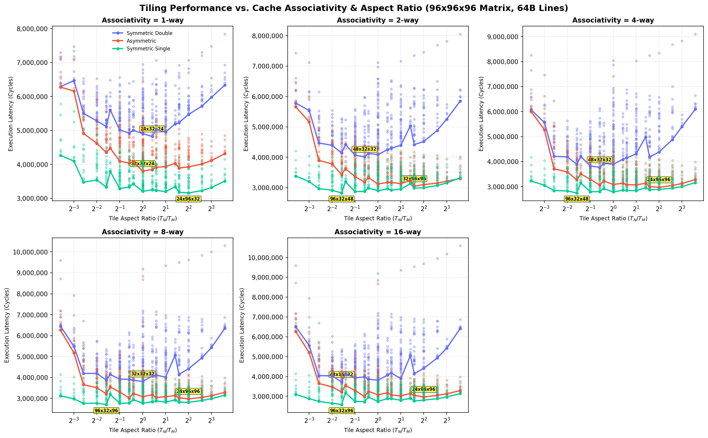

# Empirical Cache Associativity Tiling Sweeps (64B Lines)

This directory contains the results of empirical tile sweeps for a **$96 \times 96 \times 96$ matrix** under a fixed **64B cache line size**, sweeping Cache Associativity $A \in \{1, 2, 4, 8, 16\}$-way and tile dimensions $T_M, T_N, T_K \in \{8, 12, 16, 24, 32, 48, 96\}$.

> [!NOTE]
> **Hardware Parameters:**
> * **Matrix Size:** $96 \times 96 \times 96$.
> * **Cache Line Size:** 64B for both L1 and L2 caches.
> * **L1 Cache:** 16 KB capacity, swept associativity, 4-cycle access, LRU replacement, Write-Back policy.
> * **L2 Cache:** 64 KB capacity, swept associativity, 14-cycle access, LRU replacement, Write-Back policy.
> * **DRAM Latency:** 180 cycles.
> * **Register Tile:** $4 \times 4 \times 4$ ($R_M \times R_N \times R_K$), 8-cycle compute (`tmulac`).

## 1. Summary of Optimal Tile Shapes by Cache Associativity

| Associativity | Precision Config | Optimal Tile Shape ($T_M \times T_N \times T_K$) | Ratio ($T_N/T_M$) | Footprint (KB) | L1 Hit Rate | L2 Hit Rate | DRAM Traffic (KB) | Total Cycles |
| :---: | :---: | :---: | :---: | :---: | :---: | :---: | :---: | :---: |
| 1-way | Symmetric Double | 24x32x24 | 1.333 | 16.5 KB | 0.949 | 0.754 | 1061.0 KB | 4,821,224 |
| 1-way | Asymmetric | 32x32x24 | 1.000 | 15.5 KB | 0.973 | 0.738 | 564.9 KB | 3,800,822 |
| 1-way | Symmetric Single | 24x96x32 | 4.000 | 24.0 KB | 0.976 | 0.822 | 296.8 KB | 3,157,098 |
| 2-way | Symmetric Double | 48x32x32 | 0.667 | 32.0 KB | 0.962 | 0.752 | 728.5 KB | 4,015,600 |
| 2-way | Asymmetric | 32x96x96 | 3.000 | 66.0 KB | 0.974 | 0.779 | 344.0 KB | 3,047,906 |
| 2-way | Symmetric Single | 96x32x48 | 0.333 | 36.0 KB | 0.981 | 0.821 | 209.5 KB | 2,828,374 |
| 4-way | Symmetric Double | 48x32x32 | 0.667 | 32.0 KB | 0.975 | 0.665 | 656.0 KB | 3,773,056 |
| 4-way | Asymmetric | 24x96x96 | 4.000 | 54.0 KB | 0.976 | 0.803 | 264.1 KB | 2,971,972 |
| 4-way | Symmetric Single | 96x32x48 | 0.333 | 36.0 KB | 0.989 | 0.684 | 204.8 KB | 2,748,040 |
| 8-way | Symmetric Double | 32x32x32 | 1.000 | 24.0 KB | 0.974 | 0.677 | 656.0 KB | 3,806,800 |
| 8-way | Asymmetric | 24x96x96 | 4.000 | 54.0 KB | 0.976 | 0.805 | 262.1 KB | 2,970,450 |
| 8-way | Symmetric Single | 96x32x96 | 0.333 | 60.0 KB | 0.985 | 0.748 | 200.9 KB | 2,703,402 |
| 16-way | Symmetric Double | 48x16x32 | 0.333 | 22.0 KB | 0.970 | 0.777 | 512.0 KB | 3,725,120 |
| 16-way | Asymmetric | 24x96x96 | 4.000 | 54.0 KB | 0.976 | 0.808 | 260.4 KB | 2,969,148 |
| 16-way | Symmetric Single | 96x32x96 | 0.333 | 60.0 KB | 0.990 | 0.699 | 152.0 KB | 2,587,168 |

---

## 2. Details for Associativity = 1-way

### Symmetric Double (1-way)

#### Top 3 Optimal Tile Shapes

| Rank | Tile Shape ($T_M \times T_N \times T_K$) | Ratio ($T_N/T_M$) | Footprint (KB) | L1 Hit Rate | L2 Hit Rate | DRAM Traffic (KB) | Total Cycles |
| :---: | :---: | :---: | :---: | :---: | :---: | :---: | :---: |
| 1 | 24x32x24 | 1.333 | 16.5 KB | 0.949 | 0.754 | 1061.0 KB | 4,821,224 |
| 2 | 24x32x32 | 1.333 | 20.0 KB | 0.945 | 0.740 | 1145.2 KB | 4,873,000 |
| 3 | 24x32x16 | 1.333 | 13.0 KB | 0.953 | 0.768 | 998.0 KB | 4,886,084 |

#### Bottom 3 Worst Tile Shapes

| Rank | Tile Shape ($T_M \times T_N \times T_K$) | Ratio ($T_N/T_M$) | Footprint (KB) | L1 Hit Rate | L2 Hit Rate | DRAM Traffic (KB) | Total Cycles |
| :---: | :---: | :---: | :---: | :---: | :---: | :---: | :---: |
| 341 | 12x96x96 | 8.000 | 90.0 KB | 0.869 | 0.711 | 2643.5 KB | 7,479,424 |
| 342 | 96x96x8 | 1.000 | 84.0 KB | 0.948 | 0.684 | 2006.9 KB | 7,717,120 |
| 343 | 8x96x96 | 12.000 | 84.0 KB | 0.869 | 0.718 | 2744.4 KB | 7,837,012 |

### Asymmetric (1-way)

#### Top 3 Optimal Tile Shapes

| Rank | Tile Shape ($T_M \times T_N \times T_K$) | Ratio ($T_N/T_M$) | Footprint (KB) | L1 Hit Rate | L2 Hit Rate | DRAM Traffic (KB) | Total Cycles |
| :---: | :---: | :---: | :---: | :---: | :---: | :---: | :---: |
| 1 | 32x32x24 | 1.000 | 15.5 KB | 0.973 | 0.738 | 564.9 KB | 3,800,822 |
| 2 | 32x32x32 | 1.000 | 18.0 KB | 0.969 | 0.734 | 613.1 KB | 3,810,642 |
| 3 | 24x32x24 | 1.333 | 12.0 KB | 0.974 | 0.719 | 577.4 KB | 3,846,392 |

#### Bottom 3 Worst Tile Shapes

| Rank | Tile Shape ($T_M \times T_N \times T_K$) | Ratio ($T_N/T_M$) | Footprint (KB) | L1 Hit Rate | L2 Hit Rate | DRAM Traffic (KB) | Total Cycles |
| :---: | :---: | :---: | :---: | :---: | :---: | :---: | :---: |
| 341 | 96x8x8 | 0.083 | 12.1 KB | 0.948 | 0.736 | 1693.6 KB | 7,088,996 |
| 342 | 96x12x12 | 0.125 | 18.3 KB | 0.940 | 0.697 | 1917.2 KB | 7,100,344 |
| 343 | 96x8x12 | 0.083 | 15.2 KB | 0.935 | 0.716 | 1901.4 KB | 7,172,822 |

### Symmetric Single (1-way)

#### Top 3 Optimal Tile Shapes

| Rank | Tile Shape ($T_M \times T_N \times T_K$) | Ratio ($T_N/T_M$) | Footprint (KB) | L1 Hit Rate | L2 Hit Rate | DRAM Traffic (KB) | Total Cycles |
| :---: | :---: | :---: | :---: | :---: | :---: | :---: | :---: |
| 1 | 24x96x32 | 4.000 | 24.0 KB | 0.976 | 0.822 | 296.8 KB | 3,157,098 |
| 2 | 32x96x32 | 3.000 | 28.0 KB | 0.976 | 0.797 | 336.0 KB | 3,176,752 |
| 3 | 24x96x48 | 4.000 | 31.5 KB | 0.968 | 0.840 | 326.2 KB | 3,186,526 |

#### Bottom 3 Worst Tile Shapes

| Rank | Tile Shape ($T_M \times T_N \times T_K$) | Ratio ($T_N/T_M$) | Footprint (KB) | L1 Hit Rate | L2 Hit Rate | DRAM Traffic (KB) | Total Cycles |
| :---: | :---: | :---: | :---: | :---: | :---: | :---: | :---: |
| 341 | 96x8x12 | 0.083 | 7.9 KB | 0.964 | 0.752 | 975.6 KB | 5,458,714 |
| 342 | 96x12x8 | 0.125 | 7.9 KB | 0.969 | 0.742 | 954.1 KB | 5,565,162 |
| 343 | 96x8x8 | 0.083 | 6.2 KB | 0.968 | 0.756 | 966.6 KB | 5,778,322 |

---

## 2. Details for Associativity = 2-way

### Symmetric Double (2-way)

#### Top 3 Optimal Tile Shapes

| Rank | Tile Shape ($T_M \times T_N \times T_K$) | Ratio ($T_N/T_M$) | Footprint (KB) | L1 Hit Rate | L2 Hit Rate | DRAM Traffic (KB) | Total Cycles |
| :---: | :---: | :---: | :---: | :---: | :---: | :---: | :---: |
| 1 | 48x32x32 | 0.667 | 32.0 KB | 0.962 | 0.752 | 728.5 KB | 4,015,600 |
| 2 | 48x32x24 | 0.667 | 27.0 KB | 0.966 | 0.746 | 717.2 KB | 4,055,840 |
| 3 | 48x24x32 | 0.500 | 27.0 KB | 0.962 | 0.756 | 733.8 KB | 4,069,324 |

#### Bottom 3 Worst Tile Shapes

| Rank | Tile Shape ($T_M \times T_N \times T_K$) | Ratio ($T_N/T_M$) | Footprint (KB) | L1 Hit Rate | L2 Hit Rate | DRAM Traffic (KB) | Total Cycles |
| :---: | :---: | :---: | :---: | :---: | :---: | :---: | :---: |
| 341 | 16x96x96 | 6.000 | 96.0 KB | 0.857 | 0.708 | 2811.6 KB | 7,690,516 |
| 342 | 12x96x96 | 8.000 | 90.0 KB | 0.858 | 0.715 | 2822.4 KB | 7,811,980 |
| 343 | 8x96x96 | 12.000 | 84.0 KB | 0.859 | 0.729 | 2841.4 KB | 8,051,308 |

### Asymmetric (2-way)

#### Top 3 Optimal Tile Shapes

| Rank | Tile Shape ($T_M \times T_N \times T_K$) | Ratio ($T_N/T_M$) | Footprint (KB) | L1 Hit Rate | L2 Hit Rate | DRAM Traffic (KB) | Total Cycles |
| :---: | :---: | :---: | :---: | :---: | :---: | :---: | :---: |
| 1 | 32x96x96 | 3.000 | 66.0 KB | 0.974 | 0.779 | 344.0 KB | 3,047,906 |
| 2 | 32x96x48 | 3.000 | 45.0 KB | 0.983 | 0.711 | 343.1 KB | 3,090,684 |
| 3 | 24x96x96 | 4.000 | 54.0 KB | 0.974 | 0.776 | 354.6 KB | 3,101,848 |

#### Bottom 3 Worst Tile Shapes

| Rank | Tile Shape ($T_M \times T_N \times T_K$) | Ratio ($T_N/T_M$) | Footprint (KB) | L1 Hit Rate | L2 Hit Rate | DRAM Traffic (KB) | Total Cycles |
| :---: | :---: | :---: | :---: | :---: | :---: | :---: | :---: |
| 341 | 96x96x8 | 1.000 | 79.5 KB | 0.974 | 0.674 | 1218.5 KB | 6,407,756 |
| 342 | 96x8x8 | 0.083 | 12.1 KB | 0.945 | 0.789 | 1460.9 KB | 6,481,906 |
| 343 | 96x8x96 | 0.083 | 79.5 KB | 0.944 | 0.438 | 2343.6 KB | 6,610,206 |

### Symmetric Single (2-way)

#### Top 3 Optimal Tile Shapes

| Rank | Tile Shape ($T_M \times T_N \times T_K$) | Ratio ($T_N/T_M$) | Footprint (KB) | L1 Hit Rate | L2 Hit Rate | DRAM Traffic (KB) | Total Cycles |
| :---: | :---: | :---: | :---: | :---: | :---: | :---: | :---: |
| 1 | 96x32x48 | 0.333 | 36.0 KB | 0.981 | 0.821 | 209.5 KB | 2,828,374 |
| 2 | 96x48x32 | 0.500 | 36.0 KB | 0.984 | 0.789 | 220.8 KB | 2,872,130 |
| 3 | 96x48x48 | 0.500 | 45.0 KB | 0.980 | 0.801 | 246.8 KB | 2,877,150 |

#### Bottom 3 Worst Tile Shapes

| Rank | Tile Shape ($T_M \times T_N \times T_K$) | Ratio ($T_N/T_M$) | Footprint (KB) | L1 Hit Rate | L2 Hit Rate | DRAM Traffic (KB) | Total Cycles |
| :---: | :---: | :---: | :---: | :---: | :---: | :---: | :---: |
| 341 | 96x8x8 | 0.083 | 6.2 KB | 0.970 | 0.926 | 232.1 KB | 4,205,574 |
| 342 | 8x12x8 | 1.500 | 1.0 KB | 0.984 | 0.861 | 201.9 KB | 4,226,574 |
| 343 | 8x8x8 | 1.000 | 0.8 KB | 0.984 | 0.860 | 201.9 KB | 4,371,916 |

---

## 2. Details for Associativity = 4-way

### Symmetric Double (4-way)

#### Top 3 Optimal Tile Shapes

| Rank | Tile Shape ($T_M \times T_N \times T_K$) | Ratio ($T_N/T_M$) | Footprint (KB) | L1 Hit Rate | L2 Hit Rate | DRAM Traffic (KB) | Total Cycles |
| :---: | :---: | :---: | :---: | :---: | :---: | :---: | :---: |
| 1 | 48x32x32 | 0.667 | 32.0 KB | 0.975 | 0.665 | 656.0 KB | 3,773,056 |
| 2 | 48x24x32 | 0.500 | 27.0 KB | 0.973 | 0.687 | 654.8 KB | 3,824,472 |
| 3 | 32x32x32 | 1.000 | 24.0 KB | 0.975 | 0.643 | 709.8 KB | 3,893,656 |

#### Bottom 3 Worst Tile Shapes

| Rank | Tile Shape ($T_M \times T_N \times T_K$) | Ratio ($T_N/T_M$) | Footprint (KB) | L1 Hit Rate | L2 Hit Rate | DRAM Traffic (KB) | Total Cycles |
| :---: | :---: | :---: | :---: | :---: | :---: | :---: | :---: |
| 341 | 16x96x96 | 6.000 | 96.0 KB | 0.859 | 0.632 | 3511.2 KB | 8,687,752 |
| 342 | 12x96x96 | 8.000 | 90.0 KB | 0.859 | 0.641 | 3532.5 KB | 8,824,336 |
| 343 | 8x96x96 | 12.000 | 84.0 KB | 0.860 | 0.656 | 3576.6 KB | 9,099,844 |

### Asymmetric (4-way)

#### Top 3 Optimal Tile Shapes

| Rank | Tile Shape ($T_M \times T_N \times T_K$) | Ratio ($T_N/T_M$) | Footprint (KB) | L1 Hit Rate | L2 Hit Rate | DRAM Traffic (KB) | Total Cycles |
| :---: | :---: | :---: | :---: | :---: | :---: | :---: | :---: |
| 1 | 24x96x96 | 4.000 | 54.0 KB | 0.976 | 0.803 | 264.1 KB | 2,971,972 |
| 2 | 32x96x96 | 3.000 | 66.0 KB | 0.976 | 0.770 | 312.9 KB | 3,002,704 |
| 3 | 16x96x96 | 6.000 | 42.0 KB | 0.977 | 0.810 | 260.9 KB | 3,046,228 |

#### Bottom 3 Worst Tile Shapes

| Rank | Tile Shape ($T_M \times T_N \times T_K$) | Ratio ($T_N/T_M$) | Footprint (KB) | L1 Hit Rate | L2 Hit Rate | DRAM Traffic (KB) | Total Cycles |
| :---: | :---: | :---: | :---: | :---: | :---: | :---: | :---: |
| 341 | 96x8x8 | 0.083 | 12.1 KB | 0.945 | 0.750 | 1738.0 KB | 6,876,488 |
| 342 | 96x96x8 | 1.000 | 79.5 KB | 0.975 | 0.575 | 1590.2 KB | 7,412,602 |
| 343 | 96x8x96 | 0.083 | 79.5 KB | 0.947 | 0.222 | 3081.1 KB | 7,646,888 |

### Symmetric Single (4-way)

#### Top 3 Optimal Tile Shapes

| Rank | Tile Shape ($T_M \times T_N \times T_K$) | Ratio ($T_N/T_M$) | Footprint (KB) | L1 Hit Rate | L2 Hit Rate | DRAM Traffic (KB) | Total Cycles |
| :---: | :---: | :---: | :---: | :---: | :---: | :---: | :---: |
| 1 | 96x32x48 | 0.333 | 36.0 KB | 0.989 | 0.684 | 204.8 KB | 2,748,040 |
| 2 | 48x48x48 | 1.000 | 27.0 KB | 0.987 | 0.716 | 220.6 KB | 2,786,832 |
| 3 | 96x48x32 | 0.500 | 36.0 KB | 0.991 | 0.665 | 216.6 KB | 2,792,850 |

#### Bottom 3 Worst Tile Shapes

| Rank | Tile Shape ($T_M \times T_N \times T_K$) | Ratio ($T_N/T_M$) | Footprint (KB) | L1 Hit Rate | L2 Hit Rate | DRAM Traffic (KB) | Total Cycles |
| :---: | :---: | :---: | :---: | :---: | :---: | :---: | :---: |
| 341 | 8x12x8 | 1.500 | 1.0 KB | 0.988 | 0.843 | 152.5 KB | 4,062,724 |
| 342 | 96x8x8 | 0.083 | 6.2 KB | 0.970 | 0.937 | 197.4 KB | 4,175,152 |
| 343 | 8x8x8 | 1.000 | 0.8 KB | 0.988 | 0.842 | 152.5 KB | 4,208,752 |

---

## 2. Details for Associativity = 8-way

### Symmetric Double (8-way)

#### Top 3 Optimal Tile Shapes

| Rank | Tile Shape ($T_M \times T_N \times T_K$) | Ratio ($T_N/T_M$) | Footprint (KB) | L1 Hit Rate | L2 Hit Rate | DRAM Traffic (KB) | Total Cycles |
| :---: | :---: | :---: | :---: | :---: | :---: | :---: | :---: |
| 1 | 32x32x32 | 1.000 | 24.0 KB | 0.974 | 0.677 | 656.0 KB | 3,806,800 |
| 2 | 32x24x32 | 0.750 | 20.0 KB | 0.973 | 0.697 | 656.0 KB | 3,860,604 |
| 3 | 48x16x32 | 0.333 | 22.0 KB | 0.970 | 0.739 | 610.5 KB | 3,866,960 |

#### Bottom 3 Worst Tile Shapes

| Rank | Tile Shape ($T_M \times T_N \times T_K$) | Ratio ($T_N/T_M$) | Footprint (KB) | L1 Hit Rate | L2 Hit Rate | DRAM Traffic (KB) | Total Cycles |
| :---: | :---: | :---: | :---: | :---: | :---: | :---: | :---: |
| 341 | 16x96x96 | 6.000 | 96.0 KB | 0.859 | 0.549 | 4312.0 KB | 9,836,608 |
| 342 | 12x96x96 | 8.000 | 90.0 KB | 0.859 | 0.558 | 4357.0 KB | 10,007,392 |
| 343 | 8x96x96 | 12.000 | 84.0 KB | 0.860 | 0.577 | 4413.1 KB | 10,300,180 |

### Asymmetric (8-way)

#### Top 3 Optimal Tile Shapes

| Rank | Tile Shape ($T_M \times T_N \times T_K$) | Ratio ($T_N/T_M$) | Footprint (KB) | L1 Hit Rate | L2 Hit Rate | DRAM Traffic (KB) | Total Cycles |
| :---: | :---: | :---: | :---: | :---: | :---: | :---: | :---: |
| 1 | 24x96x96 | 4.000 | 54.0 KB | 0.976 | 0.805 | 262.1 KB | 2,970,450 |
| 2 | 48x32x96 | 0.667 | 54.0 KB | 0.981 | 0.726 | 310.2 KB | 3,013,848 |
| 3 | 32x96x96 | 3.000 | 66.0 KB | 0.976 | 0.764 | 326.2 KB | 3,023,280 |

#### Bottom 3 Worst Tile Shapes

| Rank | Tile Shape ($T_M \times T_N \times T_K$) | Ratio ($T_N/T_M$) | Footprint (KB) | L1 Hit Rate | L2 Hit Rate | DRAM Traffic (KB) | Total Cycles |
| :---: | :---: | :---: | :---: | :---: | :---: | :---: | :---: |
| 341 | 96x8x8 | 0.083 | 12.1 KB | 0.945 | 0.720 | 1952.0 KB | 7,179,968 |
| 342 | 96x96x8 | 1.000 | 79.5 KB | 0.975 | 0.457 | 2052.5 KB | 8,673,322 |
| 343 | 96x8x96 | 0.083 | 79.5 KB | 0.947 | 0.035 | 3824.0 KB | 8,714,424 |

### Symmetric Single (8-way)

#### Top 3 Optimal Tile Shapes

| Rank | Tile Shape ($T_M \times T_N \times T_K$) | Ratio ($T_N/T_M$) | Footprint (KB) | L1 Hit Rate | L2 Hit Rate | DRAM Traffic (KB) | Total Cycles |
| :---: | :---: | :---: | :---: | :---: | :---: | :---: | :---: |
| 1 | 96x32x96 | 0.333 | 60.0 KB | 0.985 | 0.748 | 200.9 KB | 2,703,402 |
| 2 | 96x16x96 | 0.167 | 48.0 KB | 0.982 | 0.829 | 152.0 KB | 2,758,478 |
| 3 | 96x48x48 | 0.500 | 45.0 KB | 0.991 | 0.594 | 237.9 KB | 2,762,484 |

#### Bottom 3 Worst Tile Shapes

| Rank | Tile Shape ($T_M \times T_N \times T_K$) | Ratio ($T_N/T_M$) | Footprint (KB) | L1 Hit Rate | L2 Hit Rate | DRAM Traffic (KB) | Total Cycles |
| :---: | :---: | :---: | :---: | :---: | :---: | :---: | :---: |
| 341 | 12x8x8 | 0.667 | 1.0 KB | 0.988 | 0.838 | 157.9 KB | 4,071,668 |
| 342 | 96x8x8 | 0.083 | 6.2 KB | 0.968 | 0.950 | 152.0 KB | 4,131,332 |
| 343 | 8x8x8 | 1.000 | 0.8 KB | 0.988 | 0.847 | 152.0 KB | 4,214,868 |

---

## 2. Details for Associativity = 16-way

### Symmetric Double (16-way)

#### Top 3 Optimal Tile Shapes

| Rank | Tile Shape ($T_M \times T_N \times T_K$) | Ratio ($T_N/T_M$) | Footprint (KB) | L1 Hit Rate | L2 Hit Rate | DRAM Traffic (KB) | Total Cycles |
| :---: | :---: | :---: | :---: | :---: | :---: | :---: | :---: |
| 1 | 48x16x32 | 0.333 | 22.0 KB | 0.970 | 0.777 | 512.0 KB | 3,725,120 |
| 2 | 32x32x32 | 1.000 | 24.0 KB | 0.974 | 0.680 | 657.5 KB | 3,812,152 |
| 3 | 32x24x32 | 0.750 | 20.0 KB | 0.972 | 0.701 | 656.5 KB | 3,864,432 |

#### Bottom 3 Worst Tile Shapes

| Rank | Tile Shape ($T_M \times T_N \times T_K$) | Ratio ($T_N/T_M$) | Footprint (KB) | L1 Hit Rate | L2 Hit Rate | DRAM Traffic (KB) | Total Cycles |
| :---: | :---: | :---: | :---: | :---: | :---: | :---: | :---: |
| 341 | 16x96x96 | 6.000 | 96.0 KB | 0.859 | 0.543 | 4378.5 KB | 9,934,384 |
| 342 | 12x96x96 | 8.000 | 90.0 KB | 0.859 | 0.547 | 4475.5 KB | 10,180,048 |
| 343 | 8x96x96 | 12.000 | 84.0 KB | 0.860 | 0.558 | 4615.9 KB | 10,594,156 |

### Asymmetric (16-way)

#### Top 3 Optimal Tile Shapes

| Rank | Tile Shape ($T_M \times T_N \times T_K$) | Ratio ($T_N/T_M$) | Footprint (KB) | L1 Hit Rate | L2 Hit Rate | DRAM Traffic (KB) | Total Cycles |
| :---: | :---: | :---: | :---: | :---: | :---: | :---: | :---: |
| 1 | 24x96x96 | 4.000 | 54.0 KB | 0.976 | 0.808 | 260.4 KB | 2,969,148 |
| 2 | 48x32x96 | 0.667 | 54.0 KB | 0.981 | 0.736 | 296.0 KB | 2,990,088 |
| 3 | 48x96x32 | 2.000 | 54.0 KB | 0.986 | 0.734 | 296.5 KB | 3,023,872 |

#### Bottom 3 Worst Tile Shapes

| Rank | Tile Shape ($T_M \times T_N \times T_K$) | Ratio ($T_N/T_M$) | Footprint (KB) | L1 Hit Rate | L2 Hit Rate | DRAM Traffic (KB) | Total Cycles |
| :---: | :---: | :---: | :---: | :---: | :---: | :---: | :---: |
| 341 | 96x8x8 | 0.083 | 12.1 KB | 0.945 | 0.720 | 1952.0 KB | 7,179,968 |
| 342 | 96x96x8 | 1.000 | 79.5 KB | 0.975 | 0.457 | 2052.9 KB | 8,673,696 |
| 343 | 96x8x96 | 0.083 | 79.5 KB | 0.947 | 0.035 | 3824.0 KB | 8,714,064 |

### Symmetric Single (16-way)

#### Top 3 Optimal Tile Shapes

| Rank | Tile Shape ($T_M \times T_N \times T_K$) | Ratio ($T_N/T_M$) | Footprint (KB) | L1 Hit Rate | L2 Hit Rate | DRAM Traffic (KB) | Total Cycles |
| :---: | :---: | :---: | :---: | :---: | :---: | :---: | :---: |
| 1 | 96x32x96 | 0.333 | 60.0 KB | 0.990 | 0.699 | 152.0 KB | 2,587,168 |
| 2 | 96x24x96 | 0.250 | 54.0 KB | 0.987 | 0.774 | 152.0 KB | 2,650,800 |
| 3 | 48x32x96 | 0.667 | 36.0 KB | 0.989 | 0.635 | 224.0 KB | 2,730,016 |

#### Bottom 3 Worst Tile Shapes

| Rank | Tile Shape ($T_M \times T_N \times T_K$) | Ratio ($T_N/T_M$) | Footprint (KB) | L1 Hit Rate | L2 Hit Rate | DRAM Traffic (KB) | Total Cycles |
| :---: | :---: | :---: | :---: | :---: | :---: | :---: | :---: |
| 341 | 12x8x8 | 0.667 | 1.0 KB | 0.986 | 0.860 | 152.0 KB | 4,085,440 |
| 342 | 96x8x8 | 0.083 | 6.2 KB | 0.968 | 0.951 | 152.0 KB | 4,140,852 |
| 343 | 8x8x8 | 1.000 | 0.8 KB | 0.991 | 0.800 | 152.0 KB | 4,175,776 |

---

## 3. Aspect Ratio Sensitivity vs. Associativity
The plot below details how the cache associativity affects both execution cycles and the shape aspect ratio trend.

