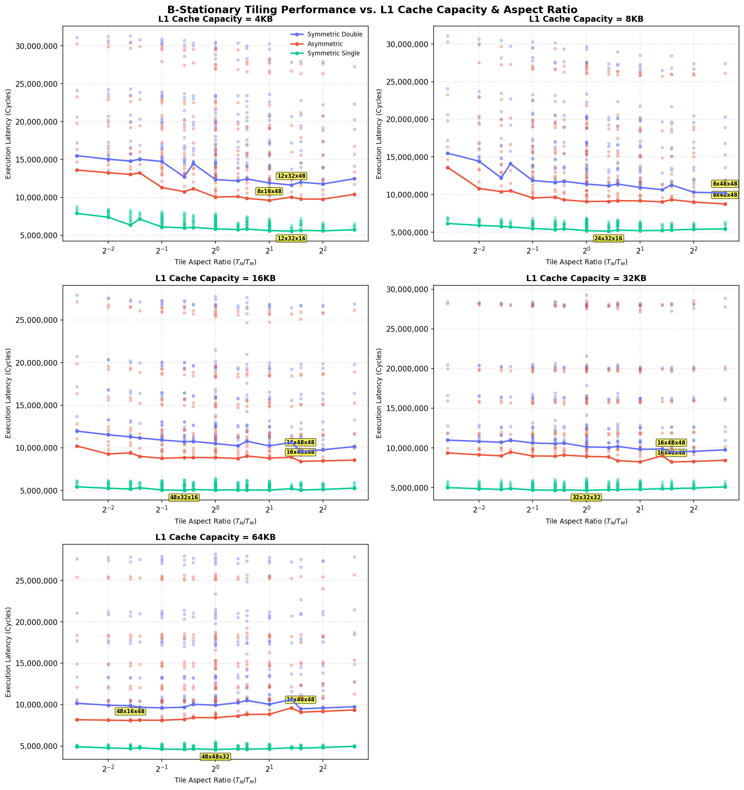

# B-Stationary L1 Cache Capacity Empirical Tiling Sweeps

This directory contains the results of empirical tile sweeps for a **$96 \times 96 \times 96$ matrix** multiplication under **B-stationary** loop ordering, sweeping L1 cache capacity $C_1 \in \{4, 8, 16, 32, 64\}$ KB with 16B cache lines.

> [Safe/Hardware Parameters]
> * **Matrix Size:** $96 \times 96 \times 96$.
> * **Loop Nesting:** B-stationary.
> * **Cache Line Size:** 16B.
> * **L2 Cache:** 64 KB capacity, 8-way associativity, 14-cycle access, LRU replacement, Write-Back policy.
> * **DRAM Latency:** 180 cycles.
> * **Register Tile:** $4 \times 4 \times 4$, 8-cycle compute (`tmulac`).

## 1. Summary of Optimal Tile Shapes by L1 Cache Capacity (B-Stationary)

| L1 Cache Size | Precision Config | Optimal Tile Shape ($T_M \times T_N \times T_K$) | Ratio ($T_N/T_M$) | Footprint (KB) | L1 Hit Rate | L2 Hit Rate | DRAM Traffic (KB) | Total Cycles |
| :---: | :---: | :---: | :---: | :---: | :---: | :---: | :---: | :---: |
| 4KB | Symmetric Double | 12x32x48 | 2.667 | 19.5 KB | 0.848 | 0.829 | 763.7 KB | 11,626,408 |
| 4KB | Asymmetric | 8x16x48 | 2.000 | 5.5 KB | 0.914 | 0.784 | 540.8 KB | 9,608,368 |
| 4KB | Symmetric Single | 12x32x16 | 2.667 | 4.2 KB | 0.949 | 0.872 | 159.7 KB | 5,541,352 |
| 8KB | Symmetric Double | 8x48x48 | 6.000 | 24.0 KB | 0.896 | 0.757 | 655.1 KB | 10,228,416 |
| 8KB | Asymmetric | 8x48x48 | 6.000 | 10.5 KB | 0.955 | 0.585 | 529.3 KB | 8,752,932 |
| 8KB | Symmetric Single | 24x32x16 | 1.333 | 6.5 KB | 0.967 | 0.823 | 157.4 KB | 5,147,424 |
| 16KB | Symmetric Double | 16x48x48 | 3.000 | 30.0 KB | 0.927 | 0.645 | 655.6 KB | 9,583,584 |
| 16KB | Asymmetric | 16x48x48 | 3.000 | 16.5 KB | 0.964 | 0.472 | 536.4 KB | 8,412,572 |
| 16KB | Symmetric Single | 48x32x16 | 0.667 | 11.0 KB | 0.969 | 0.812 | 155.8 KB | 5,016,896 |
| 32KB | Symmetric Double | 16x48x48 | 3.000 | 30.0 KB | 0.943 | 0.541 | 678.9 KB | 9,511,592 |
| 32KB | Asymmetric | 16x48x48 | 3.000 | 16.5 KB | 0.974 | 0.323 | 538.4 KB | 8,228,340 |
| 32KB | Symmetric Single | 32x32x32 | 1.000 | 12.0 KB | 0.985 | 0.598 | 154.8 KB | 4,652,992 |
| 64KB | Symmetric Double | 16x48x48 | 3.000 | 30.0 KB | 0.970 | 0.133 | 764.2 KB | 9,491,040 |
| 64KB | Asymmetric | 48x16x48 | 0.333 | 25.5 KB | 0.976 | 0.235 | 551.0 KB | 8,077,118 |
| 64KB | Symmetric Single | 48x48x32 | 1.000 | 21.0 KB | 0.987 | 0.411 | 167.5 KB | 4,569,104 |

---

## 2. Details for L1 Size = 4KB

### Symmetric Double (4KB)

#### Top 3 Optimal Tile Shapes

| Rank | Tile Shape ($T_M \times T_N \times T_K$) | Ratio ($T_N/T_M$) | Footprint (KB) | L1 Hit Rate | L2 Hit Rate | DRAM Traffic (KB) | Total Cycles |
| :---: | :---: | :---: | :---: | :---: | :---: | :---: | :---: |
| 1 | 12x32x48 | 2.667 | 19.5 KB | 0.848 | 0.829 | 763.7 KB | 11,626,408 |
| 2 | 8x32x48 | 4.000 | 17.0 KB | 0.854 | 0.828 | 761.6 KB | 11,762,072 |
| 3 | 12x24x48 | 2.000 | 15.8 KB | 0.842 | 0.829 | 790.8 KB | 11,900,824 |

### Asymmetric (4KB)

#### Top 3 Optimal Tile Shapes

| Rank | Tile Shape ($T_M \times T_N \times T_K$) | Ratio ($T_N/T_M$) | Footprint (KB) | L1 Hit Rate | L2 Hit Rate | DRAM Traffic (KB) | Total Cycles |
| :---: | :---: | :---: | :---: | :---: | :---: | :---: | :---: |
| 1 | 8x16x48 | 2.000 | 5.5 KB | 0.914 | 0.784 | 540.8 KB | 9,608,368 |
| 2 | 8x32x48 | 4.000 | 8.0 KB | 0.920 | 0.765 | 588.7 KB | 9,763,388 |
| 3 | 8x24x48 | 3.000 | 6.8 KB | 0.920 | 0.758 | 589.9 KB | 9,779,196 |

### Symmetric Single (4KB)

#### Top 3 Optimal Tile Shapes

| Rank | Tile Shape ($T_M \times T_N \times T_K$) | Ratio ($T_N/T_M$) | Footprint (KB) | L1 Hit Rate | L2 Hit Rate | DRAM Traffic (KB) | Total Cycles |
| :---: | :---: | :---: | :---: | :---: | :---: | :---: | :---: |
| 1 | 12x32x16 | 2.667 | 4.2 KB | 0.949 | 0.872 | 159.7 KB | 5,541,352 |
| 2 | 8x32x16 | 4.000 | 3.5 KB | 0.959 | 0.856 | 158.0 KB | 5,581,248 |
| 3 | 12x24x16 | 2.000 | 3.4 KB | 0.946 | 0.878 | 159.7 KB | 5,618,536 |

---

## 2. Details for L1 Size = 8KB

### Symmetric Double (8KB)

#### Top 3 Optimal Tile Shapes

| Rank | Tile Shape ($T_M \times T_N \times T_K$) | Ratio ($T_N/T_M$) | Footprint (KB) | L1 Hit Rate | L2 Hit Rate | DRAM Traffic (KB) | Total Cycles |
| :---: | :---: | :---: | :---: | :---: | :---: | :---: | :---: |
| 1 | 8x48x48 | 6.000 | 24.0 KB | 0.896 | 0.757 | 655.1 KB | 10,228,416 |
| 2 | 12x48x48 | 4.000 | 27.0 KB | 0.891 | 0.793 | 654.7 KB | 10,306,264 |
| 3 | 12x32x48 | 2.667 | 19.5 KB | 0.903 | 0.692 | 764.2 KB | 10,662,984 |

### Asymmetric (8KB)

#### Top 3 Optimal Tile Shapes

| Rank | Tile Shape ($T_M \times T_N \times T_K$) | Ratio ($T_N/T_M$) | Footprint (KB) | L1 Hit Rate | L2 Hit Rate | DRAM Traffic (KB) | Total Cycles |
| :---: | :---: | :---: | :---: | :---: | :---: | :---: | :---: |
| 1 | 8x48x48 | 6.000 | 10.5 KB | 0.955 | 0.585 | 529.3 KB | 8,752,932 |
| 2 | 12x48x48 | 4.000 | 13.5 KB | 0.933 | 0.756 | 524.6 KB | 9,015,440 |
| 3 | 12x32x48 | 2.667 | 10.5 KB | 0.950 | 0.575 | 585.7 KB | 9,039,192 |

### Symmetric Single (8KB)

#### Top 3 Optimal Tile Shapes

| Rank | Tile Shape ($T_M \times T_N \times T_K$) | Ratio ($T_N/T_M$) | Footprint (KB) | L1 Hit Rate | L2 Hit Rate | DRAM Traffic (KB) | Total Cycles |
| :---: | :---: | :---: | :---: | :---: | :---: | :---: | :---: |
| 1 | 24x32x16 | 1.333 | 6.5 KB | 0.967 | 0.823 | 157.4 KB | 5,147,424 |
| 2 | 24x24x16 | 1.000 | 5.2 KB | 0.964 | 0.833 | 157.4 KB | 5,216,544 |
| 3 | 16x32x16 | 2.000 | 5.0 KB | 0.967 | 0.824 | 156.9 KB | 5,217,432 |

---

## 2. Details for L1 Size = 16KB

### Symmetric Double (16KB)

#### Top 3 Optimal Tile Shapes

| Rank | Tile Shape ($T_M \times T_N \times T_K$) | Ratio ($T_N/T_M$) | Footprint (KB) | L1 Hit Rate | L2 Hit Rate | DRAM Traffic (KB) | Total Cycles |
| :---: | :---: | :---: | :---: | :---: | :---: | :---: | :---: |
| 1 | 16x48x48 | 3.000 | 30.0 KB | 0.927 | 0.645 | 655.6 KB | 9,583,584 |
| 2 | 12x48x48 | 4.000 | 27.0 KB | 0.918 | 0.684 | 655.8 KB | 9,769,720 |
| 3 | 8x48x48 | 6.000 | 24.0 KB | 0.902 | 0.742 | 655.2 KB | 10,148,472 |

### Asymmetric (16KB)

#### Top 3 Optimal Tile Shapes

| Rank | Tile Shape ($T_M \times T_N \times T_K$) | Ratio ($T_N/T_M$) | Footprint (KB) | L1 Hit Rate | L2 Hit Rate | DRAM Traffic (KB) | Total Cycles |
| :---: | :---: | :---: | :---: | :---: | :---: | :---: | :---: |
| 1 | 16x48x48 | 3.000 | 16.5 KB | 0.964 | 0.472 | 536.4 KB | 8,412,572 |
| 2 | 12x48x48 | 4.000 | 13.5 KB | 0.966 | 0.458 | 536.9 KB | 8,474,464 |
| 3 | 8x48x48 | 6.000 | 10.5 KB | 0.971 | 0.416 | 534.1 KB | 8,558,584 |

### Symmetric Single (16KB)

#### Top 3 Optimal Tile Shapes

| Rank | Tile Shape ($T_M \times T_N \times T_K$) | Ratio ($T_N/T_M$) | Footprint (KB) | L1 Hit Rate | L2 Hit Rate | DRAM Traffic (KB) | Total Cycles |
| :---: | :---: | :---: | :---: | :---: | :---: | :---: | :---: |
| 1 | 48x32x16 | 0.667 | 11.0 KB | 0.969 | 0.812 | 155.8 KB | 5,016,896 |
| 2 | 24x48x16 | 2.000 | 9.0 KB | 0.971 | 0.804 | 156.0 KB | 5,038,688 |
| 3 | 32x48x16 | 1.500 | 11.0 KB | 0.969 | 0.808 | 158.8 KB | 5,050,112 |

---

## 2. Details for L1 Size = 32KB

### Symmetric Double (32KB)

#### Top 3 Optimal Tile Shapes

| Rank | Tile Shape ($T_M \times T_N \times T_K$) | Ratio ($T_N/T_M$) | Footprint (KB) | L1 Hit Rate | L2 Hit Rate | DRAM Traffic (KB) | Total Cycles |
| :---: | :---: | :---: | :---: | :---: | :---: | :---: | :---: |
| 1 | 16x48x48 | 3.000 | 30.0 KB | 0.943 | 0.541 | 678.9 KB | 9,511,592 |
| 2 | 12x48x48 | 4.000 | 27.0 KB | 0.941 | 0.574 | 665.4 KB | 9,559,192 |
| 3 | 8x48x48 | 6.000 | 24.0 KB | 0.936 | 0.625 | 656.5 KB | 9,754,420 |

### Asymmetric (32KB)

#### Top 3 Optimal Tile Shapes

| Rank | Tile Shape ($T_M \times T_N \times T_K$) | Ratio ($T_N/T_M$) | Footprint (KB) | L1 Hit Rate | L2 Hit Rate | DRAM Traffic (KB) | Total Cycles |
| :---: | :---: | :---: | :---: | :---: | :---: | :---: | :---: |
| 1 | 16x48x48 | 3.000 | 16.5 KB | 0.974 | 0.323 | 538.4 KB | 8,228,340 |
| 2 | 24x48x48 | 2.000 | 22.5 KB | 0.971 | 0.345 | 549.5 KB | 8,236,214 |
| 3 | 12x48x48 | 4.000 | 13.5 KB | 0.975 | 0.307 | 539.2 KB | 8,290,864 |

### Symmetric Single (32KB)

#### Top 3 Optimal Tile Shapes

| Rank | Tile Shape ($T_M \times T_N \times T_K$) | Ratio ($T_N/T_M$) | Footprint (KB) | L1 Hit Rate | L2 Hit Rate | DRAM Traffic (KB) | Total Cycles |
| :---: | :---: | :---: | :---: | :---: | :---: | :---: | :---: |
| 1 | 32x32x32 | 1.000 | 12.0 KB | 0.985 | 0.598 | 154.8 KB | 4,652,992 |
| 2 | 48x32x32 | 0.667 | 16.0 KB | 0.984 | 0.602 | 158.3 KB | 4,663,874 |
| 3 | 48x24x32 | 0.500 | 13.5 KB | 0.984 | 0.599 | 158.6 KB | 4,701,658 |

---

## 2. Details for L1 Size = 64KB

### Symmetric Double (64KB)

#### Top 3 Optimal Tile Shapes

| Rank | Tile Shape ($T_M \times T_N \times T_K$) | Ratio ($T_N/T_M$) | Footprint (KB) | L1 Hit Rate | L2 Hit Rate | DRAM Traffic (KB) | Total Cycles |
| :---: | :---: | :---: | :---: | :---: | :---: | :---: | :---: |
| 1 | 16x48x48 | 3.000 | 30.0 KB | 0.970 | 0.133 | 764.2 KB | 9,491,040 |
| 2 | 12x48x48 | 4.000 | 27.0 KB | 0.971 | 0.130 | 767.1 KB | 9,584,596 |
| 3 | 32x16x48 | 0.500 | 22.0 KB | 0.966 | 0.218 | 766.5 KB | 9,603,064 |

### Asymmetric (64KB)

#### Top 3 Optimal Tile Shapes

| Rank | Tile Shape ($T_M \times T_N \times T_K$) | Ratio ($T_N/T_M$) | Footprint (KB) | L1 Hit Rate | L2 Hit Rate | DRAM Traffic (KB) | Total Cycles |
| :---: | :---: | :---: | :---: | :---: | :---: | :---: | :---: |
| 1 | 48x16x48 | 0.333 | 25.5 KB | 0.976 | 0.235 | 551.0 KB | 8,077,118 |
| 2 | 32x16x48 | 0.500 | 17.5 KB | 0.977 | 0.227 | 549.9 KB | 8,102,150 |
| 3 | 48x12x48 | 0.250 | 23.6 KB | 0.977 | 0.248 | 543.1 KB | 8,114,694 |

### Symmetric Single (64KB)

#### Top 3 Optimal Tile Shapes

| Rank | Tile Shape ($T_M \times T_N \times T_K$) | Ratio ($T_N/T_M$) | Footprint (KB) | L1 Hit Rate | L2 Hit Rate | DRAM Traffic (KB) | Total Cycles |
| :---: | :---: | :---: | :---: | :---: | :---: | :---: | :---: |
| 1 | 48x48x32 | 1.000 | 21.0 KB | 0.987 | 0.411 | 167.5 KB | 4,569,104 |
| 2 | 48x48x16 | 1.000 | 15.0 KB | 0.991 | 0.051 | 161.0 KB | 4,572,328 |
| 3 | 48x32x48 | 0.667 | 21.0 KB | 0.988 | 0.357 | 171.2 KB | 4,582,292 |

---

## 3. Physical Analysis & Conclusions

L1 capacity scaling directly helps reduce conflict and capacity evict traffic in B-stationary loops. When L1 is small (4KB), shapes are restricted to very small footprints to avoid trashing. Once L1 capacity expands to 32KB and 64KB, the optimal shapes shift to wider configurations to maximize B data reuse. The Asymmetric configurations consistently outperform double-precision configurations by maintaining higher hit rates and utilizing smaller precision footprints.

