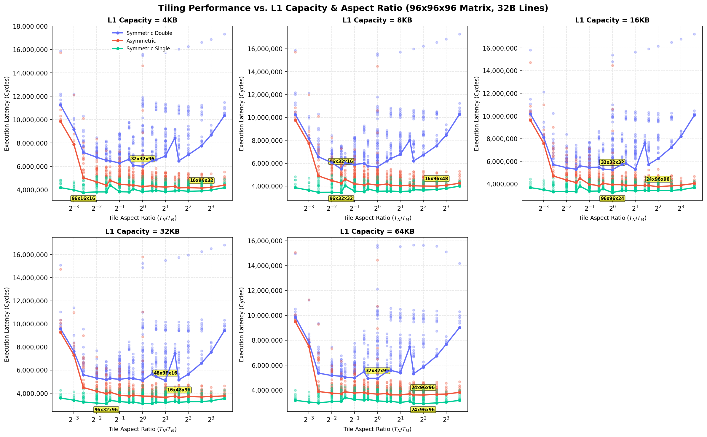

# Empirical L1 Cache Capacity Tiling Sweeps (32B Lines)

This directory contains the results of empirical tile sweeps for a **$96 \times 96 \times 96$ matrix** under a fixed **32B cache line size**, sweeping L1 Cache Capacities $C_{L1} \in \{4, 8, 16, 32, 64\}$ KB and tile dimensions $T_M, T_N, T_K \in \{8, 12, 16, 24, 32, 48, 96\}$.

> [!NOTE]
> **Hardware Parameters:**
> * **Matrix Size:** $96 \times 96 \times 96$.
> * **Cache Line Size:** 32B for both L1 and L2 caches.
> * **L1 Cache:** Swept capacity, 8-way associativity, 4-cycle access, LRU replacement, Write-Back policy.
> * **L2 Cache:** 64 KB capacity, 8-way associativity, 14-cycle access, LRU replacement, Write-Back policy.
> * **DRAM Latency:** 180 cycles.
> * **Register Tile:** $4 \times 4 \times 4$ ($R_M \times R_N \times R_K$), 8-cycle compute (`tmulac`).

## 1. Summary of Optimal Tile Shapes by L1 Cache Capacity

| L1 Capacity | Precision Config | Optimal Tile Shape ($T_M \times T_N \times T_K$) | Ratio ($T_N/T_M$) | Footprint (KB) | L1 Hit Rate | L2 Hit Rate | DRAM Traffic (KB) | Total Cycles |
| :---: | :---: | :---: | :---: | :---: | :---: | :---: | :---: | :---: |
| 4KB | Symmetric Double | 32x32x96 | 1.000 | 56.0 KB | 0.819 | 0.882 | 656.0 KB | 6,010,688 |
| 4KB | Asymmetric | 16x96x32 | 6.000 | 22.0 KB | 0.946 | 0.860 | 266.0 KB | 4,150,532 |
| 4KB | Symmetric Single | 96x16x16 | 0.167 | 13.0 KB | 0.963 | 0.885 | 152.0 KB | 3,773,728 |
| 8KB | Symmetric Double | 96x32x16 | 0.333 | 40.0 KB | 0.946 | 0.749 | 656.0 KB | 5,500,608 |
| 8KB | Asymmetric | 16x96x48 | 6.000 | 27.0 KB | 0.949 | 0.839 | 263.2 KB | 3,996,884 |
| 8KB | Symmetric Single | 96x32x32 | 0.333 | 28.0 KB | 0.977 | 0.718 | 218.8 KB | 3,439,984 |
| 16KB | Symmetric Double | 32x32x32 | 1.000 | 24.0 KB | 0.949 | 0.676 | 656.0 KB | 5,252,624 |
| 16KB | Asymmetric | 24x96x96 | 4.000 | 54.0 KB | 0.952 | 0.807 | 261.1 KB | 3,763,998 |
| 16KB | Symmetric Single | 96x96x24 | 1.000 | 54.0 KB | 0.983 | 0.716 | 178.3 KB | 3,250,238 |
| 32KB | Symmetric Double | 48x96x16 | 2.000 | 54.0 KB | 0.958 | 0.734 | 565.6 KB | 5,096,636 |
| 32KB | Asymmetric | 16x48x96 | 3.000 | 27.0 KB | 0.984 | 0.508 | 264.5 KB | 3,639,274 |
| 32KB | Symmetric Single | 96x32x96 | 0.333 | 60.0 KB | 0.980 | 0.662 | 176.5 KB | 3,105,286 |
| 64KB | Symmetric Double | 32x32x96 | 1.000 | 56.0 KB | 0.978 | 0.072 | 720.9 KB | 4,938,264 |
| 64KB | Asymmetric | 24x96x96 | 4.000 | 54.0 KB | 0.990 | 0.019 | 349.4 KB | 3,598,360 |
| 64KB | Symmetric Single | 24x96x96 | 4.000 | 54.0 KB | 0.993 | 0.116 | 170.2 KB | 2,908,810 |

---

## 2. Details for L1 Capacity = 4KB

### Symmetric Double (4KB)

#### Top 3 Optimal Tile Shapes

| Rank | Tile Shape ($T_M \times T_N \times T_K$) | Ratio ($T_N/T_M$) | Footprint (KB) | L1 Hit Rate | L2 Hit Rate | DRAM Traffic (KB) | Total Cycles |
| :---: | :---: | :---: | :---: | :---: | :---: | :---: | :---: |
| 1 | 32x32x96 | 1.000 | 56.0 KB | 0.819 | 0.882 | 656.0 KB | 6,010,688 |
| 2 | 32x24x96 | 0.750 | 48.0 KB | 0.815 | 0.886 | 656.0 KB | 6,101,424 |
| 3 | 32x32x48 | 1.000 | 32.0 KB | 0.819 | 0.882 | 696.5 KB | 6,281,696 |

#### Bottom 3 Worst Tile Shapes

| Rank | Tile Shape ($T_M \times T_N \times T_K$) | Ratio ($T_N/T_M$) | Footprint (KB) | L1 Hit Rate | L2 Hit Rate | DRAM Traffic (KB) | Total Cycles |
| :---: | :---: | :---: | :---: | :---: | :---: | :---: | :---: |
| 341 | 16x96x96 | 6.000 | 96.0 KB | 0.825 | 0.270 | 4314.8 KB | 16,600,496 |
| 342 | 12x96x96 | 8.000 | 90.0 KB | 0.822 | 0.296 | 4359.9 KB | 16,868,876 |
| 343 | 8x96x96 | 12.000 | 84.0 KB | 0.818 | 0.346 | 4422.2 KB | 17,324,816 |

### Asymmetric (4KB)

#### Top 3 Optimal Tile Shapes

| Rank | Tile Shape ($T_M \times T_N \times T_K$) | Ratio ($T_N/T_M$) | Footprint (KB) | L1 Hit Rate | L2 Hit Rate | DRAM Traffic (KB) | Total Cycles |
| :---: | :---: | :---: | :---: | :---: | :---: | :---: | :---: |
| 1 | 16x96x32 | 6.000 | 22.0 KB | 0.946 | 0.860 | 266.0 KB | 4,150,532 |
| 2 | 32x96x32 | 3.000 | 38.0 KB | 0.946 | 0.830 | 319.2 KB | 4,171,250 |
| 3 | 24x96x32 | 4.000 | 30.0 KB | 0.946 | 0.835 | 313.8 KB | 4,189,544 |

#### Bottom 3 Worst Tile Shapes

| Rank | Tile Shape ($T_M \times T_N \times T_K$) | Ratio ($T_N/T_M$) | Footprint (KB) | L1 Hit Rate | L2 Hit Rate | DRAM Traffic (KB) | Total Cycles |
| :---: | :---: | :---: | :---: | :---: | :---: | :---: | :---: |
| 341 | 96x12x96 | 0.125 | 83.2 KB | 0.782 | 0.653 | 2600.0 KB | 12,097,904 |
| 342 | 96x96x8 | 1.000 | 79.5 KB | 0.933 | 0.541 | 2046.6 KB | 14,620,566 |
| 343 | 96x8x96 | 0.083 | 79.5 KB | 0.777 | 0.543 | 3752.0 KB | 15,722,384 |

### Symmetric Single (4KB)

#### Top 3 Optimal Tile Shapes

| Rank | Tile Shape ($T_M \times T_N \times T_K$) | Ratio ($T_N/T_M$) | Footprint (KB) | L1 Hit Rate | L2 Hit Rate | DRAM Traffic (KB) | Total Cycles |
| :---: | :---: | :---: | :---: | :---: | :---: | :---: | :---: |
| 1 | 96x16x16 | 0.167 | 13.0 KB | 0.963 | 0.885 | 152.0 KB | 3,773,728 |
| 2 | 48x32x16 | 0.667 | 11.0 KB | 0.972 | 0.809 | 224.0 KB | 3,821,952 |
| 3 | 96x32x16 | 0.333 | 20.0 KB | 0.973 | 0.787 | 241.4 KB | 3,823,320 |

#### Bottom 3 Worst Tile Shapes

| Rank | Tile Shape ($T_M \times T_N \times T_K$) | Ratio ($T_N/T_M$) | Footprint (KB) | L1 Hit Rate | L2 Hit Rate | DRAM Traffic (KB) | Total Cycles |
| :---: | :---: | :---: | :---: | :---: | :---: | :---: | :---: |
| 341 | 32x8x32 | 0.250 | 6.0 KB | 0.859 | 0.946 | 267.9 KB | 5,152,336 |
| 342 | 32x8x8 | 0.250 | 2.2 KB | 0.956 | 0.890 | 275.5 KB | 5,160,180 |
| 343 | 8x8x32 | 1.000 | 2.2 KB | 0.871 | 0.966 | 152.0 KB | 5,188,384 |

---

## 2. Details for L1 Capacity = 8KB

### Symmetric Double (8KB)

#### Top 3 Optimal Tile Shapes

| Rank | Tile Shape ($T_M \times T_N \times T_K$) | Ratio ($T_N/T_M$) | Footprint (KB) | L1 Hit Rate | L2 Hit Rate | DRAM Traffic (KB) | Total Cycles |
| :---: | :---: | :---: | :---: | :---: | :---: | :---: | :---: |
| 1 | 96x32x16 | 0.333 | 40.0 KB | 0.946 | 0.749 | 656.0 KB | 5,500,608 |
| 2 | 32x32x16 | 1.000 | 16.0 KB | 0.940 | 0.772 | 656.0 KB | 5,684,928 |
| 3 | 32x24x16 | 0.750 | 13.0 KB | 0.938 | 0.782 | 656.0 KB | 5,754,496 |

#### Bottom 3 Worst Tile Shapes

| Rank | Tile Shape ($T_M \times T_N \times T_K$) | Ratio ($T_N/T_M$) | Footprint (KB) | L1 Hit Rate | L2 Hit Rate | DRAM Traffic (KB) | Total Cycles |
| :---: | :---: | :---: | :---: | :---: | :---: | :---: | :---: |
| 341 | 16x96x96 | 6.000 | 96.0 KB | 0.829 | 0.253 | 4314.8 KB | 16,569,584 |
| 342 | 12x96x96 | 8.000 | 90.0 KB | 0.826 | 0.280 | 4359.9 KB | 16,837,964 |
| 343 | 8x96x96 | 12.000 | 84.0 KB | 0.821 | 0.333 | 4422.2 KB | 17,293,904 |

### Asymmetric (8KB)

#### Top 3 Optimal Tile Shapes

| Rank | Tile Shape ($T_M \times T_N \times T_K$) | Ratio ($T_N/T_M$) | Footprint (KB) | L1 Hit Rate | L2 Hit Rate | DRAM Traffic (KB) | Total Cycles |
| :---: | :---: | :---: | :---: | :---: | :---: | :---: | :---: |
| 1 | 16x96x48 | 6.000 | 27.0 KB | 0.949 | 0.839 | 263.2 KB | 3,996,884 |
| 2 | 24x96x48 | 4.000 | 36.0 KB | 0.949 | 0.817 | 299.2 KB | 4,005,876 |
| 3 | 32x96x48 | 3.000 | 45.0 KB | 0.949 | 0.806 | 314.9 KB | 4,023,872 |

#### Bottom 3 Worst Tile Shapes

| Rank | Tile Shape ($T_M \times T_N \times T_K$) | Ratio ($T_N/T_M$) | Footprint (KB) | L1 Hit Rate | L2 Hit Rate | DRAM Traffic (KB) | Total Cycles |
| :---: | :---: | :---: | :---: | :---: | :---: | :---: | :---: |
| 341 | 96x12x96 | 0.125 | 83.2 KB | 0.795 | 0.632 | 2600.0 KB | 11,996,284 |
| 342 | 96x96x8 | 1.000 | 79.5 KB | 0.949 | 0.460 | 2046.6 KB | 14,460,600 |
| 343 | 96x8x96 | 0.083 | 79.5 KB | 0.779 | 0.540 | 3752.0 KB | 15,709,356 |

### Symmetric Single (8KB)

#### Top 3 Optimal Tile Shapes

| Rank | Tile Shape ($T_M \times T_N \times T_K$) | Ratio ($T_N/T_M$) | Footprint (KB) | L1 Hit Rate | L2 Hit Rate | DRAM Traffic (KB) | Total Cycles |
| :---: | :---: | :---: | :---: | :---: | :---: | :---: | :---: |
| 1 | 96x32x32 | 0.333 | 28.0 KB | 0.977 | 0.718 | 218.8 KB | 3,439,984 |
| 2 | 96x16x32 | 0.167 | 20.0 KB | 0.966 | 0.850 | 152.0 KB | 3,455,552 |
| 3 | 96x24x32 | 0.250 | 24.0 KB | 0.973 | 0.768 | 202.1 KB | 3,461,268 |

#### Bottom 3 Worst Tile Shapes

| Rank | Tile Shape ($T_M \times T_N \times T_K$) | Ratio ($T_N/T_M$) | Footprint (KB) | L1 Hit Rate | L2 Hit Rate | DRAM Traffic (KB) | Total Cycles |
| :---: | :---: | :---: | :---: | :---: | :---: | :---: | :---: |
| 341 | 8x8x96 | 1.000 | 6.2 KB | 0.878 | 0.960 | 152.0 KB | 4,842,016 |
| 342 | 32x8x8 | 0.250 | 2.2 KB | 0.971 | 0.812 | 275.0 KB | 4,868,408 |
| 343 | 32x8x96 | 0.250 | 16.0 KB | 0.845 | 0.947 | 253.8 KB | 4,949,692 |

---

## 2. Details for L1 Capacity = 16KB

### Symmetric Double (16KB)

#### Top 3 Optimal Tile Shapes

| Rank | Tile Shape ($T_M \times T_N \times T_K$) | Ratio ($T_N/T_M$) | Footprint (KB) | L1 Hit Rate | L2 Hit Rate | DRAM Traffic (KB) | Total Cycles |
| :---: | :---: | :---: | :---: | :---: | :---: | :---: | :---: |
| 1 | 32x32x32 | 1.000 | 24.0 KB | 0.949 | 0.676 | 656.0 KB | 5,252,624 |
| 2 | 48x96x12 | 2.000 | 49.5 KB | 0.950 | 0.807 | 534.9 KB | 5,297,682 |
| 3 | 48x16x32 | 0.333 | 22.0 KB | 0.940 | 0.739 | 610.2 KB | 5,300,176 |

#### Bottom 3 Worst Tile Shapes

| Rank | Tile Shape ($T_M \times T_N \times T_K$) | Ratio ($T_N/T_M$) | Footprint (KB) | L1 Hit Rate | L2 Hit Rate | DRAM Traffic (KB) | Total Cycles |
| :---: | :---: | :---: | :---: | :---: | :---: | :---: | :---: |
| 341 | 16x96x96 | 6.000 | 96.0 KB | 0.838 | 0.213 | 4317.9 KB | 16,512,188 |
| 342 | 12x96x96 | 8.000 | 90.0 KB | 0.835 | 0.243 | 4365.4 KB | 16,787,408 |
| 343 | 8x96x96 | 12.000 | 84.0 KB | 0.829 | 0.302 | 4425.9 KB | 17,238,128 |

### Asymmetric (16KB)

#### Top 3 Optimal Tile Shapes

| Rank | Tile Shape ($T_M \times T_N \times T_K$) | Ratio ($T_N/T_M$) | Footprint (KB) | L1 Hit Rate | L2 Hit Rate | DRAM Traffic (KB) | Total Cycles |
| :---: | :---: | :---: | :---: | :---: | :---: | :---: | :---: |
| 1 | 24x96x96 | 4.000 | 54.0 KB | 0.952 | 0.807 | 261.1 KB | 3,763,998 |
| 2 | 16x96x48 | 6.000 | 27.0 KB | 0.972 | 0.736 | 269.2 KB | 3,841,152 |
| 3 | 16x96x96 | 6.000 | 42.0 KB | 0.952 | 0.813 | 260.0 KB | 3,845,838 |

#### Bottom 3 Worst Tile Shapes

| Rank | Tile Shape ($T_M \times T_N \times T_K$) | Ratio ($T_N/T_M$) | Footprint (KB) | L1 Hit Rate | L2 Hit Rate | DRAM Traffic (KB) | Total Cycles |
| :---: | :---: | :---: | :---: | :---: | :---: | :---: | :---: |
| 341 | 96x12x96 | 0.125 | 83.2 KB | 0.923 | 0.051 | 2600.0 KB | 10,998,900 |
| 342 | 96x96x8 | 1.000 | 79.5 KB | 0.949 | 0.457 | 2052.2 KB | 14,470,546 |
| 343 | 96x8x96 | 0.083 | 79.5 KB | 0.896 | 0.036 | 3752.0 KB | 14,735,416 |

### Symmetric Single (16KB)

#### Top 3 Optimal Tile Shapes

| Rank | Tile Shape ($T_M \times T_N \times T_K$) | Ratio ($T_N/T_M$) | Footprint (KB) | L1 Hit Rate | L2 Hit Rate | DRAM Traffic (KB) | Total Cycles |
| :---: | :---: | :---: | :---: | :---: | :---: | :---: | :---: |
| 1 | 96x96x24 | 1.000 | 54.0 KB | 0.983 | 0.716 | 178.3 KB | 3,250,238 |
| 2 | 96x96x16 | 1.000 | 48.0 KB | 0.980 | 0.810 | 152.0 KB | 3,309,204 |
| 3 | 96x16x96 | 0.167 | 48.0 KB | 0.959 | 0.850 | 152.0 KB | 3,323,606 |

#### Bottom 3 Worst Tile Shapes

| Rank | Tile Shape ($T_M \times T_N \times T_K$) | Ratio ($T_N/T_M$) | Footprint (KB) | L1 Hit Rate | L2 Hit Rate | DRAM Traffic (KB) | Total Cycles |
| :---: | :---: | :---: | :---: | :---: | :---: | :---: | :---: |
| 341 | 8x12x8 | 1.500 | 1.0 KB | 0.979 | 0.823 | 152.0 KB | 4,551,852 |
| 342 | 32x8x8 | 0.250 | 2.2 KB | 0.986 | 0.572 | 274.5 KB | 4,629,710 |
| 343 | 8x8x8 | 1.000 | 0.8 KB | 0.982 | 0.802 | 152.0 KB | 4,669,560 |

---

## 2. Details for L1 Capacity = 32KB

### Symmetric Double (32KB)

#### Top 3 Optimal Tile Shapes

| Rank | Tile Shape ($T_M \times T_N \times T_K$) | Ratio ($T_N/T_M$) | Footprint (KB) | L1 Hit Rate | L2 Hit Rate | DRAM Traffic (KB) | Total Cycles |
| :---: | :---: | :---: | :---: | :---: | :---: | :---: | :---: |
| 1 | 48x96x16 | 2.000 | 54.0 KB | 0.958 | 0.734 | 565.6 KB | 5,096,636 |
| 2 | 48x48x32 | 1.000 | 42.0 KB | 0.965 | 0.539 | 676.1 KB | 5,113,386 |
| 3 | 32x96x24 | 3.000 | 48.0 KB | 0.961 | 0.627 | 658.0 KB | 5,148,562 |

#### Bottom 3 Worst Tile Shapes

| Rank | Tile Shape ($T_M \times T_N \times T_K$) | Ratio ($T_N/T_M$) | Footprint (KB) | L1 Hit Rate | L2 Hit Rate | DRAM Traffic (KB) | Total Cycles |
| :---: | :---: | :---: | :---: | :---: | :---: | :---: | :---: |
| 341 | 16x96x96 | 6.000 | 96.0 KB | 0.855 | 0.131 | 4280.9 KB | 16,272,952 |
| 342 | 12x96x96 | 8.000 | 90.0 KB | 0.851 | 0.170 | 4314.8 KB | 16,507,364 |
| 343 | 8x96x96 | 12.000 | 84.0 KB | 0.846 | 0.247 | 4327.9 KB | 16,816,492 |

### Asymmetric (32KB)

#### Top 3 Optimal Tile Shapes

| Rank | Tile Shape ($T_M \times T_N \times T_K$) | Ratio ($T_N/T_M$) | Footprint (KB) | L1 Hit Rate | L2 Hit Rate | DRAM Traffic (KB) | Total Cycles |
| :---: | :---: | :---: | :---: | :---: | :---: | :---: | :---: |
| 1 | 16x48x96 | 3.000 | 27.0 KB | 0.984 | 0.508 | 264.5 KB | 3,639,274 |
| 2 | 16x32x96 | 2.000 | 22.0 KB | 0.985 | 0.488 | 260.0 KB | 3,651,172 |
| 3 | 16x96x96 | 6.000 | 42.0 KB | 0.978 | 0.609 | 271.8 KB | 3,682,080 |

#### Bottom 3 Worst Tile Shapes

| Rank | Tile Shape ($T_M \times T_N \times T_K$) | Ratio ($T_N/T_M$) | Footprint (KB) | L1 Hit Rate | L2 Hit Rate | DRAM Traffic (KB) | Total Cycles |
| :---: | :---: | :---: | :---: | :---: | :---: | :---: | :---: |
| 341 | 96x96x12 | 1.000 | 83.2 KB | 0.958 | 0.373 | 1629.6 KB | 11,033,282 |
| 342 | 96x8x96 | 0.083 | 79.5 KB | 0.896 | 0.035 | 3752.0 KB | 14,728,806 |
| 343 | 96x96x8 | 1.000 | 79.5 KB | 0.950 | 0.328 | 2521.2 KB | 15,804,032 |

### Symmetric Single (32KB)

#### Top 3 Optimal Tile Shapes

| Rank | Tile Shape ($T_M \times T_N \times T_K$) | Ratio ($T_N/T_M$) | Footprint (KB) | L1 Hit Rate | L2 Hit Rate | DRAM Traffic (KB) | Total Cycles |
| :---: | :---: | :---: | :---: | :---: | :---: | :---: | :---: |
| 1 | 96x32x96 | 0.333 | 60.0 KB | 0.980 | 0.662 | 176.5 KB | 3,105,286 |
| 2 | 24x32x96 | 1.333 | 24.0 KB | 0.987 | 0.549 | 160.1 KB | 3,106,852 |
| 3 | 96x96x24 | 1.000 | 54.0 KB | 0.984 | 0.723 | 156.5 KB | 3,112,194 |

#### Bottom 3 Worst Tile Shapes

| Rank | Tile Shape ($T_M \times T_N \times T_K$) | Ratio ($T_N/T_M$) | Footprint (KB) | L1 Hit Rate | L2 Hit Rate | DRAM Traffic (KB) | Total Cycles |
| :---: | :---: | :---: | :---: | :---: | :---: | :---: | :---: |
| 341 | 12x8x8 | 0.667 | 1.0 KB | 0.987 | 0.724 | 152.4 KB | 4,449,308 |
| 342 | 8x12x8 | 1.500 | 1.0 KB | 0.981 | 0.799 | 152.0 KB | 4,517,024 |
| 343 | 8x8x8 | 1.000 | 0.8 KB | 0.982 | 0.799 | 152.0 KB | 4,664,480 |

---

## 2. Details for L1 Capacity = 64KB

### Symmetric Double (64KB)

#### Top 3 Optimal Tile Shapes

| Rank | Tile Shape ($T_M \times T_N \times T_K$) | Ratio ($T_N/T_M$) | Footprint (KB) | L1 Hit Rate | L2 Hit Rate | DRAM Traffic (KB) | Total Cycles |
| :---: | :---: | :---: | :---: | :---: | :---: | :---: | :---: |
| 1 | 32x32x96 | 1.000 | 56.0 KB | 0.978 | 0.072 | 720.9 KB | 4,938,264 |
| 2 | 32x24x96 | 0.750 | 48.0 KB | 0.978 | 0.087 | 708.6 KB | 4,939,848 |
| 3 | 32x16x96 | 0.500 | 40.0 KB | 0.979 | 0.101 | 696.4 KB | 4,978,296 |

#### Bottom 3 Worst Tile Shapes

| Rank | Tile Shape ($T_M \times T_N \times T_K$) | Ratio ($T_N/T_M$) | Footprint (KB) | L1 Hit Rate | L2 Hit Rate | DRAM Traffic (KB) | Total Cycles |
| :---: | :---: | :---: | :---: | :---: | :---: | :---: | :---: |
| 341 | 24x96x96 | 4.000 | 108.0 KB | 0.867 | 0.056 | 4132.1 KB | 15,640,858 |
| 342 | 96x96x8 | 1.000 | 84.0 KB | 0.949 | 0.315 | 2565.4 KB | 15,642,580 |
| 343 | 32x96x96 | 3.000 | 120.0 KB | 0.866 | 0.039 | 4151.8 KB | 15,648,360 |

### Asymmetric (64KB)

#### Top 3 Optimal Tile Shapes

| Rank | Tile Shape ($T_M \times T_N \times T_K$) | Ratio ($T_N/T_M$) | Footprint (KB) | L1 Hit Rate | L2 Hit Rate | DRAM Traffic (KB) | Total Cycles |
| :---: | :---: | :---: | :---: | :---: | :---: | :---: | :---: |
| 1 | 24x96x96 | 4.000 | 54.0 KB | 0.990 | 0.019 | 349.4 KB | 3,598,360 |
| 2 | 16x32x96 | 2.000 | 22.0 KB | 0.990 | 0.160 | 297.2 KB | 3,608,580 |
| 3 | 16x48x96 | 3.000 | 27.0 KB | 0.990 | 0.121 | 311.8 KB | 3,609,828 |

#### Bottom 3 Worst Tile Shapes

| Rank | Tile Shape ($T_M \times T_N \times T_K$) | Ratio ($T_N/T_M$) | Footprint (KB) | L1 Hit Rate | L2 Hit Rate | DRAM Traffic (KB) | Total Cycles |
| :---: | :---: | :---: | :---: | :---: | :---: | :---: | :---: |
| 341 | 96x12x96 | 0.125 | 83.2 KB | 0.923 | 0.013 | 2697.2 KB | 11,264,128 |
| 342 | 96x96x8 | 1.000 | 79.5 KB | 0.951 | 0.400 | 2169.9 KB | 14,431,580 |
| 343 | 96x8x96 | 0.083 | 79.5 KB | 0.896 | 0.005 | 3870.0 KB | 15,065,216 |

### Symmetric Single (64KB)

#### Top 3 Optimal Tile Shapes

| Rank | Tile Shape ($T_M \times T_N \times T_K$) | Ratio ($T_N/T_M$) | Footprint (KB) | L1 Hit Rate | L2 Hit Rate | DRAM Traffic (KB) | Total Cycles |
| :---: | :---: | :---: | :---: | :---: | :---: | :---: | :---: |
| 1 | 24x96x96 | 4.000 | 54.0 KB | 0.993 | 0.116 | 170.2 KB | 2,908,810 |
| 2 | 32x96x96 | 3.000 | 60.0 KB | 0.992 | 0.207 | 181.2 KB | 2,936,730 |
| 3 | 16x96x96 | 6.000 | 48.0 KB | 0.994 | 0.134 | 164.0 KB | 2,964,326 |

#### Bottom 3 Worst Tile Shapes

| Rank | Tile Shape ($T_M \times T_N \times T_K$) | Ratio ($T_N/T_M$) | Footprint (KB) | L1 Hit Rate | L2 Hit Rate | DRAM Traffic (KB) | Total Cycles |
| :---: | :---: | :---: | :---: | :---: | :---: | :---: | :---: |
| 341 | 48x8x8 | 0.167 | 3.2 KB | 0.994 | 0.051 | 245.9 KB | 4,318,076 |
| 342 | 8x8x8 | 1.000 | 0.8 KB | 0.996 | 0.178 | 152.5 KB | 4,368,902 |
| 343 | 32x8x8 | 0.250 | 2.2 KB | 0.993 | 0.171 | 254.6 KB | 4,416,282 |

---

## 3. Aspect Ratio Sensitivity vs. L1 Capacity
The plot below details how the L1 capacity size affects both execution cycles and the shape aspect ratio trend.

