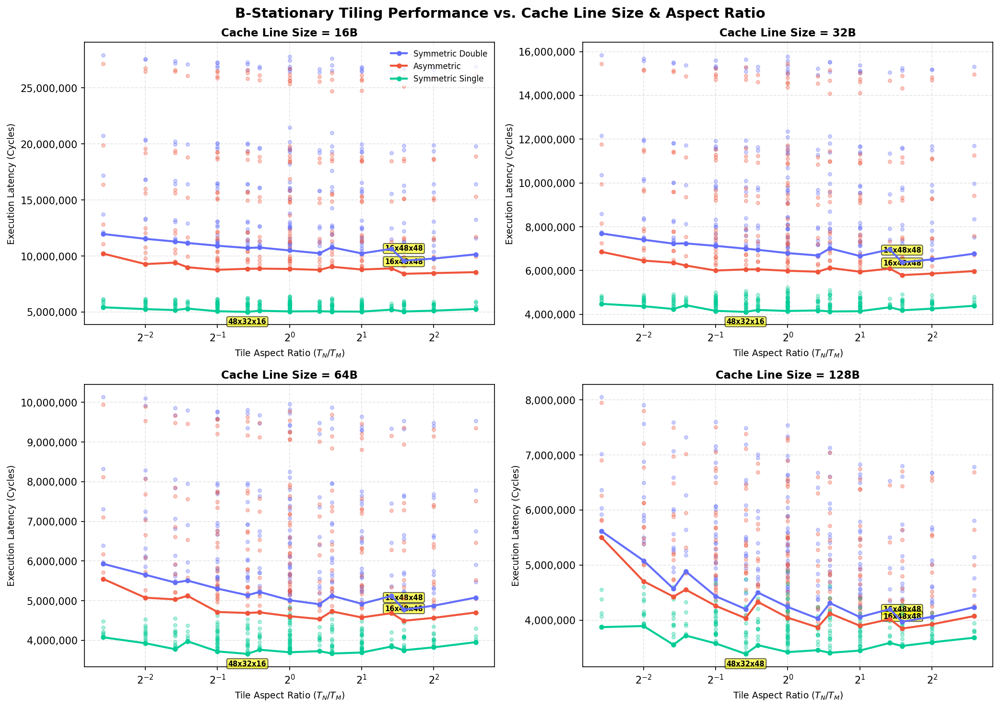

# B-Stationary Empirical Cache Line Size Tiling Sweeps

This directory contains the results of empirical tile sweeps for a **$96 \times 96 \times 96$ matrix** multiplication under **16 KB L1** and **64 KB L2** caches under **B-stationary** loop ordering. We sweep cache line sizes $L \in \{16, 32, 64, 128\}$ bytes and tile dimensions $T_M, T_N, T_K \in \{8, 12, 16, 24, 32, 48\}$.

> [Safe/Hardware Parameters]
> * **Matrix Size:** $96 \times 96 \times 96$.
> * **Loop Nesting:** B-stationary.
> * **L1 Cache:** 16 KB capacity, 8-way associativity, 4-cycle access, LRU replacement, Write-Back policy.
> * **L2 Cache:** 64 KB capacity, 8-way associativity, 14-cycle access, LRU replacement, Write-Back policy.
> * **DRAM Latency:** 180 cycles.
> * **Register Tile:** $4 \times 4 \times 4$, 8-cycle compute (`tmulac`).

## 1. Summary of Optimal Tile Shapes by Cache Line Size (B-Stationary)

| Cache Line Size | Precision Config | Optimal Tile Shape ($T_M \times T_N \times T_K$) | Ratio ($T_N/T_M$) | Footprint (KB) | L1 Hit Rate | L2 Hit Rate | DRAM Traffic (KB) | Total Cycles |
| :---: | :---: | :---: | :---: | :---: | :---: | :---: | :---: | :---: |
| 16B | Symmetric Double | 16x48x48 | 3.000 | 30.0 KB | 0.927 | 0.645 | 655.6 KB | 9,583,584 |
| 16B | Asymmetric | 16x48x48 | 3.000 | 16.5 KB | 0.964 | 0.472 | 536.4 KB | 8,412,572 |
| 16B | Symmetric Single | 48x32x16 | 0.667 | 11.0 KB | 0.969 | 0.812 | 155.8 KB | 5,016,896 |
| 32B | Symmetric Double | 16x48x48 | 3.000 | 30.0 KB | 0.963 | 0.645 | 655.6 KB | 6,376,944 |
| 32B | Asymmetric | 16x48x48 | 3.000 | 16.5 KB | 0.982 | 0.473 | 536.4 KB | 5,791,788 |
| 32B | Symmetric Single | 48x32x16 | 0.667 | 11.0 KB | 0.984 | 0.812 | 155.8 KB | 4,112,032 |
| 64B | Symmetric Double | 16x48x48 | 3.000 | 30.0 KB | 0.982 | 0.645 | 655.9 KB | 4,773,564 |
| 64B | Asymmetric | 16x48x48 | 3.000 | 16.5 KB | 0.990 | 0.511 | 537.0 KB | 4,494,624 |
| 64B | Symmetric Single | 48x32x16 | 0.667 | 11.0 KB | 0.992 | 0.812 | 155.8 KB | 3,659,600 |
| 128B | Symmetric Double | 16x48x48 | 3.000 | 30.0 KB | 0.991 | 0.642 | 656.5 KB | 3,971,712 |
| 128B | Asymmetric | 16x48x48 | 3.000 | 16.5 KB | 0.994 | 0.581 | 536.8 KB | 3,845,882 |
| 128B | Symmetric Single | 48x32x48 | 0.667 | 21.0 KB | 0.995 | 0.704 | 222.8 KB | 3,385,056 |

---

## 2. Details for Line Size = 16B

### Symmetric Double (16B)

#### Top 3 Optimal Tile Shapes

| Rank | Tile Shape ($T_M \times T_N \times T_K$) | Ratio ($T_N/T_M$) | Footprint (KB) | L1 Hit Rate | L2 Hit Rate | DRAM Traffic (KB) | Total Cycles |
| :---: | :---: | :---: | :---: | :---: | :---: | :---: | :---: |
| 1 | 16x48x48 | 3.000 | 30.0 KB | 0.927 | 0.645 | 655.6 KB | 9,583,584 |
| 2 | 12x48x48 | 4.000 | 27.0 KB | 0.918 | 0.684 | 655.8 KB | 9,769,720 |
| 3 | 8x48x48 | 6.000 | 24.0 KB | 0.902 | 0.742 | 655.2 KB | 10,148,472 |

### Asymmetric (16B)

#### Top 3 Optimal Tile Shapes

| Rank | Tile Shape ($T_M \times T_N \times T_K$) | Ratio ($T_N/T_M$) | Footprint (KB) | L1 Hit Rate | L2 Hit Rate | DRAM Traffic (KB) | Total Cycles |
| :---: | :---: | :---: | :---: | :---: | :---: | :---: | :---: |
| 1 | 16x48x48 | 3.000 | 16.5 KB | 0.964 | 0.472 | 536.4 KB | 8,412,572 |
| 2 | 12x48x48 | 4.000 | 13.5 KB | 0.966 | 0.458 | 536.9 KB | 8,474,464 |
| 3 | 8x48x48 | 6.000 | 10.5 KB | 0.971 | 0.416 | 534.1 KB | 8,558,584 |

### Symmetric Single (16B)

#### Top 3 Optimal Tile Shapes

| Rank | Tile Shape ($T_M \times T_N \times T_K$) | Ratio ($T_N/T_M$) | Footprint (KB) | L1 Hit Rate | L2 Hit Rate | DRAM Traffic (KB) | Total Cycles |
| :---: | :---: | :---: | :---: | :---: | :---: | :---: | :---: |
| 1 | 48x32x16 | 0.667 | 11.0 KB | 0.969 | 0.812 | 155.8 KB | 5,016,896 |
| 2 | 24x48x16 | 2.000 | 9.0 KB | 0.971 | 0.804 | 156.0 KB | 5,038,688 |
| 3 | 32x48x16 | 1.500 | 11.0 KB | 0.969 | 0.808 | 158.8 KB | 5,050,112 |

---

## 2. Details for Line Size = 32B

### Symmetric Double (32B)

#### Top 3 Optimal Tile Shapes

| Rank | Tile Shape ($T_M \times T_N \times T_K$) | Ratio ($T_N/T_M$) | Footprint (KB) | L1 Hit Rate | L2 Hit Rate | DRAM Traffic (KB) | Total Cycles |
| :---: | :---: | :---: | :---: | :---: | :---: | :---: | :---: |
| 1 | 16x48x48 | 3.000 | 30.0 KB | 0.963 | 0.645 | 655.6 KB | 6,376,944 |
| 2 | 12x48x48 | 4.000 | 27.0 KB | 0.959 | 0.684 | 655.8 KB | 6,506,876 |
| 3 | 24x48x48 | 2.000 | 36.0 KB | 0.956 | 0.723 | 718.7 KB | 6,663,588 |

### Asymmetric (32B)

#### Top 3 Optimal Tile Shapes

| Rank | Tile Shape ($T_M \times T_N \times T_K$) | Ratio ($T_N/T_M$) | Footprint (KB) | L1 Hit Rate | L2 Hit Rate | DRAM Traffic (KB) | Total Cycles |
| :---: | :---: | :---: | :---: | :---: | :---: | :---: | :---: |
| 1 | 16x48x48 | 3.000 | 16.5 KB | 0.982 | 0.473 | 536.4 KB | 5,791,788 |
| 2 | 12x48x48 | 4.000 | 13.5 KB | 0.983 | 0.459 | 536.9 KB | 5,859,464 |
| 3 | 24x32x48 | 1.333 | 18.0 KB | 0.978 | 0.516 | 579.3 KB | 5,945,014 |

### Symmetric Single (32B)

#### Top 3 Optimal Tile Shapes

| Rank | Tile Shape ($T_M \times T_N \times T_K$) | Ratio ($T_N/T_M$) | Footprint (KB) | L1 Hit Rate | L2 Hit Rate | DRAM Traffic (KB) | Total Cycles |
| :---: | :---: | :---: | :---: | :---: | :---: | :---: | :---: |
| 1 | 48x32x16 | 0.667 | 11.0 KB | 0.984 | 0.812 | 155.8 KB | 4,112,032 |
| 2 | 32x48x16 | 1.500 | 11.0 KB | 0.984 | 0.809 | 158.8 KB | 4,129,312 |
| 3 | 24x48x16 | 2.000 | 9.0 KB | 0.985 | 0.805 | 156.1 KB | 4,141,904 |

---

## 2. Details for Line Size = 64B

### Symmetric Double (64B)

#### Top 3 Optimal Tile Shapes

| Rank | Tile Shape ($T_M \times T_N \times T_K$) | Ratio ($T_N/T_M$) | Footprint (KB) | L1 Hit Rate | L2 Hit Rate | DRAM Traffic (KB) | Total Cycles |
| :---: | :---: | :---: | :---: | :---: | :---: | :---: | :---: |
| 1 | 16x48x48 | 3.000 | 30.0 KB | 0.982 | 0.645 | 655.9 KB | 4,773,564 |
| 2 | 12x48x48 | 4.000 | 27.0 KB | 0.980 | 0.683 | 655.8 KB | 4,874,440 |
| 3 | 24x32x48 | 1.333 | 27.0 KB | 0.982 | 0.579 | 777.0 KB | 4,911,516 |

### Asymmetric (64B)

#### Top 3 Optimal Tile Shapes

| Rank | Tile Shape ($T_M \times T_N \times T_K$) | Ratio ($T_N/T_M$) | Footprint (KB) | L1 Hit Rate | L2 Hit Rate | DRAM Traffic (KB) | Total Cycles |
| :---: | :---: | :---: | :---: | :---: | :---: | :---: | :---: |
| 1 | 16x48x48 | 3.000 | 16.5 KB | 0.990 | 0.511 | 537.0 KB | 4,494,624 |
| 2 | 24x32x48 | 1.333 | 18.0 KB | 0.989 | 0.516 | 579.0 KB | 4,538,714 |
| 3 | 12x48x48 | 4.000 | 13.5 KB | 0.990 | 0.505 | 538.8 KB | 4,567,768 |

### Symmetric Single (64B)

#### Top 3 Optimal Tile Shapes

| Rank | Tile Shape ($T_M \times T_N \times T_K$) | Ratio ($T_N/T_M$) | Footprint (KB) | L1 Hit Rate | L2 Hit Rate | DRAM Traffic (KB) | Total Cycles |
| :---: | :---: | :---: | :---: | :---: | :---: | :---: | :---: |
| 1 | 48x32x16 | 0.667 | 11.0 KB | 0.992 | 0.812 | 155.8 KB | 3,659,600 |
| 2 | 32x48x16 | 1.500 | 11.0 KB | 0.992 | 0.810 | 158.8 KB | 3,668,912 |
| 3 | 48x32x48 | 0.667 | 21.0 KB | 0.993 | 0.645 | 220.0 KB | 3,669,816 |

---

## 2. Details for Line Size = 128B

### Symmetric Double (128B)

#### Top 3 Optimal Tile Shapes

| Rank | Tile Shape ($T_M \times T_N \times T_K$) | Ratio ($T_N/T_M$) | Footprint (KB) | L1 Hit Rate | L2 Hit Rate | DRAM Traffic (KB) | Total Cycles |
| :---: | :---: | :---: | :---: | :---: | :---: | :---: | :---: |
| 1 | 16x48x48 | 3.000 | 30.0 KB | 0.991 | 0.642 | 656.5 KB | 3,971,712 |
| 2 | 24x32x48 | 1.333 | 27.0 KB | 0.991 | 0.557 | 790.0 KB | 4,027,536 |
| 3 | 24x48x48 | 2.000 | 36.0 KB | 0.986 | 0.812 | 710.0 KB | 4,054,440 |

### Asymmetric (128B)

#### Top 3 Optimal Tile Shapes

| Rank | Tile Shape ($T_M \times T_N \times T_K$) | Ratio ($T_N/T_M$) | Footprint (KB) | L1 Hit Rate | L2 Hit Rate | DRAM Traffic (KB) | Total Cycles |
| :---: | :---: | :---: | :---: | :---: | :---: | :---: | :---: |
| 1 | 16x48x48 | 3.000 | 16.5 KB | 0.994 | 0.581 | 536.8 KB | 3,845,882 |
| 2 | 24x32x48 | 1.333 | 18.0 KB | 0.993 | 0.561 | 603.8 KB | 3,867,544 |
| 3 | 24x48x48 | 2.000 | 22.5 KB | 0.988 | 0.838 | 534.0 KB | 3,896,510 |

### Symmetric Single (128B)

#### Top 3 Optimal Tile Shapes

| Rank | Tile Shape ($T_M \times T_N \times T_K$) | Ratio ($T_N/T_M$) | Footprint (KB) | L1 Hit Rate | L2 Hit Rate | DRAM Traffic (KB) | Total Cycles |
| :---: | :---: | :---: | :---: | :---: | :---: | :---: | :---: |
| 1 | 48x32x48 | 0.667 | 21.0 KB | 0.995 | 0.704 | 222.8 KB | 3,385,056 |
| 2 | 32x48x32 | 1.500 | 16.0 KB | 0.996 | 0.742 | 216.0 KB | 3,405,016 |
| 3 | 48x32x32 | 0.667 | 16.0 KB | 0.997 | 0.615 | 236.0 KB | 3,416,736 |

---

## 3. Physical Analysis & Conclusions

Under B-stationary loop ordering, the optimal tile shapes systematically favor **wider layouts** ($T_N > T_M$) compared to C-stationary. Because B is held stationary in registers outside the innermost loop, the L1 cache only needs to stream A and C, reducing C-accumulator spill pressure on L1 SRAM. As line size grows to 128B, the spatial prefetching benefit of row-major access speeds up execution but shifts the optimum toward shapes that fit inside L1 without set thrashing.

