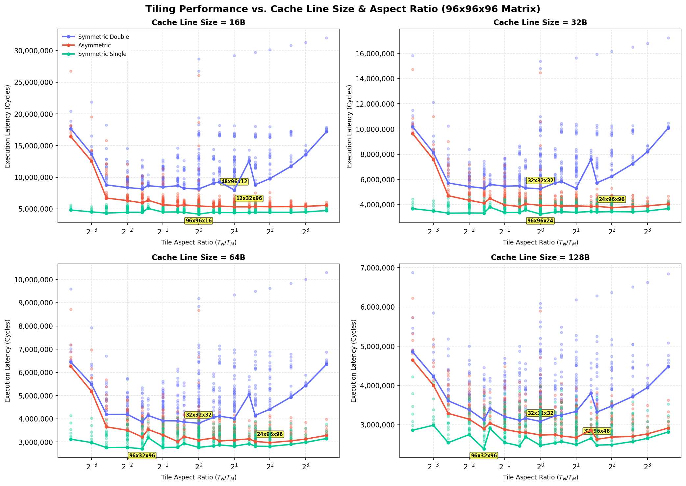

# Empirical Cache Line Size Tiling Sweeps

This directory contains the results of empirical tile sweeps for a **$96 \times 96 \times 96$ matrix** under **16 KB L1** and **64 KB L2** caches, sweeping cache line sizes $L \in \{16, 32, 64, 128\}$ bytes and tile dimensions $T_M, T_N, T_K \in \{8, 12, 16, 24, 32, 48\}$.

> [!NOTE]
> **Hardware Parameters:**
> * **Matrix Size:** $96 \times 96 \times 96$.
> * **L1 Cache:** 16 KB capacity, 8-way associativity, 4-cycle access, LRU replacement, Write-Back policy.
> * **L2 Cache:** 64 KB capacity, 8-way associativity, 14-cycle access, LRU replacement, Write-Back policy.
> * **DRAM Latency:** 180 cycles.
> * **Register Tile:** $4 \times 4 \times 4$ ($R_M \times R_N \times R_K$), 8-cycle compute (`tmulac`).

## 1. Summary of Optimal Tile Shapes by Cache Line Size

| Cache Line Size | Precision Config | Optimal Tile Shape ($T_M \times T_N \times T_K$) | Ratio ($T_N/T_M$) | Footprint (KB) | L1 Hit Rate | L2 Hit Rate | DRAM Traffic (KB) | Total Cycles |
| :---: | :---: | :---: | :---: | :---: | :---: | :---: | :---: | :---: |
| 16B | Symmetric Double | 48x96x12 | 2.000 | 49.5 KB | 0.899 | 0.807 | 534.9 KB | 7,978,020 |
| 16B | Asymmetric | 12x32x96 | 2.667 | 18.0 KB | 0.945 | 0.711 | 260.0 KB | 5,327,088 |
| 16B | Symmetric Single | 96x96x16 | 1.000 | 48.0 KB | 0.960 | 0.810 | 152.0 KB | 4,185,468 |
| 32B | Symmetric Double | 32x32x32 | 1.000 | 24.0 KB | 0.949 | 0.676 | 656.0 KB | 5,252,624 |
| 32B | Asymmetric | 24x96x96 | 4.000 | 54.0 KB | 0.952 | 0.807 | 261.1 KB | 3,763,998 |
| 32B | Symmetric Single | 96x96x24 | 1.000 | 54.0 KB | 0.983 | 0.716 | 178.3 KB | 3,250,238 |
| 64B | Symmetric Double | 32x32x32 | 1.000 | 24.0 KB | 0.974 | 0.677 | 656.0 KB | 3,806,800 |
| 64B | Asymmetric | 24x96x96 | 4.000 | 54.0 KB | 0.976 | 0.805 | 262.1 KB | 2,970,450 |
| 64B | Symmetric Single | 96x32x96 | 0.333 | 60.0 KB | 0.985 | 0.748 | 200.9 KB | 2,703,402 |
| 128B | Symmetric Double | 32x32x32 | 1.000 | 24.0 KB | 0.987 | 0.679 | 656.0 KB | 3,083,888 |
| 128B | Asymmetric | 32x96x48 | 3.000 | 45.0 KB | 0.994 | 0.648 | 332.0 KB | 2,629,164 |
| 128B | Symmetric Single | 96x32x96 | 0.333 | 60.0 KB | 0.994 | 0.719 | 175.0 KB | 2,386,578 |

---

## 2. Details for Line Size = 16B

### Symmetric Double (16B)

#### Top 3 Optimal Tile Shapes

| Rank | Tile Shape ($T_M \times T_N \times T_K$) | Ratio ($T_N/T_M$) | Footprint (KB) | L1 Hit Rate | L2 Hit Rate | DRAM Traffic (KB) | Total Cycles |
| :---: | :---: | :---: | :---: | :---: | :---: | :---: | :---: |
| 1 | 48x96x12 | 2.000 | 49.5 KB | 0.899 | 0.807 | 534.9 KB | 7,978,020 |
| 2 | 32x32x32 | 1.000 | 24.0 KB | 0.898 | 0.676 | 656.0 KB | 8,145,952 |
| 3 | 48x16x32 | 0.333 | 22.0 KB | 0.881 | 0.739 | 610.2 KB | 8,167,328 |

#### Bottom 3 Worst Tile Shapes

| Rank | Tile Shape ($T_M \times T_N \times T_K$) | Ratio ($T_N/T_M$) | Footprint (KB) | L1 Hit Rate | L2 Hit Rate | DRAM Traffic (KB) | Total Cycles |
| :---: | :---: | :---: | :---: | :---: | :---: | :---: | :---: |
| 341 | 16x96x96 | 6.000 | 96.0 KB | 0.675 | 0.213 | 4317.9 KB | 30,775,672 |
| 342 | 12x96x96 | 8.000 | 90.0 KB | 0.669 | 0.243 | 4365.4 KB | 31,252,384 |
| 343 | 8x96x96 | 12.000 | 84.0 KB | 0.659 | 0.302 | 4425.9 KB | 32,006,368 |

### Asymmetric (16B)

#### Top 3 Optimal Tile Shapes

| Rank | Tile Shape ($T_M \times T_N \times T_K$) | Ratio ($T_N/T_M$) | Footprint (KB) | L1 Hit Rate | L2 Hit Rate | DRAM Traffic (KB) | Total Cycles |
| :---: | :---: | :---: | :---: | :---: | :---: | :---: | :---: |
| 1 | 12x32x96 | 2.667 | 18.0 KB | 0.945 | 0.711 | 260.0 KB | 5,327,088 |
| 2 | 12x24x96 | 2.000 | 15.8 KB | 0.950 | 0.691 | 260.0 KB | 5,330,588 |
| 3 | 8x32x96 | 4.000 | 14.0 KB | 0.962 | 0.623 | 260.0 KB | 5,347,288 |

#### Bottom 3 Worst Tile Shapes

| Rank | Tile Shape ($T_M \times T_N \times T_K$) | Ratio ($T_N/T_M$) | Footprint (KB) | L1 Hit Rate | L2 Hit Rate | DRAM Traffic (KB) | Total Cycles |
| :---: | :---: | :---: | :---: | :---: | :---: | :---: | :---: |
| 341 | 96x12x96 | 0.125 | 83.2 KB | 0.847 | 0.051 | 2576.0 KB | 19,526,376 |
| 342 | 96x96x8 | 1.000 | 79.5 KB | 0.898 | 0.457 | 2052.3 KB | 26,066,060 |
| 343 | 96x8x96 | 0.083 | 79.5 KB | 0.795 | 0.036 | 3716.0 KB | 26,776,320 |

### Symmetric Single (16B)

#### Top 3 Optimal Tile Shapes

| Rank | Tile Shape ($T_M \times T_N \times T_K$) | Ratio ($T_N/T_M$) | Footprint (KB) | L1 Hit Rate | L2 Hit Rate | DRAM Traffic (KB) | Total Cycles |
| :---: | :---: | :---: | :---: | :---: | :---: | :---: | :---: |
| 1 | 96x96x16 | 1.000 | 48.0 KB | 0.960 | 0.810 | 152.0 KB | 4,185,468 |
| 2 | 96x96x24 | 1.000 | 54.0 KB | 0.966 | 0.716 | 178.3 KB | 4,214,950 |
| 3 | 96x16x48 | 0.167 | 27.0 KB | 0.938 | 0.823 | 152.0 KB | 4,343,762 |

#### Bottom 3 Worst Tile Shapes

| Rank | Tile Shape ($T_M \times T_N \times T_K$) | Ratio ($T_N/T_M$) | Footprint (KB) | L1 Hit Rate | L2 Hit Rate | DRAM Traffic (KB) | Total Cycles |
| :---: | :---: | :---: | :---: | :---: | :---: | :---: | :---: |
| 341 | 32x12x8 | 0.375 | 2.9 KB | 0.971 | 0.566 | 271.3 KB | 5,731,308 |
| 342 | 32x96x8 | 3.000 | 16.0 KB | 0.949 | 0.833 | 256.3 KB | 5,886,220 |
| 343 | 32x8x8 | 0.250 | 2.2 KB | 0.971 | 0.572 | 274.5 KB | 5,904,670 |

---

## 2. Details for Line Size = 32B

### Symmetric Double (32B)

#### Top 3 Optimal Tile Shapes

| Rank | Tile Shape ($T_M \times T_N \times T_K$) | Ratio ($T_N/T_M$) | Footprint (KB) | L1 Hit Rate | L2 Hit Rate | DRAM Traffic (KB) | Total Cycles |
| :---: | :---: | :---: | :---: | :---: | :---: | :---: | :---: |
| 1 | 32x32x32 | 1.000 | 24.0 KB | 0.949 | 0.676 | 656.0 KB | 5,252,624 |
| 2 | 48x96x12 | 2.000 | 49.5 KB | 0.950 | 0.807 | 534.9 KB | 5,297,682 |
| 3 | 48x16x32 | 0.333 | 22.0 KB | 0.940 | 0.739 | 610.2 KB | 5,300,176 |

#### Bottom 3 Worst Tile Shapes

| Rank | Tile Shape ($T_M \times T_N \times T_K$) | Ratio ($T_N/T_M$) | Footprint (KB) | L1 Hit Rate | L2 Hit Rate | DRAM Traffic (KB) | Total Cycles |
| :---: | :---: | :---: | :---: | :---: | :---: | :---: | :---: |
| 341 | 16x96x96 | 6.000 | 96.0 KB | 0.838 | 0.213 | 4317.9 KB | 16,512,188 |
| 342 | 12x96x96 | 8.000 | 90.0 KB | 0.835 | 0.243 | 4365.4 KB | 16,787,408 |
| 343 | 8x96x96 | 12.000 | 84.0 KB | 0.829 | 0.302 | 4425.9 KB | 17,238,128 |

### Asymmetric (32B)

#### Top 3 Optimal Tile Shapes

| Rank | Tile Shape ($T_M \times T_N \times T_K$) | Ratio ($T_N/T_M$) | Footprint (KB) | L1 Hit Rate | L2 Hit Rate | DRAM Traffic (KB) | Total Cycles |
| :---: | :---: | :---: | :---: | :---: | :---: | :---: | :---: |
| 1 | 24x96x96 | 4.000 | 54.0 KB | 0.952 | 0.807 | 261.1 KB | 3,763,998 |
| 2 | 16x96x48 | 6.000 | 27.0 KB | 0.972 | 0.736 | 269.2 KB | 3,841,152 |
| 3 | 16x96x96 | 6.000 | 42.0 KB | 0.952 | 0.813 | 260.0 KB | 3,845,838 |

#### Bottom 3 Worst Tile Shapes

| Rank | Tile Shape ($T_M \times T_N \times T_K$) | Ratio ($T_N/T_M$) | Footprint (KB) | L1 Hit Rate | L2 Hit Rate | DRAM Traffic (KB) | Total Cycles |
| :---: | :---: | :---: | :---: | :---: | :---: | :---: | :---: |
| 341 | 96x12x96 | 0.125 | 83.2 KB | 0.923 | 0.051 | 2600.0 KB | 10,998,900 |
| 342 | 96x96x8 | 1.000 | 79.5 KB | 0.949 | 0.457 | 2052.2 KB | 14,470,546 |
| 343 | 96x8x96 | 0.083 | 79.5 KB | 0.896 | 0.036 | 3752.0 KB | 14,735,416 |

### Symmetric Single (32B)

#### Top 3 Optimal Tile Shapes

| Rank | Tile Shape ($T_M \times T_N \times T_K$) | Ratio ($T_N/T_M$) | Footprint (KB) | L1 Hit Rate | L2 Hit Rate | DRAM Traffic (KB) | Total Cycles |
| :---: | :---: | :---: | :---: | :---: | :---: | :---: | :---: |
| 1 | 96x96x24 | 1.000 | 54.0 KB | 0.983 | 0.716 | 178.3 KB | 3,250,238 |
| 2 | 96x96x16 | 1.000 | 48.0 KB | 0.980 | 0.810 | 152.0 KB | 3,309,204 |
| 3 | 96x16x96 | 0.167 | 48.0 KB | 0.959 | 0.850 | 152.0 KB | 3,323,606 |

#### Bottom 3 Worst Tile Shapes

| Rank | Tile Shape ($T_M \times T_N \times T_K$) | Ratio ($T_N/T_M$) | Footprint (KB) | L1 Hit Rate | L2 Hit Rate | DRAM Traffic (KB) | Total Cycles |
| :---: | :---: | :---: | :---: | :---: | :---: | :---: | :---: |
| 341 | 8x12x8 | 1.500 | 1.0 KB | 0.979 | 0.823 | 152.0 KB | 4,551,852 |
| 342 | 32x8x8 | 0.250 | 2.2 KB | 0.986 | 0.572 | 274.5 KB | 4,629,710 |
| 343 | 8x8x8 | 1.000 | 0.8 KB | 0.982 | 0.802 | 152.0 KB | 4,669,560 |

---

## 2. Details for Line Size = 64B

### Symmetric Double (64B)

#### Top 3 Optimal Tile Shapes

| Rank | Tile Shape ($T_M \times T_N \times T_K$) | Ratio ($T_N/T_M$) | Footprint (KB) | L1 Hit Rate | L2 Hit Rate | DRAM Traffic (KB) | Total Cycles |
| :---: | :---: | :---: | :---: | :---: | :---: | :---: | :---: |
| 1 | 32x32x32 | 1.000 | 24.0 KB | 0.974 | 0.677 | 656.0 KB | 3,806,800 |
| 2 | 32x24x32 | 0.750 | 20.0 KB | 0.973 | 0.697 | 656.0 KB | 3,860,604 |
| 3 | 48x16x32 | 0.333 | 22.0 KB | 0.970 | 0.739 | 610.5 KB | 3,866,960 |

#### Bottom 3 Worst Tile Shapes

| Rank | Tile Shape ($T_M \times T_N \times T_K$) | Ratio ($T_N/T_M$) | Footprint (KB) | L1 Hit Rate | L2 Hit Rate | DRAM Traffic (KB) | Total Cycles |
| :---: | :---: | :---: | :---: | :---: | :---: | :---: | :---: |
| 341 | 16x96x96 | 6.000 | 96.0 KB | 0.859 | 0.549 | 4312.0 KB | 9,836,608 |
| 342 | 12x96x96 | 8.000 | 90.0 KB | 0.859 | 0.558 | 4357.0 KB | 10,007,392 |
| 343 | 8x96x96 | 12.000 | 84.0 KB | 0.860 | 0.577 | 4413.1 KB | 10,300,180 |

### Asymmetric (64B)

#### Top 3 Optimal Tile Shapes

| Rank | Tile Shape ($T_M \times T_N \times T_K$) | Ratio ($T_N/T_M$) | Footprint (KB) | L1 Hit Rate | L2 Hit Rate | DRAM Traffic (KB) | Total Cycles |
| :---: | :---: | :---: | :---: | :---: | :---: | :---: | :---: |
| 1 | 24x96x96 | 4.000 | 54.0 KB | 0.976 | 0.805 | 262.1 KB | 2,970,450 |
| 2 | 48x32x96 | 0.667 | 54.0 KB | 0.981 | 0.726 | 310.2 KB | 3,013,848 |
| 3 | 32x96x96 | 3.000 | 66.0 KB | 0.976 | 0.764 | 326.2 KB | 3,023,280 |

#### Bottom 3 Worst Tile Shapes

| Rank | Tile Shape ($T_M \times T_N \times T_K$) | Ratio ($T_N/T_M$) | Footprint (KB) | L1 Hit Rate | L2 Hit Rate | DRAM Traffic (KB) | Total Cycles |
| :---: | :---: | :---: | :---: | :---: | :---: | :---: | :---: |
| 341 | 96x8x8 | 0.083 | 12.1 KB | 0.945 | 0.720 | 1952.0 KB | 7,179,968 |
| 342 | 96x96x8 | 1.000 | 79.5 KB | 0.975 | 0.457 | 2052.5 KB | 8,673,322 |
| 343 | 96x8x96 | 0.083 | 79.5 KB | 0.947 | 0.035 | 3824.0 KB | 8,714,424 |

### Symmetric Single (64B)

#### Top 3 Optimal Tile Shapes

| Rank | Tile Shape ($T_M \times T_N \times T_K$) | Ratio ($T_N/T_M$) | Footprint (KB) | L1 Hit Rate | L2 Hit Rate | DRAM Traffic (KB) | Total Cycles |
| :---: | :---: | :---: | :---: | :---: | :---: | :---: | :---: |
| 1 | 96x32x96 | 0.333 | 60.0 KB | 0.985 | 0.748 | 200.9 KB | 2,703,402 |
| 2 | 96x16x96 | 0.167 | 48.0 KB | 0.982 | 0.829 | 152.0 KB | 2,758,478 |
| 3 | 96x48x48 | 0.500 | 45.0 KB | 0.991 | 0.594 | 237.9 KB | 2,762,484 |

#### Bottom 3 Worst Tile Shapes

| Rank | Tile Shape ($T_M \times T_N \times T_K$) | Ratio ($T_N/T_M$) | Footprint (KB) | L1 Hit Rate | L2 Hit Rate | DRAM Traffic (KB) | Total Cycles |
| :---: | :---: | :---: | :---: | :---: | :---: | :---: | :---: |
| 341 | 12x8x8 | 0.667 | 1.0 KB | 0.988 | 0.838 | 157.9 KB | 4,071,668 |
| 342 | 96x8x8 | 0.083 | 6.2 KB | 0.968 | 0.950 | 152.0 KB | 4,131,332 |
| 343 | 8x8x8 | 1.000 | 0.8 KB | 0.988 | 0.847 | 152.0 KB | 4,214,868 |

---

## 2. Details for Line Size = 128B

### Symmetric Double (128B)

#### Top 3 Optimal Tile Shapes

| Rank | Tile Shape ($T_M \times T_N \times T_K$) | Ratio ($T_N/T_M$) | Footprint (KB) | L1 Hit Rate | L2 Hit Rate | DRAM Traffic (KB) | Total Cycles |
| :---: | :---: | :---: | :---: | :---: | :---: | :---: | :---: |
| 1 | 32x32x32 | 1.000 | 24.0 KB | 0.987 | 0.679 | 656.0 KB | 3,083,888 |
| 2 | 32x32x48 | 1.000 | 32.0 KB | 0.976 | 0.790 | 686.0 KB | 3,110,854 |
| 3 | 48x32x32 | 0.667 | 32.0 KB | 0.988 | 0.622 | 749.0 KB | 3,114,704 |

#### Bottom 3 Worst Tile Shapes

| Rank | Tile Shape ($T_M \times T_N \times T_K$) | Ratio ($T_N/T_M$) | Footprint (KB) | L1 Hit Rate | L2 Hit Rate | DRAM Traffic (KB) | Total Cycles |
| :---: | :---: | :---: | :---: | :---: | :---: | :---: | :---: |
| 341 | 12x96x96 | 8.000 | 90.0 KB | 0.872 | 0.759 | 4352.5 KB | 6,626,360 |
| 342 | 8x96x96 | 12.000 | 84.0 KB | 0.876 | 0.763 | 4405.2 KB | 6,844,052 |
| 343 | 96x8x96 | 0.083 | 84.0 KB | 0.867 | 0.788 | 4208.0 KB | 6,874,252 |

### Asymmetric (128B)

#### Top 3 Optimal Tile Shapes

| Rank | Tile Shape ($T_M \times T_N \times T_K$) | Ratio ($T_N/T_M$) | Footprint (KB) | L1 Hit Rate | L2 Hit Rate | DRAM Traffic (KB) | Total Cycles |
| :---: | :---: | :---: | :---: | :---: | :---: | :---: | :---: |
| 1 | 32x96x48 | 3.000 | 45.0 KB | 0.994 | 0.648 | 332.0 KB | 2,629,164 |
| 2 | 48x96x32 | 2.000 | 54.0 KB | 0.993 | 0.714 | 323.2 KB | 2,674,032 |
| 3 | 24x96x48 | 4.000 | 36.0 KB | 0.993 | 0.631 | 361.0 KB | 2,685,636 |

#### Bottom 3 Worst Tile Shapes

| Rank | Tile Shape ($T_M \times T_N \times T_K$) | Ratio ($T_N/T_M$) | Footprint (KB) | L1 Hit Rate | L2 Hit Rate | DRAM Traffic (KB) | Total Cycles |
| :---: | :---: | :---: | :---: | :---: | :---: | :---: | :---: |
| 341 | 96x8x8 | 0.083 | 12.1 KB | 0.945 | 0.850 | 2096.0 KB | 5,728,448 |
| 342 | 96x96x8 | 1.000 | 79.5 KB | 0.986 | 0.460 | 2198.2 KB | 5,900,390 |
| 343 | 96x8x96 | 0.083 | 79.5 KB | 0.943 | 0.525 | 4182.0 KB | 6,223,782 |

### Symmetric Single (128B)

#### Top 3 Optimal Tile Shapes

| Rank | Tile Shape ($T_M \times T_N \times T_K$) | Ratio ($T_N/T_M$) | Footprint (KB) | L1 Hit Rate | L2 Hit Rate | DRAM Traffic (KB) | Total Cycles |
| :---: | :---: | :---: | :---: | :---: | :---: | :---: | :---: |
| 1 | 96x32x96 | 0.333 | 60.0 KB | 0.994 | 0.719 | 175.0 KB | 2,386,578 |
| 2 | 48x32x96 | 0.667 | 36.0 KB | 0.993 | 0.686 | 223.2 KB | 2,462,446 |
| 3 | 96x96x96 | 1.000 | 108.0 KB | 0.983 | 0.833 | 296.0 KB | 2,473,050 |

#### Bottom 3 Worst Tile Shapes

| Rank | Tile Shape ($T_M \times T_N \times T_K$) | Ratio ($T_N/T_M$) | Footprint (KB) | L1 Hit Rate | L2 Hit Rate | DRAM Traffic (KB) | Total Cycles |
| :---: | :---: | :---: | :---: | :---: | :---: | :---: | :---: |
| 341 | 8x8x8 | 1.000 | 0.8 KB | 0.992 | 0.889 | 152.0 KB | 3,979,962 |
| 342 | 96x12x8 | 0.125 | 7.9 KB | 0.964 | 0.948 | 445.5 KB | 4,075,220 |
| 343 | 96x8x8 | 0.083 | 6.2 KB | 0.954 | 0.976 | 234.0 KB | 4,221,946 |

---

## 3. Aspect Ratio Sensitivity vs. Cache Line Size
The plot below details how the cache line size affects both execution cycles and the shape aspect ratio trend.

