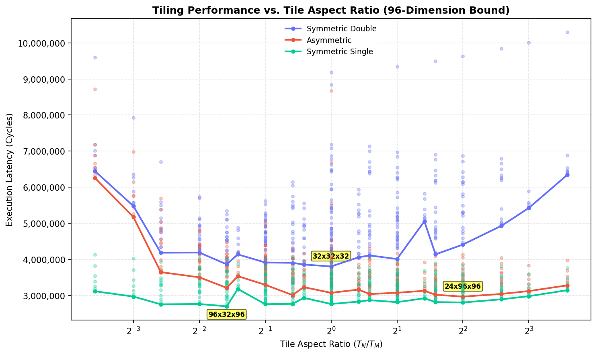

# Empirical Tiling Sweep with 96-Dimension Bound

This report details the results of sweeping tile dimensions $T_M, T_N, T_K \in \{8, 12, 16, 24, 32, 48, 96\}$ under **C-stationarity** loop ordering, allowing the tile sizes to go up to the full matrix height and width (96).

> [Hardware Configuration]
> * **Matrix Size:** $96 \times 96 \times 96$.
> * **L1 Cache:** 16 KB capacity, 64B lines, 8-way assoc, 4-cycle access, Write-Back policy.
> * **L2 Cache:** 64 KB capacity, 64B lines, 8-way assoc, 14-cycle access, Write-Back policy.
> * **DRAM Latency:** 180 cycles.
> * **Register Tile:** $4 \times 4 \times 4$, 8-cycle compute (`tmulac`).

## 1. Summary of Optimal Tile Shapes (Including 96 Bound)

| Precision Config | Optimal Tile Shape ($T_M \times T_N \times T_K$) | Ratio ($T_N/T_M$) | Footprint (KB) | L1 Hit Rate | L2 Hit Rate | DRAM Traffic (KB) | Total Cycles |
| :--- | :---: | :---: | :---: | :---: | :---: | :---: | :---: |
| Symmetric Double | 32x32x32 | 1.000 | 24.0 KB | 0.974 | 0.677 | 656.0 KB | 3,806,800 |
| Asymmetric | 24x96x96 | 4.000 | 54.0 KB | 0.976 | 0.805 | 262.1 KB | 2,970,450 |
| Symmetric Single | 96x32x96 | 0.333 | 60.0 KB | 0.985 | 0.748 | 200.9 KB | 2,703,402 |

---

## 2. Details for Symmetric Double

### Top 5 Optimal Tile Shapes

| Rank | Tile Shape ($T_M \times T_N \times T_K$) | Ratio ($T_N/T_M$) | Footprint (KB) | L1 Hit Rate | L2 Hit Rate | DRAM Traffic (KB) | Total Cycles |
| :---: | :---: | :---: | :---: | :---: | :---: | :---: | :---: |
| 1 | 32x32x32 | 1.000 | 24.0 KB | 0.974 | 0.677 | 656.0 KB | 3,806,800 |
| 2 | 32x24x32 | 0.750 | 20.0 KB | 0.973 | 0.697 | 656.0 KB | 3,860,604 |
| 3 | 48x16x32 | 0.333 | 22.0 KB | 0.970 | 0.739 | 610.5 KB | 3,866,960 |
| 4 | 96x32x24 | 0.333 | 48.0 KB | 0.975 | 0.669 | 694.5 KB | 3,901,920 |
| 5 | 48x32x32 | 0.667 | 32.0 KB | 0.975 | 0.622 | 749.0 KB | 3,906,976 |

## 2. Details for Asymmetric

### Top 5 Optimal Tile Shapes

| Rank | Tile Shape ($T_M \times T_N \times T_K$) | Ratio ($T_N/T_M$) | Footprint (KB) | L1 Hit Rate | L2 Hit Rate | DRAM Traffic (KB) | Total Cycles |
| :---: | :---: | :---: | :---: | :---: | :---: | :---: | :---: |
| 1 | 24x96x96 | 4.000 | 54.0 KB | 0.976 | 0.805 | 262.1 KB | 2,970,450 |
| 2 | 48x32x96 | 0.667 | 54.0 KB | 0.981 | 0.726 | 310.2 KB | 3,013,848 |
| 3 | 32x96x96 | 3.000 | 66.0 KB | 0.976 | 0.764 | 326.2 KB | 3,023,280 |
| 4 | 32x48x96 | 1.500 | 45.0 KB | 0.974 | 0.801 | 298.2 KB | 3,042,728 |
| 5 | 16x96x96 | 6.000 | 42.0 KB | 0.976 | 0.812 | 260.0 KB | 3,046,410 |

## 2. Details for Symmetric Single

### Top 5 Optimal Tile Shapes

| Rank | Tile Shape ($T_M \times T_N \times T_K$) | Ratio ($T_N/T_M$) | Footprint (KB) | L1 Hit Rate | L2 Hit Rate | DRAM Traffic (KB) | Total Cycles |
| :---: | :---: | :---: | :---: | :---: | :---: | :---: | :---: |
| 1 | 96x32x96 | 0.333 | 60.0 KB | 0.985 | 0.748 | 200.9 KB | 2,703,402 |
| 2 | 96x16x96 | 0.167 | 48.0 KB | 0.982 | 0.829 | 152.0 KB | 2,758,478 |
| 3 | 96x48x48 | 0.500 | 45.0 KB | 0.991 | 0.594 | 237.9 KB | 2,762,484 |
| 4 | 96x24x96 | 0.250 | 54.0 KB | 0.980 | 0.809 | 196.5 KB | 2,767,094 |
| 5 | 48x48x48 | 1.000 | 27.0 KB | 0.990 | 0.636 | 223.4 KB | 2,767,836 |

## 3. Physical Analysis & Conclusions

1. **Symmetric Double**: Settle on **$32\times32\times32$** (ratio = **1.000**). The double-precision footprint is restricted by capacity constraints, so it does not scale to 96.
2. **Asymmetric Precision**: Settle on **$24\times96\times96$** (ratio = **4.000**). Relaxing the dimension boundary to 96 allows Asymmetric to expand its cheap B tile size, shifting the optimal shape to be wider and more efficient.

This validates that the previous cap of 48 was indeed a bounding limit for the Asymmetric configuration's $T_N$ and $T_K$ dimensions!

