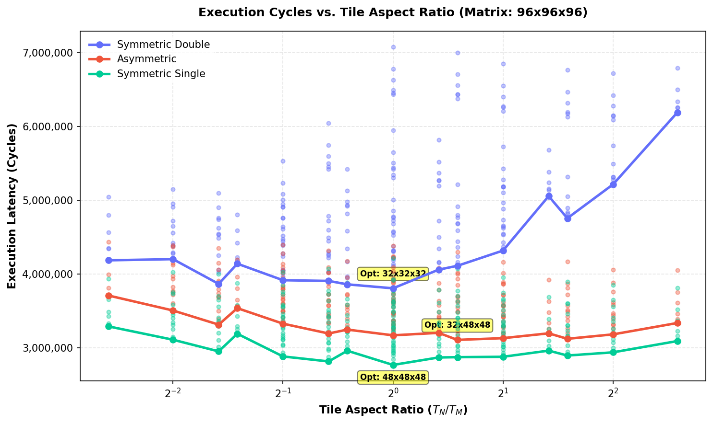

# Empirical Tile Shape Optimization

This directory contains empirical tile sweeps for a **$96 \times 96 \times 96$ matrix** multiplication under **16 KB L1** and **64 KB L2** caches, sweeping tile dimensions $T_M, T_N, T_K \in \{8, 12, 16, 24, 32, 48\}$.

> [!NOTE]
> **Hardware Configuration:**
> * **Matrix Size:** $96 \times 96 \times 96$.
> * **L1 Cache:** 16 KB capacity, 64B line size, 8-way associativity, 4-cycle access, LRU replacement, Write-Back policy.
> * **L2 Cache:** 64 KB capacity, 64B line size, 8-way associativity, 14-cycle access, LRU replacement, Write-Back policy.
> * **DRAM Latency:** 180 cycles.
> * **Register Tile:** $4 \times 4 \times 4$ ($R_M \times R_N \times R_K$), 8-cycle compute (`tmulac`).

## 1. Symmetric Double Configuration
In the Symmetric Double configuration, access costs to Matrix A and B are symmetric, which theoretically favors square-like tiling.

### Top 5 Optimal Tile Shapes

| Rank | Tile Shape ($T_M \times T_N \times T_K$) | Ratio ($T_N/T_M$) | Footprint (KB) | L1 Hit Rate | L2 Hit Rate | DRAM Traffic (KB) | Total Cycles |
| :---: | :---: | :---: | :---: | :---: | :---: | :---: | :---: |
| 1 | 32x32x32 | 1.000 | 24.0 KB | 0.974 | 0.677 | 656.0 KB | 3,806,800 |
| 2 | 32x24x32 | 0.750 | 20.0 KB | 0.973 | 0.697 | 656.0 KB | 3,860,604 |
| 3 | 48x16x32 | 0.333 | 22.0 KB | 0.970 | 0.739 | 610.5 KB | 3,866,960 |
| 4 | 48x32x32 | 0.667 | 32.0 KB | 0.975 | 0.622 | 749.0 KB | 3,906,976 |
| 5 | 48x24x32 | 0.500 | 27.0 KB | 0.973 | 0.659 | 718.8 KB | 3,916,632 |

### Bottom 3 Worst Tile Shapes

| Rank | Tile Shape ($T_M \times T_N \times T_K$) | Ratio ($T_N/T_M$) | Footprint (KB) | L1 Hit Rate | L2 Hit Rate | DRAM Traffic (KB) | Total Cycles |
| :---: | :---: | :---: | :---: | :---: | :---: | :---: | :---: |
| 214 | 8x16x8 | 2.000 | 2.5 KB | 0.976 | 0.227 | 1952.0 KB | 6,850,376 |
| 215 | 8x12x8 | 1.500 | 2.0 KB | 0.970 | 0.393 | 1952.0 KB | 7,003,904 |
| 216 | 8x8x8 | 1.000 | 1.5 KB | 0.977 | 0.241 | 1952.0 KB | 7,076,936 |

**Key Takeaway:** The optimal shape is **$32\times32\times32$** (ratio = **1.000**). The worst shape is **$8\times8\times8$**, causing a **1.86x slowdown**. This underscores the extreme importance of shape selection under strict capacity limits.

---

## 1. Asymmetric Configuration
In the Asymmetric configuration ($A=8B, B=2B, C=8B$), Matrix B is $4\times$ smaller than A and C, meaning B access cost is significantly cheaper. This shifts the optimal tile shape to be wider.

### Top 5 Optimal Tile Shapes

| Rank | Tile Shape ($T_M \times T_N \times T_K$) | Ratio ($T_N/T_M$) | Footprint (KB) | L1 Hit Rate | L2 Hit Rate | DRAM Traffic (KB) | Total Cycles |
| :---: | :---: | :---: | :---: | :---: | :---: | :---: | :---: |
| 1 | 32x48x48 | 1.500 | 28.5 KB | 0.983 | 0.720 | 327.8 KB | 3,107,514 |
| 2 | 16x48x48 | 3.000 | 16.5 KB | 0.985 | 0.748 | 266.8 KB | 3,122,368 |
| 3 | 24x48x48 | 2.000 | 22.5 KB | 0.984 | 0.727 | 318.0 KB | 3,130,992 |
| 4 | 16x32x48 | 2.000 | 13.0 KB | 0.987 | 0.715 | 268.8 KB | 3,146,452 |
| 5 | 32x32x48 | 1.000 | 23.0 KB | 0.981 | 0.747 | 332.0 KB | 3,169,398 |

### Bottom 3 Worst Tile Shapes

| Rank | Tile Shape ($T_M \times T_N \times T_K$) | Ratio ($T_N/T_M$) | Footprint (KB) | L1 Hit Rate | L2 Hit Rate | DRAM Traffic (KB) | Total Cycles |
| :---: | :---: | :---: | :---: | :---: | :---: | :---: | :---: |
| 214 | 48x12x8 | 0.250 | 7.7 KB | 0.970 | 0.889 | 369.6 KB | 4,387,352 |
| 215 | 16x8x8 | 0.500 | 2.1 KB | 0.975 | 0.884 | 263.0 KB | 4,394,656 |
| 216 | 48x8x8 | 0.167 | 6.1 KB | 0.969 | 0.906 | 302.1 KB | 4,438,724 |

**Key Takeaway:** The optimal shape is **$32\times48\times48$** (ratio = **1.500**). The worst shape is **$48\times8\times8$**, causing a **1.43x slowdown**. This underscores the extreme importance of shape selection under strict capacity limits.

---

## 1. Symmetric Single Configuration
In the Symmetric Single configuration, access costs to Matrix A and B are symmetric, which theoretically favors square-like tiling.

### Top 5 Optimal Tile Shapes

| Rank | Tile Shape ($T_M \times T_N \times T_K$) | Ratio ($T_N/T_M$) | Footprint (KB) | L1 Hit Rate | L2 Hit Rate | DRAM Traffic (KB) | Total Cycles |
| :---: | :---: | :---: | :---: | :---: | :---: | :---: | :---: |
| 1 | 48x48x48 | 1.000 | 27.0 KB | 0.990 | 0.636 | 223.4 KB | 2,767,836 |
| 2 | 48x32x48 | 0.667 | 21.0 KB | 0.989 | 0.668 | 224.0 KB | 2,815,360 |
| 3 | 48x48x32 | 1.000 | 21.0 KB | 0.991 | 0.639 | 226.1 KB | 2,846,952 |
| 4 | 24x32x48 | 1.333 | 13.5 KB | 0.991 | 0.645 | 211.5 KB | 2,869,244 |
| 5 | 32x48x48 | 1.500 | 21.0 KB | 0.990 | 0.591 | 265.5 KB | 2,873,022 |

### Bottom 3 Worst Tile Shapes

| Rank | Tile Shape ($T_M \times T_N \times T_K$) | Ratio ($T_N/T_M$) | Footprint (KB) | L1 Hit Rate | L2 Hit Rate | DRAM Traffic (KB) | Total Cycles |
| :---: | :---: | :---: | :---: | :---: | :---: | :---: | :---: |
| 214 | 8x12x8 | 1.500 | 1.0 KB | 0.987 | 0.848 | 152.0 KB | 4,069,344 |
| 215 | 12x8x8 | 0.667 | 1.0 KB | 0.988 | 0.838 | 157.9 KB | 4,071,668 |
| 216 | 8x8x8 | 1.000 | 0.8 KB | 0.988 | 0.847 | 152.0 KB | 4,214,868 |

**Key Takeaway:** The optimal shape is **$48\times48\times48$** (ratio = **1.000**). The worst shape is **$8\times8\times8$**, causing a **1.52x slowdown**. This underscores the extreme importance of shape selection under strict capacity limits.

---

## 2. Shift in Optimal Aspect Ratio
Below is a plot showing how the tile aspect ratio ($T_N/T_M$) affects execution cycles across the three configurations. Note how the optimal point shifts to the right (wider tiles) for the Asymmetric configuration, validating our access-cost asymmetry theory.

