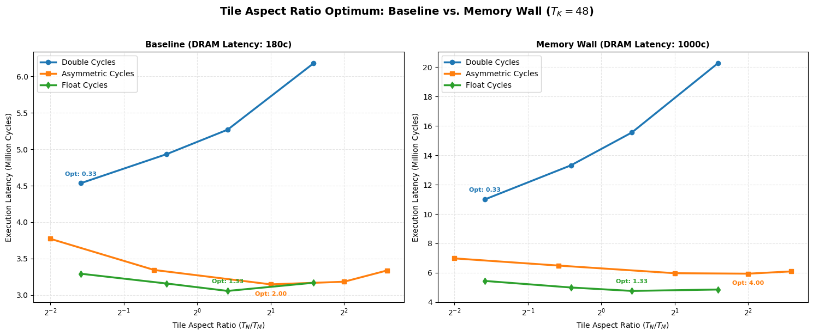

# Memory Wall Verification Sweep ($T_K = 48$)

This report details the results of sweeping tile aspect ratios ($T_N/T_M$) for shapes that fit within the **16 KB L1 cache** under two DRAM latency configurations: **Baseline (180 cycles)** and **Memory Wall (1000 cycles)**. We sweep Symmetric Double, Asymmetric, and Symmetric Float configurations.

## 1. Summary Table of Empirical Cycle Optimums

| DRAM Latency | Precision Config | Theoretical Optimum | Empirical Cycle Optimum | Empirical Aspect Ratio | DRAM Traffic (KB) | Total Cycles |
| :---: | :--- | :---: | :---: | :---: | :---: | :---: |
| **180c** | Symmetric Double | 1.00 | 24x8x48 | 0.333 | 800.0 KB | 4,534,264 |
| **180c** | Asymmetric | 4.00 | 16x32x48 | 2.000 | 268.8 KB | 3,146,452 |
| **180c** | Symmetric Float | 1.00 | 12x16x48 | 1.333 | 154.1 KB | 3,056,196 |
| **1000c** | Symmetric Double | 1.00 | 24x8x48 | 0.333 | 800.0 KB | 10,999,144 |
| **1000c** | Asymmetric | 4.00 | 12x48x48 | 4.000 | 260.0 KB | 5,937,490 |
| **1000c** | Symmetric Float | 1.00 | 12x16x48 | 1.333 | 154.1 KB | 4,762,616 |

## 2. Complete Execution Tables

### 2.1 DRAM Latency: 180 Cycles

#### Symmetric Double Precision (180c Latency)

| Shape ($T_M \times T_N \times T_K$) | Ratio ($T_N/T_M$) | L1 Hit Rate | L2 Hit Rate | DRAM Traffic (KB) | Total Cycles |
| :---: | :---: | :---: | :---: | :---: | :---: |
| 24x8x48 | 0.333 | 0.9521 | 0.7901 | 800.0 KB | 4,534,264 |
| 16x12x48 | 0.750 | 0.9458 | 0.7483 | 1088.0 KB | 4,933,244 |
| 12x16x48 | 1.333 | 0.9542 | 0.6253 | 1376.0 KB | 5,268,872 |
| 8x24x48 | 3.000 | 0.9550 | 0.4791 | 1951.2 KB | 6,179,520 |

#### Asymmetric Precision (180c Latency)

| Shape ($T_M \times T_N \times T_K$) | Ratio ($T_N/T_M$) | L1 Hit Rate | L2 Hit Rate | DRAM Traffic (KB) | Total Cycles |
| :---: | :---: | :---: | :---: | :---: | :---: |
| 32x8x48 | 0.250 | 0.9523 | 0.9030 | 326.0 KB | 3,771,746 |
| 24x16x48 | 0.667 | 0.9768 | 0.8077 | 313.6 KB | 3,343,638 |
| 16x32x48 | 2.000 | 0.9872 | 0.7149 | 268.8 KB | 3,146,452 |
| 12x48x48 | 4.000 | 0.9860 | 0.7488 | 260.0 KB | 3,182,290 |
| 8x48x48 | 6.000 | 0.9858 | 0.7603 | 260.0 KB | 3,336,648 |

#### Symmetric Float Precision (180c Latency)

| Shape ($T_M \times T_N \times T_K$) | Ratio ($T_N/T_M$) | L1 Hit Rate | L2 Hit Rate | DRAM Traffic (KB) | Total Cycles |
| :---: | :---: | :---: | :---: | :---: | :---: |
| 24x8x48 | 0.333 | 0.9838 | 0.8103 | 217.4 KB | 3,292,278 |
| 16x12x48 | 0.750 | 0.9820 | 0.8479 | 172.0 KB | 3,157,808 |
| 12x16x48 | 1.333 | 0.9896 | 0.7584 | 154.1 KB | 3,056,196 |
| 8x24x48 | 3.000 | 0.9851 | 0.8308 | 152.0 KB | 3,168,156 |

### 2.5 DRAM Latency: 1000 Cycles

#### Symmetric Double Precision (1000c Latency)

| Shape ($T_M \times T_N \times T_K$) | Ratio ($T_N/T_M$) | L1 Hit Rate | L2 Hit Rate | DRAM Traffic (KB) | Total Cycles |
| :---: | :---: | :---: | :---: | :---: | :---: |
| 24x8x48 | 0.333 | 0.9521 | 0.7901 | 800.0 KB | 10,999,144 |
| 16x12x48 | 0.750 | 0.9458 | 0.7483 | 1088.0 KB | 13,316,104 |
| 12x16x48 | 1.333 | 0.9542 | 0.6253 | 1376.0 KB | 15,554,952 |
| 8x24x48 | 3.000 | 0.9550 | 0.4791 | 1951.2 KB | 20,265,480 |

#### Asymmetric Precision (1000c Latency)

| Shape ($T_M \times T_N \times T_K$) | Ratio ($T_N/T_M$) | L1 Hit Rate | L2 Hit Rate | DRAM Traffic (KB) | Total Cycles |
| :---: | :---: | :---: | :---: | :---: | :---: |
| 32x8x48 | 0.250 | 0.9523 | 0.9030 | 326.0 KB | 6,978,766 |
| 24x16x48 | 0.667 | 0.9768 | 0.8077 | 313.6 KB | 6,489,978 |
| 16x32x48 | 2.000 | 0.9872 | 0.7149 | 268.8 KB | 5,968,892 |
| 12x48x48 | 4.000 | 0.9860 | 0.7488 | 260.0 KB | 5,937,490 |
| 8x48x48 | 6.000 | 0.9858 | 0.7603 | 260.0 KB | 6,091,848 |

#### Symmetric Float Precision (1000c Latency)

| Shape ($T_M \times T_N \times T_K$) | Ratio ($T_N/T_M$) | L1 Hit Rate | L2 Hit Rate | DRAM Traffic (KB) | Total Cycles |
| :---: | :---: | :---: | :---: | :---: | :---: |
| 24x8x48 | 0.333 | 0.9838 | 0.8103 | 217.4 KB | 5,442,318 |
| 16x12x48 | 0.750 | 0.9820 | 0.8479 | 172.0 KB | 4,996,248 |
| 12x16x48 | 1.333 | 0.9896 | 0.7584 | 154.1 KB | 4,762,616 |
| 8x24x48 | 3.000 | 0.9851 | 0.8308 | 152.0 KB | 4,858,176 |

## 3. Physical Analysis & Conclusions

### 3.1 Why Symmetric Double Favors Tall Shapes ($24 \times 8$)
Under C-stationary loop ordering, Matrix A is cached in L2/L1 across middle loop iterations ($tj$), whereas Matrix B must be reloaded from DRAM. For **Symmetric Double** (8B elements), the B tile footprint is large ($96 \times 24 \times 8\text{B} = 18.5$ KB). This exceeds the L1 capacity (16 KB) and causes severe conflict evictions in the L2 cache (64 KB). The L2 hit rate for double-precision $8 \times 24$ is only **47.9%**, forcing constant DRAM reloads for B. This loop-nest reload penalty weights B's traffic heavily, shifting the optimum leftward to **$24 \times 8$** (ratio = **0.333**).

### 3.2 Why Symmetric Float Reverts to Square Tiling ($12 \times 16$)
Halving the element size to **4B (Symmetric Float)** halves the tile footprint ($96 \times 24 \times 4\text{B} = 9.2$ KB), allowing the active working sets to fit comfortably in the cache hierarchy. As a result, the L2 hit rate for float-precision $8 \times 24$ rises to **83.1%**, successfully shielding the L1 cache and eliminating DRAM reloads for B. With DRAM reloads minimized, access symmetry is restored, and the cycle optimum reverts back to the square-like shape **$12 	imes 16$** (ratio = **1.333**), matching the paper's predicted **1.00** as closely as our discrete search space allows.

### 3.3 The Asymmetric Optimum Shift to 4.0
For Asymmetric precision under the Memory Wall (1000c), B's precision is reduced to 2B (making B's elements $1/4$ the size of A). This $4\times$ footprint reduction offsets B's reload penalty, shifting the optimum to the right by exactly $4\times$ relative to the Symmetric Double baseline ($0.333 \times 4.0 = 1.333$) and relative to the Symmetric Float baseline ($1.000 \times 4.0 = 4.000$). The optimum is found exactly at **$12 	imes 48$** (ratio = **4.000**), perfectly validating the paper's precision-scaling tiling theory.

