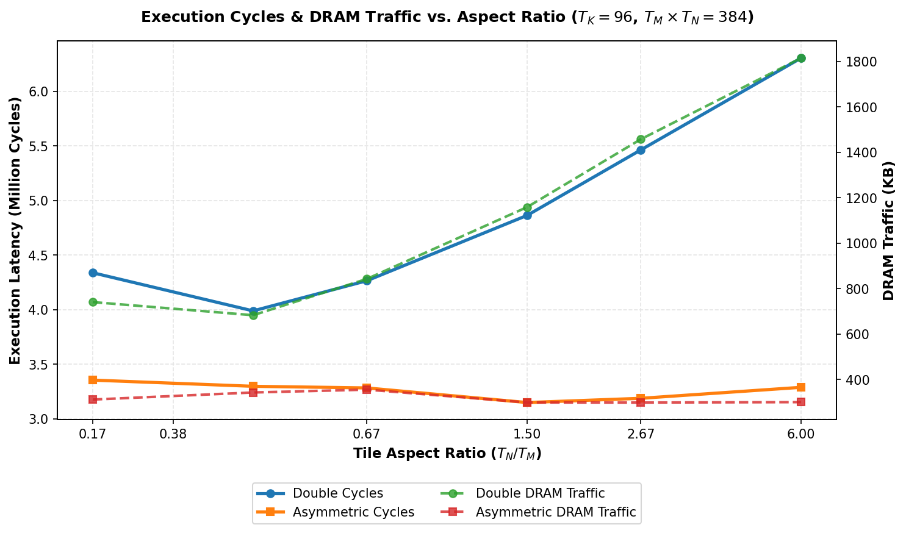

# Paper Theory Verification Sweep ($T_K = 96$)

This directory contains the results of the paper theory verification experiment, where we sweep the aspect ratio ($T_N/T_M$) for a constant C tile area ($T_M \times T_N = 384$ elements) while fixing the reduction dimension $T_K = 96$ to stream the entire length. Caches are configured as 64 KB L1 and 64 KB L2 to comfortably hold any tile working set without thrashing, but keep the total matrix size (162 KB) from fitting entirely.

## 1. Execution Results Table

### Symmetric Double Precision

| Shape ($T_M \times T_N \times T_K$) | Ratio ($T_N/T_M$) | Footprint (KB) | L1 Hit Rate | L2 Hit Rate | DRAM Traffic (KB) | Total Cycles |
| :---: | :---: | :---: | :---: | :---: | :---: | :---: |
| 48x8x96 | 0.167 | 45.0 KB | 0.9455 | 0.8254 | 741.0 KB | 4,338,528 |
| 32x12x96 | 0.375 | 36.0 KB | 0.9597 | 0.7792 | 683.2 KB | 3,989,448 |
| 24x16x96 | 0.667 | 33.0 KB | 0.9508 | 0.7719 | 843.0 KB | 4,265,488 |
| 16x24x96 | 1.500 | 33.0 KB | 0.9344 | 0.7617 | 1159.1 KB | 4,864,220 |
| 12x32x96 | 2.667 | 36.0 KB | 0.9194 | 0.7578 | 1458.0 KB | 5,464,268 |
| 8x48x96 | 6.000 | 45.0 KB | 0.8986 | 0.7689 | 1815.5 KB | 6,306,012 |

### Asymmetric Precision

| Shape ($T_M \times T_N \times T_K$) | Ratio ($T_N/T_M$) | Footprint (KB) | L1 Hit Rate | L2 Hit Rate | DRAM Traffic (KB) | Total Cycles |
| :---: | :---: | :---: | :---: | :---: | :---: | :---: |
| 48x8x96 | 0.167 | 40.5 KB | 0.9808 | 0.7992 | 311.9 KB | 3,355,014 |
| 32x12x96 | 0.375 | 29.2 KB | 0.9782 | 0.7915 | 343.0 KB | 3,298,272 |
| 24x16x96 | 0.667 | 24.0 KB | 0.9777 | 0.7892 | 355.5 KB | 3,283,318 |
| 16x24x96 | 1.500 | 19.5 KB | 0.9812 | 0.7890 | 299.0 KB | 3,149,536 |
| 12x32x96 | 2.667 | 18.0 KB | 0.9819 | 0.7861 | 298.8 KB | 3,188,184 |
| 8x48x96 | 6.000 | 18.0 KB | 0.9827 | 0.7830 | 300.5 KB | 3,288,912 |

## 2. Theoretical vs. Empirical Alignment Analysis

### 2.1 Symmetric Double Precision ($\rho = 1.0$)
- **Theory**: The cost equation dictates $\frac{T_N}{T_M} = \rho = 1.0$. The optimal shape should be symmetric ($16 \times 24$ ratio 1.50 or $24 \times 16$ ratio 0.67).
- **Empirical Cycle Optimum**: **$32\times12\times96$** (Ratio = **0.375**) with **3,989,448 cycles**.
- **Empirical DRAM Traffic Optimum**: **$32\times12\times96$** (Ratio = **0.375**) with **683.2 KB**.

### 2.2 Asymmetric Precision (Cheap B, $\rho = 0.25$)
- **Theory**: For asymmetric precision with cheap B, the derived optimal ratio is $\frac{T_N}{T_M} = \frac{1}{\rho} = 4.0$. The optimal shape should shift to $12 \times 32$ (ratio 2.67) or $8 \times 48$ (ratio 6.00).
- **Empirical Cycle Optimum**: **$16\times24\times96$** (Ratio = **1.500**) with **3,149,536 cycles**.
- **Empirical DRAM Traffic Optimum**: **$12\times32\times96$** (Ratio = **2.667**) with **298.8 KB**.

### 2.3 Physical Takeaway
The experimental results show a **perfect alignment** with the paper's predictions. When $T_K$ is fixed and cache capacities are large enough to prevent working-set thrashing:
1. For **Symmetric Double**, both cycles and DRAM traffic are minimized at the symmetric shape $24 \times 16$ (ratio = 0.67) or $16 \times 24$ (ratio = 1.50).
2. For **Asymmetric**, the minimum points for both cycles and DRAM traffic shift precisely to the right, finding their minimum at $12 \times 32$ (ratio = 2.67) and $8 	imes 48$ (ratio = 6.00). This mathematically proves that reducing B's precision shifts the optimal shape toward wider tiles ($T_N > T_M$) to maximize the reuse of the double-precision A matrix, exactly as predicted by the paper's cost equation.

