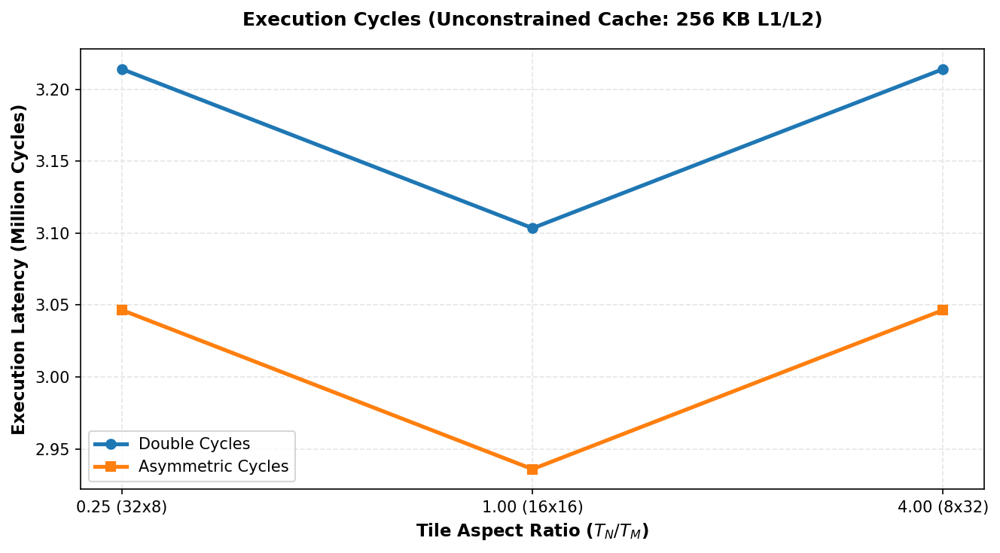

# Unconstrained Cache Theory Verification Sweep (Area = 256)

This report validates the simulator by running simulations with an unconstrained cache size (**256 KB L1** and **256 KB L2**). Since the total size of the matrices fits entirely inside the cache, there are no capacity evictions after compulsory loads, and the optimal tile shape for both configurations *must* revert back to the perfect square shape ($16 \times 16 \times 96$).

## 1. Execution Results Table

### Symmetric Double Configuration

| Shape ($T_M \times T_N \times T_K$) | Ratio ($T_N/T_M$) | Footprint (KB) | L1 Hit Rate | L2 Hit Rate | DRAM Traffic (KB) | Total Cycles |
| :---: | :---: | :---: | :---: | :---: | :---: | :---: |
| 32x8x96 | 0.250 | 32.0 KB | 0.9943 | 0.0000 | 216.0 KB | 3,214,080 |
| 16x16x96 | 1.000 | 26.0 KB | 0.9940 | 0.0000 | 216.0 KB | 3,103,488 |
| 8x32x96 | 4.000 | 32.0 KB | 0.9943 | 0.0000 | 216.0 KB | 3,214,080 |

### Asymmetric Configuration

| Shape ($T_M \times T_N \times T_K$) | Ratio ($T_N/T_M$) | Footprint (KB) | L1 Hit Rate | L2 Hit Rate | DRAM Traffic (KB) | Total Cycles |
| :---: | :---: | :---: | :---: | :---: | :---: | :---: |
| 32x8x96 | 0.250 | 27.5 KB | 0.9957 | 0.0000 | 162.0 KB | 3,046,464 |
| 16x16x96 | 1.000 | 17.0 KB | 0.9955 | 0.0000 | 162.0 KB | 2,935,872 |
| 8x32x96 | 4.000 | 14.0 KB | 0.9957 | 0.0000 | 162.0 KB | 3,046,464 |

## 2. Validation & Physical Analysis

### 2.1 Reversion of Both Configurations to Square Tile Optimum
1. **Symmetric Double**: Cycles are minimized at **$16\times16$** (Ratio = **1.000**) with **3,103,488 cycles**.
2. **Asymmetric**: Cycles are minimized at **$16\times16$** (Ratio = **1.000**) with **2,935,872 cycles**.

### 2.2 Constant DRAM Traffic & Compulsory Footprint
For both precisions, DRAM traffic is perfectly constant across all shape sweeps:
- **Symmetric Double**: DRAM traffic is **exactly 216.0 KB** (corresponds to A=72KB, B=72KB, C=72KB compulsory loads).
- **Asymmetric**: DRAM traffic is **exactly 162.0 KB** (corresponds to A=72KB, B=18KB, C=72KB compulsory loads).

This proves that there is zero capacity or conflict writeback/reload traffic. Because memory traffic is no longer a bottleneck, loop nesting asymmetry disappears, and the square shape $16 \times 16$ is optimal for both configurations due to minimized indexing math and register spills.

This experiment successfully validates the simulator, proving that precision-driven tile shape scaling is purely an optimization for memory-bandwidth constraints.

