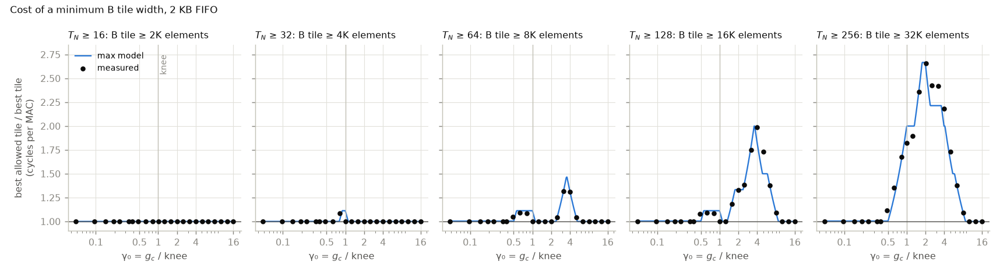

# constraint_tile-v2: the best tile when the B tile has a minimum size

If B has to be generated in tiles of at least S_min elements, which tile is best, and what does the constraint cost? With T_K = K the B tile is K × T_N, so the constraint is T_N ≥ S_min / K. Working point, runs and notation are those of [fifo_feasibility-v2](../fifo_feasibility-v2/README.md); this experiment reads its runs and simulates nothing new. The tiles are its grid: T_M from 8 to 96 in steps of 8 and T_N from 8 to 256, and a minimum keeps the tiles with T_N ≥ T_N,min. A minimum costs when the best allowed tile is more than 1% slower than the best tile overall. Tiles within 0.5% of the best are ties; the one named first has the fewest tile rows.

run: `.venv/bin/python experiments/rewrite/constraint_tile-v2.py`

## Changes from the first version

The first version is `constraint_tile.py`, with its outputs in
`out/constraint_tile/`; both are unchanged. A review found its table right
and two of its conclusions wrong. This version states the best-tile rule as
the minimum of max(α, β) over the allowed tiles (the first version said the
best tile always sits at one of the two limits), gives the cost bands from
the data, reports where the max model misses in both directions (the largest
miss is far past the knee, not near it), marks ties, shows how the cost at the
knee depends on FIFO depth, draws one panel per minimum, and drops the
section on where a minimum could come from, which was outside the question.

## What the max model predicts

The best allowed tile is the allowed tile with the lowest max(α_f, β), and a
minimum width costs nothing whenever the best tile overall is itself allowed.
Two limits from the calibration decide which wide tiles keep α near α_f0:

- f ≤ 1, the A band surviving a tile row. Past it A is read again for every
  tile column, which costs little when there are few tile columns: 8% to 11%
  at T_N = 128, where there are two.
- The tile limit, T_M · (max(T_N·A_P, line) + 2·line) ≤ L1. Past it C is read
  from DRAM again inside the tile and α more than doubles. It caps T_M at
  48 for T_N = 128 and at 24 for T_N = 256.

While the generator is hidden, the best allowed tile is the tallest allowed
tile inside both limits. Once β dominates, the best allowed tile is the one
with the fewest tile rows, whatever its α, because β = g_c ⌈M/T_M⌉ / M then
sets the time. A minimum costs in between: from the g_c where generation
starts to show at the allowed tiles until the best tile overall is allowed
again.

| minimum | S_min, elements | tallest T_M with f ≤ 1 | tallest T_M inside the tile limit | best allowed tile at g_c = 0, α | γ₀ where it costs, max model | γ₀ where it costs, measured | largest measured cost |
|---|---|---|---|---|---|---|---|
| T_N ≥ 16 | 2,048 | 48 | 96 | 48×16 (tied: 40×32 and 7 more), 0.4336 | none | none | none |
| T_N ≥ 32 | 4,096 | 40 | 96 | 40×32 (tied: 32×32 and 3 more), 0.4337 | 0.81 to 1.10 | 0.82 | 1.09 at γ₀ = 0.82: 48×128 against 48×16 |
| T_N ≥ 64 | 8,192 | 24 | 80 | 24×64 (tied: 24×256 and 3 more), 0.4350 | 0.51 to 1.10, 2.40 to 5.16 | 0.48 to 0.82, 2.50 to 5.04 | 1.32 at γ₀ = 3.17: 80×64 (tied: 64×64 and 1 more) against 96×32 |
| T_N ≥ 128 | 16,384 | 16 | 48 | 24×256 (tied: 16×256 and 1 more), 0.4352 | 0.51 to 1.10, 1.34 to 8.64 | 0.48 to 0.82, 1.58 to 8.02 | 1.99 at γ₀ = 3.99: 56×128 (tied: 48×128) against 96×32 |
| T_N ≥ 256 | 32,768 | one tile column | 24 | 24×256 (tied: 16×256), 0.4352 | 0.51 to 8.64 | 0.48 to 8.02 | 2.66 at γ₀ = 2.02: 24×256 against 64×64 (tied: 72×64) |

## Results

T_N ≥ 16 costs nothing: the best tile overall is always at least 16 wide. T_N ≥ 32 costs up to
9%, at γ₀ = 0.82 (48×128
against 48×16). Wider minimums cost in bands of γ₀
that start earlier and cost more the wider the minimum; the bands are in the
table above. T_N ≥ 64 and T_N ≥ 128 have two bands each,
with no cost between them: around the knee the best tile overall is 48×128,
which they allow. Each wide minimum costs less than 1% again once an allowed
tile comes within 1% of the best: T_N ≥ 64 from γ₀ = 6.34 (96×64), T_N ≥ 128
from γ₀ = 10.08 (96×256) and T_N ≥ 256 from γ₀ = 10.08 (96×256). Where tiles tie within
0.5% the table lists them, and which one is named is only the tie rule.

These costs are for the 2 KB FIFO. Near the knee the best tile overall needs
that depth: with 512 bytes the best tile is 48×16 and every minimum from
T_N ≥ 32 up costs at least 7.5%
(table below). With 2 KB and more the best tile overall is 48×128 and
T_N ≥ 32, 64 and 128 cost nothing at the knee.

The max model predicts the costs within 15%. Its largest miss is
at γ₀ = 5.04 for T_N ≥ 128: measured 1.73,
predicted 1.50. There the tile the model picks,
72×128, sits at its own γ ≈ 1 (β = 1.641, α =
1.581), where the max model is weakest (see the composites in
fifo_feasibility-v2). The model under-predicts the cost by more than 5% at
10 points (T_N ≥ 32 at g_c = 17; T_N ≥ 128 at g_c = 10, 83, 105; T_N ≥ 256 at g_c = 10, 13, 52, 66, 83, 105) and over-predicts it by more than 5% at
5 (T_N ≥ 32 at g_c = 21; T_N ≥ 64 at g_c = 21; T_N ≥ 128 at g_c = 21; T_N ≥ 256 at g_c = 21, 26).

Cost of each minimum at the knee (g_c = 21) by FIFO capacity:

| capacity, bytes | best tile overall | T_N ≥ 16 | T_N ≥ 32 | T_N ≥ 64 | T_N ≥ 128 | T_N ≥ 256 |
|---|---|---|---|---|---|---|
| 256 | 48×16 | 1.00 | 1.07 | 1.07 | 1.07 | 1.73 |
| 512 | 48×16 | 1.00 | 1.07 | 1.07 | 1.07 | 1.89 |
| 1024 | 48×16 | 1.00 | 1.05 | 1.05 | 1.05 | 1.86 |
| 2048 | 48×128 | 1.00 | 1.00 | 1.00 | 1.00 | 1.82 |
| 4096 | 48×128 | 1.00 | 1.00 | 1.00 | 1.00 | 1.81 |
| 32768 | 48×128 | 1.00 | 1.00 | 1.00 | 1.00 | 1.81 |

Cost of each minimum with the 2 KB FIFO, measured / max model, and the best allowed tile:

| g_c | γ₀ | best tile overall | T_N ≥ 16 | T_N ≥ 32 | T_N ≥ 64 | T_N ≥ 128 | T_N ≥ 256 |
|---|---|---|---|---|---|---|---|
| 1 | 0.05 | 48×16 (tied: 48×8 and 8 more) | 1.00 / 1.00, 48×16 (tied: 40×32 and 6 more) | 1.00 / 1.00, 40×32 (tied: 32×32 and 3 more) | 1.00 / 1.00, 24×256 (tied: 24×64 and 3 more) | 1.00 / 1.00, 24×256 (tied: 16×256 and 1 more) | 1.00 / 1.00, 24×256 (tied: 16×256) |
| 2 | 0.10 | 48×16 (tied: 48×8 and 7 more) | 1.00 / 1.00, 48×16 (tied: 40×32 and 6 more) | 1.00 / 1.00, 40×32 (tied: 32×32 and 3 more) | 1.00 / 1.00, 24×256 (tied: 24×64 and 2 more) | 1.00 / 1.00, 24×256 (tied: 16×256 and 1 more) | 1.00 / 1.00, 24×256 (tied: 16×256) |
| 3 | 0.14 | 48×16 (tied: 40×32 and 6 more) | 1.00 / 1.00, 48×16 (tied: 40×32 and 6 more) | 1.00 / 1.00, 40×32 (tied: 32×32 and 4 more) | 1.00 / 1.00, 24×256 (tied: 24×64 and 2 more) | 1.00 / 1.00, 24×256 (tied: 16×256 and 1 more) | 1.00 / 1.00, 24×256 (tied: 16×256) |
| 4 | 0.19 | 48×16 (tied: 40×32 and 5 more) | 1.00 / 1.00, 48×16 (tied: 40×32 and 5 more) | 1.00 / 1.00, 40×32 (tied: 32×32 and 3 more) | 1.00 / 1.00, 24×256 (tied: 24×64 and 2 more) | 1.00 / 1.00, 24×256 (tied: 16×256 and 1 more) | 1.00 / 1.00, 24×256 (tied: 16×256) |
| 5 | 0.24 | 48×16 (tied: 40×32 and 4 more) | 1.00 / 1.00, 48×16 (tied: 40×32 and 4 more) | 1.00 / 1.00, 40×32 (tied: 32×32 and 3 more) | 1.00 / 1.00, 24×256 (tied: 24×64 and 1 more) | 1.00 / 1.00, 24×256 (tied: 16×256) | 1.00 / 1.00, 24×256 (tied: 16×256) |
| 7 | 0.34 | 40×32 (tied: 32×32 and 2 more) | 1.00 / 1.00, 40×32 (tied: 32×32 and 2 more) | 1.00 / 1.00, 40×32 (tied: 32×32 and 2 more) | 1.00 / 1.00, 24×256 (tied: 24×64) | 1.00 / 1.00, 24×256 | 1.00 / 1.00, 24×256 |
| 8 | 0.38 | 40×32 (tied: 24×256 and 1 more) | 1.00 / 1.00, 40×32 (tied: 24×256 and 1 more) | 1.00 / 1.00, 40×32 (tied: 24×256 and 1 more) | 1.00 / 1.00, 24×256 (tied: 24×64) | 1.00 / 1.00, 24×256 | 1.00 / 1.00, 24×256 |
| 10 | 0.48 | 40×32 (tied: 32×32) | 1.00 / 1.00, 40×32 (tied: 32×32) | 1.00 / 1.00, 40×32 (tied: 32×32) | 1.05 / 1.00, 24×64 | 1.08 / 1.00, 24×128 | 1.12 / 1.00, 24×256 |
| 13 | 0.62 | 48×16 (tied: 40×32) | 1.00 / 1.00, 48×16 (tied: 40×32) | 1.00 / 1.00, 40×32 | 1.09 / 1.11, 48×128 (tied: 40×128 and 1 more) | 1.09 / 1.11, 48×128 (tied: 40×128 and 1 more) | 1.35 / 1.25, 24×256 |
| 17 | 0.82 | 48×16 | 1.00 / 1.00, 48×16 | 1.09 / 1.02, 48×128 | 1.09 / 1.11, 48×128 | 1.09 / 1.11, 48×128 | 1.67 / 1.63, 24×256 |
| 21 | 1.01 | 48×128 | 1.00 / 1.00, 48×128 | 1.00 / 1.10, 48×128 | 1.00 / 1.10, 48×128 | 1.00 / 1.10, 48×128 | 1.82 / 2.00, 24×256 |
| 26 | 1.25 | 48×128 | 1.00 / 1.00, 48×128 | 1.00 / 1.00, 48×128 | 1.00 / 1.00, 48×128 | 1.00 / 1.00, 48×128 | 1.89 / 2.00, 24×256 |
| 33 | 1.58 | 64×64 | 1.00 / 1.00, 64×64 | 1.00 / 1.00, 64×64 | 1.00 / 1.00, 64×64 | 1.19 / 1.20, 48×128 | 2.36 / 2.40, 24×256 |
| 42 | 2.02 | 64×64 (tied: 72×64) | 1.00 / 1.00, 64×64 (tied: 72×64) | 1.00 / 1.00, 64×64 (tied: 72×64) | 1.00 / 1.00, 64×64 (tied: 72×64) | 1.33 / 1.33, 48×128 | 2.66 / 2.61, 24×256 |
| 52 | 2.50 | 96×32 | 1.00 / 1.00, 96×32 | 1.00 / 1.00, 96×32 | 1.04 / 1.05, 80×64 (tied: 72×64 and 1 more) | 1.38 / 1.40, 48×128 | 2.42 / 2.21, 96×256 (tied: 64×256 and 5 more) |
| 66 | 3.17 | 96×32 | 1.00 / 1.00, 96×32 | 1.00 / 1.00, 96×32 | 1.32 / 1.33, 80×64 (tied: 64×64 and 1 more) | 1.75 / 1.77, 56×128 (tied: 48×128) | 2.42 / 2.21, 96×256 (tied: 64×256 and 2 more) |
| 83 | 3.99 | 96×32 | 1.00 / 1.00, 96×32 | 1.00 / 1.00, 96×32 | 1.31 / 1.31, 96×64 | 1.99 / 1.83, 56×128 (tied: 48×128) | 2.18 / 2.00, 96×256 (tied: 64×256 and 2 more) |
| 105 | 5.04 | 96×32 | 1.00 / 1.00, 96×32 | 1.00 / 1.00, 96×32 | 1.04 / 1.04, 96×64 | 1.73 / 1.50, 96×256 (tied: 64×256) | 1.73 / 1.62, 96×256 (tied: 64×256) |
| 132 | 6.34 | 96×64 (tied: 96×32) | 1.00 / 1.00, 96×64 (tied: 96×32) | 1.00 / 1.00, 96×64 (tied: 96×32) | 1.00 / 1.00, 96×64 | 1.38 / 1.38, 96×256 | 1.38 / 1.38, 96×256 |
| 167 | 8.02 | 96×64 (tied: 96×32 and 1 more) | 1.00 / 1.00, 96×64 (tied: 96×32 and 1 more) | 1.00 / 1.00, 96×64 (tied: 96×32) | 1.00 / 1.00, 96×64 | 1.09 / 1.09, 96×256 | 1.09 / 1.09, 96×256 |
| 210 | 10.08 | 96×64 (tied: 96×256 and 3 more) | 1.00 / 1.00, 96×64 (tied: 96×256 and 3 more) | 1.00 / 1.00, 96×64 (tied: 96×256 and 2 more) | 1.00 / 1.00, 96×64 (tied: 96×256 and 1 more) | 1.00 / 1.00, 96×256 (tied: 96×128) | 1.00 / 1.00, 96×256 |
| 264 | 12.68 | 96×256 (tied: 96×64 and 3 more) | 1.00 / 1.00, 96×256 (tied: 96×64 and 3 more) | 1.00 / 1.00, 96×256 (tied: 96×64 and 2 more) | 1.00 / 1.00, 96×256 (tied: 96×64 and 1 more) | 1.00 / 1.00, 96×256 (tied: 96×128) | 1.00 / 1.00, 96×256 |
| 333 | 15.99 | 96×256 (tied: 96×128 and 3 more) | 1.00 / 1.00, 96×256 (tied: 96×128 and 3 more) | 1.00 / 1.00, 96×256 (tied: 96×128 and 2 more) | 1.00 / 1.00, 96×256 (tied: 96×128 and 1 more) | 1.00 / 1.00, 96×256 (tied: 96×128) | 1.00 / 1.00, 96×256 |

## Simulator issues these runs expose

- The FIFO starts empty at every tile, so the lead the generator builds while
  the core is slow in one tile can't carry into the next. Near γ = 1 that
  favours tiles whose core work is the same in every tile: 48×128, with f > 1,
  reads A again in every tile, and that is why it beats 48×16 at the knee with
  a 2 KB FIFO and why T_N ≥ 32 to 128 cost nothing there.
- T_K is always K, so a minimum B tile can only be met by widening T_N. With a
  tile-level T_K, a B tile of T_K × T_N could also grow along K; this
  simulator can't test that.
