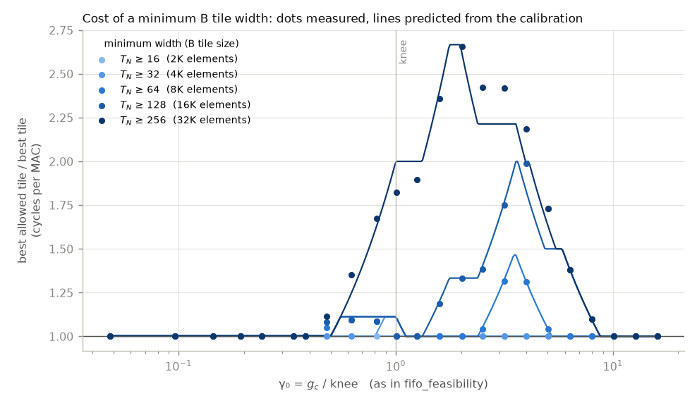

# constraint_tile: the best tile when the B tile has a minimum size

If B has to be generated in tiles of at least S_min elements, which tile is best, and what does the constraint cost? With T_K = K the B tile is K × T_N, so the constraint is T_N ≥ S_min / K. Working point, runs and notation are those of [fifo_feasibility](../fifo_feasibility/README.md); this experiment reads its runs and simulates nothing new.

run: `.venv/bin/python experiments/rewrite/constraint_tile.py`

## What the max model predicts

The best allowed tile is the allowed tile with the lowest max(α_f, β). A
minimum width costs nothing as long as some allowed tile both has α close to
α_f0 and hides the generator at that g_c. Two limits from the calibration
decide which tiles qualify as T_N grows:

- f ≤ 1, the A band surviving a tile row. Past it A is read once per tile
  column, so it costs little when there are few tile columns: 8% to 11% at
  T_N = 128, where there are two.
- The limit inside a tile, T_M · (max(T_N·A_P, line) + 2·line) ≤ L1. Past it
  C is read from DRAM again during the tile, and α more than doubles. It caps
  T_M at 48 for T_N = 128 and at 24 for T_N = 256.

A capped T_M means more tile rows, so B is generated more often: β = g_c ⌈M/T_M⌉
/ M. The constraint therefore costs nothing while the generator is hidden at
the capped tile, starts to cost at that tile's own knee, α · M / ⌈M/T_M⌉, and
costs nothing again once g_c is so large that the unconstrained optimum is
itself the widest tall tile (96×256).

| minimum | S_min, elements | tallest T_M with f ≤ 1 | tallest T_M inside the tile limit | best allowed tile at g_c = 0, α | predicted to start costing | largest measured cost |
|---|---|---|---|---|---|---|
| T_N ≥ 16 | 2048 | 48 | 96 | 48×16, 0.4336 | g_c = 21.0, γ₀ = 1.01 | none |
| T_N ≥ 32 | 4096 | 40 | 96 | 40×32, 0.4337 | g_c = 16.8, γ₀ = 0.81 | 1.09 at γ₀ = 0.82, 48×128 against 48×16 |
| T_N ≥ 64 | 8192 | 32 | 80 | 24×64, 0.4350 | g_c = 10.6, γ₀ = 0.51 | 1.32 at γ₀ = 3.17, 80×64 against 96×32 |
| T_N ≥ 128 | 16384 | 16 | 48 | 24×256, 0.4352 | g_c = 10.6, γ₀ = 0.51 | 1.99 at γ₀ = 3.99, 56×128 against 96×32 |
| T_N ≥ 256 | 32768 | one tile column | 24 | 24×256, 0.4352 | g_c = 10.6, γ₀ = 0.51 | 2.66 at γ₀ = 2.02, 24×256 against 64×64 |

## Results

T_N ≥ 16 and T_N ≥ 32 are close to free: at most 1.09 times the
unconstrained best. Wider minimums cost in a band of γ₀ that starts earlier
and gets worse the wider the minimum. T_N ≥ 64 costs up to 1.32 times at
γ₀ = 3.17, where the unconstrained optimum is 96×32 and the constraint
forces 80×64. T_N = 256 means one tile column, the whole of B generated per
tile row. The limit inside a tile then caps T_M at 24, so B is
generated 8 times, and it costs up to 2.66 times
at γ₀ = 2.02 (best allowed 24×256, against 64×64). At the far right
every curve returns to 1, because the unconstrained optimum is 96×256 there
too.

So the best tile under a minimum width is the tallest allowed tile whose α
stays near α_f0, which is the tile at one of the two limits. It differs from
the unconstrained optimum only between that tile's knee and the point where
the unconstrained optimum itself becomes 96×256.

The max model predicts the costs within 15% everywhere. The largest
misses are near the knee, where it predicts a cost and the measurement shows
little or none (T_N ≥ 32 at γ₀ = 1.01: 1.00 against 1.10; T_N ≥ 64 at γ₀ = 1.01: 1.00 against 1.10; T_N ≥ 128 at γ₀ = 1.01: 1.00 against 1.10). Near the knee the measured optimum is already
the wide tile 48×128: each tile starts with an empty FIFO, and fewer, wider
tiles have fewer of those starts. The max model doesn't see the starts, so it
prefers the narrow 48×16 and charges the minimum width for giving it up.

Cost of each minimum, measured / predicted, and the best allowed tile:

| g_c | γ₀ | best tile | T_N ≥ 16 | T_N ≥ 32 | T_N ≥ 64 | T_N ≥ 128 | T_N ≥ 256 |
|---|---|---|---|---|---|---|---|
| 1 | 0.05 | 40×32 | 1.00 / 1.00, 40×32 | 1.00 / 1.00, 40×32 | 1.00 / 1.00, 24×256 | 1.00 / 1.00, 24×256 | 1.00 / 1.00, 24×256 |
| 2 | 0.10 | 40×32 | 1.00 / 1.00, 40×32 | 1.00 / 1.00, 40×32 | 1.00 / 1.00, 24×256 | 1.00 / 1.00, 24×256 | 1.00 / 1.00, 24×256 |
| 3 | 0.14 | 40×32 | 1.00 / 1.00, 40×32 | 1.00 / 1.00, 40×32 | 1.00 / 1.00, 24×256 | 1.00 / 1.00, 24×256 | 1.00 / 1.00, 24×256 |
| 4 | 0.19 | 40×32 | 1.00 / 1.00, 40×32 | 1.00 / 1.00, 40×32 | 1.00 / 1.00, 24×256 | 1.00 / 1.00, 24×256 | 1.00 / 1.00, 24×256 |
| 5 | 0.24 | 24×256 | 1.00 / 1.00, 24×256 | 1.00 / 1.00, 24×256 | 1.00 / 1.00, 24×256 | 1.00 / 1.00, 24×256 | 1.00 / 1.00, 24×256 |
| 7 | 0.34 | 24×256 | 1.00 / 1.00, 24×256 | 1.00 / 1.00, 24×256 | 1.00 / 1.00, 24×256 | 1.00 / 1.00, 24×256 | 1.00 / 1.00, 24×256 |
| 8 | 0.38 | 24×256 | 1.00 / 1.00, 24×256 | 1.00 / 1.00, 24×256 | 1.00 / 1.00, 24×256 | 1.00 / 1.00, 24×256 | 1.00 / 1.00, 24×256 |
| 10 | 0.48 | 40×32 | 1.00 / 1.00, 40×32 | 1.00 / 1.00, 40×32 | 1.05 / 1.00, 24×64 | 1.08 / 1.00, 24×128 | 1.12 / 1.00, 24×256 |
| 13 | 0.62 | 40×32 | 1.00 / 1.00, 40×32 | 1.00 / 1.00, 40×32 | 1.09 / 1.11, 48×128 | 1.09 / 1.11, 48×128 | 1.35 / 1.25, 24×256 |
| 17 | 0.82 | 48×16 | 1.00 / 1.00, 48×16 | 1.09 / 1.02, 48×128 | 1.09 / 1.11, 48×128 | 1.09 / 1.11, 48×128 | 1.67 / 1.63, 24×256 |
| 21 | 1.01 | 48×128 | 1.00 / 1.00, 48×128 | 1.00 / 1.10, 48×128 | 1.00 / 1.10, 48×128 | 1.00 / 1.10, 48×128 | 1.82 / 2.00, 24×256 |
| 26 | 1.25 | 48×128 | 1.00 / 1.00, 48×128 | 1.00 / 1.00, 48×128 | 1.00 / 1.00, 48×128 | 1.00 / 1.00, 48×128 | 1.89 / 2.00, 24×256 |
| 33 | 1.59 | 64×64 | 1.00 / 1.00, 64×64 | 1.00 / 1.00, 64×64 | 1.00 / 1.00, 64×64 | 1.19 / 1.20, 48×128 | 2.36 / 2.40, 24×256 |
| 42 | 2.02 | 64×64 | 1.00 / 1.00, 64×64 | 1.00 / 1.00, 64×64 | 1.00 / 1.00, 64×64 | 1.33 / 1.33, 48×128 | 2.66 / 2.61, 24×256 |
| 52 | 2.50 | 96×32 | 1.00 / 1.00, 96×32 | 1.00 / 1.00, 96×32 | 1.04 / 1.05, 80×64 | 1.38 / 1.40, 48×128 | 2.42 / 2.21, 96×256 |
| 66 | 3.17 | 96×32 | 1.00 / 1.00, 96×32 | 1.00 / 1.00, 96×32 | 1.32 / 1.33, 80×64 | 1.75 / 1.77, 56×128 | 2.42 / 2.21, 96×256 |
| 83 | 3.99 | 96×32 | 1.00 / 1.00, 96×32 | 1.00 / 1.00, 96×32 | 1.31 / 1.31, 96×64 | 1.99 / 1.83, 56×128 | 2.18 / 2.00, 96×256 |
| 105 | 5.05 | 96×32 | 1.00 / 1.00, 96×32 | 1.00 / 1.00, 96×32 | 1.04 / 1.04, 96×64 | 1.73 / 1.50, 96×256 | 1.73 / 1.62, 96×256 |
| 132 | 6.34 | 96×64 | 1.00 / 1.00, 96×64 | 1.00 / 1.00, 96×64 | 1.00 / 1.00, 96×64 | 1.38 / 1.38, 96×256 | 1.38 / 1.38, 96×256 |
| 166 | 7.98 | 96×64 | 1.00 / 1.00, 96×64 | 1.00 / 1.00, 96×64 | 1.00 / 1.00, 96×64 | 1.10 / 1.10, 96×256 | 1.10 / 1.10, 96×256 |
| 210 | 10.09 | 96×64 | 1.00 / 1.00, 96×64 | 1.00 / 1.00, 96×64 | 1.00 / 1.00, 96×64 | 1.00 / 1.00, 96×256 | 1.00 / 1.00, 96×256 |
| 264 | 12.69 | 96×256 | 1.00 / 1.00, 96×256 | 1.00 / 1.00, 96×256 | 1.00 / 1.00, 96×256 | 1.00 / 1.00, 96×256 | 1.00 / 1.00, 96×256 |
| 333 | 16.00 | 96×256 | 1.00 / 1.00, 96×256 | 1.00 / 1.00, 96×256 | 1.00 / 1.00, 96×256 | 1.00 / 1.00, 96×256 | 1.00 / 1.00, 96×256 |

## Where a minimum could come from

The constraint is taken as given here; two properties of the generator bear
on it. A generator that emits a fixed word per step, in the order the core
consumes B, needs a whole number of words per pop. A pop is r²·B_P =
64 bytes here, one 64-byte word, so the word size puts no
limit on T_N. And each tile's B block is a function of its 8-byte seed,
so there are at most 2^64 different blocks whatever the tile size;
a larger tile does not hold more randomness. A minimum size has to come from
what B is used for.

## Simulator issues these runs expose

- The FIFO starts empty at every tile, so near the knee the number of tiles
  matters and wide tiles look better than the max model predicts. Part of why
  a minimum width costs nothing at the knee comes from this restart.
- T_K is always K, so a minimum B tile can only be met by widening T_N. With a
  tile-level T_K, a B tile of T_K × T_N could also grow along K; this
  simulator can't test that.
- T_M moves in steps of 8 (one register block), so the caps above are on that
  grid.
