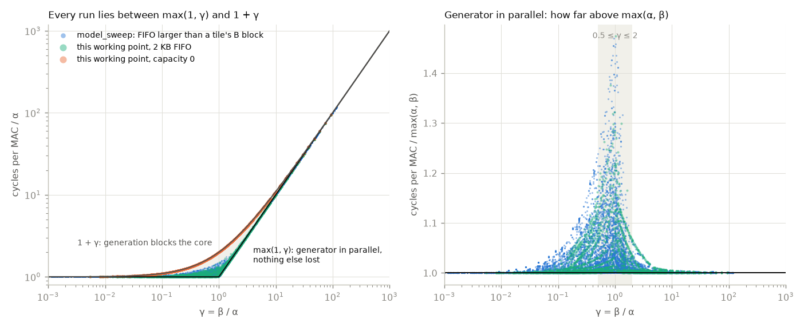
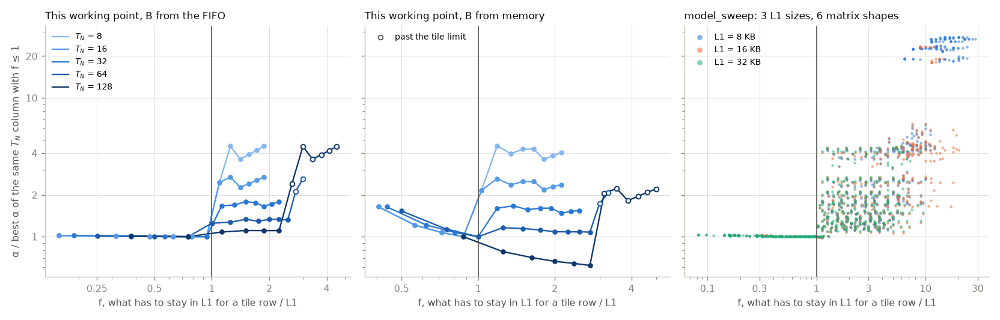
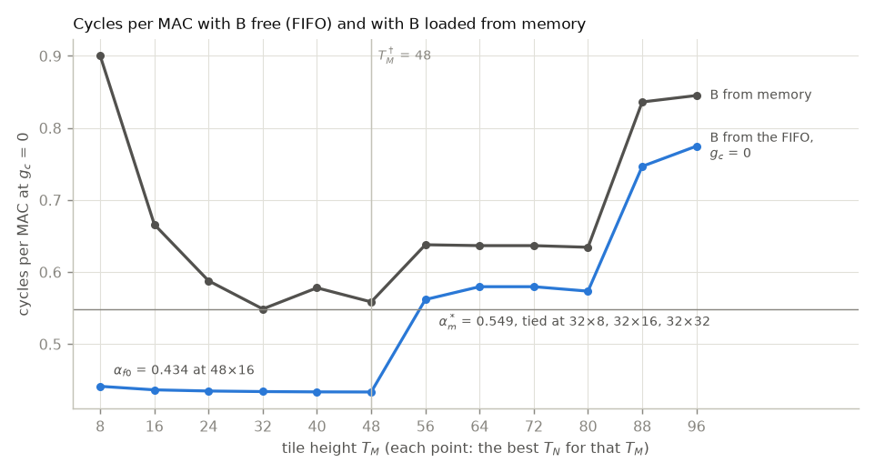
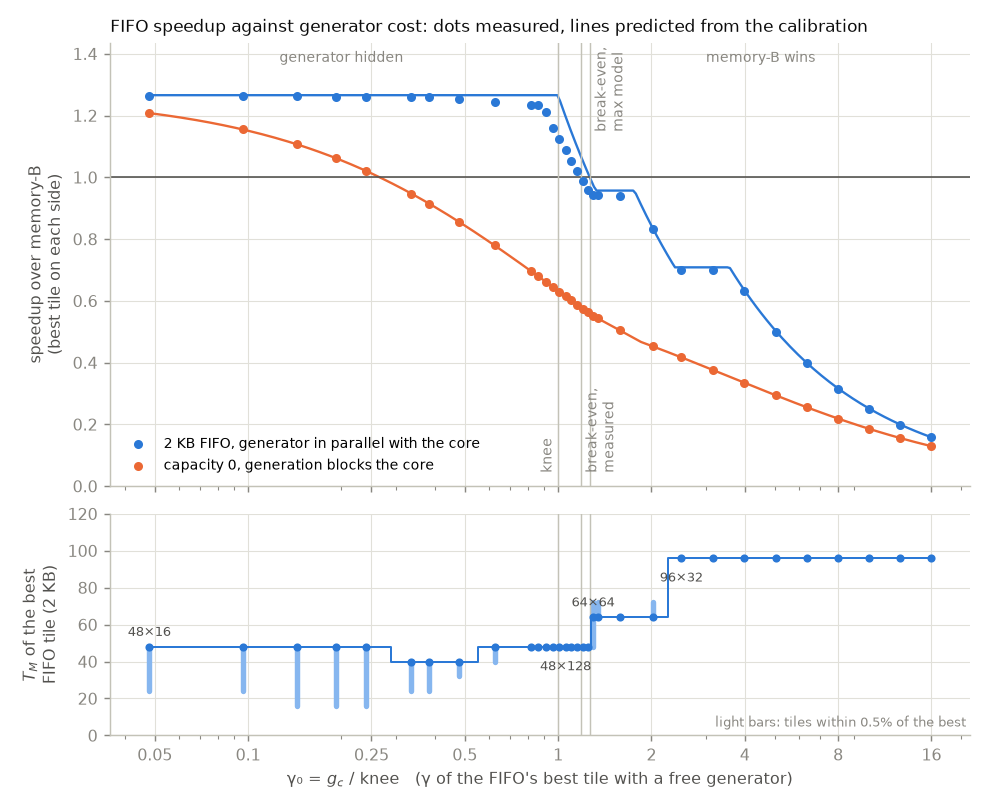
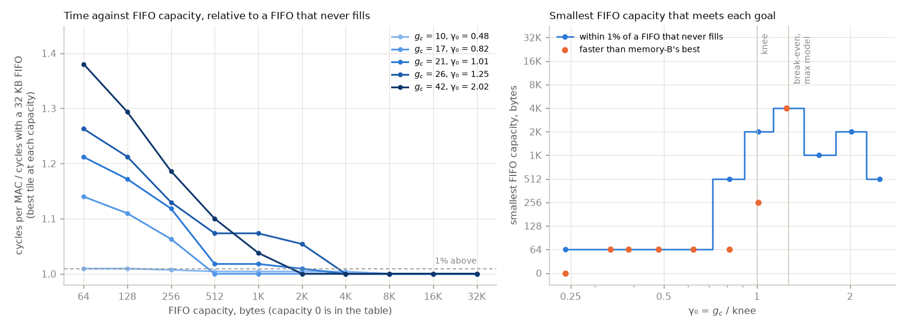

# fifo_feasibility-v2: when does a PRNG FIFO beat loading B from memory?

B-stationary matmul at one working point modelled on a 256-bit C7x. B is
either generated by the PRNG FIFO or loaded through L1 from DRAM; A and C
always go through L1. The questions are how slow the generator may be before
loading B is faster, and how deep the FIFO has to be.

run: `.venv/bin/python experiments/rewrite/fifo_feasibility-v2.py`. `constraint_tile-v2.py`
reuses these runs.

## Working point

| parameter | value | source |
|---|---|---|
| A, C | fp32, A_P = 4 bytes | activations |
| B | int8, B_P = 1 byte, stored row by row | weights |
| M, K, N | 192, 128, 256 | small enough that the A band fits L1 for some tiles |
| register block r | 8: one block row of A is 32 bytes, one 256-bit register  |
| cache line | 64 bytes | two registers per line |
| L1 | 32 KB, fully associative, LRU 
| L2 | none: every L1 miss goes to DRAM, as for operands too big for L2 
| t_1 | 5 cycles per L1 hit, one access at a time
| t_mem | 200 cycles
| a_c | 5 cycles | a pop costs one L1 hit |
| mulacc | 26 cycles per 8×8×8 block (512 MACs)
| FIFO | 2048 bytes (2048 elements) | one tile's B block at T_N = 16 |
| seed | 8 bytes per tile, read through L1 | |
| layout | `--aligned` | every row starts on a cache line |
| tiles | T_M = 8 to 96 in steps of 8 (the grid of this experiment), T_N ∈ {8, 16, 32, 64, 128, 256} | 72 tiles |

SPRADC1 describes the 512-bit C71x on the TDA4VM, while r and mulacc are set
for the 256-bit C7504/C7524, so the cache sizes and the core come from
different parts of the family.

## Notation

| symbol | meaning |
|---|---|
| g_c | cycles to generate one element of B |
| t_1, t_mem | L1 hit and DRAM latency, cycles |
| a_c | cycles per FIFO pop; one pop is one r × r block of B |
| T_M, T_N | tile height (rows of A) and width (columns of B); T_K is always K |
| A_P, B_P | bytes per element of A (and C), and of B |
| α | cycles per MAC of a run with g_c = 0: the core's own work (A and C loads, pops, MACs). At the FIFO's best tile 54% of it is L1 hit latency and 34% DRAM misses |
| β | g_c ⌈M/T_M⌉ / M: generation cycles per MAC. B is generated once per tile row, so each element serves T_M MACs. This is the generator's busy time, not added time |
| γ, f | the composite parameters, below |
| α_f(t), α_m(t) | α of tile t with B from the FIFO, and cycles per MAC of tile t with B from memory |
| α_f0 | the FIFO's best α over all tiles |
| α_m* | memory-B's best over all tiles |
| knee | the largest g_c at which a tile within 0.5% of α_f0 still hides the generator: the largest α·M/⌈M/T_M⌉ over those tiles |
| γ₀ | g_c / knee: γ of the tile that sets the knee, with a free generator |
| T_M† | the tallest tile (in rows per tile row) whose α_f still beats α_m* |
| break-even g_c* | α_m* · M / ⌈M/T_M†⌉: past it no tile lets the FIFO beat memory-B. Measured time is never below max(α, β), so this is an upper bound on the measured break-even |
| S | speedup: memory-B's best cycles over the FIFO's best cycles at that g_c |
| S_max | α_m* / α_f0, the speedup while the generator is hidden |
| tie | tiles within 0.5% of the best; the tile named first has the fewest tile rows |

## Changes from the first version

The first version is `fifo_feasibility.py`, with its outputs in
`out/fifo_feasibility/`; both are unchanged. A review of it found the numbers
right and several explanations wrong or too strong. This version:

- counts in f everything that has to stay in L1 for a tile row: the seed line
  for the FIFO, the B block for memory-B. The limit is f ≤ 1 on both sides,
  and the FIFO's limit at T_N = 64 is 24 (32×64 spills because of the seed);
- takes the knee from all tiles within 0.5% of α_f0, so a near-tie can't move
  it, and reports tiles within 0.5% of each other as ties, naming the one
  with the fewest tile rows;
- says which agreement in the collapse holds by construction, gives the
  statistics inside 0.5 ≤ γ ≤ 2, and explains the excess there tile by tile;
- adds α against f, here and in model_sweep (fill.png);
- draws the measured break-even next to the max model's, on a finer g_c grid;
- measures depth at 11 generator costs up to a FIFO that never fills, and
  traces the burst at the start of a tile to the k = 0 read of C;
- adds a sensitivity table (an L2, faster L1 hits, no DRAM latency, memory-B
  without B's misses, packed B) and states the simulator issues with numbers.

## Composite parameters

Two composites carry the results. α is measured (a run at g_c = 0); β is computed from g_c, M and T_M; f from the tile and cache sizes.

| composite | definition | what it decides |
|---|---|---|
| γ | β / α | γ < 1: the generator keeps up and is hidden, time ≈ α, if the FIFO is deep enough (depth section). γ > 1: the generator is the bottleneck, time ≈ β. Near γ = 1 the time is above both, by an amount the max model doesn't see |
| f | what has to stay in L1 for a whole tile row, over L1: T_M·(K·A_P + 2·max(T_N·A_P, line)), plus one line for the FIFO's seed or K·max(T_N·B_P, line) for memory-B's B block | f ≤ 1: the A band survives the tile row and α stays at its best. Past 1, A is read again for every tile column, and α jumps by an amount that grows with the number of tile columns N/T_N |

f has a companion inside a tile, the tile limit T_M·(max(T_N·A_P, line) + 2·line) ≤ L1: between two k steps the core walks the whole C tile and two k-columns of A, and past the limit C is read from DRAM again inside the tile.

### γ: one curve for every run

All 24,936 runs with a generator lie in the shaded
band between two curves of γ. The lower edge, max(1, γ), is a generator
running in parallel with the core with nothing else lost; no run can be
faster, since neither the core's work nor the generation shrinks. The upper
edge, 1 + γ, is generation blocking the core. The capacity-0 runs land on it
by construction, because every pop then stalls g_c per missing element and the
cache doesn't depend on time (largest deviation 0.00%).
None of the 22,632 parallel runs
is outside the band. So the left panel
shows bounds that hold for every run. What the composites have to explain is
where between them the parallel runs fall.

Away from γ = 1 most of them sit on the lower edge. Inside 0.5 ≤ γ ≤ 2 they
spread upward, and that is the range that decides the comparison with memory-B: at
this working point the FIFO only wins below γ₀ = 1.18.

| runs with a generator in parallel | 0.5 ≤ γ ≤ 2 | runs | median above max(α, β) | within 1% | more than 5% above |
|---|---|---|---|---|---|
| model_sweep | inside | 4845 | 0.73% | 54% | 23% |
| model_sweep | outside | 15483 | 0.05% | 90% | 3% |
| this working point, 2 KB | inside | 636 | 2.76% | 38% | 41% |
| this working point, 2 KB | outside | 1668 | 0.17% | 80% | 7% |

The time above max(α, β) near γ = 1 comes from tiles that are not alike, and
from the FIFO starting empty at every tile. Tile 48×16 at the knee
shows it:

| tile 48×16 at g_c = 21 | cycles |
|---|---|
| core work of the first tile of a tile row (g_c = 0) | 114,647, tile γ = 0.38 |
| core work of each of the 15 later tiles | 37,797, tile γ = 1.14 |
| generating one tile's B block, K·T_N·g_c | 43,008 |
| measured, whole run, 2 KB FIFO | 3,099,844 |
| sum over tiles of the slower of core and generator | 3,097,304 (-0.08%) |
| max(α, β) · M·N·K | 2,752,512 (-11.2%) |

The first tile of each tile row reads the A band from DRAM, so its core work
takes 114,647 cycles while generating its B block takes
43,008: the generator finishes early and the FIFO fills. The 15
later tiles find the band in L1 and need only 37,797 cycles of
core work, less than the generation, so they wait for the generator. The FIFO
is emptied at the start of every tile, so the time the generator had to spare
in the first tile is lost. Summing, tile by tile, the slower of the core
(plus the wait for the first block, r²·g_c) and the generator (plus the work
after the last pop) gives the measured time within
0.1%. max(α, β) averages over the
tiles first and comes out 11% low.

48×128 at the same g_c has f = 2.25, so A is read again in every
tile and both tiles of a tile row do the same work (379,341
cycles of core work against 344,064 of generation, tile γ
0.91). The generator is hidden in every tile,
and the measured time is 1.3% above
max(α, β). That is why 48×128 is the best 2 KB tile at the knee. At g_c =
26 (tile γ 1.12) the 2 KB FIFO leaves
48×128 5.7% above max(α, β), and
a 4 KB FIFO brings it to 0.3%.
That loss is inside the tile: the core is slow while it takes the C misses at
the start, and 2 KB can't bank enough generation during that stretch (see the
depth section).

Outside the band, 479 of the 15,483 model_sweep runs are more than
5% above max(α, β). 91% of them have a
last tile row shorter than half of T_M, such as M = 100 with T_M = 96: in that
row each B element serves only a few MACs, so the generator is the bottleneck
there even when γ over the whole run is small. Taking the max separately for
each tile row brings the worst of them (γ = 0.47,
1.23 times max(α, β)) to 1.03 times;
the largest that remains among these runs is 1.19 times.

model_sweep's runs are read from its cache, written by build 9cdda6f.
24 of 24 of them, picked at random and run again with
the current build (90a7365), give the same stats. Its FIFO holds
2·K·64 elements of 4 bytes (50 to 256 KB), more than a tile's B block, so it
never fills.

### f: where the L1 limit falls

f is the part of L1 that has to hold data for a whole tile row: the A band
and two C tiles, plus the seed line for the FIFO or the B block for memory-B.
In all three panels α stays at the best value of its column while f ≤ 1 and
rises once f passes 1. model_sweep runs a different device (4-byte elements,
r = 4, L1 of 8, 16 and 32 KB, rows not padded to cache lines) on six matrix
shapes. Its rows don't always start on a line, so a C tile row can straddle
one line more than its width needs, and f counts that line. In the
133 tile columns that have tiles on both sides of f = 1, no tile with
f ≤ 1 is more than 3.2% above the best of its column, and the
first tile more than 5% above it sits at f = 1.03 to
1.80 (median 1.25). How far past 1
depends on how big a step the next T_M of the grid is.

f says where α jumps, not how much. Past f = 1 the A band is read again for
every tile column, so the jump grows with the number of tile columns, N/T_N:
at this working point α grows 2.45
times at T_N = 8 (32 tile columns) and 1.08
times at T_N = 128 (two). Memory-B at T_N = 128 even gets cheaper past its
limit, because taller tiles also load B fewer times. The hollow markers are
tiles past the tile limit, T_M · (max(T_N·A_P, line) + 2·line) > L1, where C
doesn't survive from one k step to the next. That limit causes the large
jumps at 88×64 and 56×128 and is the only limit at T_N = 256 (one tile
column, not drawn).

## Calibration

| quantity | value |
|---|---|
| α_f0, the FIFO's best tile | 0.4336 at 48×16 (f = 0.94); 11 more tiles within 0.5%, the closest 48×8 |
| α_m*, memory-B's best tile | 0.5488, an exact tie of 32×8 (f = 0.88), 32×16 (f = 0.88), 32×32 (f = 1.00) |
| S_max = α_m* / α_f0 | 1.266 |
| knee | g_c = 20.8, from 48×8 (α = 0.4339, 4 tile rows) |
| T_M† | 48 (tile 48×16, α_f = 0.4336, 4 tile rows) |
| predicted break-even g_c* | 26.3, γ₀ = 1.26 |

With a free generator the core costs about 0.434 cycles per MAC on
every tile until the A band stops fitting in L1: 12 tiles are within
0.5% of the best. That α is mostly waiting on memory. At 48×16 it
splits into 0.234 for L1 hits
(54%), 0.147 for DRAM misses
(34%), 0.051 for the MACs and
0.002 for pops, because the simulator charges every access its
full latency, one after another.

Memory-B costs more on every tile. Its B loads take L1 hits and DRAM misses,
and its B block takes K whole lines of L1, so its band stops fitting at a
smaller T_M. The limit rows under the tables give the tallest T_M with f ≤ 1,
where f counts the seed line for the FIFO and the B block for memory-B. For
the FIFO the first jump of more than 3% in every column with several tile
columns is at the next T_M past that limit. For memory-B it is too, except at
T_N = 128: with only two tile columns, reading A
twice costs less than taller tiles save by loading B fewer times, so α keeps
falling past the limit.

How much the jump past f = 1 costs depends on how many tile columns read A
again: with T_N = 8 there are 32, and α grows 2.45 times; with
T_N = 128 there are two, and α rises by only 8% to
11%. Within the T_N = 64, 128 and 256 columns the largest
jumps come from the tile limit (88×64: 1.61 times, 56×128: 2.17 times, 32×256: 4.36 times).
Between two k steps the core walks the whole C tile and two k-columns of A,
so T_M · (max(T_N·A_P, line) + 2·line) has to fit in L1, or C is read from
DRAM again during the tile. At T_N = N = 256 there is a single tile column,
the band is never reused, and the tile limit is the only one.

T_M† is 48, the height of the FIFO's best tile. Taller tiles cost
0.56 to 0.77 cycles per MAC because their band no
longer fits, which is more than memory-B's best. So when the generator becomes
the bottleneck the FIFO has no taller tile to move to, and the predicted
break-even is only 1.26 times the knee.

Cycles per MAC with B from the FIFO at g_c = 0 (α_f):

| T_M | T_N = 8 | T_N = 16 | T_N = 32 | T_N = 64 | T_N = 128 | T_N = 256 |
|---|---|---|---|---|---|---|
| 8 | 0.442 | 0.442 | 0.442 | 0.442 | 0.441 | 0.441 |
| 16 | 0.437 | 0.437 | 0.437 | 0.437 | 0.437 | 0.437 |
| 24 | 0.436 | 0.435 | 0.435 | 0.435 | 0.472 | 0.435 |
| 32 | 0.435 | 0.435 | 0.434 | 0.544 | 0.483 | 1.899 |
| 40 | 0.434 | 0.434 | 0.434 | 0.553 | 0.483 | 1.899 |
| 48 | 0.434 | 0.434 | 0.725 | 0.580 | 0.482 | 1.898 |
| 56 | 1.063 | 1.063 | 0.733 | 0.562 | 1.047 | 1.715 |
| 64 | 1.950 | 1.167 | 0.775 | 0.580 | 1.947 | 1.898 |
| 72 | 1.570 | 0.983 | 0.763 | 0.580 | 1.581 | 1.898 |
| 80 | 1.696 | 1.044 | 0.718 | 0.574 | 1.703 | 1.898 |
| 88 | 1.823 | 1.105 | 0.747 | 0.923 | 1.821 | 1.776 |
| 96 | 1.948 | 1.166 | 0.775 | 1.135 | 1.946 | 1.897 |
| tallest T_M with f ≤ 1 (A band, two C tiles, seed line) | 48 | 48 | 40 | 24 | 16 | one tile column |
| tallest T_M inside the tile limit | 96 | 96 | 96 | 80 | 48 | 24 |

Cycles per MAC with B from memory (α_m):

| T_M | T_N = 8 | T_N = 16 | T_N = 32 | T_N = 64 | T_N = 128 | T_N = 256 |
|---|---|---|---|---|---|---|
| 8 | 0.900 | 0.900 | 0.900 | 0.900 | 0.900 | 0.900 |
| 16 | 0.666 | 0.666 | 0.666 | 0.666 | 0.703 | 0.666 |
| 24 | 0.588 | 0.588 | 0.588 | 0.588 | 0.637 | 0.588 |
| 32 | 0.549 | 0.549 | 0.549 | 0.682 | 0.598 | 2.014 |
| 40 | 1.185 | 1.185 | 0.879 | 0.673 | 0.578 | 1.994 |
| 48 | 2.479 | 1.438 | 0.917 | 0.656 | 0.559 | 1.975 |
| 56 | 2.176 | 1.297 | 0.858 | 0.638 | 1.840 | 1.792 |
| 64 | 2.346 | 1.369 | 0.881 | 0.637 | 2.004 | 1.955 |
| 72 | 2.346 | 1.369 | 0.881 | 0.637 | 1.638 | 1.955 |
| 80 | 1.979 | 1.198 | 0.808 | 0.634 | 1.760 | 1.955 |
| 88 | 2.106 | 1.259 | 0.836 | 1.023 | 1.881 | 1.833 |
| 96 | 2.212 | 1.301 | 0.845 | 1.215 | 1.984 | 1.936 |
| tallest T_M with f ≤ 1 (A band, two C tiles, B block) | 32 | 32 | 32 | 24 | 8 | one tile column |
| tallest T_M inside the tile limit | 96 | 96 | 96 | 80 | 48 | 24 |

## Generator sweep

| | max model | measured |
|---|---|---|
| break-even, 2 KB FIFO | g_c = 26.3 (γ₀ = 1.26) | g_c = 24.6 (γ₀ = 1.18) |
| break-even, capacity 0 | g_c = 5.5 | g_c = 5.5 (the same by construction) |
| largest gap between measured and predicted speedup, 2 KB | | 10.4% at g_c = 21 (γ₀ = 1.01) |

Below the knee the generator is hidden and the speedup stays close to S_max =
1.266. It is within 1% of the prediction up to γ₀ = 0.48
and then starts to fall below it (1.9% at γ₀ = 0.62, 2.5% at γ₀ = 0.82, 2.6% at γ₀ = 0.86), because the tiles are not
alike (see the worked example under the composites). Near the knee the
measurement is furthest below the prediction, 10.4% at γ₀ =
1.01.

The measured break-even is g_c = 24.6 (γ₀ = 1.18),
below the 26.3 the max model predicts. No run is faster than
max(α, β), so the predicted break-even is an upper bound for any FIFO depth;
the depth section shows how close a deeper FIFO gets. Past the break-even the
FIFO moves to taller tiles (64×64, then 96×32), but their α is
already above memory-B's best, so the speedup stays below 1 and the max model
follows the measurements closely again.

With capacity 0 the generator blocks the core, so the time is α + β by
construction, and the break-even, g_c = 5.5, is where β
equals what loading B costs at the FIFO's best tile: α_m* − α_f =
0.115 cycles per MAC, times the 48 MACs each
element serves, 5.5 cycles per element.
Generating in parallel with the core tolerates a generator
4.5 times slower.

In bytes, the measured break-even is one int8 element every 25
cycles, about 41 MB/s at 1 GHz. Like the knee, that figure
scales with α, which at this working point is mostly access latency paid one
access at a time (see the sensitivity section).

Every point. The g_c from 18 to 28 are a finer grid around the break-even; tied tiles are within 0.5% of the best:

| g_c | γ₀ | S max model | S measured, 2 KB | best tile, 2 KB | S max model, capacity 0 | S measured, capacity 0 |
|---|---|---|---|---|---|---|
| 1 | 0.05 | 1.266 | 1.264 | 48×16 (tied: 48×8, 40×32 and 7 more) | 1.208 | 1.208 |
| 2 | 0.10 | 1.266 | 1.263 | 48×16 (tied: 48×8, 40×32 and 6 more) | 1.155 | 1.155 |
| 3 | 0.14 | 1.266 | 1.262 | 48×16 (tied: 40×32, 40×16 and 5 more) | 1.106 | 1.106 |
| 4 | 0.19 | 1.266 | 1.261 | 48×16 (tied: 40×32, 40×16 and 4 more) | 1.062 | 1.062 |
| 5 | 0.24 | 1.266 | 1.260 | 48×16 (tied: 40×32, 32×32 and 3 more) | 1.021 | 1.021 |
| 7 | 0.34 | 1.266 | 1.260 | 40×32 (tied: 32×32, 24×256 and 1 more) | 0.947 | 0.947 |
| 8 | 0.38 | 1.266 | 1.259 | 40×32 (tied: 24×256, 24×64) | 0.914 | 0.914 |
| 10 | 0.48 | 1.266 | 1.254 | 40×32 (tied: 32×32) | 0.855 | 0.855 |
| 13 | 0.62 | 1.266 | 1.242 | 48×16 (tied: 40×32) | 0.779 | 0.779 |
| 17 | 0.82 | 1.266 | 1.234 | 48×16 | 0.697 | 0.697 |
| 18 | 0.86 | 1.266 | 1.233 | 48×16 | 0.679 | 0.679 |
| 19 | 0.91 | 1.266 | 1.210 | 48×16 | 0.662 | 0.662 |
| 20 | 0.96 | 1.266 | 1.160 | 48×16 | 0.645 | 0.645 |
| 21 | 1.01 | 1.254 | 1.123 | 48×128 | 0.630 | 0.630 |
| 22 | 1.06 | 1.197 | 1.089 | 48×128 | 0.615 | 0.615 |
| 23 | 1.10 | 1.145 | 1.053 | 48×128 | 0.601 | 0.601 |
| 24 | 1.15 | 1.098 | 1.020 | 48×128 | 0.588 | 0.588 |
| 25 | 1.20 | 1.054 | 0.988 | 48×128 | 0.575 | 0.575 |
| 26 | 1.25 | 1.013 | 0.959 | 48×128 | 0.563 | 0.563 |
| 27 | 1.30 | 0.976 | 0.941 | 64×64 (tied: 72×64, 48×64) | 0.551 | 0.551 |
| 28 | 1.34 | 0.957 | 0.941 | 64×64 (tied: 72×64) | 0.543 | 0.543 |
| 33 | 1.58 | 0.957 | 0.940 | 64×64 | 0.504 | 0.504 |
| 42 | 2.02 | 0.836 | 0.833 | 64×64 (tied: 72×64) | 0.453 | 0.453 |
| 52 | 2.50 | 0.708 | 0.701 | 96×32 | 0.417 | 0.417 |
| 66 | 3.17 | 0.708 | 0.699 | 96×32 | 0.375 | 0.375 |
| 83 | 3.99 | 0.635 | 0.631 | 96×32 | 0.335 | 0.335 |
| 105 | 5.04 | 0.502 | 0.499 | 96×32 | 0.294 | 0.294 |
| 132 | 6.34 | 0.399 | 0.398 | 96×64 (tied: 96×32) | 0.255 | 0.255 |
| 167 | 8.02 | 0.315 | 0.315 | 96×64 (tied: 96×32, 96×16) | 0.218 | 0.218 |
| 210 | 10.08 | 0.251 | 0.251 | 96×64 (tied: 96×256, 96×32 and 2 more) | 0.185 | 0.185 |
| 264 | 12.68 | 0.200 | 0.199 | 96×256 (tied: 96×64, 96×128 and 2 more) | 0.156 | 0.156 |
| 333 | 15.99 | 0.158 | 0.158 | 96×256 (tied: 96×128, 96×64 and 2 more) | 0.129 | 0.129 |

## FIFO depth

| g_c | γ₀ | FIFO that never fills: cycles per MAC, tile | smallest capacity within 1% of it | smallest capacity faster than memory-B | 2 KB FIFO |
|---|---|---|---|---|---|
| 5 | 0.24 | 0.4356, 48×16 (tied: 40×32, 32×32 and 3 more) | 64 B | 0 B | 0.4356 |
| 7 | 0.34 | 0.4357, 40×32 (tied: 32×32, 24×256 and 1 more) | 64 B | 64 B | 0.4357 |
| 8 | 0.38 | 0.4358, 40×32 (tied: 24×256, 24×64) | 64 B | 64 B | 0.4358 |
| 10 | 0.48 | 0.4360, 40×32 (tied: 24×256) | 64 B | 64 B | 0.4378 |
| 13 | 0.62 | 0.4418, 48×16 (tied: 40×32) | 64 B | 64 B | 0.4418 |
| 17 | 0.82 | 0.4446, 48×16 | 512 B | 64 B | 0.4446 |
| 21 | 1.01 | 0.4841, 48×128 | 2048 B | 256 B | 0.4885 |
| 26 | 1.25 | 0.5431, 48×128 | 4096 B | 4096 B | 0.5724 |
| 33 | 1.58 | 0.5838, 64×64 | 1024 B | none | 0.5838 |
| 42 | 2.02 | 0.6589, 64×64 (tied: 72×64) | 2048 B | none | 0.6589 |
| 52 | 2.50 | 0.7832, 96×32 | 512 B | none | 0.7832 |

How deep the FIFO has to be depends on γ₀. Up to γ₀ = 0.62
(g_c = 13) one pop, 64 bytes, is within 1% of a FIFO that never fills:
the generator refills a block long before the core asks for the next one.
Closer to the knee the need grows fast, to 512 bytes at γ₀ =
0.82 and 2 KB at the knee, where the 2 KB FIFO
is 0.9% above one that never
fills. At g_c = 26, the max model's break-even, the 2 KB FIFO loses to
memory-B and 4 KB wins; 4 KB or more comes within
0.3% of the max model's bound there, max(α, β) =
0.5417. Past the break-even no capacity beats memory-B, and the depth
needed for 1% goes up and down with the tile the FIFO picks.

The depth needed near the knee is set by the start of each tile. The FIFO
starts empty there, and in the first k step the core reads every line of the
C tile for the first time: the loop loads C before it accumulates into it,
and each of those read misses blocks the core for t_mem. While the core
waits, the generator makes T_M · ⌈T_N·A_P / line⌉ · (t_mem + t_1) / g_c
elements. A smaller FIFO fills up and the generator idles, and later in the
tile, where the core is faster than the generator, the core stalls for the
lead it could not bank. The table at the end runs capacities from half to
twice that burst for the two tiles the curves end on. Where the tile's γ is 1
or more, the time stops falling (stays within 0.5% of its value at twice the
burst) at 1.10 times the burst for 48×16 at g_c = 21, 1.10 times the burst for 48×16 at g_c = 26 and 1.00 times the burst for 48×128 at g_c = 26. Where γ is below 1 it stops earlier, at 0.75 times the burst for 48×128 at g_c = 21, because
the generator is faster than the core for the rest of the tile and part of
the lead is never needed. A kernel computing C = A·B would zero its
accumulators instead of loading C, and a core with misses in flight would not
wait for each line in turn, so this burst comes from the simulator's model
(see simulator issues).

Every capacity at the knee (g_c = 21) and at the max model's break-even (g_c = 26): cycles per MAC, best tile, share of time stalled. Memory-B's best is 0.5488.

| capacity, bytes | g_c = 21 | g_c = 26 |
|---|---|---|
| 0 | 0.8711, 48×16 (tied: 48×8), 50% | 0.9752, 80×64 (tied: 48×16 and 1 more), 41% |
| 64 | 0.5866, 48×16, 26% | 0.6858, 80×64 (tied: 48×16), 16% |
| 128 | 0.5672, 48×16, 24% | 0.6584, 80×64, 13% |
| 256 | 0.5414, 48×16, 20% | 0.6136, 64×64 (tied: 72×64), 6% |
| 512 | 0.4927, 48×16, 12% | 0.5829, 64×64, 1% |
| 1024 | 0.4927, 48×16, 12% | 0.5829, 64×64 (tied: 72×64), 1% |
| 2048 | 0.4885, 48×128, 1% | 0.5724, 48×128, 16% |
| 4096 | 0.4841, 48×128, 0% | 0.5431, 48×128, 11% |
| 8192 | 0.4841, 48×128, 0% | 0.5431, 48×128, 11% |
| 16384 | 0.4841, 48×128, 0% | 0.5431, 48×128, 11% |
| 32768 | 0.4841, 48×128, 0% | 0.5431, 48×128, 11% |

Fixed tile, capacity as a multiple of the burst (cycles per MAC):

| tile | g_c | γ of the tile | burst, elements | × 0.5 | × 0.75 | × 0.9 | × 1 | × 1.1 | × 1.25 | × 1.5 | × 2 |
|---|---|---|---|---|---|---|---|---|---|---|---|
| 48×16 | 21 | 1.01 | 469 | 0.5458 | 0.5223 | 0.5081 | 0.4987 | 0.4927 | 0.4927 | 0.4927 | 0.4927 |
| 48×16 | 26 | 1.25 | 378 | 0.6437 | 0.6201 | 0.6060 | 0.5968 | 0.5906 | 0.5906 | 0.5906 | 0.5906 |
| 48×128 | 21 | 0.91 | 3749 | 0.4932 | 0.4841 | 0.4841 | 0.4841 | 0.4841 | 0.4841 | 0.4841 | 0.4841 |
| 48×128 | 26 | 1.12 | 3028 | 0.5900 | 0.5650 | 0.5500 | 0.5431 | 0.5431 | 0.5431 | 0.5431 | 0.5431 |

## How much the answer depends on the model

| change | α_f0, tile | α_m*, tile | S_max | knee g_c | T_M† | break-even g_c*, max model (γ₀) | break-even, measured 2 KB (γ₀) |
|---|---|---|---|---|---|---|---|
| the working point | 0.4336, 48×16 | 0.5488, 32×8 (tied: 32×16 and 1 more) | 1.266 | 20.8 | 48 | 26.3 (1.26) | 24.6 (1.18) |
| L1 hit and pop in 1 cycle | 0.2446, 48×16 | 0.3457, 32×8 (tied: 32×16 and 1 more) | 1.413 | 11.8 | 48 | 16.6 (1.41) | not run |
| no DRAM latency (t_mem = 0) | 0.2860, 96×256 | 0.2917, 96×8 (tied: 96×16 and 4 more) | 1.020 | 27.5 | 96 | 28.0 (1.02) | not run |
| L2 512 KB, 8-way, 6 cycles | 0.4378, 48×16 | 0.4679, 80×64 (tied: 64×64 and 2 more) | 1.069 | 21.1 | 96 | 44.9 (2.13) | not run |
| L2 512 KB, 8-way, 15 cycles | 0.4444, 48×16 | 0.4805, 48×128 | 1.081 | 21.3 | 96 | 46.1 (2.16) | not run |
| L2 64 KB, 8-way, 15 cycles | 0.4446, 48×16 | 0.5126, 16×8 (tied: 16×16 and 2 more) | 1.153 | 21.4 | 48 | 24.6 (1.15) | not run |
| memory-B with B's own misses free (B still takes room in L1) | 0.4336, 48×16 | 0.4512, 32×8 (tied: 32×16 and 1 more) | 1.041 | 20.8 | 48 | 21.7 (1.04) | 18.7 (0.90) |
| memory-B with B packed in r × r blocks (Python model) | 0.4336, 48×16 | 0.4984, 48×8 (tied: 48×16) | 1.149 | 20.8 | 48 | 23.9 (1.15) | 21.6 (1.04) |

Every number in the sections above holds for this model of the machine: no
L2, every access paying its full latency before the next one starts, and B
stored row by row. The table repeats the calibration with one of those
changed at a time. The last two rows keep this working point's runs and
change only memory-B: one frees B's own misses, the other stores B in packed
blocks.

Without DRAM latency (t_mem = 0) S_max is 1.020,
so almost all of the FIFO's lead at this working point is DRAM latency, and
most of that is B's own. With only B's own misses free, memory-B's best is
0.4512 at 32×8 (tied: 32×16 and 1 more),
S_max = 1.041, and against the measured 2 KB sweep the FIFO breaks
even at g_c ≈ 18.7, below the knee. That row still keeps
B's lines in L1, which caps memory-B at T_M = 32. If B
also stayed out of L1, as it does when the C7x's streaming engines read it
past L1D, memory-B could use the FIFO's tall tiles; freeing every miss
memory-B takes beyond the FIFO's gives S_max = 1.026.
Storing B in packed 8×8 blocks of one
line each gives memory-B fewer L1 accesses and a B block of K·T_N bytes
instead of K lines, so it can use the same tall tiles as the FIFO: its best is
0.4984 at 48×8 (tied: 48×16), S_max drops to
1.149 and the measured break-even to g_c ≈ 21.6, about the
knee. build/sim has no packed layout, so this row comes from a Python copy of
its loop (`memory_b_python`), which reproduces build/sim's memory-B cycles
exactly on all 72 tiles of the row-major layout.

An L2 that holds the whole problem, as the TDA4VM's 512 KB L2 would (SPRADC1
§2.8.1), turns B's repeated misses into L2 hits. S_max drops to
1.069 with a 6-cycle L2 (0.03 of t_mem, the ratio in
SPRADC1 Table 3-1) and to 1.081 with 15 cycles. The
predicted break-even moves out to 2.1 times the
knee all the same: memory-B's best α is now above the α of tiles 96
rows tall, so the FIFO can use those, generate B for 2
tile rows instead of 4, and keep its small lead up to
a much slower generator. With only the 64 KB the SDK sets up
as L2 cache, S_max is 1.153.

With 1-cycle L1 hits and pops, α_f0 shrinks to 0.245, S_max rises
to 1.41 and the knee falls from
20.8 to 11.8. Every absolute g_c above (knee,
break-even, the MB/s figure) assumes 5-cycle accesses taken one at a time.

So the FIFO's lead at this working point, 27%
while the generator is hidden, depends on the model. With B's own misses
hidden or B packed it is 4% to 15%, and it lasts
only up to about the knee.

## Simulator issues these runs expose

- Every cache access stalls the core until it completes, misses are taken one
  at a time, and nothing streams or prefetches B. At memory-B's best tile
  (32×8) memory-B costs 0.1138 cycles per MAC more than the
  FIFO with a free generator. 0.0969 of it is DRAM latency for the
  3,048 misses it takes beyond the FIFO's: B's 512 lines, missed
  again in each of the 6 tile rows (3,072), less
  24 misses the FIFO takes on its seeds. 0.0194 is L1 hits
  for B's loads, and the FIFO's pops give 0.0024 back. A C7x streams B
  with its streaming engines, or copies it into L2 SRAM by DMA before it is
  used. With B's own misses free, S_max is
  1.041 and the FIFO breaks even
  below the knee (previous section). A and C misses block the core the same
  way: they are 34% of α_f0.
- L1 hits are charged one after another too: 54% of α_f0
  is L1 hit latency, 24 accesses of 5 cycles per 512 MACs.
  The C7x's two load/store units pipeline their loads (SPRADC1 Fig. 2-5).
  With 1-cycle hits the knee falls from 20.8 to 11.8.
- C is read before it is computed. In the first k step the loop loads every
  block of the C tile (`load_into_reg(c, ...)` in `MultiUnit::reg_weight_mul`),
  so each tile starts with a read miss on every line of its C tile, taken one
  at a time. A kernel computing C = A·B would zero its accumulators. This
  burst is what sets the FIFO depth needed near the knee.
- The FIFO starts empty at every tile (`PrngFifo::load_seed`). Each tile waits
  r²·g_c for its first B block, and the lead the generator builds while the
  core is slow in one tile can't carry into the next. Near γ = 1 this is most
  of the time above max(α, β) (worked example in the composites section). The
  next tile's seed is at a fixed address, so a generator could start on it
  early.
- B is stored row by row. An 8×8 block of int8 B then spans 8 lines and
  takes 8 L1 accesses, and a B tile narrower than a line still takes K whole
  lines of L1, which caps memory-B at T_M = 32.
  Deployed int8 weights are usually packed in the order the kernel reads
  them; the previous section estimates that case
  (S_max 1.149).
- There is no L2, so every L1 miss goes to DRAM. The TDA4VM's C7x has 512 KB
  of L2, which would hold this whole problem; the previous section shows what
  that changes.
- The seed is read through L1 at the start of every tile. At 32×64 that one
  line is what pushes the A band out: f is 1.002 with it and
  1.000 without.
- g_c is a whole number of cycles. Near the knee one cycle is a
  5% step, and a generator faster than one element per cycle
  can't be set without scaling every other latency.
- T_K is always K, so the A band is a full row of K elements. With K in the
  thousands, as in real layers, no tile would fit L1. K = 128 keeps the L1
  limit inside the range of T_M swept here.
