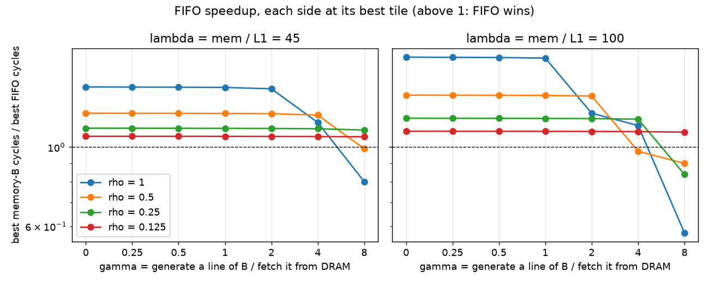
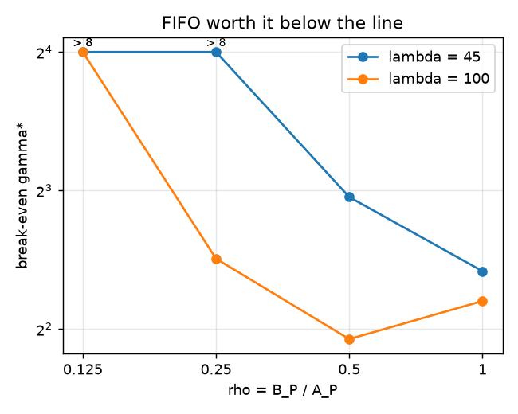
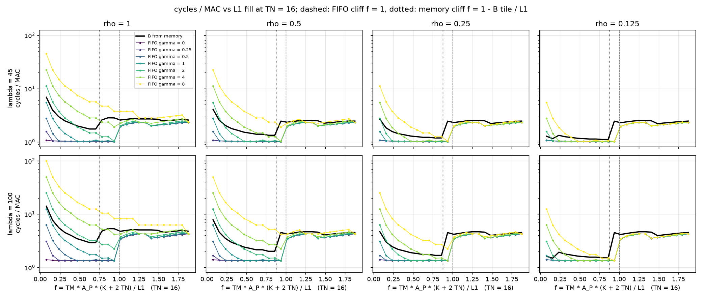
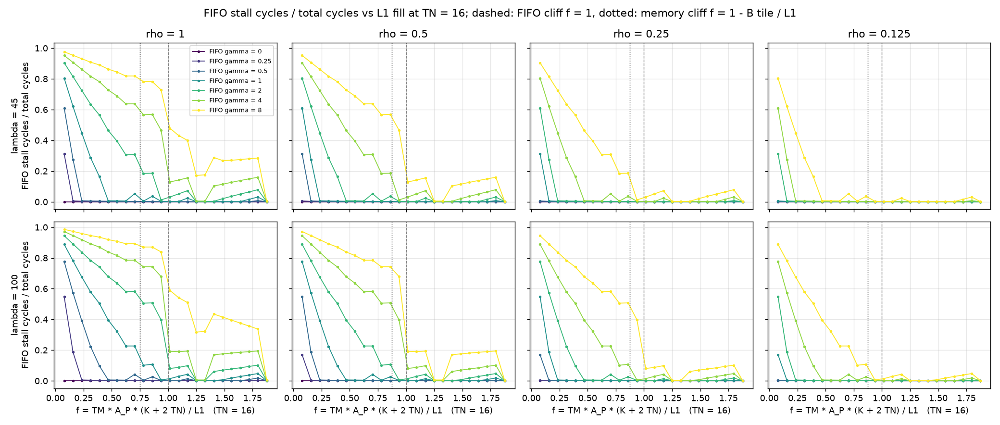

# fifo_feasibility: is a PRNG-FIFO worth adding, given the device?

B-stationary matmul, B either loaded from memory or generated by a PRNG-FIFO, on the same tile grid. Each side picks its own best tile; the ratio of the two best cycle counts says whether the FIFO pays off on this device. A fixed-tile view of the same runs shows where the win comes from.

run: `.venv/bin/python experiments/rewrite/fifo_feasibility.py`

## Parameters

| symbol | definition | meaning |
|---|---|---|
| A_P, B_P | bytes per element of A and of B; C has A's size | A_P = 8 fixed |
| rho | B_P / A_P | precision ratio (slides: T_N*/T_M* = 1/rho). 1, 1/2, 1/4, 1/8 |
| gamma | gc * (64 / B_P) / mem_cycles | time to generate one cache line of B divided by the time to fetch it from DRAM. 1: generator as slow as DRAM; 1/4: four times faster. gc = round(gamma * mem * B_P / 64) |
| lambda | mem_cycles / l1_cycles | DRAM latency counted in L1 hits; only the ratio matters. 45 is mem 180, 100 is mem 400 |
| f | TM * A_P * (K + 2 TN) / L1 | L1 fill: what LRU sees between two uses of a line of the A row band. The band itself (TM*K*A_P, reused across tile columns), the C tile of the tile being finished and the C tile of the tile being started (TM*TN*A_P each; every k step walks the whole C tile, so the new one is fully touched before the band line comes round). The FIFO's A band survives iff f <= 1 |
| memory cliff | 1 - K * max(TN*B_P, 64) / L1 | with B from memory the B column block also passes through L1 between two uses of an A line (K rows, each at least one line under `--aligned`), so the band survives only up to this smaller f |

Why gamma: in B-stationary both sides bring every B element in once per tile row, memory at mem/(64/B_P) cycles per element, the FIFO at gc. gamma is the ratio of the two. If the costs simply added up, break-even would sit at gamma = 1; the distance from 1 is what the FIFO's overlap with A loads and its zero L1 footprint buy.

## Fixed

| | value | why |
|---|---|---|
| M, N, K | 192, 256, 128 | K = 128 makes an A row 16 lines, so the cliff spans many TM steps |
| A_P = C_P | 8 B | the high-precision side |
| L1 | 64 KB, fully associative, LRU, no L2 | capacity misses only, sharp cliff |
| line | 64 B | |
| l1_cycles | 4 | the time unit |
| fifo_access | 4 | a pop costs one L1 hit |
| mulacc | 0 | identical on both sides |
| reg_dim | 4 | |
| write policy | write-back, write-allocate | keeps the C tile resident |
| FIFO capacity | 16384 elements | never the limit |
| seed | 8 B, one read per tile through the cache | |
| layout | `--aligned` | rows and matrix bases on cache-line boundaries |
| dataflow | B-stationary (`-o weight`) | each B element used TM times |

## Swept

| axis | values | role |
|---|---|---|
| TM | 4 .. 96 step 4 | minimised over (best vs best); x axis as f (fixed tile) |
| TN | 8, 16, 32, 64 | minimised over (best vs best); 16 in the fixed-tile view |
| rho | 1, 0.5, 0.25, 0.125 | B_P = 8, 4, 2, 1 |
| gamma | 0, 0.25, 0.5, 1, 2, 4, 8 | FIFO runs only |
| lambda | 45, 100 | |

6144 runs, 768 of them memory-B.

## Results: best vs best

Speedup = best memory-B cycles / best FIFO cycles, each side at its own best (TM, TN). gamma* is where it crosses 1 (log-interpolated between the gammas run; `inf` means the FIFO still wins at gamma = 8).

gc* is the same break-even as a generation cost in cycles per element, gc* = gamma* * mem * B_P / 64.

| rho | lambda | g=0 | g=0.25 | g=0.5 | g=1 | g=2 | g=4 | g=8 | gamma* | gc* |
|---|---|---|---|---|---|---|---|---|---|---|
| 1 | 45 | 1.48 | 1.47 | 1.47 | 1.47 | 1.46 | 1.17 | 0.80 | 5.34 | 120 |
| 1 | 100 | 1.79 | 1.79 | 1.78 | 1.78 | 1.24 | 1.15 | 0.58 | 4.60 | 230 |
| 0.5 | 45 | 1.25 | 1.24 | 1.24 | 1.24 | 1.24 | 1.23 | 0.99 | 7.74 | 87 |
| 0.5 | 100 | 1.40 | 1.40 | 1.40 | 1.40 | 1.39 | 0.97 | 0.90 | 3.80 | 95 |
| 0.25 | 45 | 1.13 | 1.13 | 1.13 | 1.13 | 1.13 | 1.13 | 1.12 | inf | inf |
| 0.25 | 100 | 1.21 | 1.20 | 1.20 | 1.20 | 1.20 | 1.20 | 0.84 | 5.69 | 71 |
| 0.125 | 45 | 1.07 | 1.07 | 1.07 | 1.07 | 1.07 | 1.07 | 1.07 | inf | inf |
| 0.125 | 100 | 1.11 | 1.11 | 1.11 | 1.11 | 1.11 | 1.11 | 1.10 | inf | inf |

### Tiles each side picked (TM x TN, cycles/MAC)

| rho | lambda | memory | FIFO g=0 | FIFO g=0.25 | FIFO g=0.5 | FIFO g=1 | FIFO g=2 | FIFO g=4 | FIFO g=8 |
|---|---|---|---|---|---|---|---|---|---|
| 1 | 45 | 48x8 (1.503) | 48x16 (1.019) | 48x16 (1.020) | 48x16 (1.021) | 40x32 (1.022) | 48x16 (1.032) | 96x64 (1.282) | 96x64 (1.877) |
| 1 | 100 | 48x8 (2.398) | 48x16 (1.342) | 48x16 (1.344) | 40x32 (1.345) | 48x16 (1.350) | 96x64 (1.927) | 96x64 (2.085) | 96x64 (4.169) |
| 0.5 | 45 | 48x8 (1.269) | 48x16 (1.019) | 48x16 (1.020) | 48x16 (1.020) | 48x16 (1.021) | 40x32 (1.022) | 48x16 (1.032) | 96x64 (1.282) |
| 0.5 | 100 | 48x8 (1.878) | 48x16 (1.342) | 48x16 (1.343) | 48x16 (1.344) | 40x32 (1.345) | 48x16 (1.350) | 96x64 (1.927) | 96x64 (2.085) |
| 0.25 | 45 | 48x8 (1.152) | 48x16 (1.019) | 48x16 (1.019) | 48x16 (1.020) | 48x16 (1.020) | 48x16 (1.021) | 40x32 (1.022) | 48x16 (1.032) |
| 0.25 | 100 | 48x8 (1.617) | 48x16 (1.342) | 48x16 (1.342) | 48x16 (1.343) | 48x16 (1.344) | 40x32 (1.345) | 48x16 (1.350) | 96x64 (1.927) |
| 0.125 | 45 | 48x8 (1.093) | 48x16 (1.019) | 48x16 (1.019) | 48x16 (1.019) | 48x16 (1.020) | 48x16 (1.020) | 48x16 (1.021) | 40x32 (1.022) |
| 0.125 | 100 | 48x8 (1.487) | 48x16 (1.342) | 48x16 (1.342) | 48x16 (1.342) | 48x16 (1.343) | 48x16 (1.344) | 40x32 (1.345) | 48x16 (1.350) |

## Results: fixed tile, TN = 16

One tile row costs 1280 B of reuse distance, so f = TM / 51.2. Predicted cliffs (first TM past the threshold) against the measured one (first TM with f >= 0.4 where L1 misses rise by more than 50 % over the previous step):

| rho | lambda | side | predicted f | predicted TM | measured TM |
|---|---|---|---|---|---|
| 1 | 45 | FIFO | 1.000 | 52 | 52 |
| 1 | 45 | memory | 0.750 | 40 | 40 |
| 1 | 100 | FIFO | 1.000 | 52 | 52 |
| 1 | 100 | memory | 0.750 | 40 | 40 |
| 0.5 | 45 | FIFO | 1.000 | 52 | 52 |
| 0.5 | 45 | memory | 0.875 | 48 | 48 |
| 0.5 | 100 | FIFO | 1.000 | 52 | 52 |
| 0.5 | 100 | memory | 0.875 | 48 | 48 |
| 0.25 | 45 | FIFO | 1.000 | 52 | 52 |
| 0.25 | 45 | memory | 0.875 | 48 | 48 |
| 0.25 | 100 | FIFO | 1.000 | 52 | 52 |
| 0.25 | 100 | memory | 0.875 | 48 | 48 |
| 0.125 | 45 | FIFO | 1.000 | 52 | 52 |
| 0.125 | 45 | memory | 0.875 | 48 | 48 |
| 0.125 | 100 | FIFO | 1.000 | 52 | 52 |
| 0.125 | 100 | memory | 0.875 | 48 | 48 |

## Reading the results

**The FIFO wins whenever the generator is at least as fast as DRAM, and the
gain is set by rho.** For gamma <= 1 the best-vs-best speedup is flat: the
FIFO's best tile is A-bound (no stalls, see `stall_vs_fill.png` at TM >= 20),
so generation speed doesn't show in the runtime. The flat value is the FIFO's
ceiling on this device: 1.48x at rho = 1 and lambda = 45,
1.79x at lambda = 100, falling to 1.07x / 1.11x at
rho = 1/8. Two things shrink with rho: the B traffic memory-B pays, and the L1
space B takes away from the A band. At 1-byte B both are small, so there is
little left for the FIFO to remove.

**Break-even is well above gamma = 1.** If costs added up, generating B at
DRAM speed would be a wash. Measured: gamma* = 5.34 (gc* = 120
cycles/element) at rho = 1, lambda = 45, and 4.60 (230
cycles/element) at lambda = 100; 7.74 / 3.80 at rho = 1/2; 5.69 at
rho = 1/4, lambda = 100; above 8 in the remaining cases. Two reasons. The
FIFO's generation overlaps with the A loads, so it costs nothing until
gc * ceil(M/TM) / M exceeds the A cost per MAC, and the FIFO can grow TM to
amortize (its best tile moves from 48x16 to 96x64 once generation binds). And
in gamma units a line of 1-byte B is 64 elements, so "DRAM speed" is a very
fast generator in absolute terms: gamma = 8 at rho = 1/8, lambda = 45 is only
gc = 22 cycles per element, which at TM = 48 is still below the A cost. So as
rho shrinks the FIFO's gain gets smaller but its tolerance for a slow
generator, measured against DRAM, gets larger. In cycles per element the
break-even moves the other way (gc* column).

**Where the win comes from (fixed tile, TN = 16).** Memory-B steps up at its
cliff and the FIFO at f = 1; between the two the FIFO wins at every gamma run,
because memory is already reloading the A band from DRAM once per tile column
and the FIFO is not. That band is 0.75 <= f < 1 at rho = 1 (B tile 16 KB of
the 64 KB L1) and 0.875 <= f < 1 at rho <= 1/2. Below the memory cliff the FIFO
still wins while it is A-bound; at gamma = 4 and 8 it is generation-bound
there (stall fraction 0.5 to 0.95) and slower than memory. Above f = 1 both
sides pay the per-column A reload and converge; the sawtooth there is
ceil(M/TM): TM = 64 and 96 divide M = 192, TM = 72 leaves a 48-row last tile
row whose band fits again.

**The cliffs land where predicted, in all 16 cases,** once f counts the C
tile twice and the B block as K padded rows. The first version of f (A band
plus one C tile) put the FIFO cliff at TM = 60; it is at 52, because between
two uses of an A-band line the whole C tile of the next tile has already been
walked. In lines: TM * (16 + 2 + 2) <= 1024 gives TM <= 51.2. Memory-B adds
the B block, 256 lines at rho = 1, 128 at rho = 1/2, and still 128 at rho <=
1/4 because 16 elements of 2 or 1 bytes are padded to a full line under
`--aligned`; hence the same memory cliff (TM = 48) for rho = 1/2, 1/4 and 1/8.

**The paper's T_N / T_M = 1/rho does not appear here.** Memory-B's best tile is
48x8 at every rho: the largest TM whose band survives, with the narrowest TN
so the B block displaces as little of the band as possible. The traffic
formula's A_P / T_N term assumes the A tile is fetched once per tile; with
the band resident in L1 across tile columns, A traffic is compulsory and
independent of TN, so TN only acts through the C tile and the B block. The
1/rho shape matters above the cliff, where A really is reloaded per tile
column, and that region is never the optimum.

**Small-TM bumps on the memory side** (rho = 1/8, TM = 8 vs 12) are the whole
B matrix (32 KB at 1 byte) staying resident across tile rows while the band
is small, which is why the cliff search starts at f = 0.4.
