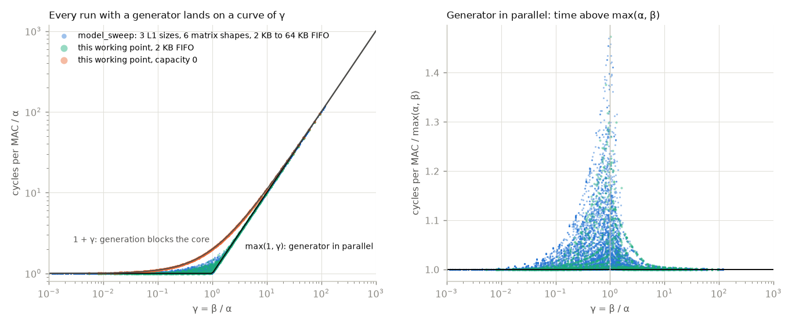
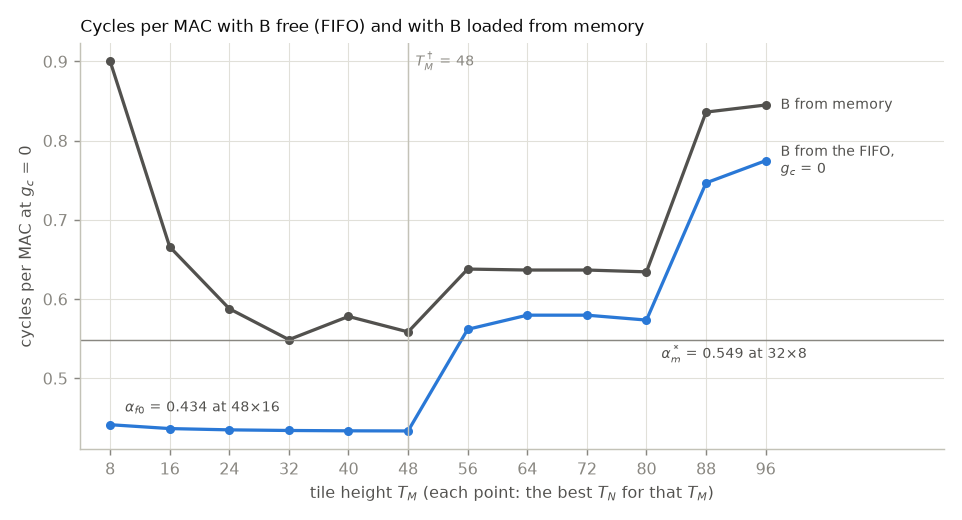
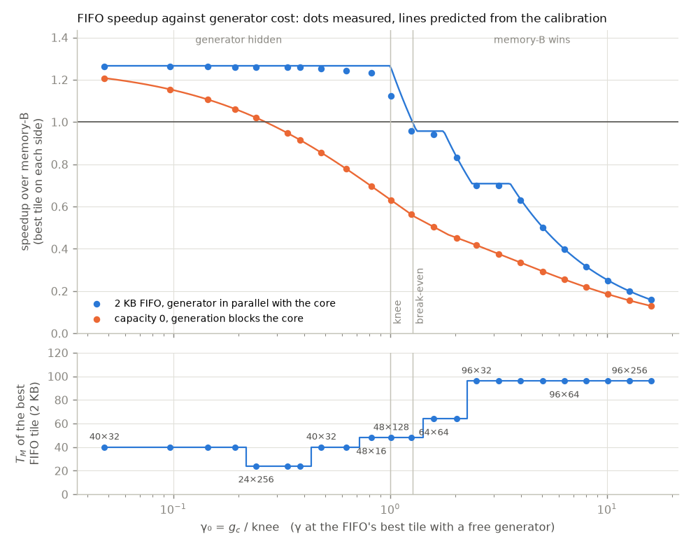
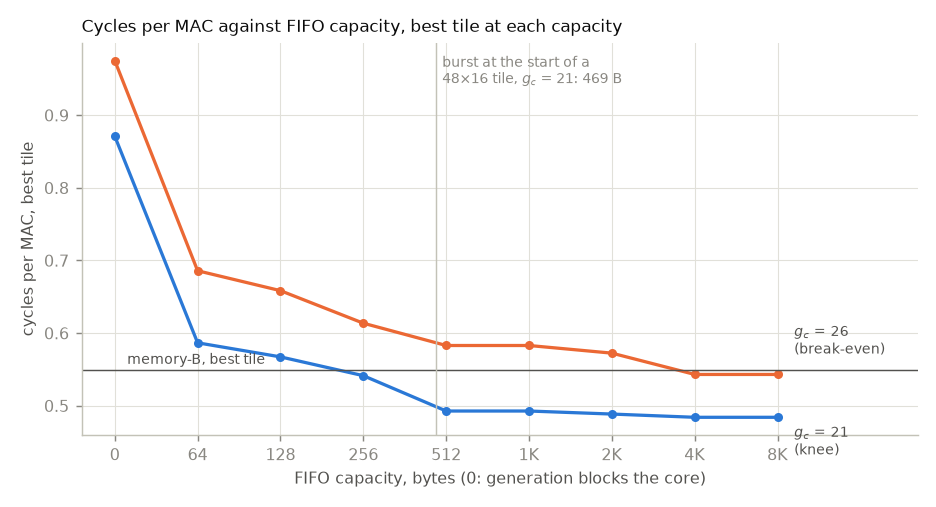

# fifo_feasibility: when does a PRNG FIFO beat loading B from memory?

B-stationary matmul at one working point modelled on a 256-bit C7x. B is
either generated by the PRNG FIFO or loaded through L1 from DRAM; A and C
always go through L1. The questions are how slow the generator may be before
loading B is faster, and how deep the FIFO has to be.

run: `.venv/bin/python experiments/rewrite/fifo_feasibility.py`. `constraint_tile.py`
reuses these runs.

## Working point

| parameter | value | source |
|---|---|---|
| A, C | fp32, A_P = 4 bytes | activations |
| B | int8, B_P = 1 byte | weights |
| M, K, N | 192, 128, 256 | small enough that the A band fits L1 for some tiles |
| register block r | 8: one block row of A is 32 bytes, one 256-bit register | C7504/C7524 vector width (SPRUIV4D §1.2) |
| cache line | 64 bytes | two registers per line |
| L1 | 32 KB, fully associative, LRU, no L2 | the TDA4VM's C7x uses 32 KB of its L1D as cache (SPRADC1 §2.8.1) |
| t_1 | 5 cycles | C7x load: 4 delay slots (SPRUIP0 §3.5.3.5) |
| t_mem | 200 cycles | assumed: about 200 ns at the C7x's 1 GHz. TI gives only ratios: from the C7x, L2 SRAM is 0.03 and MSMC 0.36 of the DDR latency (SPRADC1 Table 3-1) |
| a_c | 5 cycles | a pop costs one L1 hit |
| mulacc | 26 cycles per 8×8×8 block (512 MACs) | assumed: the 512-bit C71x does 80 fp32 FLOPs per cycle (SPRUIP0 §3.3.1), halved for 256 bits |
| FIFO | 2048 bytes (2048 elements) | one tile's B block at T_N = 16 |
| seed | 8 bytes per tile, read through L1 | |
| layout | `--aligned` | every row starts on a cache line |
| tiles | T_M = 8 to 96 in steps of 8, T_N ∈ {8, 16, 32, 64, 128, 256} | 72 tiles |

## Notation

| symbol | meaning |
|---|---|
| g_c | cycles to generate one element of B |
| t_1, t_mem | L1 hit and DRAM latency, cycles |
| a_c | cycles per FIFO pop; one pop is one r × r block |
| T_M, T_N | tile height (rows of A) and width (columns of B); T_K is always K |
| A_P, B_P | bytes per element of A (and C), and of B |
| α | cycles per MAC of a run with g_c = 0: the core's own work (A and C loads, pops, MACs) |
| β | g_c ⌈M/T_M⌉ / M: generation cycles per MAC. B is generated once per tile row, so each element serves T_M MACs. This is the generator's busy time, not added time |
| γ, f | the composite parameters, below |
| α_f(t), α_m(t) | α of tile t with B from the FIFO, and cycles per MAC of tile t with B from memory |
| α_f0, T_M* | the FIFO's best α over all tiles, and the height of that tile |
| α_m* | memory-B's best over all tiles |
| γ₀ | γ at the FIFO's best tile with a free generator: g_c ⌈M/T_M*⌉ / (M α_f0) = g_c / knee |
| knee | the g_c where γ₀ = 1, α_f0 · M / ⌈M/T_M*⌉: the generator stops keeping up |
| T_M† | the tallest tile (in rows per tile row) whose α_f still beats α_m* |
| break-even g_c* | α_m* · M / ⌈M/T_M†⌉: past it no tile lets the FIFO beat memory-B |
| S | speedup: memory-B's best cycles over the FIFO's best cycles at that g_c |
| S_max | α_m* / α_f0, the speedup while the generator is hidden |

## Composite parameters

Two composites decide the results. α and β are measured, γ and f are built from them.

| composite | definition | what it decides | how to get it |
|---|---|---|---|
| γ | β / α | γ < 1: the generator keeps up and is hidden, time ≈ α. γ > 1: the generator is the bottleneck, time ≈ β. Near γ = 1 both matter, and FIFO depth and the empty FIFO at the start of each tile show up | α from the same tile at g_c = 0, β = g_c ⌈M/T_M⌉ / M |
| f | T_M · (K·A_P + 2·max(T_N·A_P, line)) / L1 | f ≤ 1: the A band and the C tiles stay in L1 for a whole tile row. Past it A is read again for every tile column and α jumps. Memory-B also keeps its B block in L1, so its limit is f ≤ 1 − K·max(T_N·B_P, line) / L1 | from the parameters, no run |

f counts the two C tiles because between two uses of a line of the A band the core finishes one C tile and touches all of the next. A C tile row narrower than a line still takes a whole line.

Worked example, tile 48×16 at g_c = 21:

| quantity | value |
|---|---|
| α, same tile at g_c = 0 | 0.4336 cycles per MAC |
| β = 21 · ⌈192/48⌉ / 192 | 0.4375 |
| γ = β / α | 1.009 |
| f | 0.938 |
| measured, 2 KB FIFO | 0.4927 |
| max(α, β), generator in parallel | 0.4375 |
| α + β, generation blocking the core | 0.8711 |

This tile at this g_c sits at γ ≈ 1, where the parallel model is weakest: the measured time is 13% above max(α, β).

All 23640 runs with a generator fall on one of
two curves of γ. When generation blocks the core (capacity 0) the time is
exactly α + β, so every orange point is on 1 + γ; the largest deviation is
0.00%. With the generator in parallel the time is close to
max(α, β): the median run is 0.09%
above it and 81% of the runs
are within 1%.

The right panel shows where the parallel runs leave max(α, β). Almost all of
the excess sits near γ = 1, up to 1.47 times at γ = 1.02.
There the core and the generator need about the same time on average, so any
stretch where the core is faster than the generator turns into a stall, and
the slower stretches that follow can't win it back. The empty FIFO at the
start of every tile adds to it (see the depth section). Away from γ = 1 the
gap is small: of the 15483 model_sweep runs with γ below 0.5 or above 2,
479 are more than 5% above max(α, β), at most 1.23 times.
91% of those have a last tile row shorter
than half of T_M, such as M = 100 with T_M = 96. In that row each B element
serves only a few MACs, so the generator is the bottleneck there even when γ
averaged over the run is small. Taking the max separately for each tile row
explains part of it (the worst run drops to 1.19 times); the
rest is not traced.

## Calibration

| quantity | value |
|---|---|
| α_f0, the FIFO's best tile | 0.4336 at 48×16 (f = 0.94) |
| α_m*, memory-B's best tile | 0.5488 at 32×8 (f = 0.62) |
| S_max = α_m* / α_f0 | 1.266 |
| knee | g_c = 20.8 |
| T_M† | 48 (tile 48×16, α_f = 0.4336, 4 tile rows) |
| predicted break-even g_c* | 26.3, γ₀ = 1.27 |

With a free generator the core costs about 0.434 cycles per MAC on
every tile until the A band stops fitting in L1. Memory-B costs more on every
tile. Its B loads take L1 hits and DRAM misses, and its B block takes K lines
of L1, so its band stops fitting at a smaller T_M. The f limits under the
tables mark where each column starts to read A again for every tile column.
What that costs depends on how many tile columns there are: with T_N = 8 there
are 32, and α grows 2.5 times past the limit; with T_N = 128 there are
two, and α rises by only 8% to 11% (memory-B
even keeps improving with T_M there, because taller tiles load B fewer times).
At 32×64 f is exactly 1.00 and the band already falls out: the seed, read
through L1 once per tile, takes the last free line.

The largest jumps (88×64, 56×128, 32×256) come from a second limit, inside a tile. Between
two k steps the core walks the whole C tile and two k-columns of A, so
T_M · (max(T_N·A_P, line) + 2·line) has to fit in L1, or C is read from DRAM
again during the tile. Those three cells are exactly where that sum first
passes 32 KB. At T_N = N = 256 there is a single tile column, the band is
never reused, and this second limit is the only one.

T_M† is 48, the same height as the FIFO's best tile. The next heights
cost 0.56 to 0.77 cycles per MAC because their band no
longer fits, which is more than memory-B's best. So when the generator becomes
the bottleneck the FIFO has no taller tile to move to, and the break-even is
only 1.27 times the knee.

Cycles per MAC with B from the FIFO at g_c = 0 (α_f):

| T_M | T_N = 8 | T_N = 16 | T_N = 32 | T_N = 64 | T_N = 128 | T_N = 256 |
|---|---|---|---|---|---|---|
| 8 | 0.442 | 0.442 | 0.442 | 0.442 | 0.441 | 0.441 |
| 16 | 0.437 | 0.437 | 0.437 | 0.437 | 0.437 | 0.437 |
| 24 | 0.436 | 0.435 | 0.435 | 0.435 | 0.472 | 0.435 |
| 32 | 0.435 | 0.435 | 0.434 | 0.544 | 0.483 | 1.899 |
| 40 | 0.434 | 0.434 | 0.434 | 0.553 | 0.483 | 1.899 |
| 48 | 0.434 | 0.434 | 0.725 | 0.580 | 0.482 | 1.898 |
| 56 | 1.063 | 1.063 | 0.733 | 0.562 | 1.047 | 1.715 |
| 64 | 1.950 | 1.167 | 0.775 | 0.580 | 1.947 | 1.898 |
| 72 | 1.570 | 0.983 | 0.763 | 0.580 | 1.581 | 1.898 |
| 80 | 1.696 | 1.044 | 0.718 | 0.574 | 1.703 | 1.898 |
| 88 | 1.823 | 1.105 | 0.747 | 0.923 | 1.821 | 1.776 |
| 96 | 1.948 | 1.166 | 0.775 | 1.135 | 1.946 | 1.897 |
| largest T_M with f ≤ 1 | 48 | 48 | 40 | 32 | 16 | one tile column |

Cycles per MAC with B from memory (α_m):

| T_M | T_N = 8 | T_N = 16 | T_N = 32 | T_N = 64 | T_N = 128 | T_N = 256 |
|---|---|---|---|---|---|---|
| 8 | 0.900 | 0.900 | 0.900 | 0.900 | 0.900 | 0.900 |
| 16 | 0.666 | 0.666 | 0.666 | 0.666 | 0.703 | 0.666 |
| 24 | 0.588 | 0.588 | 0.588 | 0.588 | 0.637 | 0.588 |
| 32 | 0.549 | 0.549 | 0.549 | 0.682 | 0.598 | 2.014 |
| 40 | 1.185 | 1.185 | 0.879 | 0.673 | 0.578 | 1.994 |
| 48 | 2.479 | 1.438 | 0.917 | 0.656 | 0.559 | 1.975 |
| 56 | 2.176 | 1.297 | 0.858 | 0.638 | 1.840 | 1.792 |
| 64 | 2.346 | 1.369 | 0.881 | 0.637 | 2.004 | 1.955 |
| 72 | 2.346 | 1.369 | 0.881 | 0.637 | 1.638 | 1.955 |
| 80 | 1.979 | 1.198 | 0.808 | 0.634 | 1.760 | 1.955 |
| 88 | 2.106 | 1.259 | 0.836 | 1.023 | 1.881 | 1.833 |
| 96 | 2.212 | 1.301 | 0.845 | 1.215 | 1.984 | 1.936 |
| largest T_M with f ≤ 1 − K·max(T_N·B_P, line)/L1 | 32 | 32 | 32 | 24 | 8 | one tile column |

## Generator sweep

| | predicted | measured |
|---|---|---|
| break-even, 2 KB FIFO | g_c = 26.3 | g_c = 24.6 |
| break-even, capacity 0 | g_c = 5.5 | g_c = 5.5 |
| largest gap between measured and predicted speedup, 2 KB | | 10.4% at g_c = 21 (γ₀ = 1.01) |

Below the knee the measured speedup stays at S_max: 1.264 at γ₀ =
0.05, against 1.266 predicted. Near the knee it drops
below the prediction, by 10% at γ₀ = 1.01; that is the
loss near balance seen in the collapse figure. The measured break-even is
g_c = 24.6, against 26.3 predicted. Past it the FIFO does move
to taller tiles (64×64, then 96×32), but their α is already above
memory-B's best, so the speedup stays below 1 and the max model follows the
measurements closely again.

With capacity 0 the break-even is g_c = 5.5, as predicted
(5.5), since a blocking generator adds exactly β. It pays off
only while β is smaller than what loading B costs per MAC, α_m* − α_f =
0.115 at 48×16, times the 48 MACs each
element serves: 5.5 cycles per element.
Generating in parallel with the core tolerates a generator
4.5 times slower.

In bytes, the measured break-even is one int8 element every 25
cycles, about 41 MB/s at 1 GHz.

Every point:

| g_c | γ₀ | S predicted | S measured, 2 KB | best tile, 2 KB | S predicted, capacity 0 | S measured, capacity 0 |
|---|---|---|---|---|---|---|
| 1 | 0.05 | 1.266 | 1.264 | 40×32 | 1.208 | 1.208 |
| 2 | 0.10 | 1.266 | 1.263 | 40×32 | 1.155 | 1.155 |
| 3 | 0.14 | 1.266 | 1.262 | 40×32 | 1.106 | 1.106 |
| 4 | 0.19 | 1.266 | 1.261 | 40×32 | 1.062 | 1.062 |
| 5 | 0.24 | 1.266 | 1.260 | 24×256 | 1.021 | 1.021 |
| 7 | 0.34 | 1.266 | 1.260 | 24×256 | 0.947 | 0.947 |
| 8 | 0.38 | 1.266 | 1.259 | 24×256 | 0.914 | 0.914 |
| 10 | 0.48 | 1.266 | 1.254 | 40×32 | 0.855 | 0.855 |
| 13 | 0.62 | 1.266 | 1.242 | 40×32 | 0.779 | 0.779 |
| 17 | 0.82 | 1.266 | 1.234 | 48×16 | 0.697 | 0.697 |
| 21 | 1.01 | 1.254 | 1.123 | 48×128 | 0.630 | 0.630 |
| 26 | 1.25 | 1.013 | 0.959 | 48×128 | 0.563 | 0.563 |
| 33 | 1.59 | 0.957 | 0.940 | 64×64 | 0.504 | 0.504 |
| 42 | 2.02 | 0.836 | 0.833 | 64×64 | 0.453 | 0.453 |
| 52 | 2.50 | 0.708 | 0.701 | 96×32 | 0.417 | 0.417 |
| 66 | 3.17 | 0.708 | 0.699 | 96×32 | 0.375 | 0.375 |
| 83 | 3.99 | 0.635 | 0.631 | 96×32 | 0.335 | 0.335 |
| 105 | 5.05 | 0.502 | 0.499 | 96×32 | 0.294 | 0.294 |
| 132 | 6.34 | 0.399 | 0.398 | 96×64 | 0.255 | 0.255 |
| 166 | 7.98 | 0.317 | 0.317 | 96×64 | 0.219 | 0.219 |
| 210 | 10.09 | 0.251 | 0.251 | 96×64 | 0.185 | 0.185 |
| 264 | 12.69 | 0.200 | 0.199 | 96×256 | 0.156 | 0.156 |
| 333 | 16.00 | 0.158 | 0.158 | 96×256 | 0.129 | 0.129 |

## FIFO depth

| capacity, bytes | g_c = 21: cycles per MAC, tile, share of time stalled | g_c = 26: cycles per MAC, tile, share of time stalled |
|---|---|---|
| 0 | 0.8711, 48×16, 50% | 0.9752, 48×16, 56% |
| 64 | 0.5866, 48×16, 26% | 0.6858, 80×64, 16% |
| 128 | 0.5672, 48×16, 24% | 0.6584, 80×64, 13% |
| 256 | 0.5414, 48×16, 20% | 0.6136, 64×64, 6% |
| 512 | 0.4927, 48×16, 12% | 0.5829, 64×64, 1% |
| 1024 | 0.4927, 48×16, 12% | 0.5829, 64×64, 1% |
| 2048 | 0.4885, 48×128, 1% | 0.5724, 48×128, 16% |
| 4096 | 0.4841, 48×128, 0% | 0.5431, 48×128, 11% |
| 8192 | 0.4841, 48×128, 0% | 0.5431, 48×128, 11% |

Depth matters here because the break-even is so close to the knee: wherever
the FIFO can win, the generator is close to balance. At the knee (g_c =
21) a FIFO of one pop (64 bytes) is slower than memory-B and 256 bytes
just beats it. From 512 bytes on it improves only a little more, by moving to
the wider tile 48×128. At the break-even (g_c = 26) the 2 KB FIFO loses
to memory-B and 4 KB wins, also with 48×128.

The depth at which the curve flattens is set by the start of each tile. The
FIFO starts empty there, and in the first k step the core misses on every line
of the C tile, because those lines are touched for the first time (write
allocate). While the core waits for those misses the generator keeps working
and makes T_M · ⌈T_N·A_P / line⌉ · (t_mem + t_1) / g_c elements. A smaller FIFO
fills up and the generator idles, and later in the tile, where the core is
faster than the generator, the core stalls for the lead that was not banked.
The finer sweep below runs capacities from half to twice that burst. Where
the tile's γ is 1 or more, the curve stops falling between 1.0 and 1.1 times
the burst. Where γ is below 1 (48×128 at g_c = 21) it stops earlier,
because the generator is faster than the core for the rest of the tile and
part of the lead is never needed. One DRAM miss, t_mem / g_c ≈ 10
elements, is far too small to explain the depth.

Fixed tile, capacity as a multiple of the burst (cycles per MAC):

| tile | g_c | γ | burst, elements | × 0.5 | × 0.75 | × 0.9 | × 1 | × 1.1 | × 1.25 | × 1.5 | × 2 |
|---|---|---|---|---|---|---|---|---|---|---|---|
| 48×16 | 21 | 1.01 | 469 | 0.5458 | 0.5223 | 0.5081 | 0.4987 | 0.4927 | 0.4927 | 0.4927 | 0.4927 |
| 48×16 | 26 | 1.25 | 378 | 0.6437 | 0.6201 | 0.6060 | 0.5968 | 0.5906 | 0.5906 | 0.5906 | 0.5906 |
| 48×128 | 21 | 0.91 | 3749 | 0.4932 | 0.4841 | 0.4841 | 0.4841 | 0.4841 | 0.4841 | 0.4841 | 0.4841 |
| 48×128 | 26 | 1.12 | 3028 | 0.5900 | 0.5650 | 0.5500 | 0.5431 | 0.5431 | 0.5431 | 0.5431 | 0.5431 |

## Simulator issues these runs expose

- Only the FIFO runs in parallel with the core. Every cache access stalls the
  core until it completes, so memory-B pays the full 200 cycles for every
  line of B that misses, one at a time, and DRAM has no bandwidth limit. At
  memory-B's best tile (32×8) memory-B costs 0.114 cycles per
  MAC more than the FIFO with a free generator: 0.097 of it is DRAM
  latency for the misses B adds, 0.019 is L1 hits for B's loads, and the
  FIFO's pops give 0.002 back. A C7x would stream B with its streaming
  engines, or copy it to L2 SRAM by DMA before it is used, and hide most of
  that latency. So S_max and the break-even here favour the FIFO.
- The FIFO starts empty at every tile (`PrngFifo::load_seed`). Each tile
  begins with a stall of r²·g_c, and lead the generator built in one tile
  can't carry into the next. This is part of the gap between measured and
  predicted speedup near the knee, and one reason wider tiles (fewer tiles)
  win there. The next tile's seed is at a fixed address, so a generator could
  start on it early.
- The seed is read through L1 at the start of every tile. At 32×64, where f is
  exactly 1.00, that one line is enough to push the A band out.
- Registers are r × r blocks for A, B and C alike. An 8×8 block of int8 is 64
  bytes, two 32-byte registers, but memory-B pays 8 L1 accesses for it, one
  per row. At memory-B's best tile that overcharges it by 0.0146 cycles
  per MAC, 2.7% of its cost.
- g_c is a whole number of cycles. Near the knee (g_c ≈ 21) one cycle is
  a 5% step, and a generator faster than one element per cycle
  can't be set without scaling every other latency.
- T_K is always K, so the A band is a full row of K elements. With K in the
  thousands, as in real layers, no tile would fit L1. K = 128 keeps the L1
  limit inside the range of T_M swept here.
