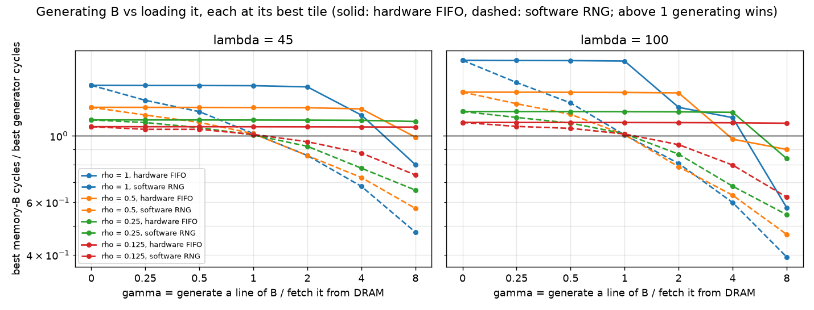
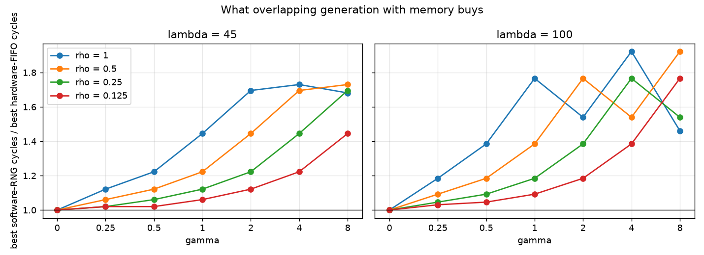
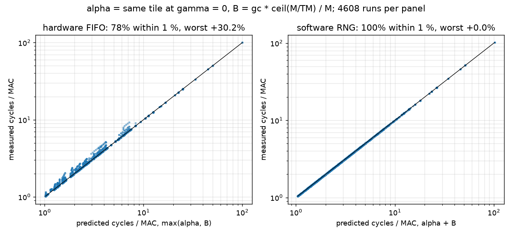

# fifo_sync: software RNG vs hardware PRNG-FIFO

Liang, Murray, Buluç, Demmel, *Fast multiplication of random dense matrices with sparse matrices* (arXiv 2310.15419) generate the random operand on the CPU core. Their cost model adds memory movement and generation, and their future work is "specialized hardware for RNG". This experiment runs both ways of generating B on the same device and compares each against loading B from memory:

- **hardware FIFO** (FIFO capacity 16384): the generator fills the FIFO while the core loads A and C, so generation overlaps memory work.
- **software RNG** (FIFO capacity 0): nothing is generated ahead; each pop waits g_c per element. This is the paper's additive model in its dense limit.

The question: how much of the FIFO's advantage over memory-B comes from not loading B, and how much from generating asynchronously?

run: `.venv/bin/python experiments/rewrite/fifo_sync.py`

## How the paper maps onto the project

Transpose their product to match ours: their  = S·A is our Cᵀ = Bᵀ·Aᵀ.

| Liang et al. | here |
|---|---|
| S, d×m, random, generated on the fly | B, K×N, from the generator |
| A, m×n, sparse with density ρ | A, M×K, dense: their density-1 limit |
| d, m, n | N, K, M |
| block d1 × m1 × n1; Algorithm 1 does not block m | T_N × K × T_M; T_K = K |
| h: cost to generate one number, in memory accesses | γ: generation cost per element over memory cost per element (a line fetch shared by 64/B_P elements) |
| cache holds the output block and the A block, S is never cached: d1·n1 + m1·n1·ρ ≤ M | C tile + A band ≤ L1, the f ≤ 1 of fifo_feasibility (which counts the C tile twice for LRU) |
| generation per MAC h/n1 | g_c·⌈M/T_M⌉/M ≈ g_c/T_M |
| cost = memory + generation | software RNG: α + B term. Hardware FIFO: max(α, B term) |
| Algorithm 3 (regenerate per use) vs Algorithm 4 (reuse a generated column) | C-stationary vs B-stationary, see `dataflow.py` |

Not carried over: sparsity (CSC/CSR, skipping empty rows), their √(hM) block-size result (it needs blocking of the inner dimension, and here T_K = K), multithreading and the least-squares application. The software mode serialises generation with blocking memory accesses; an out-of-order CPU overlaps some of it, so this is the worst case for software, not a model of their machines.

## Setup

Everything as in `fifo_feasibility` (its README defines ρ, λ, γ and f):
M, N, K = 192, 256, 128; A_P = 8 B; L1 64 KB fully associative LRU, 64 B lines, no L2; L1 hit 4 cycles; pop = one L1 hit; mulacc 0; 4×4 registers; B-stationary; `--aligned`. Swept: ρ ∈ {1, 0.5, 0.25, 0.125}, λ ∈ {45, 100}, γ ∈ {0, 0.25, 0.5, 1, 2, 4, 8}, T_M 4..96, T_N ∈ {8, 16, 32, 64}. Each side takes its best (T_M, T_N).

h = γ·λ·B_P/64 is the generation cost per element in L1-hit times.

11520 runs.

## Results

Break-even against memory-B (γ* where the speedup crosses 1, log-interpolated; `inf`: still winning at γ = 8), also in L1 hits per element:

| ρ | λ | γ* hardware FIFO | γ* software RNG | h* hardware FIFO | h* software RNG |
|---|---|---|---|---|---|
| 1 | 45 | 5.34 | 1.07 | 30.1 | 6.0 |
| 1 | 100 | 4.60 | 1.02 | 57.5 | 12.8 |
| 0.5 | 45 | 7.74 | 1.07 | 21.8 | 3.0 |
| 0.5 | 100 | 3.80 | 1.02 | 23.8 | 6.4 |
| 0.25 | 45 | inf | 1.05 | inf | 1.5 |
| 0.25 | 100 | 5.69 | 1.07 | 17.8 | 3.4 |
| 0.125 | 45 | inf | 1.14 | inf | 0.8 |
| 0.125 | 100 | inf | 1.12 | inf | 1.8 |

Speedup over memory-B at each γ (hardware / software):

| ρ | λ | γ=0 | γ=0.25 | γ=0.5 | γ=1 | γ=2 | γ=4 | γ=8 |
|---|---|---|---|---|---|---|---|---|
| 1 | 45 | 1.48 / 1.48 | 1.47 / 1.31 | 1.47 / 1.20 | 1.47 / 1.02 | 1.46 / 0.86 | 1.17 / 0.68 | 0.80 / 0.48 |
| 1 | 100 | 1.79 / 1.79 | 1.79 / 1.51 | 1.78 / 1.29 | 1.78 / 1.01 | 1.24 / 0.81 | 1.15 / 0.60 | 0.58 / 0.39 |
| 0.5 | 45 | 1.25 / 1.25 | 1.24 / 1.17 | 1.24 / 1.11 | 1.24 / 1.02 | 1.24 / 0.86 | 1.23 / 0.73 | 0.99 / 0.57 |
| 0.5 | 100 | 1.40 / 1.40 | 1.40 / 1.28 | 1.40 / 1.18 | 1.40 / 1.01 | 1.39 / 0.79 | 0.97 / 0.63 | 0.90 / 0.47 |
| 0.25 | 45 | 1.13 / 1.13 | 1.13 / 1.11 | 1.13 / 1.06 | 1.13 / 1.01 | 1.13 / 0.92 | 1.13 / 0.78 | 1.12 / 0.66 |
| 0.25 | 100 | 1.21 / 1.21 | 1.20 / 1.15 | 1.20 / 1.10 | 1.20 / 1.02 | 1.20 / 0.87 | 1.20 / 0.68 | 0.84 / 0.55 |
| 0.125 | 45 | 1.07 / 1.07 | 1.07 / 1.05 | 1.07 / 1.05 | 1.07 / 1.01 | 1.07 / 0.96 | 1.07 / 0.88 | 1.07 / 0.74 |
| 0.125 | 100 | 1.11 / 1.11 | 1.11 / 1.07 | 1.11 / 1.06 | 1.11 / 1.01 | 1.11 / 0.93 | 1.11 / 0.80 | 1.10 / 0.62 |

Best software-RNG cycles / best hardware-FIFO cycles:

| ρ | λ | γ=0 | γ=0.25 | γ=0.5 | γ=1 | γ=2 | γ=4 | γ=8 |
|---|---|---|---|---|---|---|---|---|
| 1 | 45 | 1.00 | 1.12 | 1.22 | 1.45 | 1.70 | 1.73 | 1.68 |
| 1 | 100 | 1.00 | 1.18 | 1.38 | 1.77 | 1.54 | 1.92 | 1.46 |
| 0.5 | 45 | 1.00 | 1.06 | 1.12 | 1.22 | 1.45 | 1.70 | 1.73 |
| 0.5 | 100 | 1.00 | 1.09 | 1.18 | 1.38 | 1.77 | 1.54 | 1.92 |
| 0.25 | 45 | 1.00 | 1.02 | 1.06 | 1.12 | 1.22 | 1.45 | 1.70 |
| 0.25 | 100 | 1.00 | 1.05 | 1.09 | 1.18 | 1.38 | 1.77 | 1.54 |
| 0.125 | 45 | 1.00 | 1.02 | 1.02 | 1.06 | 1.12 | 1.22 | 1.45 |
| 0.125 | 100 | 1.00 | 1.03 | 1.05 | 1.09 | 1.18 | 1.38 | 1.77 |

Tiles picked (T_M×T_N) by the software RNG, for comparison with fifo_feasibility's hardware-FIFO table:

| ρ | λ | memory | γ=0 | γ=0.25 | γ=0.5 | γ=1 | γ=2 | γ=4 | γ=8 |
|---|---|---|---|---|---|---|---|---|---|
| 1 | 45 | 48x8 | 48x16 | 48x16 | 48x16 | 48x16 | 96x64 | 96x64 | 96x64 |
| 1 | 100 | 48x8 | 48x16 | 48x16 | 48x16 | 48x16 | 96x64 | 96x64 | 96x64 |
| 0.5 | 45 | 48x8 | 48x16 | 48x16 | 48x16 | 48x16 | 48x16 | 96x64 | 96x64 |
| 0.5 | 100 | 48x8 | 48x16 | 48x16 | 48x16 | 48x16 | 48x16 | 96x64 | 96x64 |
| 0.25 | 45 | 48x8 | 48x16 | 48x16 | 48x16 | 48x16 | 48x16 | 48x16 | 96x64 |
| 0.25 | 100 | 48x8 | 48x16 | 48x16 | 48x16 | 48x16 | 48x16 | 48x16 | 96x64 |
| 0.125 | 45 | 48x8 | 48x16 | 48x16 | 48x16 | 48x16 | 48x16 | 48x16 | 48x16 |
| 0.125 | 100 | 48x8 | 48x16 | 48x16 | 48x16 | 48x16 | 48x16 | 48x16 | 48x16 |

Each run against its model, with α measured at the same tile with γ = 0:

| mode | model | runs | median abs. error | within 1 % | worst over | worst under |
|---|---|---|---|---|---|---|
| hardware FIFO | max(α, B) | 4608 | 0.10% | 78% | +30.2% | +0.0% |
| software RNG | α + B | 4608 | 0.00% | 100% | +0.0% | -0.0% |

## Reading the results

**A software RNG breaks even at γ ≈ 1; the hardware FIFO at γ ≈ 4 to 8 or
more.** Software γ* is 1.02 to 1.14 in all eight (ρ, λ) cases.
That is what the additive model predicts: at the same T_M, memory-B pays
mem·B_P/64 cycles per B element and the software RNG pays g_c, and γ is
exactly their ratio. The small excess over 1 is the L1 traffic memory-B also
spends on B. It is the paper's own condition for generating on the fly,
h < 1. The hardware FIFO breaks even at γ = 3.80 to 7.74 where
the grid reached it, and still wins at γ = 8 in 3 cases. So the FIFO's
tolerance beyond "generate faster than DRAM" comes entirely from overlapping
generation with memory work.

**Below γ = 1 software also beats memory-B, by less.** At γ = 0.5, ρ = 1:
1.20× against the hardware FIFO's 1.47× at λ = 45, and
1.29× against 1.78× at λ = 100.

**Overlap is worth up to 1.92×.** Best software cycles over best
hardware cycles grow with γ to 1.73 (λ = 45) and 1.92
(λ = 100), near 2, the most max(a, b) can save over a + b. The ratio is
(α + B) / max(α, B) at the tiles each mode picks, so it peaks where
generation and memory work take about the same time. At λ = 100 it
zigzags: when the best tile jumps from 48×16 to 96×64, α and the B term
move apart and the ratio drops before climbing again. The rows for
different ρ are the same numbers shifted one γ column per halving of B_P:
at fixed γ, g_c is proportional to B_P, and neither generator mode depends
on ρ otherwise. The gain is a function of g_c alone.

**Each cost model describes its own mode.** Software runs match α + B in all
4608 runs to within 0.0 %. Hardware runs match max(α, B) with a median error
of 0.1% and 78% within 1 %, but up to +30% near the
balance point, where the per-tile FIFO restart and bursty consumption cost
extra (see `overlap_fit`). The paper's additive model is right for a
generator that blocks the core, and max is right for a decoupled one: the
difference comes from the hardware, not the workload.

**Tile choice barely changes.** Software picks 48×16 until generation
dominates and then 96×64, one γ step earlier than the hardware FIFO at
λ = 45 and at the same step at λ = 100. Neither mode shows the paper's
√(hM) block growth, as expected without inner-dimension blocking: T_M jumps
from just below the L1 cliff to M/2.

**Caveats.** The software mode serialises generation with blocking memory
accesses, the pessimistic end for a CPU, where out-of-order execution and
prefetching hide some of each; a real software RNG sits between the two
curves. The hardware FIFO has 16384 elements, more than one tile consumes
(at most K·T_N = 8192) and it is emptied at every tile, so its capacity
never binds. A FIFO small enough to bind gives results in between.
