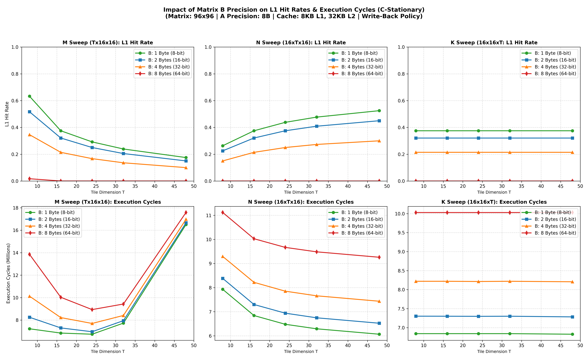

# Matrix B Precision Sweep Analysis Report

This report evaluates the performance and cache impact of varying the element precision (byte width) of **Matrix B** from 1 Byte to 8 Bytes under a **C-Stationary** loop ordering.

---

## 1. Experiment Overview
* **Matrix A Precision**: Fixed at **8 Bytes** (double-precision).
* **Matrix B Precision**: Swept through **1 Byte (8-bit)**, **2 Bytes (16-bit)**, **4 Bytes (32-bit)**, and **8 Bytes (64-bit)**.
* **Loop Structure**: **C-Stationary** (innermost loop is the reduction dimension $K$).
* **Cache Architecture**: L1 Cache: 8 KB (4-way assoc, 8B lines) | L2 Cache: 32 KB (8-way assoc, 8B lines) | Write-Back Policy.
* **Sweep Range**: Tile sizes $T \in [8, 16, 24, 32, 48]$ along $M$, $N$, and $K$ dimensions.

---

## 2. Experimental Data

### A. L1 Cache Hit Rates (K Sweep: 16x16xT)
| Tile Size T | B: 1 Byte (8-bit) | B: 2 Bytes (16-bit) | B: 4 Bytes (32-bit) | B: 8 Bytes (64-bit) |
| :---: | :---: | :---: | :---: | :---: |
| **8**  | 0.375 | 0.321 | 0.214 | 0.000 |
| **16** | 0.375 | 0.321 | 0.214 | 0.000 |
| **24** | 0.375 | 0.321 | 0.214 | 0.000 |
| **32** | 0.375 | 0.321 | 0.214 | 0.000 |
| **48** | 0.375 | 0.321 | 0.214 | 0.000 |

### B. Execution Cycles (Millions)

#### M Sweep (Tx16x16)
| Tile Size T | B: 1 Byte (8-bit) | B: 2 Bytes (16-bit) | B: 4 Bytes (32-bit) | B: 8 Bytes (64-bit) |
| :---: | :---: | :---: | :---: | :---: |
| **8**  | 7.223M | 8.251M | 10.127M | 13.856M |
| **16** | 6.841M | 7.300M | 8.219M  | 10.028M |
| **24** | 6.739M | 6.960M | 7.698M  | 8.932M  |
| **32** | 7.727M | 7.946M | 8.409M  | 9.428M  |
| **48** | 16.509M | 16.661M | 16.976M | 17.585M |

#### N Sweep (16xTx16)
| Tile Size T | B: 1 Byte (8-bit) | B: 2 Bytes (16-bit) | B: 4 Bytes (32-bit) | B: 8 Bytes (64-bit) |
| :---: | :---: | :---: | :---: | :---: |
| **8**  | 7.930M | 8.384M | 9.295M | 11.120M |
| **16** | 6.841M | 7.300M | 8.219M | 10.028M |
| **24** | 6.479M | 6.940M | 7.852M | 9.669M  |
| **32** | 6.291M | 6.748M | 7.660M | 9.485M  |
| **48** | 6.066M | 6.523M | 7.435M | 9.260M  |

#### K Sweep (16x16xT)
| Tile Size T | B: 1 Byte (8-bit) | B: 2 Bytes (16-bit) | B: 4 Bytes (32-bit) | B: 8 Bytes (64-bit) |
| :---: | :---: | :---: | :---: | :---: |
| **8**  | 6.841M | 7.301M | 8.219M | 10.028M |
| **16** | 6.841M | 7.300M | 8.219M | 10.028M |
| **24** | 6.841M | 7.297M | 8.214M | 10.028M |
| **32** | 6.841M | 7.300M | 8.219M | 10.028M |
| **48** | 6.826M | 7.283M | 8.206M | 10.031M |

---

## 3. Analysis & Key Findings

### 1. Spatial Locality and B Precision
* **Zero Spatial Locality for 8B Precision**: When the precision of $B$ is **8 Bytes**, both L1 and L2 cache lines (8 Bytes wide) can hold exactly **one element** of $B$. Because one cache line contains only one element, there is zero spatial reuse on $B$. Combined with 8B precisions for $A$ and $C$, the simulator registers **exactly 0.0% L1 cache hits** across all tile sizes.
* **Increasing Spatial Reuse**: By reducing the precision of B, more elements fit inside a single cache line:
  * **4 Bytes (32-bit)**: 2 elements per line $\rightarrow$ **21.4%** L1 hit rate.
  * **2 Bytes (16-bit)**: 4 elements per line $\rightarrow$ **32.1%** L1 hit rate.
  * **1 Byte (8-bit)**: 8 elements per line $\rightarrow$ **37.5%** L1 hit rate.
  This validates that asymmetric precision matrix multiplication yields significant spatial caching benefits.

### 2. Substantial Performance Savings
* Reducing B's element width directly scales down execution cycles:
  * Going from **8B (double-precision) to 1B (8-bit integers)** saves **~3.2 million cycles** (a **1.46x speedup** or 32% execution time reduction).
  * Going from **2B (half-precision) to 1B (8-bit)** saves **~460,000 cycles** (a **1.07x speedup**).
* This performance gain comes from:
  1. Fewer cache line fills and memory read requests to main memory.
  2. Lower PRNG device regeneration overhead (generating a B tile requires fewer cache lines, reducing generation cycles).

### 3. Constant K-Sweep Profiles
* As expected, in the K-sweep, both the L1 hit rate and the cycles are **perfectly flat** across all values of $T$ (reduction tile size). This is because in C-stationary ordering, $K$ is the innermost loop, so changing $T$ does not alter the sequential address stream accessed.
* However, the M and N sweeps show standard tiling footprint behavior, with smaller $M$ and larger $N$ tiles optimizing cache hit rates.
