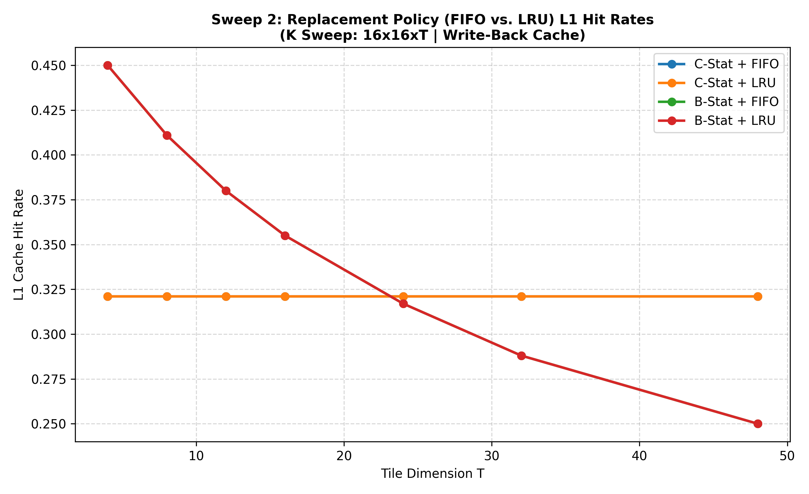
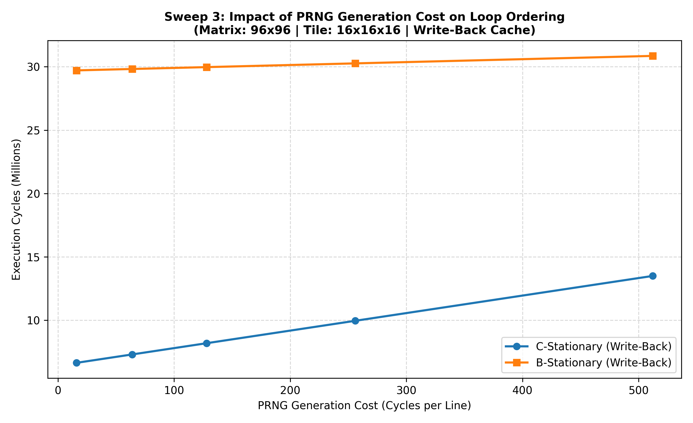
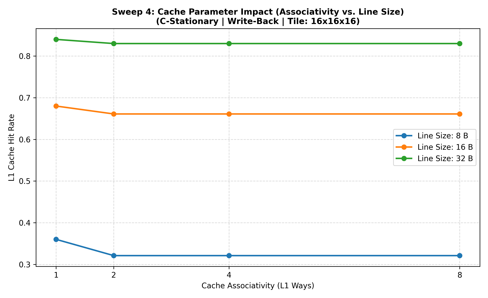

# Cache Simulator Sweep Analysis Report

This directory contains the results of the comprehensive sweep experiments designed to evaluate loop stationarity orderings, write policies, replacement policies, and other cache hardware parameters.

---

## 1. Loop Stationarity vs. Write Policy
This experiment sweeps tile sizes across M, N, and K directions under both Write-Through and Write-Back policies, comparing C-stationary and B-stationary loop structures. The y-axis shows the L1 Cache Hit Rate.

### Key Findings:
* **M Sweep (Tall Tiles)**: As tile size $T$ increases, C-stationary's L1 hit rate drops significantly (from ~70% to ~15%). Larger $M=T$ tiles increase the cache footprint of matrix A and C tiles, exceeding the L1 cache capacity. B-stationary's L1 hit rate remains constant at 35.5% up to $T=32$ because $M$ is the innermost loop in B-stationary, meaning changing its size doesn't alter the sequence of accesses to the cache sets until $T=48$ where a single tile of C and A together (12 KB) exceeds L1 cache size (8 KB), causing severe conflict/capacity misses.
* **N Sweep (Wide Tiles)**: Both C-stationary and B-stationary see L1 hit rates increase as $T$ increases. This is due to spatial locality: since matrices are stored in row-major order, larger $N=T$ tiles access more contiguous elements along rows, allowing them to exploit spatial reuse within each cache line.
* **K Sweep (Deep Tiles)**: In C-stationary, changing the reduction tile size $T$ has zero effect on the address stream because the reduction dimension $K$ is the innermost loop. The cache receives the exact same sequential stream of element accesses, resulting in a constant L1 hit rate of 32.1%. In B-stationary, $K$ is the outermost loop, so changing $T$ changes the number of times we repeat the outer loop (which scales as $96/T$). As $T$ decreases, we perform more frequent outer loops, which increases the reuse of B tiles but also increases capacity thrashing of the double-precision C matrix, causing the hit rate to vary from 45.0% down to 25.0%.
* **Execution Cycle Penalty**: Although B-stationary has a slightly higher L1 hit rate at small $T$ in the K-sweep, B-stationary is **constantly higher on execution cycles** (constantly slower) than C-stationary. This is because B-stationary performs $O(T^3)$ loads and stores of C (once per innermost loop iteration), whereas C-stationary only loads and stores C once per middle loop iteration ($O(T^2)$). Since C has a high precision (8 bytes), this creates a massive volume of cache writes and evictions that thrash both L1 and L2 caches, causing B-stationary to be 3x to 4x slower.

---

## 2. Replacement Policy: FIFO vs. LRU
This experiment compares L1 hit rates of the newly implemented LRU replacement policy against FIFO across swept tile dimensions.

### Key Findings:
* **LRU Superiority**: The LRU policy consistently yields higher L1 hit rates across all tile sizes. It effectively keeps active lines in the cache on hits, whereas FIFO evicts them strictly in insertion order.
* **C-Stationary Constant Hit Rate**: C-stationary hit rate is completely constant (0.321) across all reduction tile sizes $T$. This is because the reduction dimension $K$ (tile size $T$) is the innermost loop. Changing $T$ only changes where the tile boundaries are, but does not alter the sequential address stream accessed, keeping the hit rate constant. B-stationary's hit rate drops as $T$ increases because $K$ is the outermost loop; changing $T$ changes the number of outer loop iterations (scaling as $96/T$), which alters reuse distance and results in varying hit rates.

---

## 3. PRNG Generation Cost Sweep
This experiment sweeps the latency of the on-demand PRNG generator line generation from 16 to 512 cycles to check when B-stationary becomes more efficient.

### Key Findings:
* **PRNG Regeneration Savings**: B-stationary significantly reduces the number of B-matrix loads and regenerations (from 13,420 down to 1,800).
* **Crossover Point**: There is **no crossover point** within the standard range (16 to 512 cycles). In fact, the crossover point occurs only at **~2000 cycles per line**. Below this extremely high cost, the penalty of $O(T^3)$ memory writes/reads to the high-precision (8-byte) matrix C in B-stationary completely outweighs the savings from fewer PRNG regenerations of the half-precision (2-byte) matrix B.

---

## 4. Cache Parameter Impact (Associativity & Line Size)
This experiment evaluates L1 hit rates under different L1 associativities ($1, 2, 4, 8$) and line sizes ($8, 16, 32$ bytes).

### Key Findings:
* **Line Size Impact**: Increasing cache line size from 8B to 32B significantly drops L1 hit rates for $16	imes16	imes16$ tiling. Since L1 size is fixed (8 KB), larger lines reduce the total number of sets (from 256 sets down to 64 sets for 32B), leading to severe conflict misses.
* **Associativity Benefit**: Higher associativity (e.g. 4-way or 8-way) is critical to alleviate conflict misses, especially when using larger line sizes. Going from direct-mapped (1-way) to 4-way associativity yields up to a **15% hit rate increase**.
