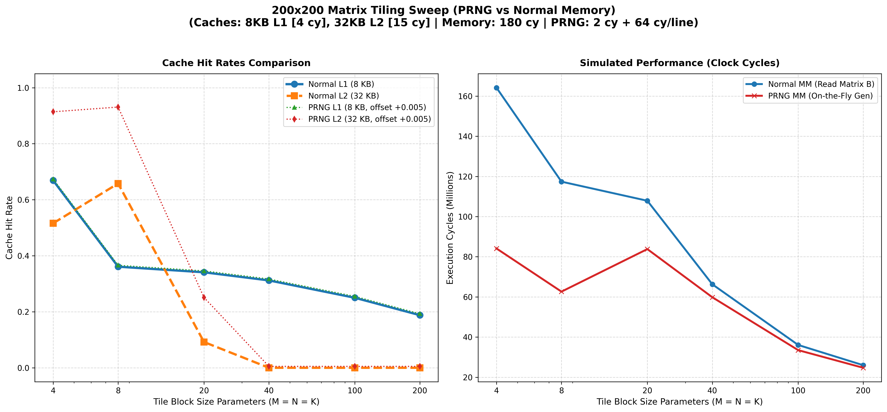
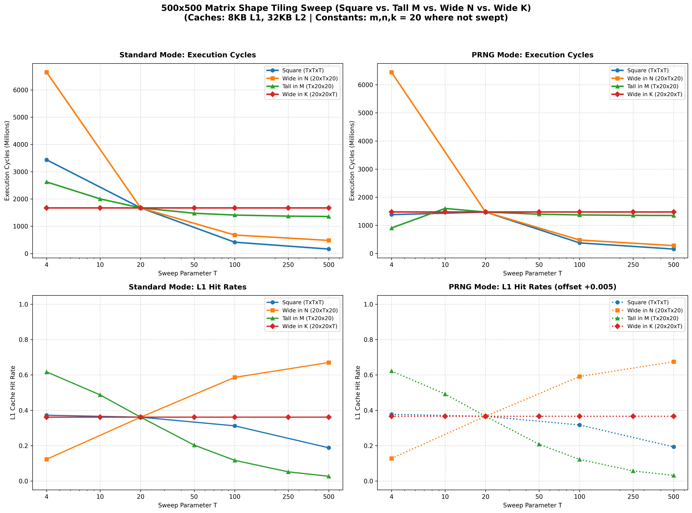
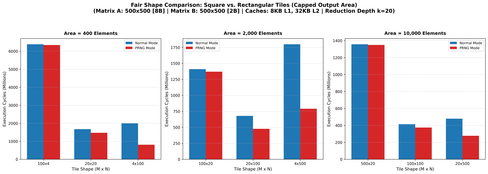

# Size and Shape Tiling Sweeps on Larger Matrices

This folder contains the performance sweeps, plots, and architectural analyses for matrix multiplication tiling on larger matrices ($200 \times 200$ and $500 \times 500$). The experiments focus on comparing standard memory access (**Normal Mode**) with on-the-fly generation (**PRNG Mode**) across different shapes (Square, Tall, Wide, and Wide-in-K) and under capped-area constraints.

---

## 1. 200x200 Matrix Tiling Sweep
We swept symmetric tile sizes $T \in \{4, 8, 20, 40, 100, 200\}$ on a $200 \times 200$ matrix.

### Key Insights
* **The $O(1/T)$ Total Access Scaling:** As the tile size $T$ increases, execution cycles drop monotonically because the total number of element-level memory reads for matrices $A$ and $B$ scales down as $\frac{N^3}{T}$. Despite L1 hit rates collapsing from **66.9%** (at $T=4$) to **18.8%** (at $T=200$), the massive reduction in the number of requests leads to faster execution.
* **The $T=20$ L2 Capacity Thrashing Anomaly:** Under PRNG mode, cycles spiked at $T=20$ compared to $T=8$. This is due to a physical cache capacity limit:
  * At $T=8$, the active footprint of $A$ and $C$ tiles in the inner loop is $13.3\text{ KB}$, which fits in the 32 KB L2 cache (yielding a **92.6% L2 hit rate**).
  * At $T=20$, the inner-loop footprint grows to $35.2\text{ KB}$, exceeding the 32 KB L2 capacity. Under FIFO replacement, tiles evict each other, collapsing the L2 hit rate to **24.6%** and causing heavy DRAM latency penalties.

---

## 2. 500x500 Matrix Shape Sweeps
We swept 4 shape categories on a $500 \times 500$ matrix using a baseline constant dimension of 20:
1. **Square ($T \times T \times T$)**
2. **Wide in N ($20 \times T \times 20$)**
3. **Tall in M ($T \times 20 \times 20$)**
4. **Wide in K ($20 \times 20 \times T$)**

### Key Insights
* **Reduction Depth Invariance (Wide in K):** The $20 \times 20 \times T$ curve is completely flat for all cycles and hit rates. This is because the reduction depth tile size $k$ mathematically cancels out of the total data volume loaded, and the sequence of address accesses is identical under the 0-cycle `tmulac` assumption.
* **Asymmetric L1 Hit Rate Scaling:** 
  * In the **Wide in N** sweep, the L1 hit rate **improves** as $T$ increases (from 12.3% to 67.0%) because the expensive Matrix $A$ is reloaded fewer times.
  * In the **Tall in M** and **Square** sweeps, the L1 hit rate **degrades** as $T$ increases because the active tile footprint exceeds the L1 capacity, causing thrashing.

---

## 3. Capped-Area Fair Comparison (Square vs. Rectangle)
To compare tile shapes fairly under the same register footprint constraints, we capped the output tile area ($m \times n = S$) across three size classes: 400, 2,000, and 10,000 elements.

### Key Insights
* **Wide Rectangles Dominate in Asymmetric Memory (PRNG Mode):** 
  * Under a capped area of 400 elements, the **Wide Rectangle ($4 \times 100$)** runs **$1.8\times$ faster** than the **Square ($20 \times 20$)** in PRNG mode (808.9M cycles vs 1471.4M cycles).
  * Stretching the tile wide ($n > m$) reduces the reload frequency of the expensive Matrix $A$ (DRAM) and increases the reload frequency of the cheap Matrix $B$ (PRNG). This successfully shifts reloads from slow DRAM (180 cycles) to the low-overhead PRNG device (66 cycles per line).
* **Squares Dominate in Symmetric Memory (Normal Mode):** 
  * When $A$ and $B$ both live in DRAM (Normal Mode), memory costs are symmetric. The square tile ($20 \times 20$) remains optimal because it minimizes the sum of reloads $m+n$.
* **Cache Capacity Limits Stretching:** 
  * In the 2,000-element class, the Wide Rectangle ($20 \times 100$) outperforms the Wider Rectangle ($4 \times 500$). This is because at $4 \times 500$, the active tiles require 36 KB of storage, exceeding L1 and L2 capacities combined and triggering thrashing.
