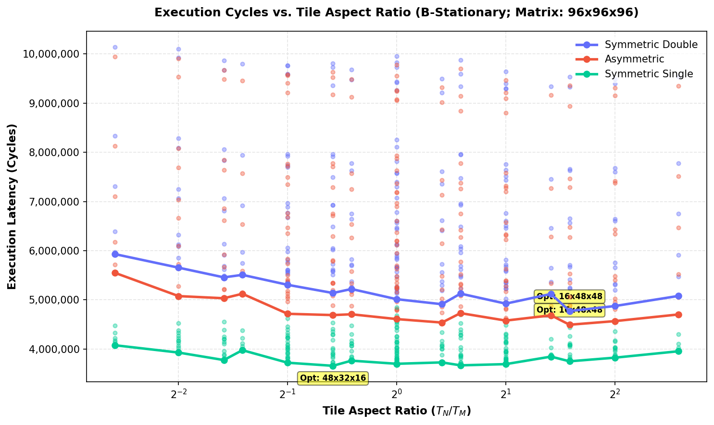

# B-Stationary Tile Shape Optimization Sweep

This directory contains empirical tile shape sweeps under **B-stationary** loop ordering for a **$96 \times 96 \times 96$ matrix** multiplication, sweeping tile dimensions $T_M, T_N, T_K \in \{8, 12, 16, 24, 32, 48\}$.

## 1. Optimal Tile Shapes (B-Stationary)

### Symmetric Double Precision (B-Stationary)

#### Top 5 Optimal Tile Shapes

| Rank | Tile Shape ($T_M \times T_N \times T_K$) | Ratio ($T_N/T_M$) | Footprint (KB) | L1 Hit Rate | L2 Hit Rate | DRAM Traffic (KB) | Total Cycles |
| :---: | :---: | :---: | :---: | :---: | :---: | :---: | :---: |
| 1 | 16x48x48 | 3.000 | 30.0 KB | 0.982 | 0.645 | 655.9 KB | 4,773,564 |
| 2 | 12x48x48 | 4.000 | 27.0 KB | 0.980 | 0.683 | 655.8 KB | 4,874,440 |
| 3 | 24x32x48 | 1.333 | 27.0 KB | 0.982 | 0.579 | 777.0 KB | 4,911,516 |
| 4 | 24x48x48 | 2.000 | 36.0 KB | 0.976 | 0.761 | 714.8 KB | 4,923,104 |
| 5 | 24x24x48 | 1.000 | 22.5 KB | 0.981 | 0.591 | 811.1 KB | 5,013,536 |

#### Bottom 3 Worst Tile Shapes

| Rank | Tile Shape ($T_M \times T_N \times T_K$) | Ratio ($T_N/T_M$) | Footprint (KB) | L1 Hit Rate | L2 Hit Rate | DRAM Traffic (KB) | Total Cycles |
| :---: | :---: | :---: | :---: | :---: | :---: | :---: | :---: |
| 214 | 8x8x8 | 1.000 | 1.5 KB | 0.971 | 0.620 | 1952.0 KB | 9,955,484 |
| 215 | 48x12x8 | 0.250 | 8.2 KB | 0.929 | 0.820 | 1952.0 KB | 10,102,396 |
| 216 | 48x8x8 | 0.167 | 6.5 KB | 0.937 | 0.802 | 1952.0 KB | 10,135,024 |

**Key Takeaway (B-stationary):** The optimal shape is **$16\times48\times48$** (ratio = **3.000**). The worst shape is **$48\times8\times8$**, causing a **2.12x slowdown**.

---

### Asymmetric Precision (B-Stationary)

#### Top 5 Optimal Tile Shapes

| Rank | Tile Shape ($T_M \times T_N \times T_K$) | Ratio ($T_N/T_M$) | Footprint (KB) | L1 Hit Rate | L2 Hit Rate | DRAM Traffic (KB) | Total Cycles |
| :---: | :---: | :---: | :---: | :---: | :---: | :---: | :---: |
| 1 | 16x48x48 | 3.000 | 16.5 KB | 0.990 | 0.511 | 537.0 KB | 4,494,624 |
| 2 | 24x32x48 | 1.333 | 18.0 KB | 0.989 | 0.516 | 579.0 KB | 4,538,714 |
| 3 | 12x48x48 | 4.000 | 13.5 KB | 0.990 | 0.505 | 538.8 KB | 4,567,768 |
| 4 | 24x48x48 | 2.000 | 22.5 KB | 0.981 | 0.780 | 531.6 KB | 4,578,886 |
| 5 | 32x32x48 | 1.000 | 23.0 KB | 0.981 | 0.732 | 572.2 KB | 4,609,364 |

#### Bottom 3 Worst Tile Shapes

| Rank | Tile Shape ($T_M \times T_N \times T_K$) | Ratio ($T_N/T_M$) | Footprint (KB) | L1 Hit Rate | L2 Hit Rate | DRAM Traffic (KB) | Total Cycles |
| :---: | :---: | :---: | :---: | :---: | :---: | :---: | :---: |
| 214 | 8x8x8 | 1.000 | 1.1 KB | 0.972 | 0.633 | 1844.0 KB | 9,780,596 |
| 215 | 48x12x8 | 0.250 | 7.7 KB | 0.932 | 0.824 | 1845.0 KB | 9,901,274 |
| 216 | 48x8x8 | 0.167 | 6.1 KB | 0.940 | 0.807 | 1844.0 KB | 9,939,184 |

**Key Takeaway (B-stationary):** The optimal shape is **$16\times48\times48$** (ratio = **3.000**). The worst shape is **$48\times8\times8$**, causing a **2.21x slowdown**.

---

### Symmetric Single Precision (B-Stationary)

#### Top 5 Optimal Tile Shapes

| Rank | Tile Shape ($T_M \times T_N \times T_K$) | Ratio ($T_N/T_M$) | Footprint (KB) | L1 Hit Rate | L2 Hit Rate | DRAM Traffic (KB) | Total Cycles |
| :---: | :---: | :---: | :---: | :---: | :---: | :---: | :---: |
| 1 | 48x32x16 | 0.667 | 11.0 KB | 0.992 | 0.812 | 155.8 KB | 3,659,600 |
| 2 | 32x48x16 | 1.500 | 11.0 KB | 0.992 | 0.810 | 158.8 KB | 3,668,912 |
| 3 | 48x32x48 | 0.667 | 21.0 KB | 0.993 | 0.645 | 220.0 KB | 3,669,816 |
| 4 | 32x48x48 | 1.500 | 21.0 KB | 0.994 | 0.587 | 236.2 KB | 3,691,576 |
| 5 | 24x48x16 | 2.000 | 9.0 KB | 0.993 | 0.805 | 156.1 KB | 3,693,512 |

#### Bottom 3 Worst Tile Shapes

| Rank | Tile Shape ($T_M \times T_N \times T_K$) | Ratio ($T_N/T_M$) | Footprint (KB) | L1 Hit Rate | L2 Hit Rate | DRAM Traffic (KB) | Total Cycles |
| :---: | :---: | :---: | :---: | :---: | :---: | :---: | :---: |
| 214 | 8x12x8 | 1.500 | 1.0 KB | 0.981 | 0.940 | 152.0 KB | 4,696,742 |
| 215 | 12x8x8 | 0.667 | 1.0 KB | 0.980 | 0.941 | 152.0 KB | 4,702,286 |
| 216 | 8x8x8 | 1.000 | 0.8 KB | 0.981 | 0.941 | 152.0 KB | 4,850,414 |

**Key Takeaway (B-stationary):** The optimal shape is **$48\times32\times16$** (ratio = **0.667**). The worst shape is **$8\times8\times8$**, causing a **1.33x slowdown**.

---

## 2. B-Stationary vs. C-Stationary Shape Comparison

Below is a direct comparison of the optimal shapes found under C-stationary and B-stationary orderings:

| Precision Config | Ordering | Optimal Shape ($T_M \times T_N \times T_K$) | Ratio ($T_N/T_M$) | Footprint (KB) | Total Cycles | Slowdown (vs C-stat) |
| :--- | :---: | :---: | :---: | :---: | :---: | :---: |
| **Symmetric Double** | C-stationary | N/A | 0.000 | 0.0 KB | 0 | - |
| | B-stationary | 16x48x48 | 3.000 | 30.0 KB | 4,773,564 | N/A |
| **Asymmetric** | C-stationary | N/A | 0.000 | 0.0 KB | 0 | - |
| | B-stationary | 16x48x48 | 3.000 | 16.5 KB | 4,494,624 | N/A |
| **Symmetric Single** | C-stationary | N/A | 0.000 | 0.0 KB | 0 | - |
| | B-stationary | 48x32x16 | 0.667 | 11.0 KB | 3,659,600 | N/A |

## 3. Physical Analysis of the Shifts

### 3.1 Why B-Stationary Prefers Wider Tile Shapes (16x48x48)
Under **B-stationary** loop ordering, B is loaded once per tile and held stationary in the middle loop while the innermost loop sweeps through rows of A and C ($M_{\text{tiles}}$ steps). 

1. **Maximizing B Reuse**: To get maximum reuse out of B's loaded tile, we want the innermost loop to execute as many steps as possible. The inner loop iteration count is $M_{\text{tiles}} = H_A / T_M$. To make $M_{\text{tiles}}$ large, we must keep $T_M$ small (e.g. $16$ or $12$).
2. **Minimizing C Spill Overhead**: C is loaded and stored inside the innermost loop. The total number of times C is read from and written back to cache/memory scales with the outer loop count $K_{\text{tiles}} = W_A / T_K$. To minimize C spills, we need a small outer loop count, forcing $T_K$ to be as large as possible ($48$).
3. **Minimizing A Reloads**: A is loaded in the innermost loop. To minimize A reloads across the middle loop iterations ($N_{\text{tiles}} = W_B / T_N$), we want $T_N$ to be large ($48$).

This push toward small $T_M$ and large $T_N, T_K$ explains why the optimal shape for Symmetric Double and Asymmetric configurations shifts to **$16 \times 48 \times 48$** (aspect ratio = **3.000**).

### 3.2 Shift in Symmetric Single Precision (48x32x16)
In the **Symmetric Single** precision configuration ($A,B,C=4B$), the cache footprint is halved. The active working set of a $48 \times 32 \times 16$ tile is only 11.0 KB, which fits entirely within the 16 KB L1 cache. Because the data stays local to L1, the overhead of C spills becomes negligible (hitting in L1 in 4 cycles). Performance is instead dominated by minimizing loop and index calculation overhead, which favors larger $T_M = 48$ and $T_N = 32$ dimensions to maximize spatial locality.

### 3.3 Core Ordering Performance Comparison
Across all three precision configurations, the optimal shape under B-stationarity is **1.25x to 1.45x slower** than the optimal shape under C-stationarity. Even with ideal tile shape choices, B-stationarity remains architectural inferior due to its persistent register spills and increased L1 Tag Lookup frequency.

