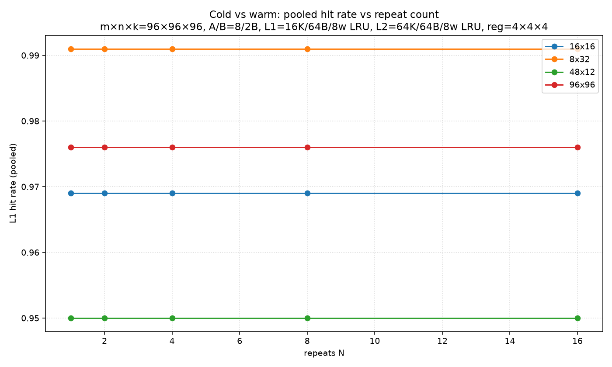
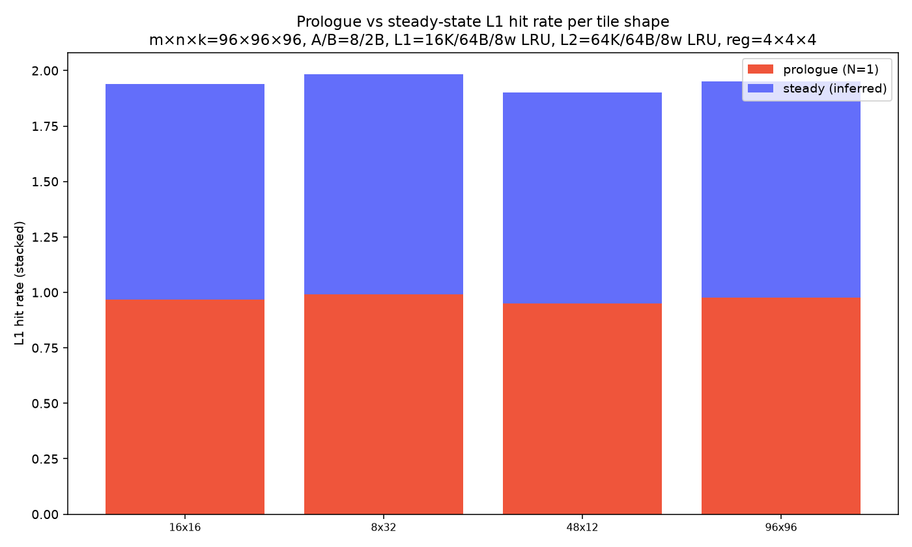

# cold-vs-warm

# cold-vs-warm

## Inferred steady-state vs prologue

| tile | prologue (N=1) | steady (inferred) |
|---|---|---|
| 16x16 | 0.969 | 0.969 |
| 8x32 | 0.991 | 0.991 |
| 48x12 | 0.950 | 0.950 |
| 96x96 | 0.976 | 0.976 |