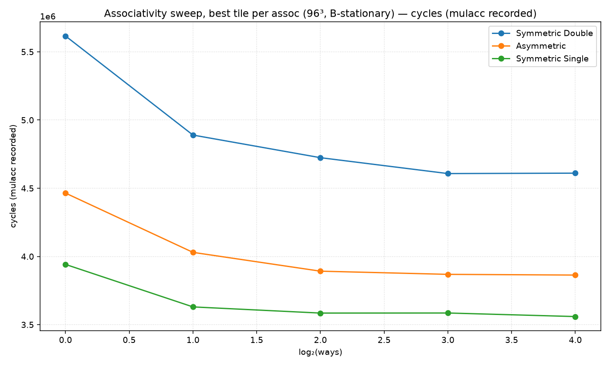
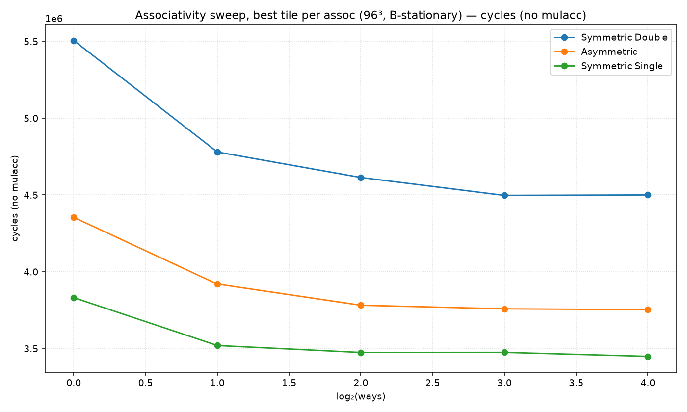
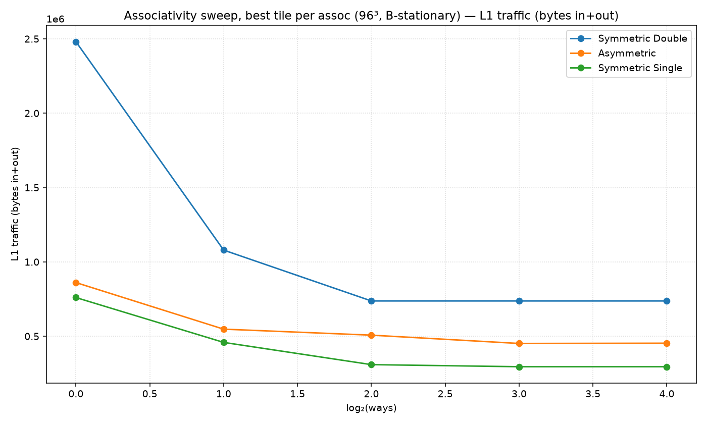
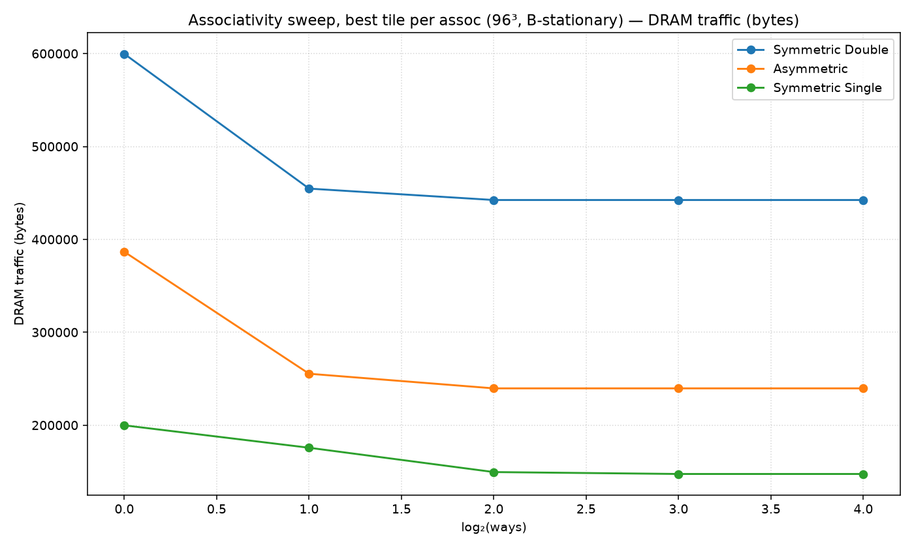
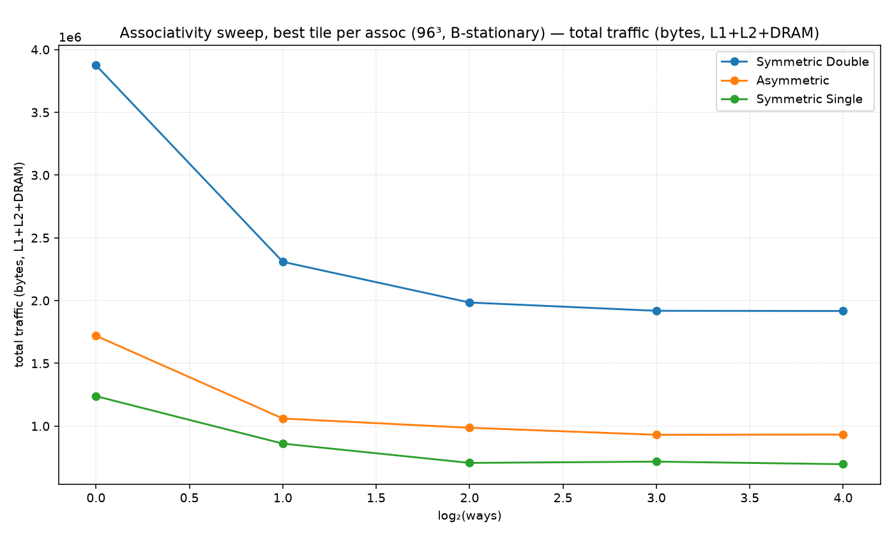

# Associativity sweep, best tile per assoc (96³, B-stationary)

Non-default config: (all defaults)

Each x point takes the best (minimum) value over all tile shapes.

## Best cell per metric

| metric | precision | assoc | tile (M×N×K) | value |
|---|---|---|---|---|
| cycles | Symmetric Double | 8-way | 16×32×96 | 4,607,560 |
| cycles | Asymmetric | 16-way | 12×96×96 | 3,863,568 |
| cycles | Symmetric Single | 16-way | 16×96×96 | 3,559,392 |
| cycles_nomulacc | Symmetric Double | 8-way | 16×32×96 | 4,496,968 |
| cycles_nomulacc | Asymmetric | 16-way | 12×96×96 | 3,752,976 |
| cycles_nomulacc | Symmetric Single | 16-way | 16×96×96 | 3,448,800 |
| l1_traffic | Symmetric Double | 4-way | 8×32×32 | 737,280 |
| l1_traffic | Asymmetric | 8-way | 12×96×96 | 451,328 |
| l1_traffic | Symmetric Single | 8-way | 8×32×48 | 294,912 |
| l2_traffic | Symmetric Double | 4-way | 8×32×96 | 442,368 |
| l2_traffic | Asymmetric | 4-way | 8×96×96 | 239,616 |
| l2_traffic | Symmetric Single | 8-way | 8×8×8 | 147,456 |
| dram_traffic | Symmetric Double | 4-way | 8×32×96 | 442,368 |
| dram_traffic | Asymmetric | 4-way | 8×96×96 | 239,616 |
| dram_traffic | Symmetric Single | 8-way | 8×8×8 | 147,456 |
| total_traffic | Symmetric Double | 16-way | 8×32×32 | 1,916,928 |
| total_traffic | Asymmetric | 8-way | 12×96×96 | 930,560 |
| total_traffic | Symmetric Single | 16-way | 8×48×32 | 696,320 |