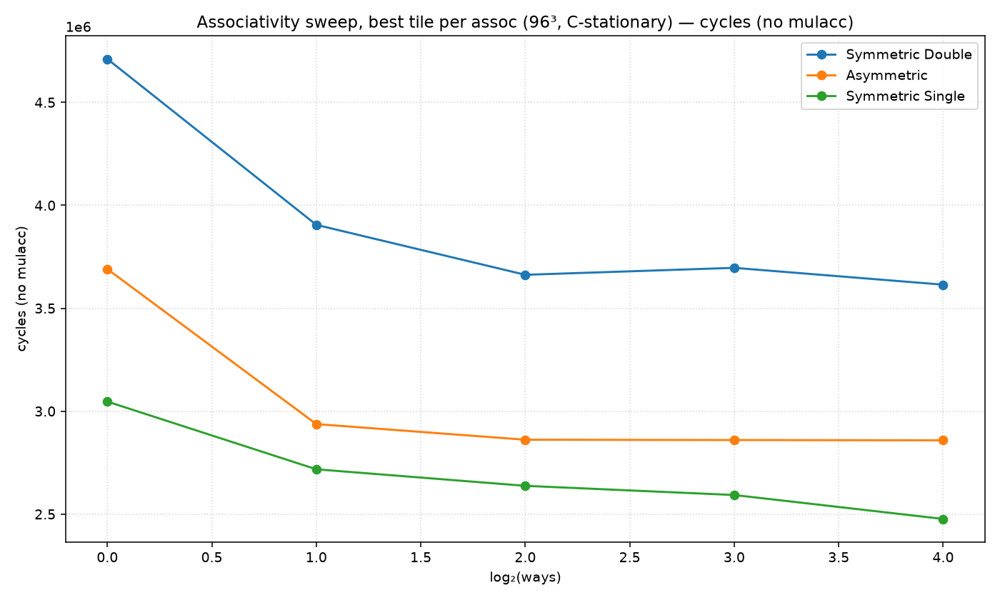
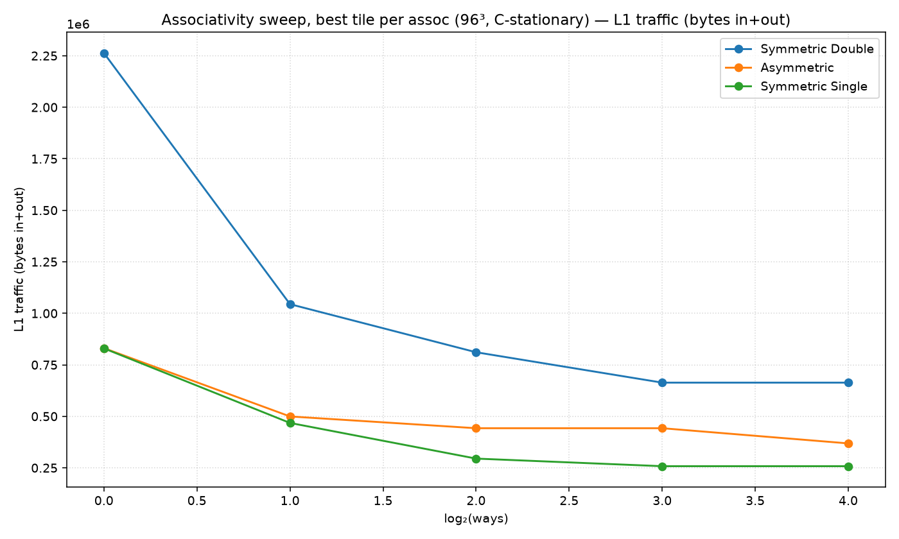
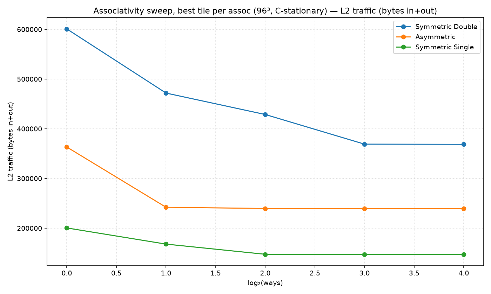
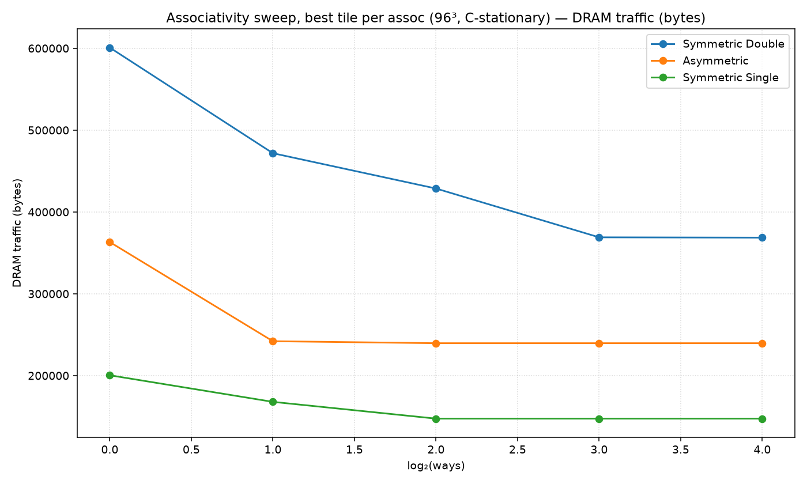
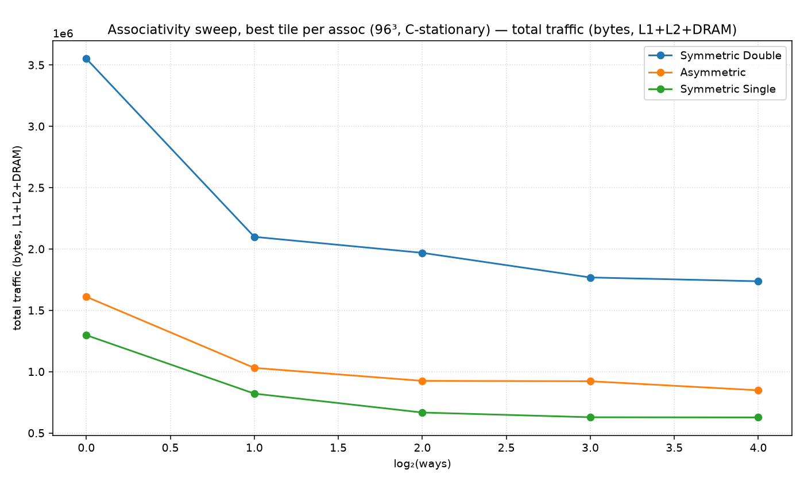

# Associativity sweep, best tile per assoc (96³, C-stationary)

Non-default config: (all defaults)

Each x point takes the best (minimum) value over all tile shapes.

## Best cell per metric

| metric | precision | assoc | tile (M×N×K) | value |
|---|---|---|---|---|
| cycles | Symmetric Double | 16-way | 48×16×32 | 3,725,120 |
| cycles | Asymmetric | 16-way | 24×96×96 | 2,969,148 |
| cycles | Symmetric Single | 16-way | 96×32×96 | 2,587,168 |
| cycles_nomulacc | Symmetric Double | 16-way | 48×16×32 | 3,614,528 |
| cycles_nomulacc | Asymmetric | 16-way | 24×96×96 | 2,858,556 |
| cycles_nomulacc | Symmetric Single | 16-way | 96×32×96 | 2,476,576 |
| l1_traffic | Symmetric Double | 8-way | 24×32×8 | 663,552 |
| l1_traffic | Asymmetric | 16-way | 12×96×8 | 368,640 |
| l1_traffic | Symmetric Single | 8-way | 32×48×8 | 258,048 |
| l2_traffic | Symmetric Double | 16-way | 48×8×32 | 368,640 |
| l2_traffic | Asymmetric | 4-way | 8×8×8 | 239,616 |
| l2_traffic | Symmetric Single | 4-way | 8×8×32 | 147,456 |
| dram_traffic | Symmetric Double | 16-way | 48×8×32 | 368,640 |
| dram_traffic | Asymmetric | 4-way | 8×8×8 | 239,616 |
| dram_traffic | Symmetric Single | 4-way | 8×8×32 | 147,456 |
| total_traffic | Symmetric Double | 16-way | 24×32×8 | 1,736,576 |
| total_traffic | Asymmetric | 16-way | 12×96×8 | 847,872 |
| total_traffic | Symmetric Single | 16-way | 16×96×8 | 626,688 |