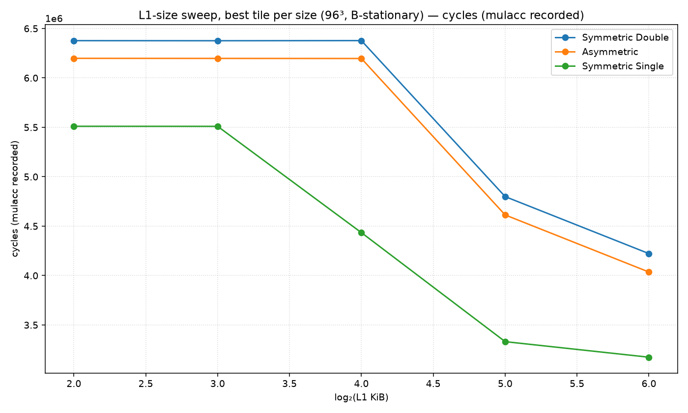
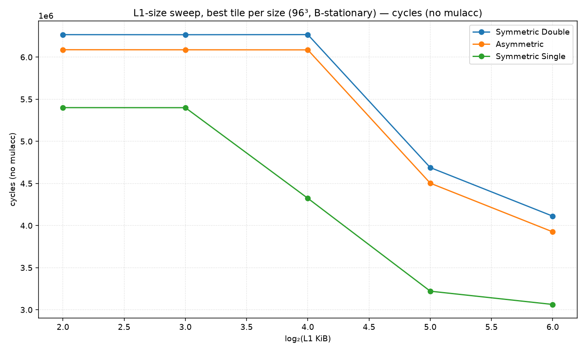
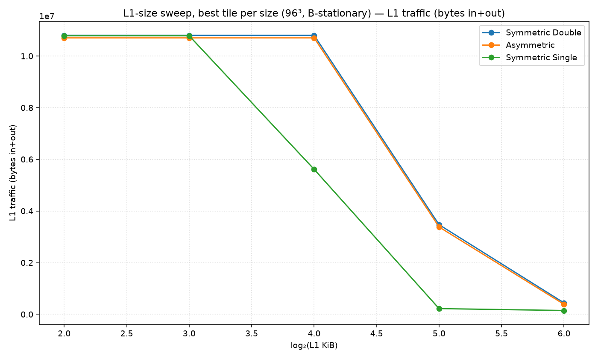
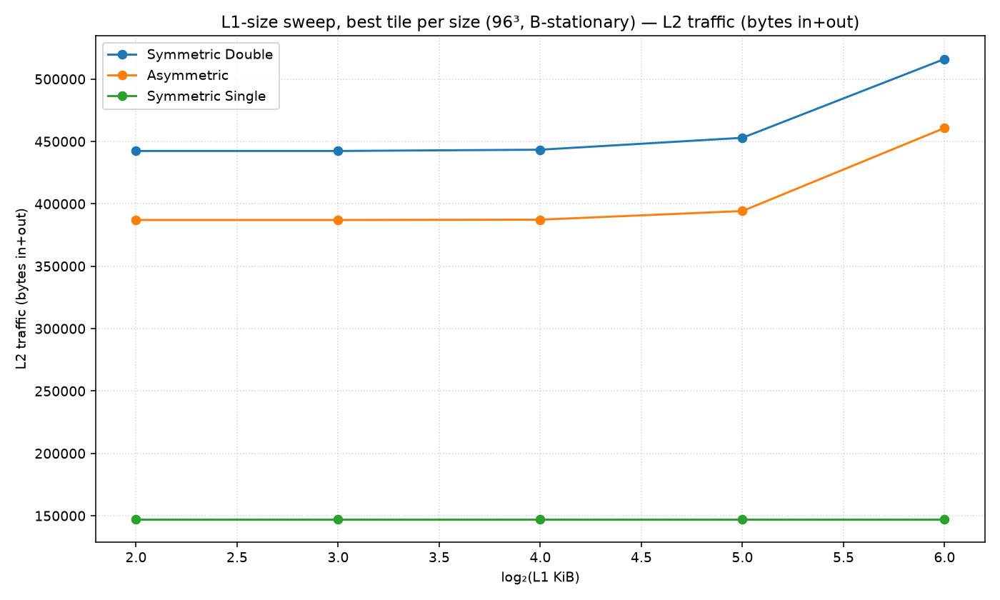
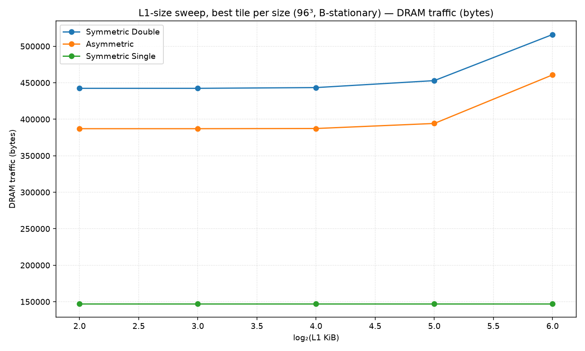
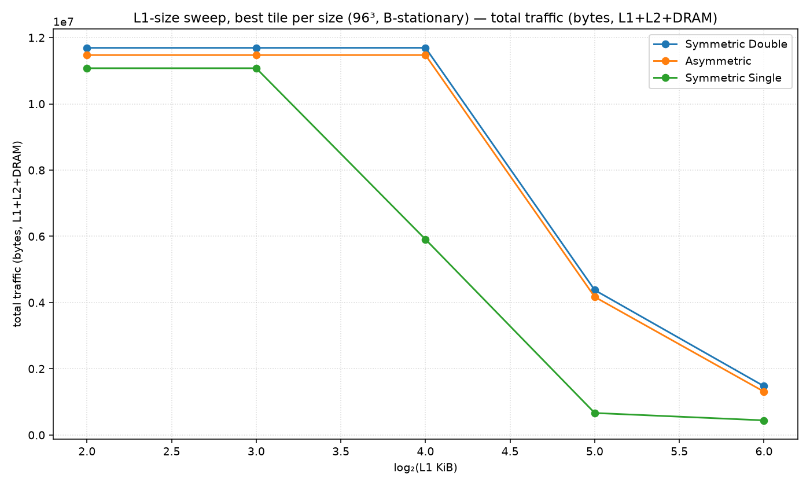

# L1-size sweep, best tile per size (96³, B-stationary)

Non-default config: (all defaults)

Each x point takes the best (minimum) value over all tile shapes.

## Best cell per metric

| metric | precision | L1 | tile (M×N×K) | value |
|---|---|---|---|---|
| cycles | Symmetric Double | L1=64K | 8×32×8 | 4,222,140 |
| cycles | Asymmetric | L1=64K | 8×32×8 | 4,035,804 |
| cycles | Symmetric Single | L1=64K | 8×96×8 | 3,173,760 |
| cycles_nomulacc | Symmetric Double | L1=64K | 8×32×8 | 4,111,548 |
| cycles_nomulacc | Asymmetric | L1=64K | 8×32×8 | 3,925,212 |
| cycles_nomulacc | Symmetric Single | L1=64K | 8×96×8 | 3,063,168 |
| l1_traffic | Symmetric Double | L1=64K | 8×32×8 | 442,368 |
| l1_traffic | Asymmetric | L1=64K | 8×32×8 | 387,072 |
| l1_traffic | Symmetric Single | L1=64K | 8×8×8 | 147,456 |
| l2_traffic | Symmetric Double | L1=4K | 8×32×8 | 442,368 |
| l2_traffic | Asymmetric | L1=4K | 8×32×8 | 387,072 |
| l2_traffic | Symmetric Single | L1=4K | 8×8×8 | 147,456 |
| dram_traffic | Symmetric Double | L1=4K | 8×32×8 | 442,368 |
| dram_traffic | Asymmetric | L1=4K | 8×32×8 | 387,072 |
| dram_traffic | Symmetric Single | L1=4K | 8×8×8 | 147,456 |
| total_traffic | Symmetric Double | L1=64K | 8×32×8 | 1,474,560 |
| total_traffic | Asymmetric | L1=64K | 8×32×8 | 1,308,672 |
| total_traffic | Symmetric Single | L1=64K | 8×8×96 | 442,368 |