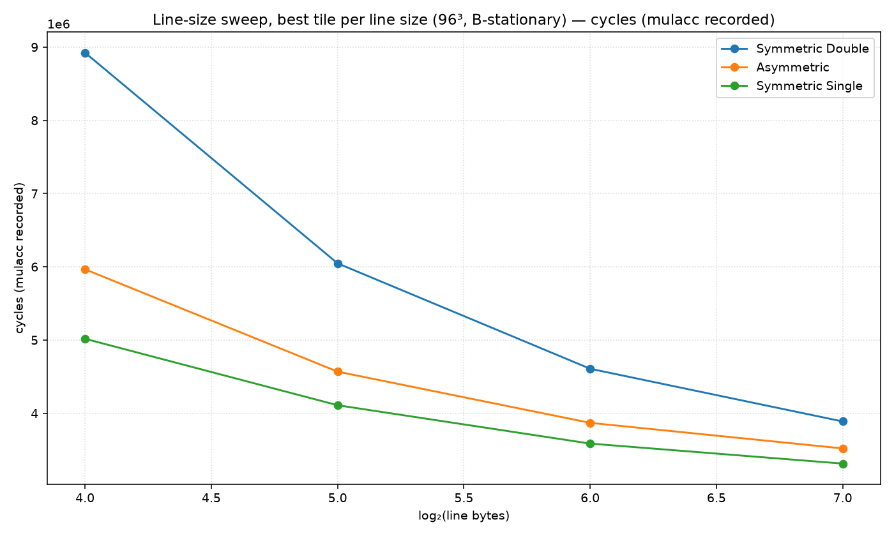
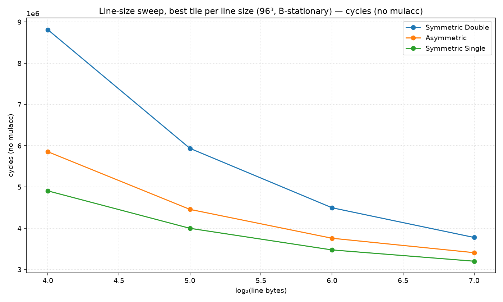
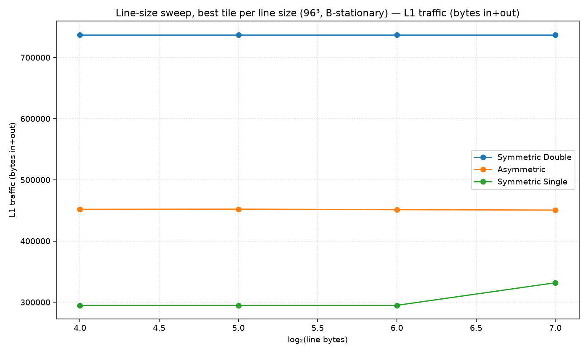
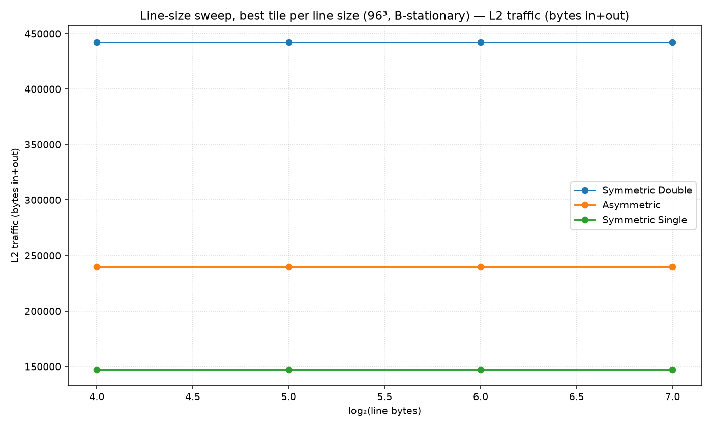
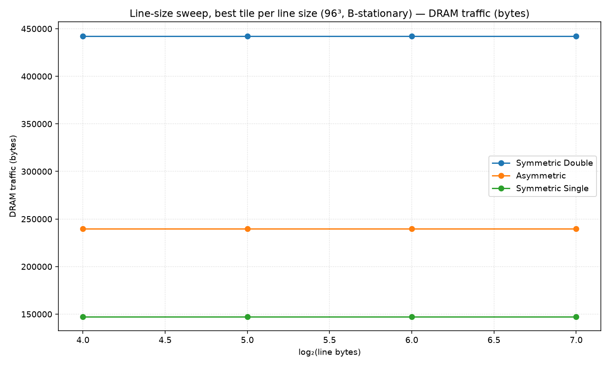
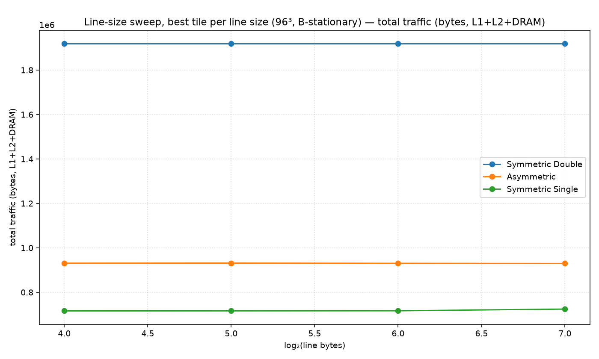

# Line-size sweep, best tile per line size (96³, B-stationary)

Non-default config: (all defaults)

Each x point takes the best (minimum) value over all tile shapes.

## Best cell per metric

| metric | precision | line | tile (M×N×K) | value |
|---|---|---|---|---|
| cycles | Symmetric Double | 128B | 16×32×96 | 3,887,684 |
| cycles | Asymmetric | 128B | 12×96×96 | 3,519,176 |
| cycles | Symmetric Single | 128B | 48×32×96 | 3,312,308 |
| cycles_nomulacc | Symmetric Double | 128B | 16×32×96 | 3,777,092 |
| cycles_nomulacc | Asymmetric | 128B | 12×96×96 | 3,408,584 |
| cycles_nomulacc | Symmetric Single | 128B | 48×32×96 | 3,201,716 |
| l1_traffic | Symmetric Double | 16B | 8×32×32 | 737,280 |
| l1_traffic | Asymmetric | 128B | 12×96×96 | 450,560 |
| l1_traffic | Symmetric Single | 16B | 8×32×48 | 294,912 |
| l2_traffic | Symmetric Double | 16B | 8×32×96 | 442,368 |
| l2_traffic | Asymmetric | 16B | 8×96×96 | 239,616 |
| l2_traffic | Symmetric Single | 16B | 8×8×8 | 147,456 |
| dram_traffic | Symmetric Double | 16B | 8×32×96 | 442,368 |
| dram_traffic | Asymmetric | 16B | 8×96×96 | 239,616 |
| dram_traffic | Symmetric Single | 16B | 8×8×8 | 147,456 |
| total_traffic | Symmetric Double | 16B | 8×32×32 | 1,918,464 |
| total_traffic | Asymmetric | 128B | 12×96×96 | 929,792 |
| total_traffic | Symmetric Single | 16B | 8×32×48 | 716,224 |