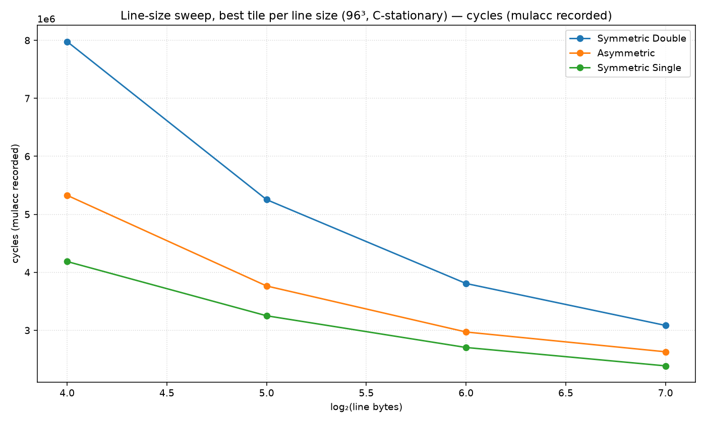
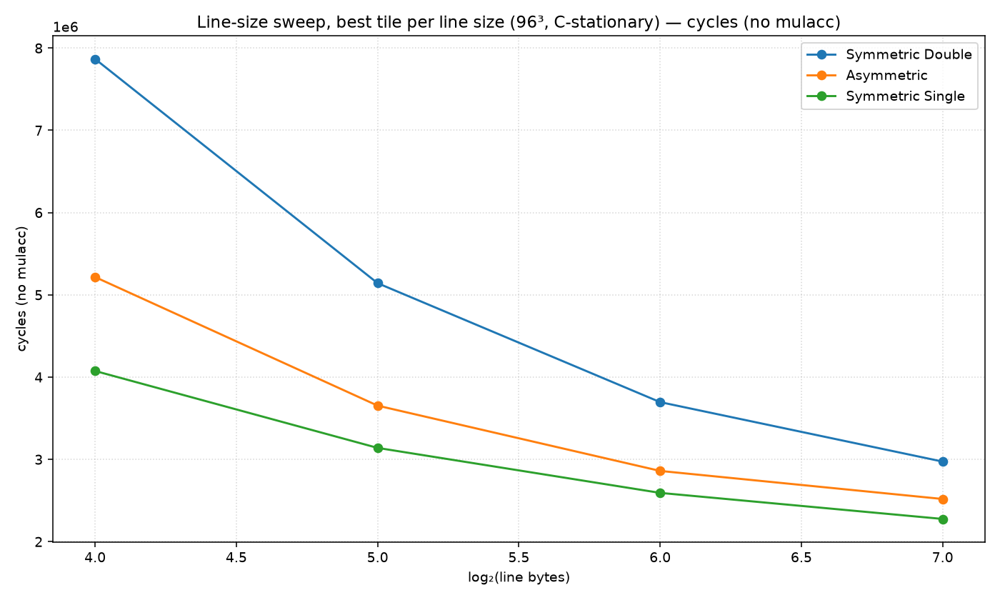
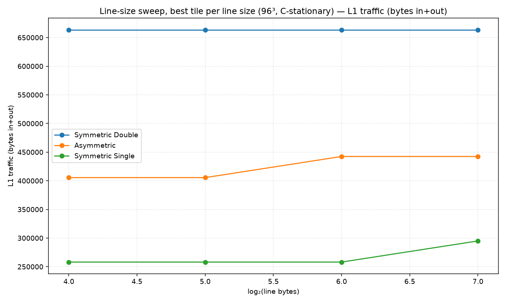
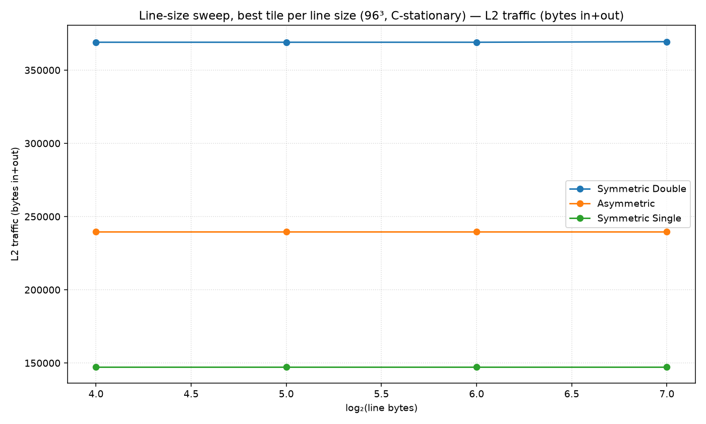
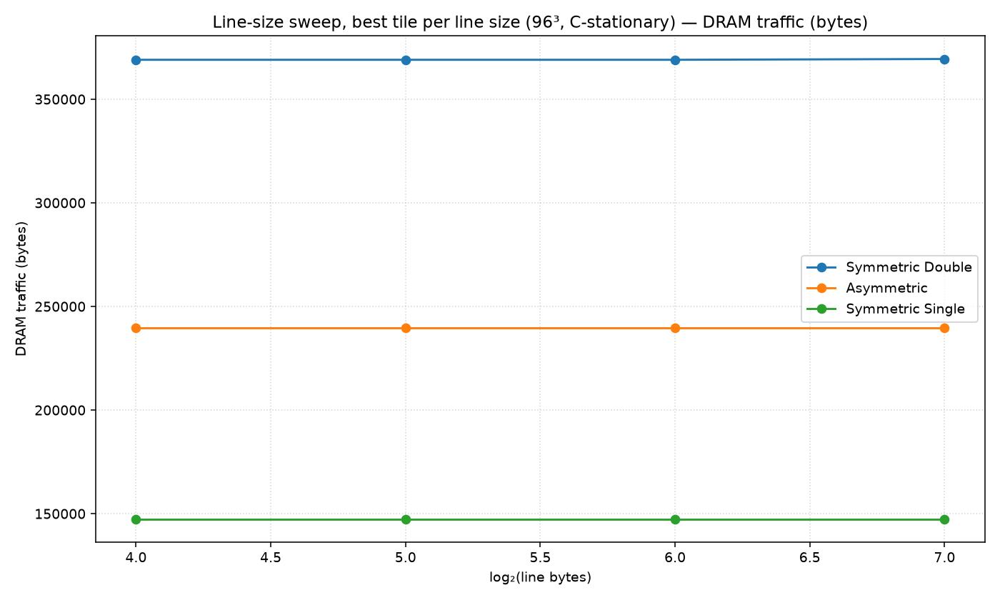
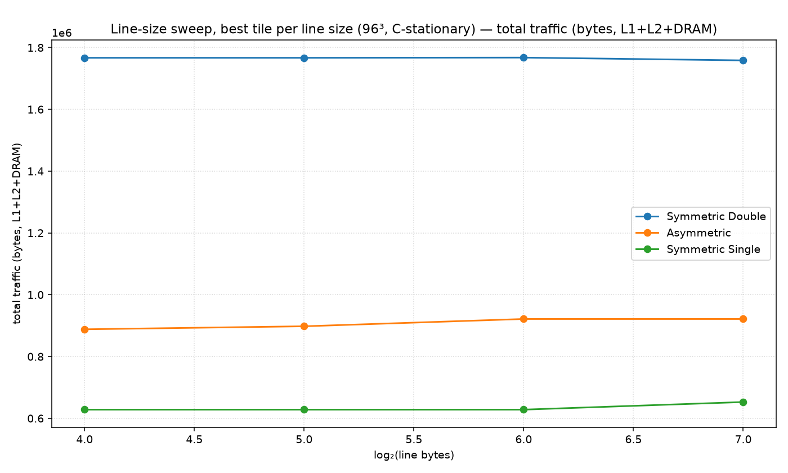

# Line-size sweep, best tile per line size (96³, C-stationary)

Non-default config: (all defaults)

Each x point takes the best (minimum) value over all tile shapes.

## Best cell per metric

| metric | precision | line | tile (M×N×K) | value |
|---|---|---|---|---|
| cycles | Symmetric Double | 128B | 32×32×32 | 3,083,888 |
| cycles | Asymmetric | 128B | 32×96×48 | 2,629,164 |
| cycles | Symmetric Single | 128B | 96×32×96 | 2,386,578 |
| cycles_nomulacc | Symmetric Double | 128B | 32×32×32 | 2,973,296 |
| cycles_nomulacc | Asymmetric | 128B | 32×96×48 | 2,518,572 |
| cycles_nomulacc | Symmetric Single | 128B | 96×32×96 | 2,275,986 |
| l1_traffic | Symmetric Double | 16B | 24×32×8 | 663,552 |
| l1_traffic | Asymmetric | 16B | 16×48×8 | 405,504 |
| l1_traffic | Symmetric Single | 16B | 32×48×8 | 258,048 |
| l2_traffic | Symmetric Double | 16B | 48×96×8 | 369,024 |
| l2_traffic | Asymmetric | 16B | 8×8×8 | 239,616 |
| l2_traffic | Symmetric Single | 16B | 8×8×8 | 147,456 |
| dram_traffic | Symmetric Double | 16B | 48×96×8 | 369,024 |
| dram_traffic | Asymmetric | 16B | 8×8×8 | 239,616 |
| dram_traffic | Symmetric Single | 16B | 8×8×8 | 147,456 |
| total_traffic | Symmetric Double | 128B | 24×32×8 | 1,758,464 |
| total_traffic | Asymmetric | 16B | 12×8×32 | 888,192 |
| total_traffic | Symmetric Single | 16B | 48×32×16 | 628,224 |