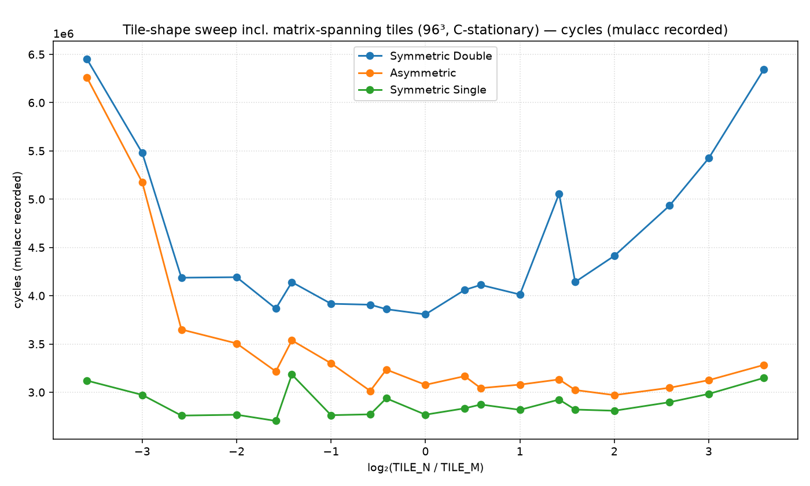
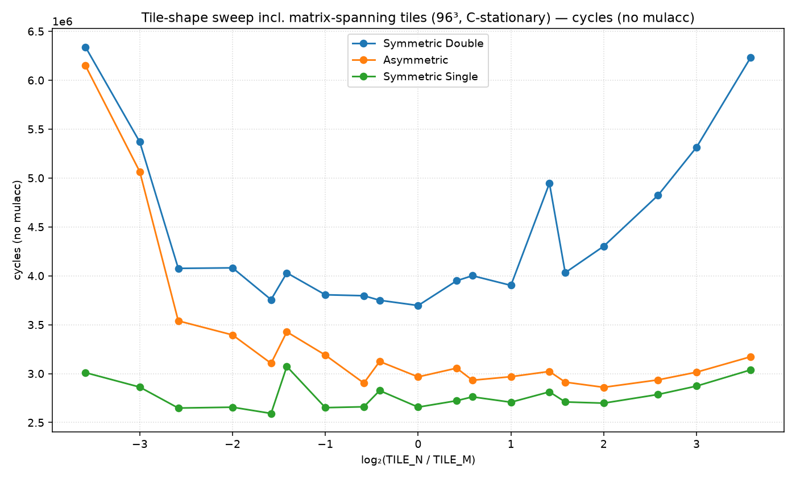
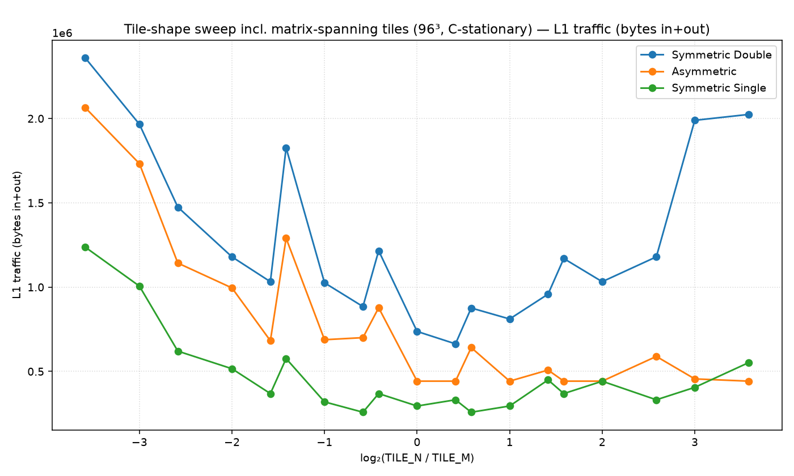
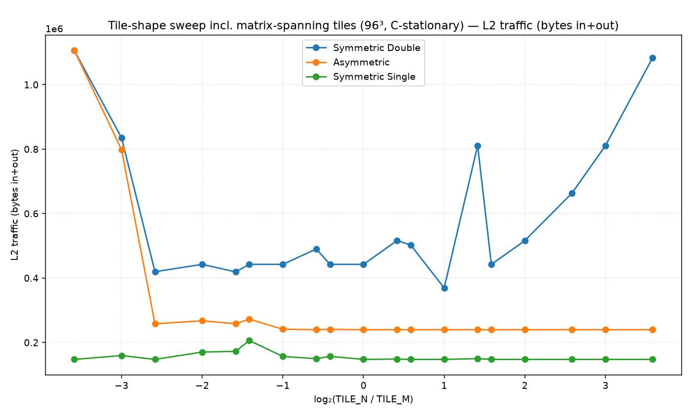
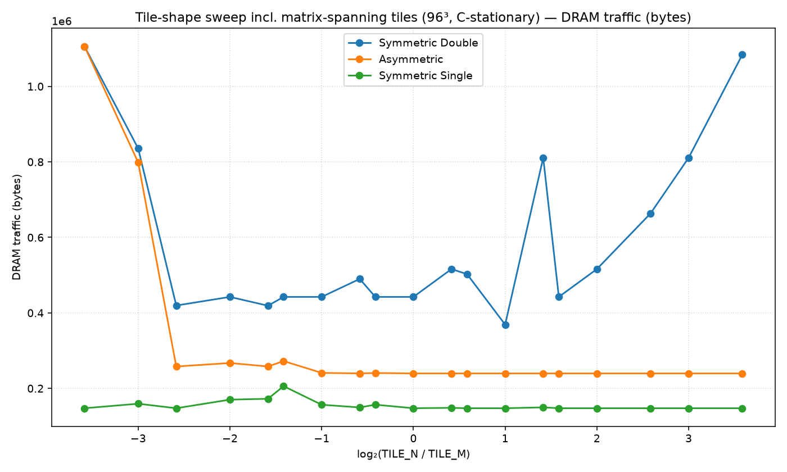
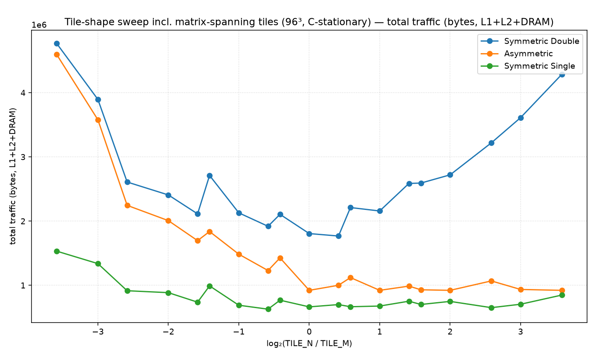

# Tile-shape sweep incl. matrix-spanning tiles (96³, C-stationary)

Non-default config: (all defaults)

Points sharing an aspect ratio take the best (minimum) value.

## Best tile per metric

| metric | precision | tile (M×N×K) | value |
|---|---|---|---|
| cycles | Symmetric Double | 32×32×32 | 3,806,800 |
| cycles | Asymmetric | 24×96×96 | 2,970,450 |
| cycles | Symmetric Single | 96×32×96 | 2,703,402 |
| cycles_nomulacc | Symmetric Double | 32×32×32 | 3,696,208 |
| cycles_nomulacc | Asymmetric | 24×96×96 | 2,859,858 |
| cycles_nomulacc | Symmetric Single | 96×32×96 | 2,592,810 |
| l1_traffic | Symmetric Double | 24×32×8 | 663,552 |
| l1_traffic | Asymmetric | 8×8×8 | 442,368 |
| l1_traffic | Symmetric Single | 32×48×8 | 258,048 |
| l2_traffic | Symmetric Double | 48×96×8 | 369,024 |
| l2_traffic | Asymmetric | 8×8×8 | 239,616 |
| l2_traffic | Symmetric Single | 8×8×8 | 147,456 |
| dram_traffic | Symmetric Double | 48×96×8 | 369,024 |
| dram_traffic | Asymmetric | 8×8×8 | 239,616 |
| dram_traffic | Symmetric Single | 8×8×8 | 147,456 |
| total_traffic | Symmetric Double | 24×32×8 | 1,767,552 |
| total_traffic | Asymmetric | 8×8×8 | 921,600 |
| total_traffic | Symmetric Single | 48×32×16 | 628,224 |