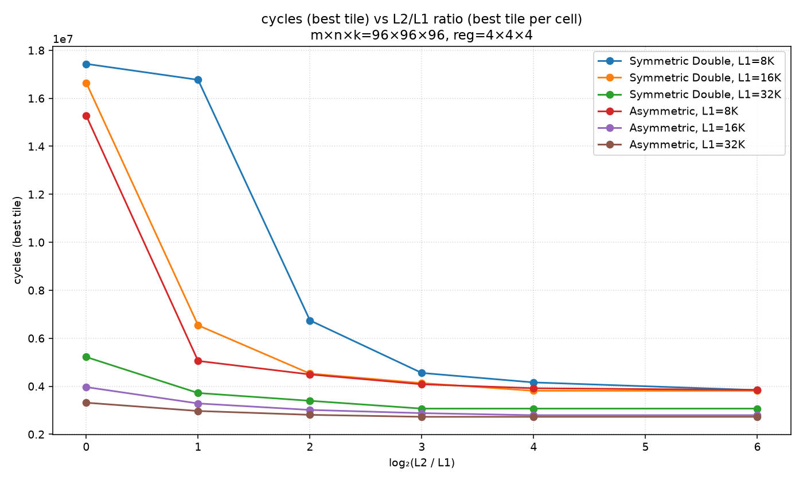
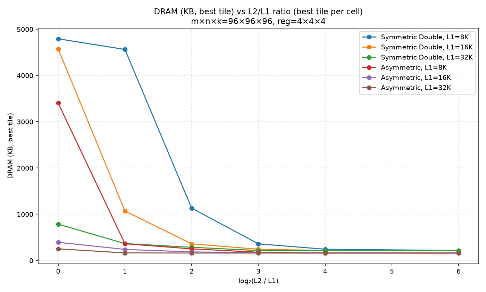

# l2-sizing-at-fixed-l1

# l2-sizing-at-fixed-l1

## Elbow (smallest L2/L1 with <5% cycle gain from the next-larger L2)

| precision | L1 | elbow L2/L1 |
|---|---|---|
| Symmetric Double | 8K | 2× |
| Symmetric Double | 16K | 64× |
| Symmetric Double | 32K | 16× |
| Asymmetric | 8K | 16× |
| Asymmetric | 16K | 8× |
| Asymmetric | 32K | 8× |