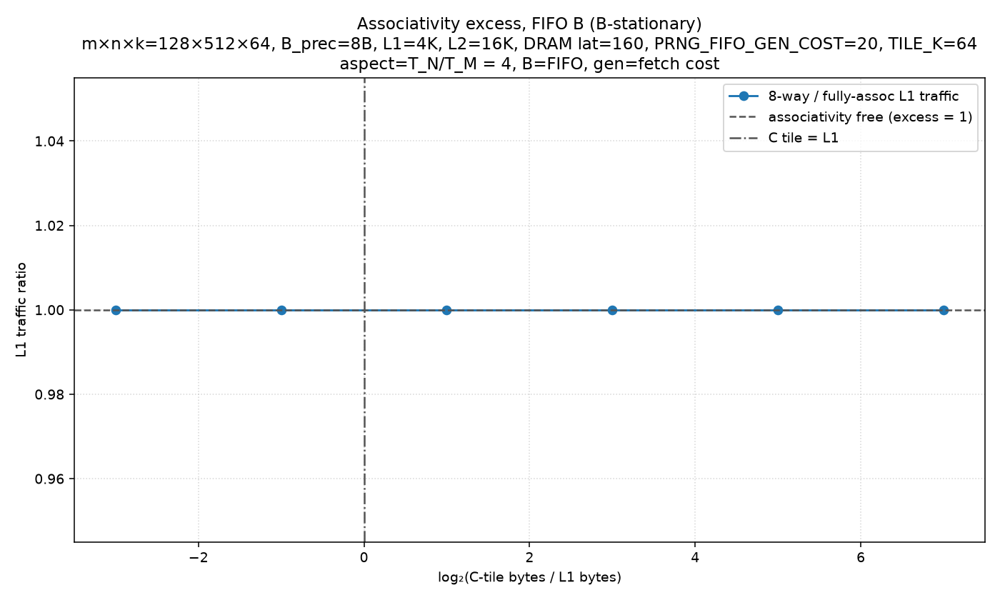
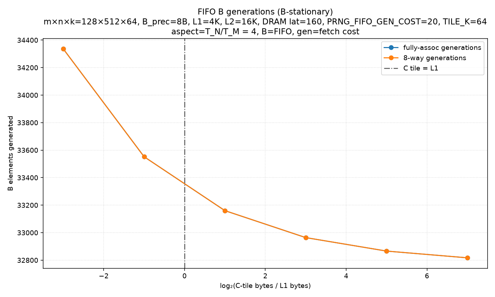
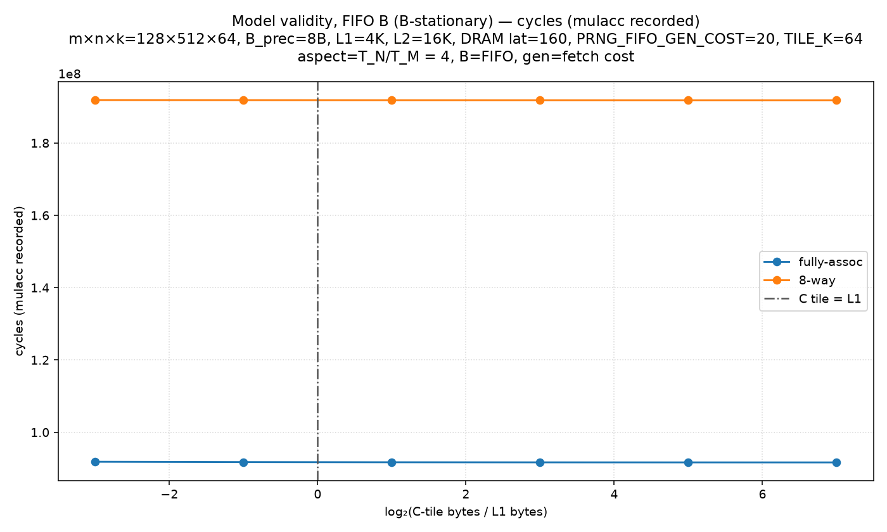
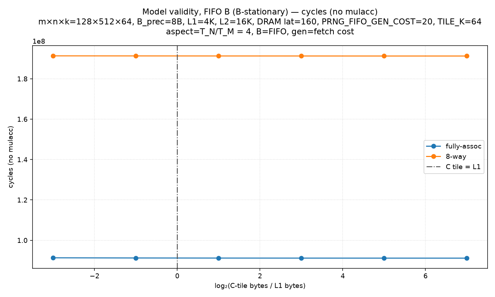
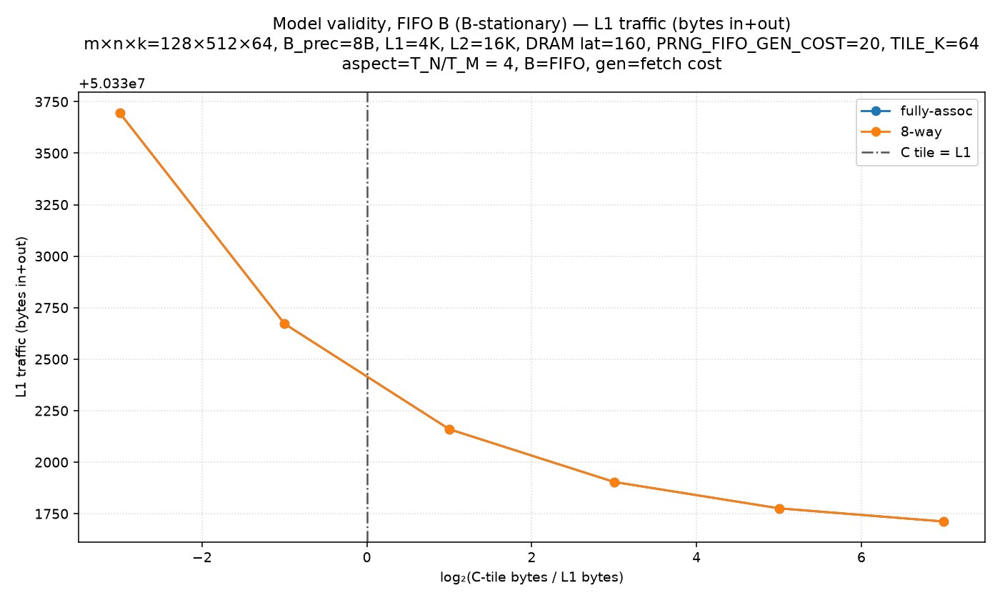
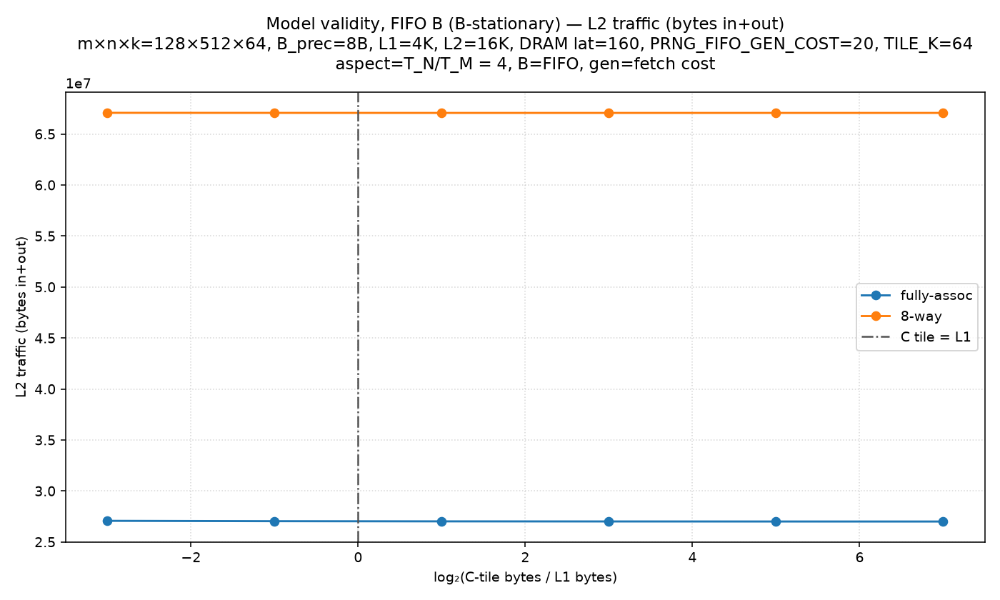
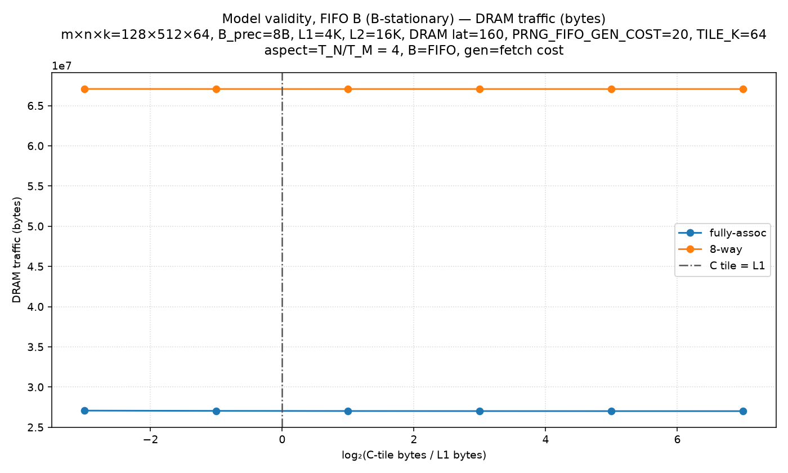
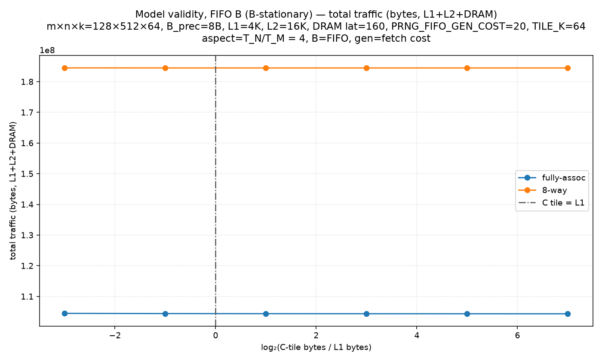

# Model validity, FIFO B (B-stationary)

Non-default config: m×n×k=128×512×64, B_prec=8B, L1=4K, L2=16K, DRAM lat=160, PRNG_FIFO_GEN_COST=20, TILE_K=64
aspect=T_N/T_M = 4, B=FIFO, gen=fetch cost

B is FIFO-generated; per-element generation cost equals A's per-element DRAM cost (both 20 cycles). A and B share 8 B precision. Seed = 8 B per B tile.

