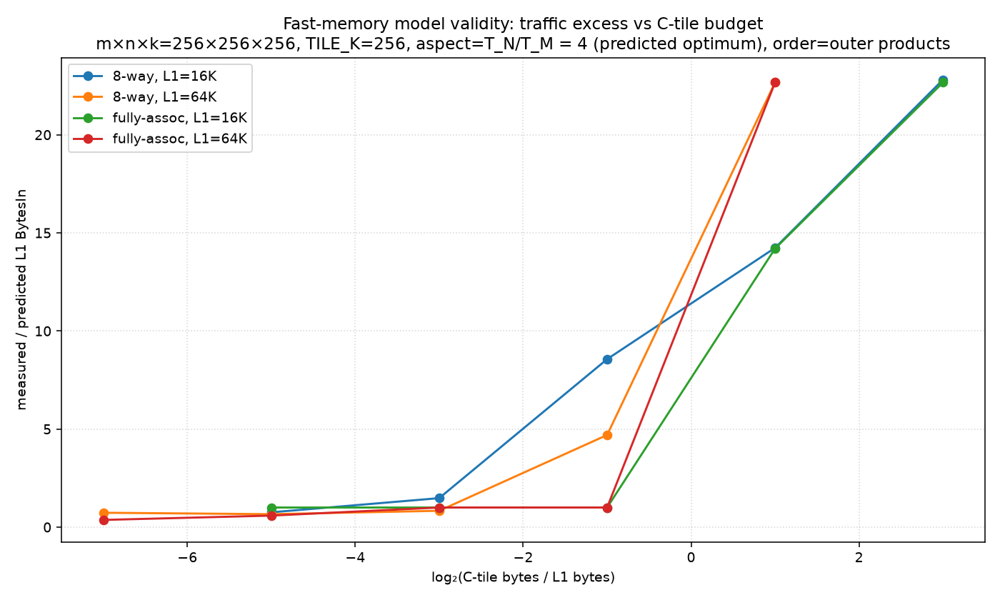
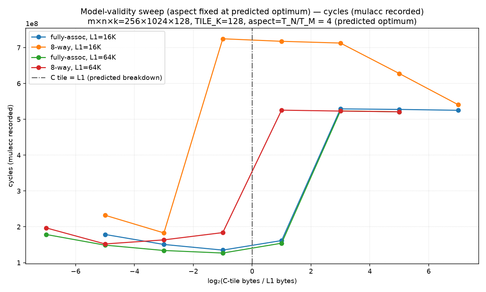
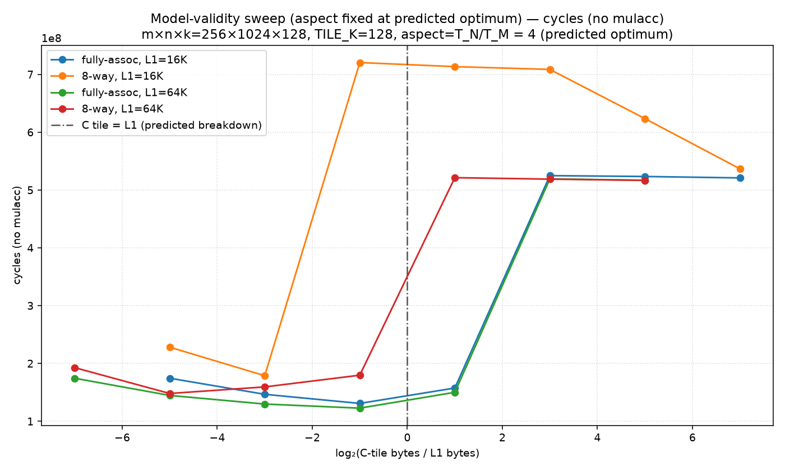
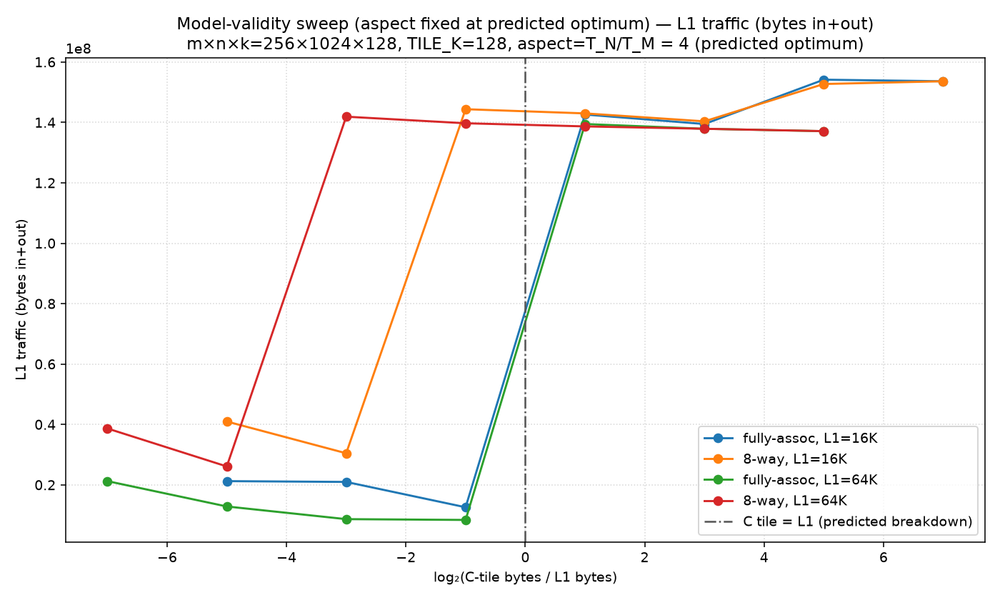
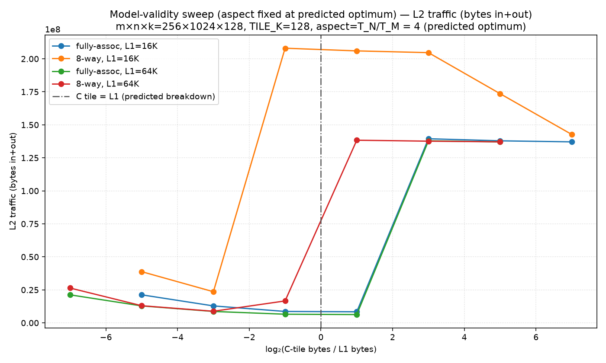
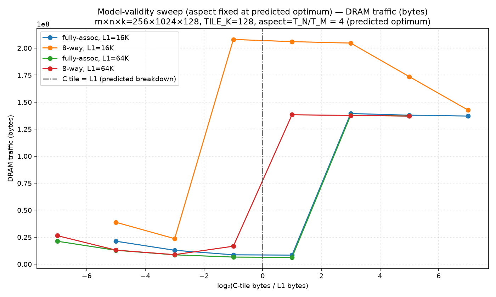
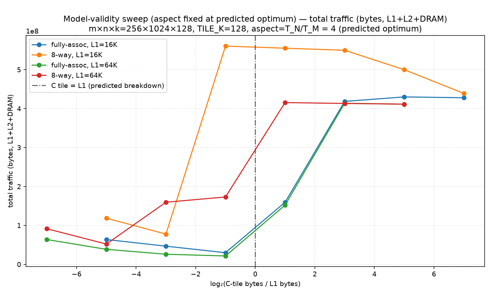

# paper-model-validity

Non-default config: m×n×k=256×1024×128, TILE_K=128, aspect=T_N/T_M = 4 (predicted optimum)

Prediction = line-aware paper formula; excess of 1.0 means the two-level model holds exactly.

## Traffic excess (measured / predicted L1 BytesIn)

| regime | 4×16 (512B C tile) | 8×32 (2K C tile) | 16×64 (8K C tile) | 32×128 (32K C tile) | 64×256 (128K C tile) | 128×512 (512K C tile) | 256×1024 (2048K C tile) |
|---|---|---|---|---|---|---|---|
| 8-way, L1=16K | 0.72 | 1.14 | 7.37 | 12.06 | 17.46 | 27.21 | 33.00 |
| 8-way, L1=64K | 0.70 | 0.95 | 7.13 | 11.54 | 17.06 | 22.50 | 26.70 |
| fully-assoc, L1=16K | 0.36 | 1.00 | 1.00 | 12.00 | 17.25 | 27.67 | 33.00 |
| fully-assoc, L1=64K | 0.36 | 0.57 | 0.62 | 1.00 | 17.25 | 22.50 | 26.70 |

