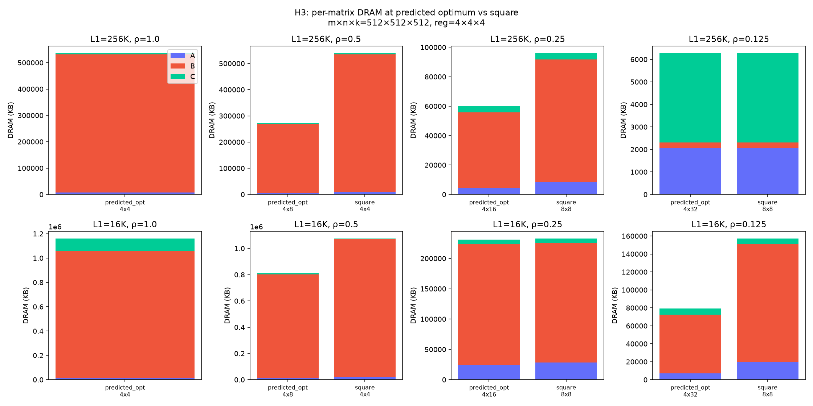

# paper-per-matrix-balance

# Paper validation — per-matrix balance at optimum (H3)

## Balance table

| regime | ρ | tile | A KB | B KB | C KB | A:B | total KB |
|---|---|---|---|---|---|---|---|
| L1=256K | 1.0 | predicted_opt=4x4 | 7280.0 | 524288.0 | 4080.0 | 0.01 | 533616.0 |
| L1=256K | 0.5 | predicted_opt=4x8 | 6336.0 | 262144.0 | 4151.8 | 0.02 | 270591.8 |
| L1=256K | 0.5 | square=4x4 | 10432.0 | 524288.0 | 4151.8 | 0.02 | 536831.8 |
| L1=256K | 0.25 | predicted_opt=4x16 | 4352.0 | 51393.8 | 4215.0 | 0.08 | 57921.2 |
| L1=256K | 0.25 | square=8x8 | 8448.0 | 83302.8 | 4207.5 | 0.10 | 93926.2 |
| L1=256K | 0.125 | predicted_opt=4x32 | 2048.0 | 256.0 | 3968.0 | 8.00 | 4352.0 |
| L1=256K | 0.125 | square=8x8 | 2048.0 | 256.0 | 3968.0 | 8.00 | 4352.0 |
| L1=16K | 1.0 | predicted_opt=4x4 | 12000.0 | 1048576.0 | 100336.0 | 0.01 | 1128160.0 |
| L1=16K | 0.5 | predicted_opt=4x8 | 15968.0 | 786432.0 | 6584.0 | 0.02 | 805984.0 |
| L1=16K | 0.5 | square=4x4 | 20064.0 | 1048576.0 | 7096.0 | 0.02 | 1072736.0 |
| L1=16K | 0.25 | predicted_opt=4x16 | 23936.0 | 199344.0 | 8008.2 | 0.12 | 227864.0 |
| L1=16K | 0.25 | square=8x8 | 28144.0 | 196768.0 | 8000.8 | 0.14 | 229496.0 |
| L1=16K | 0.125 | predicted_opt=4x32 | 6928.0 | 65536.0 | 6776.0 | 0.11 | 75856.0 |
| L1=16K | 0.125 | square=8x8 | 19608.0 | 131380.0 | 6257.8 | 0.15 | 154204.0 |