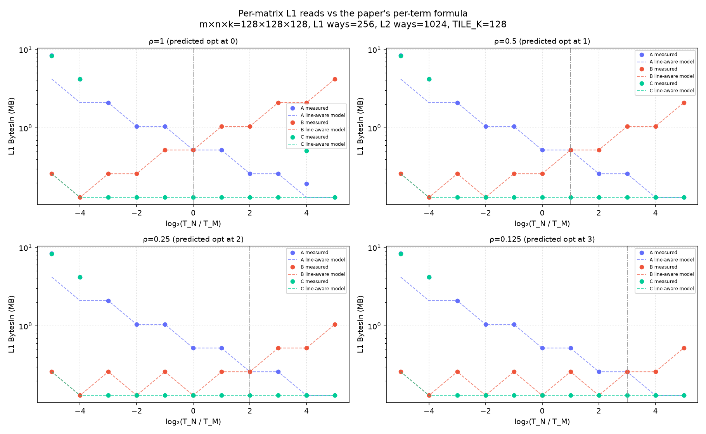
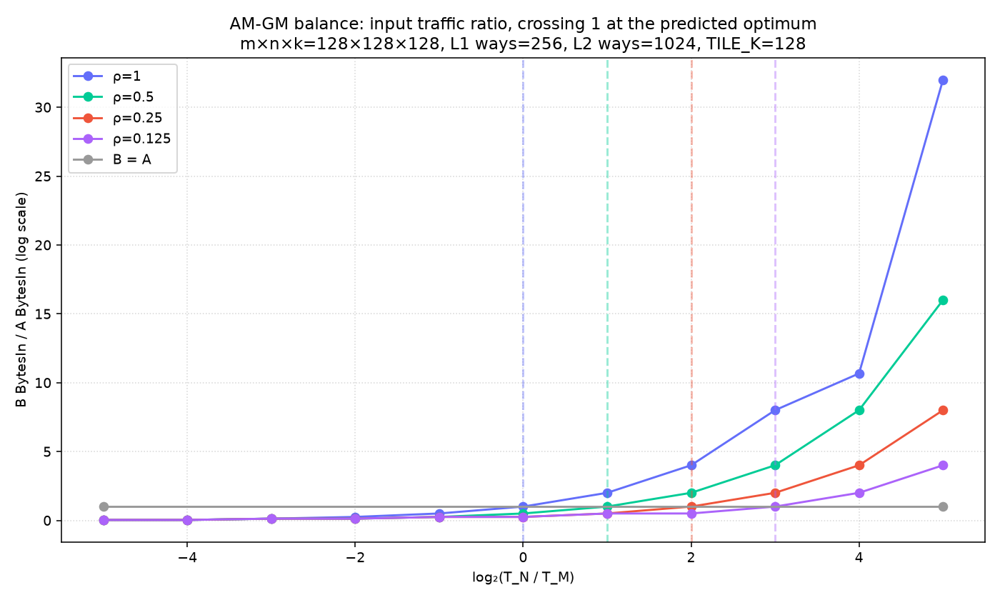
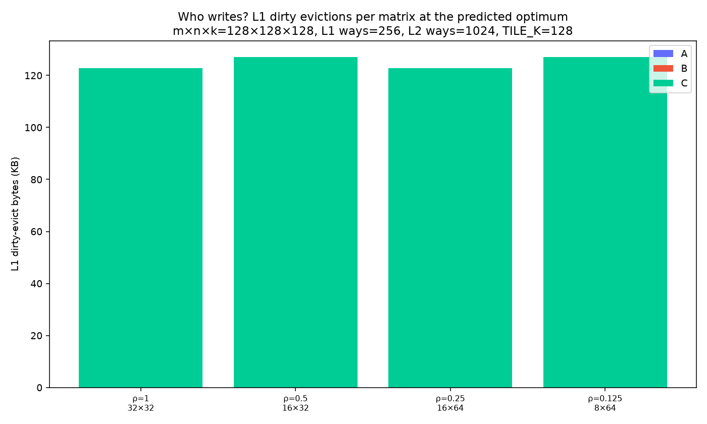
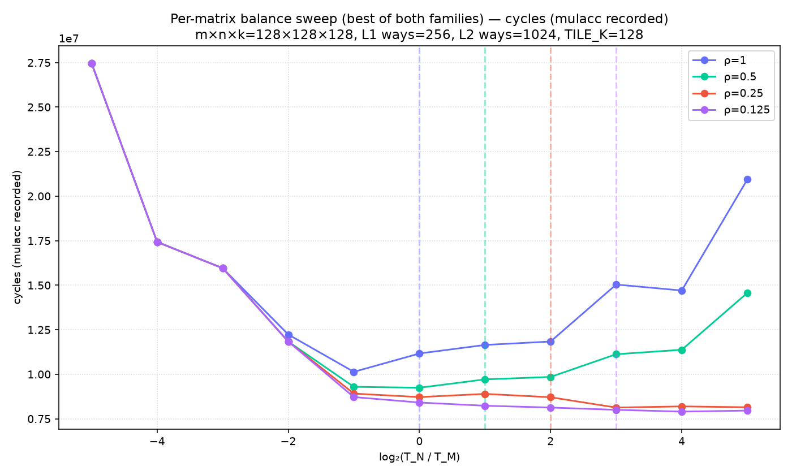
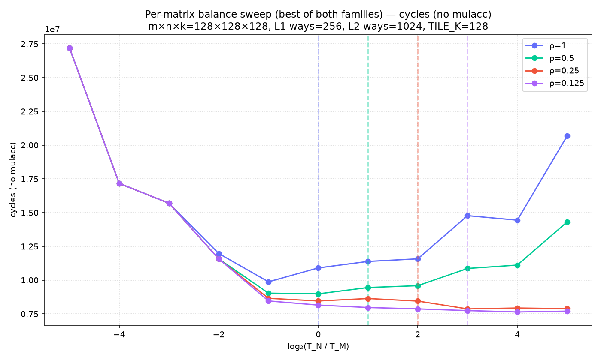
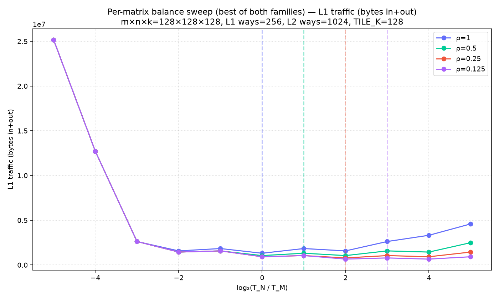
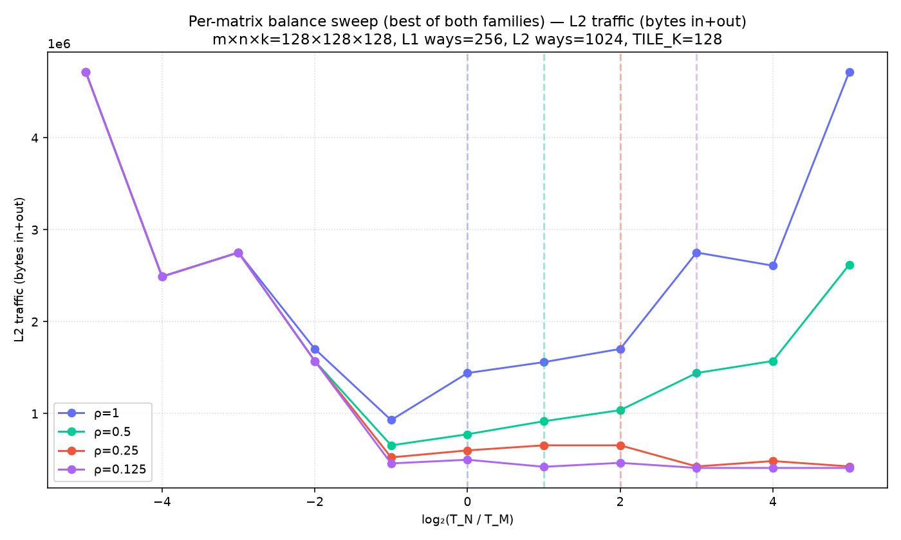
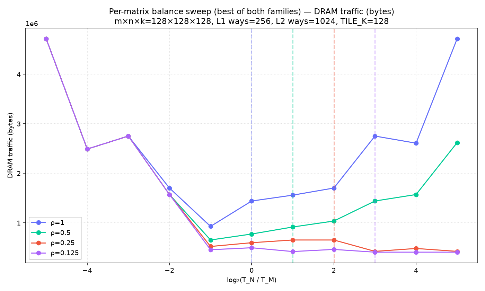
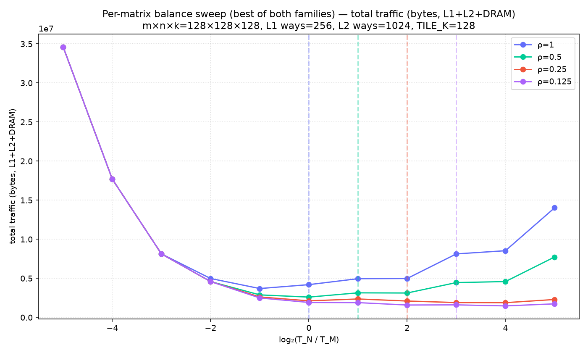

# paper-per-matrix-balance

Non-default config: m×n×k=128×128×128, L1 ways=256, L2 ways=1024, TILE_K=128

## B/A read balance at the predicted optimum (want ≈ 1)

| ρ | tile | measured B/A | word-model B/A |
|---|---|---|---|
| 1 | 32×32 | 1.000 | 1 |
| 0.5 | 16×32 | 1.000 | 1 |
| 0.25 | 16×64 | 1.000 | 1 |
| 0.125 | 8×64 | 1.000 | 1 |

