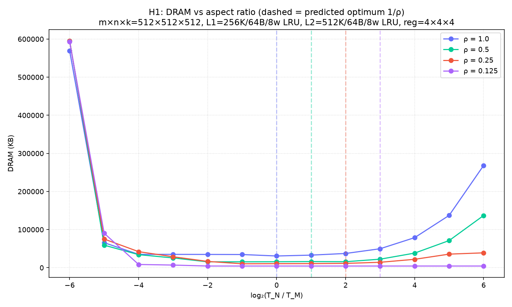

# paper-rho-continuum-unconstrained

# Paper validation — unconstrained continuum (H1)

## Speedup vs square tiles

| ρ | predicted optimum log₂(1/ρ) | empirical optimum log₂ | analytical speedup | measured speedup |
|---|---|---|---|---|
| 1.0 | +0.00 | +0.00 | 1.000 | 1.000 |
| 0.5 | +1.00 | -2.00 | 0.943 | 0.987 |
| 0.25 | +2.00 | -1.00 | 0.800 | 0.976 |
| 0.125 | +3.00 | +0.00 | 0.629 | 1.000 |