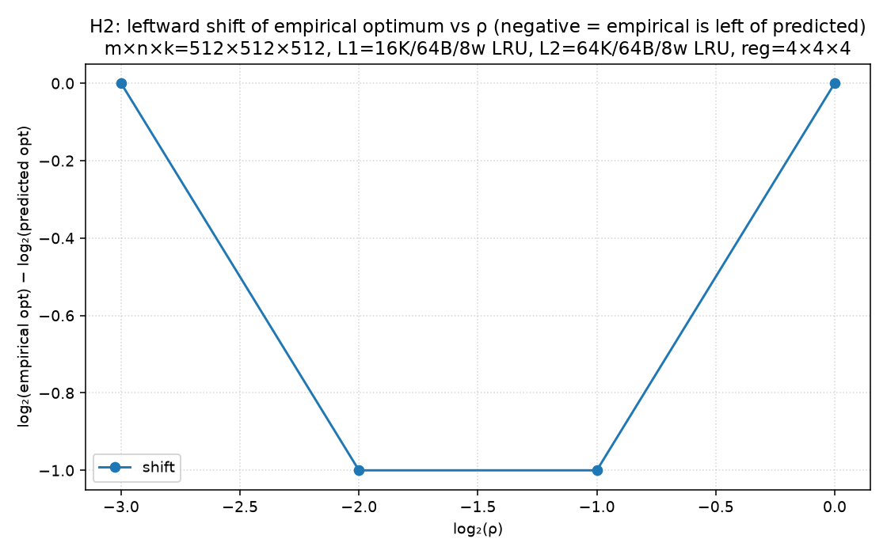
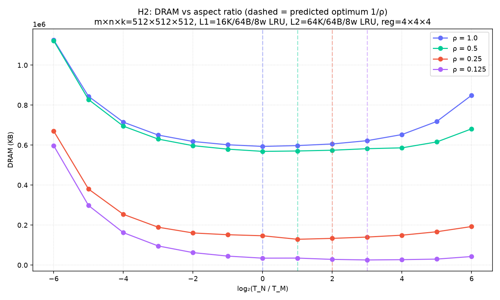

# paper-rho-shift-constrained

# Paper validation — constrained shift (H2)

## Shift per ρ

| ρ | predicted log₂ | empirical log₂ | shift |
|---|---|---|---|
| 1.0 | +0.00 | +0.00 | +0.00 |
| 0.5 | +1.00 | +0.00 | -1.00 |
| 0.25 | +2.00 | +1.00 | -1.00 |
| 0.125 | +3.00 | +3.00 | +0.00 |