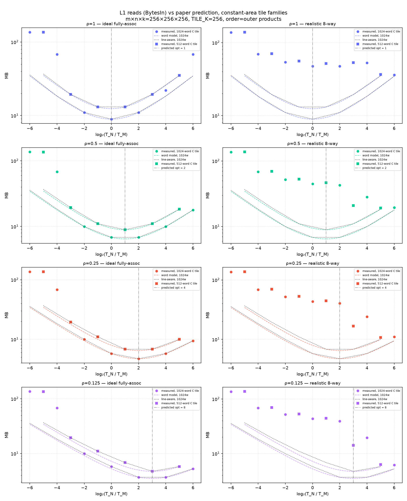
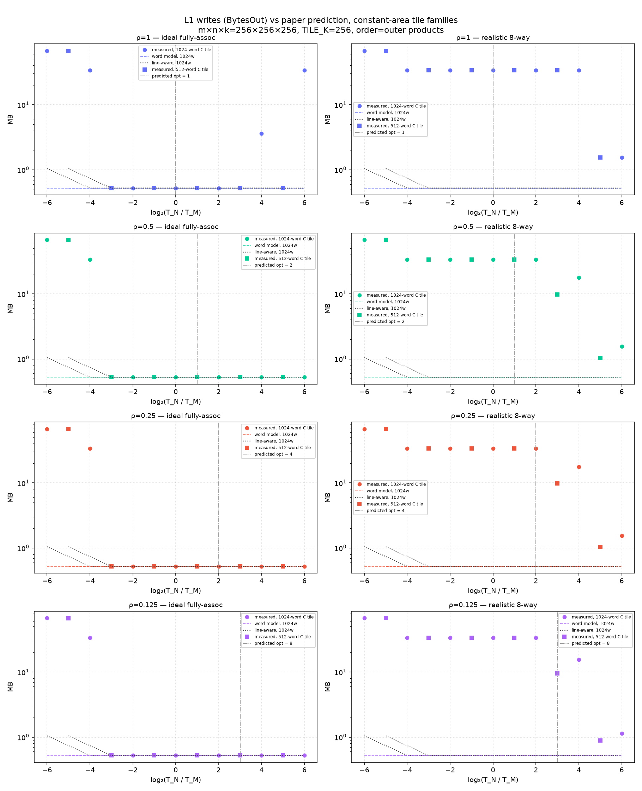
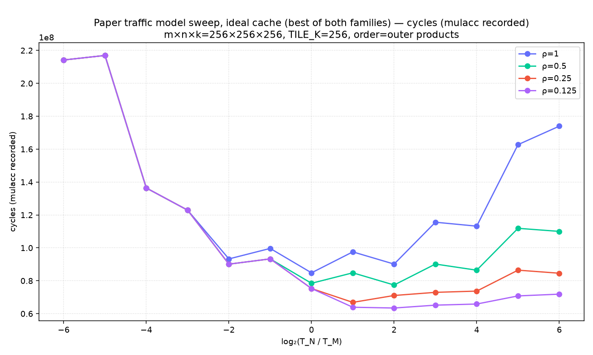
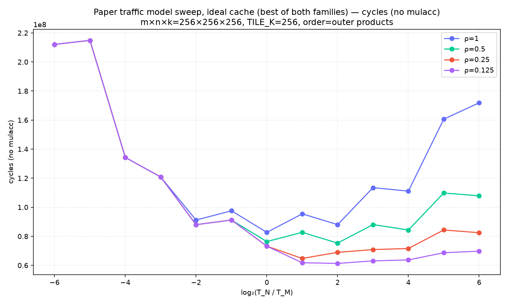
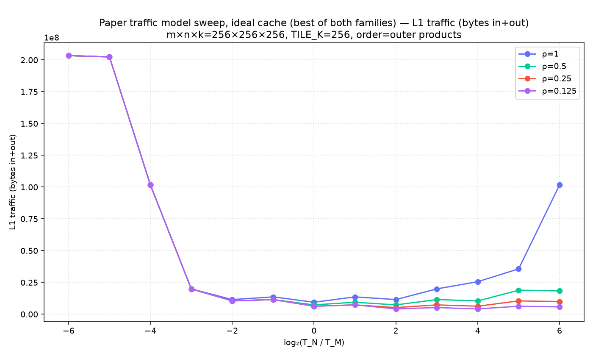
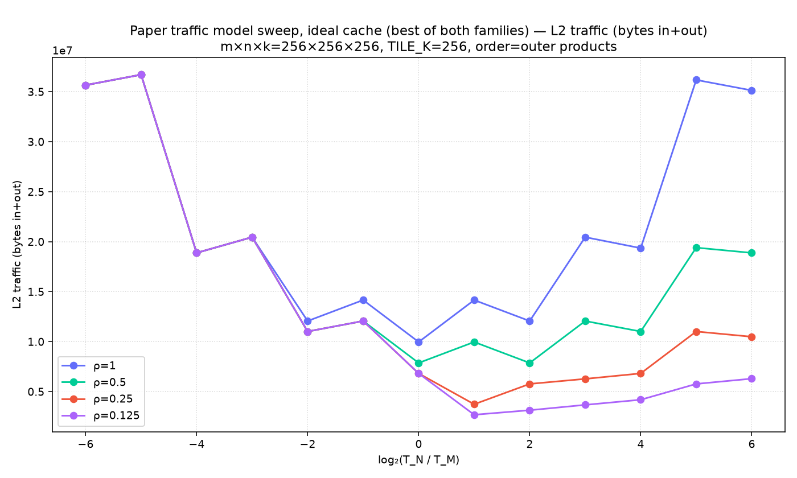
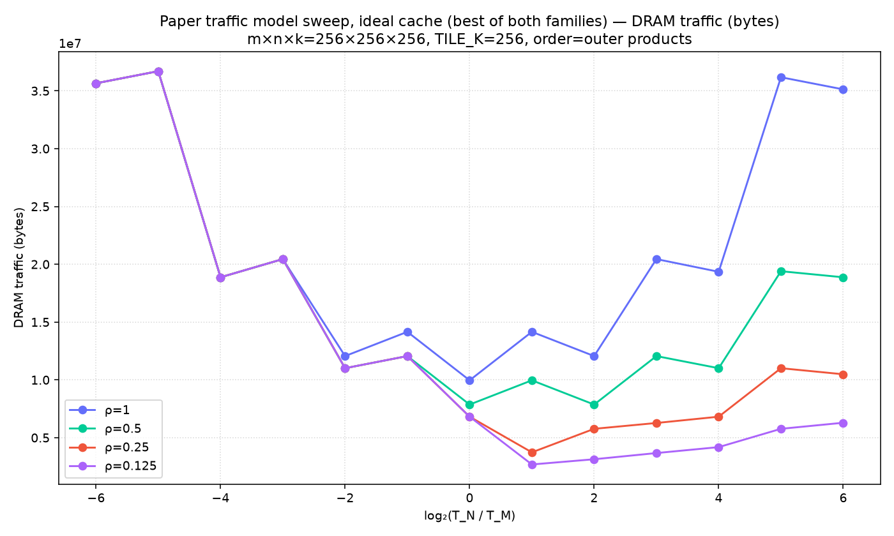
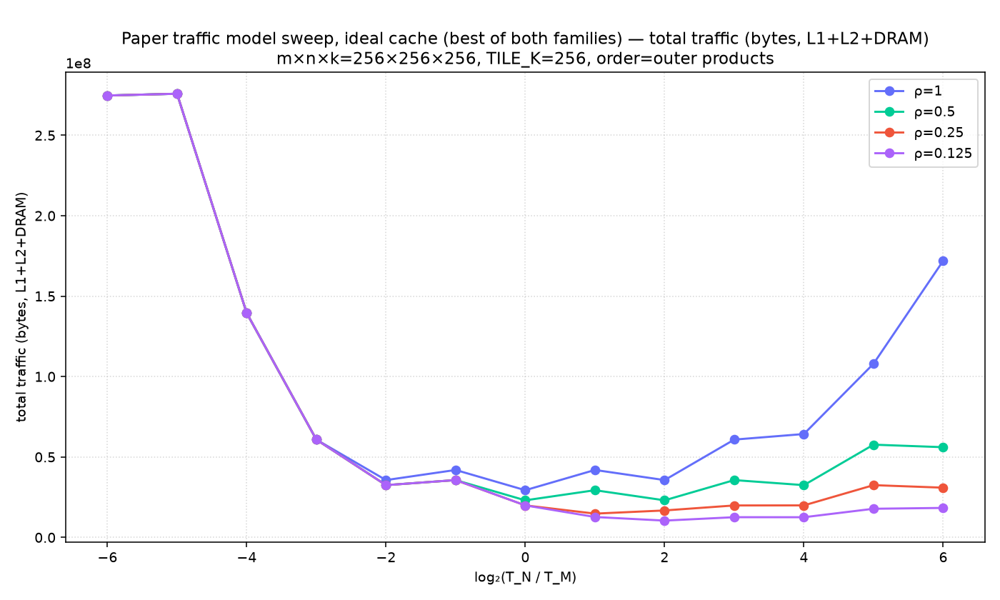

# paper-traffic-model

Non-default config: m×n×k=256×256×256, TILE_K=256, order=outer products, flags: --outer_products

Reads = L1 BytesIn, writes = L1 BytesOut (the paper's fast-memory boundary). See WRITEUP.md for the claims under test.

## Optimal aspect ratio: measured vs predicted (per family)

| regime | ρ | area (words) | measured argmin T_N/T_M | model argmin (same grid) | predicted 1/ρ |
|---|---|---|---|---|---|
| ideal fully-assoc | 1 | 1024 | 1 | 1 | 1 |
| ideal fully-assoc | 1 | 512 | 0.5 | 0.5 | 1 |
| ideal fully-assoc | 0.5 | 1024 | 1 | 1 | 2 |
| ideal fully-assoc | 0.5 | 512 | 2 | 2 | 2 |
| ideal fully-assoc | 0.25 | 1024 | 4 | 4 | 4 |
| ideal fully-assoc | 0.25 | 512 | 2 | 2 | 4 |
| ideal fully-assoc | 0.125 | 1024 | 4 | 4 | 8 |
| ideal fully-assoc | 0.125 | 512 | 8 | 8 | 8 |
| realistic 8-way | 1 | 1024 | 64 | 1 | 1 |
| realistic 8-way | 1 | 512 | 32 | 0.5 | 1 |
| realistic 8-way | 0.5 | 1024 | 64 | 1 | 2 |
| realistic 8-way | 0.5 | 512 | 32 | 2 | 2 |
| realistic 8-way | 0.25 | 1024 | 64 | 4 | 4 |
| realistic 8-way | 0.25 | 512 | 32 | 2 | 4 |
| realistic 8-way | 0.125 | 1024 | 64 | 4 | 8 |
| realistic 8-way | 0.125 | 512 | 32 | 8 | 8 |

## Savings vs square tile (1024-word family, measured reads)

| regime | ρ | reads(best)/reads(32×32) | paper asymptotic 2√ρ/(1+ρ) |
|---|---|---|---|
| ideal fully-assoc | 1 | 1.000 | 1.000 |
| ideal fully-assoc | 0.5 | 1.000 | 0.943 |
| ideal fully-assoc | 0.25 | 0.818 | 0.800 |
| ideal fully-assoc | 0.125 | 0.636 | 0.629 |
| realistic 8-way | 1 | 0.760 | 1.000 |
| realistic 8-way | 0.5 | 0.435 | 0.943 |
| realistic 8-way | 0.25 | 0.253 | 0.800 |
| realistic 8-way | 0.125 | 0.141 | 0.629 |

## Writes = mn·C_p check (ideal regime)

| ρ | max |writes − mn·C_p| / mn·C_p over all tiles |
|---|---|
| 1 | 127.0000 |
| 0.5 | 127.0000 |
| 0.25 | 127.0000 |
| 0.125 | 127.0000 |

