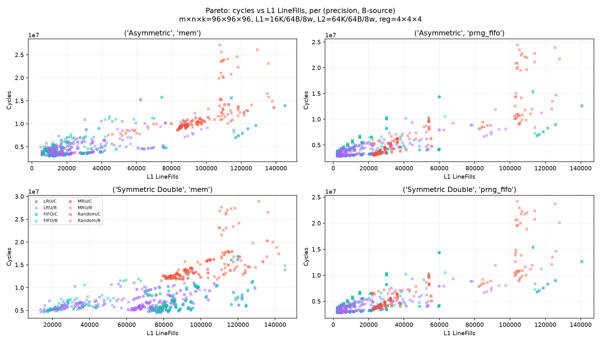

# policy-pareto

# policy-pareto

## Cycle-minimum policy per (precision / stationary / B-source) — count over 64 tile shapes

| precision | stationary | B source | LRU | FIFO | MRU | Random |
|---|---|---|---|---|---|---|
| Symmetric Double | C | mem | 35 | 1 | 0 | 28 |
| Symmetric Double | C | prng_fifo | 39 | 15 | 0 | 10 |
| Symmetric Double | B | mem | 39 | 8 | 0 | 17 |
| Symmetric Double | B | prng_fifo | 11 | 7 | 0 | 46 |
| Asymmetric | C | mem | 46 | 10 | 0 | 8 |
| Asymmetric | C | prng_fifo | 39 | 14 | 5 | 6 |
| Asymmetric | B | mem | 24 | 8 | 0 | 32 |
| Asymmetric | B | prng_fifo | 12 | 7 | 0 | 45 |