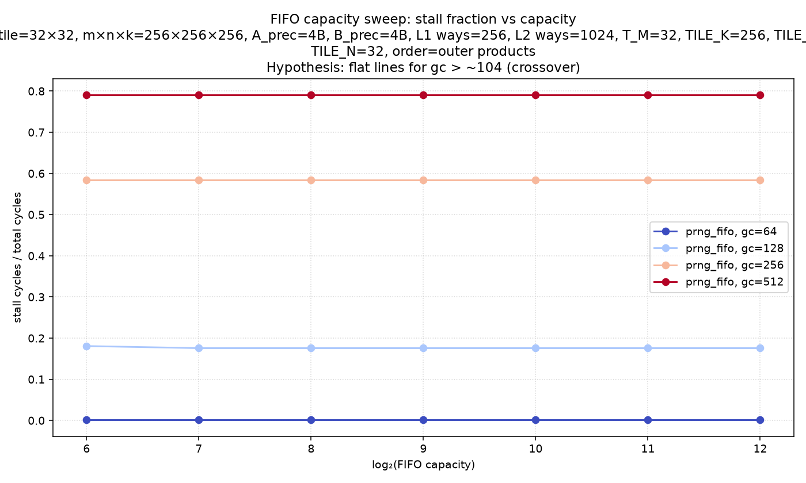
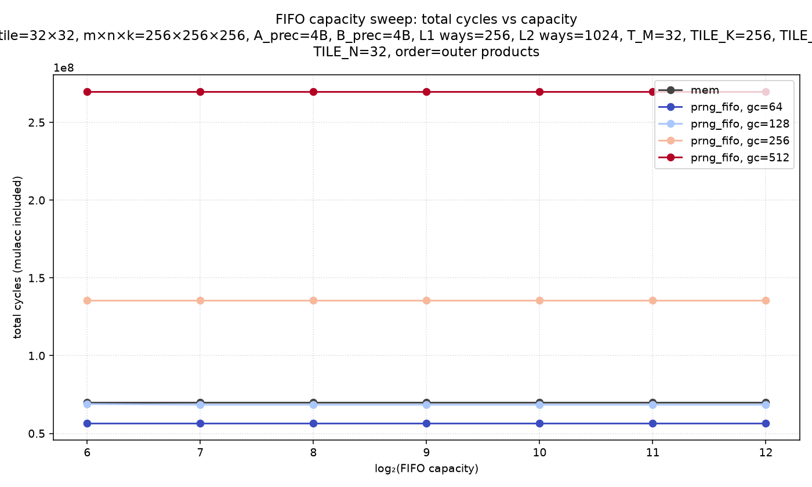

# prng-fifo-capacity-sweep

Non-default config: m×n×k=256×256×256, A_prec=4B, B_prec=4B, L1 ways=256, L2 ways=1024, T_M=32, TILE_K=256, TILE_M=32
TILE_N=32, order=outer products

See [experiment.py](experiment.py) for hypotheses.

## Results

mem baseline: 69,793,152 cycles (horizontal reference)

**Key finding:** stall fraction is flat across capacity for gc ≥ 128, confirming that capacity alone cannot compensate for generation rate < consumption rate (~104 cycles/element for this tile). True head-start prefilling (pipelining FIFO sessions across C-tiles) is needed to eliminate stalls at high gen_cost.
