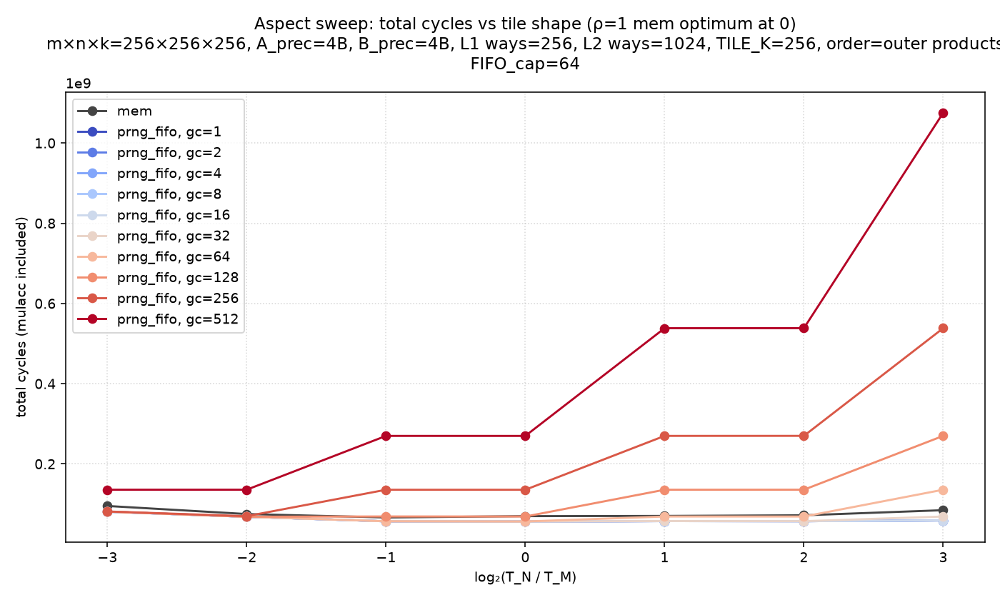
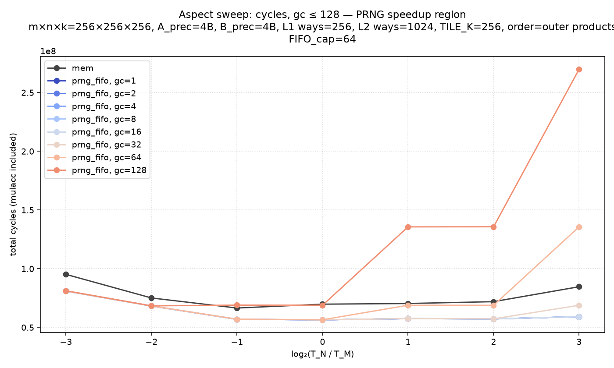
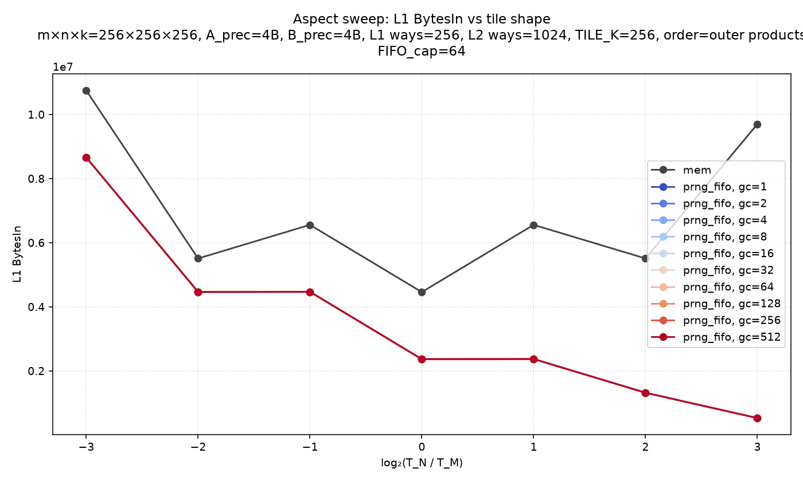
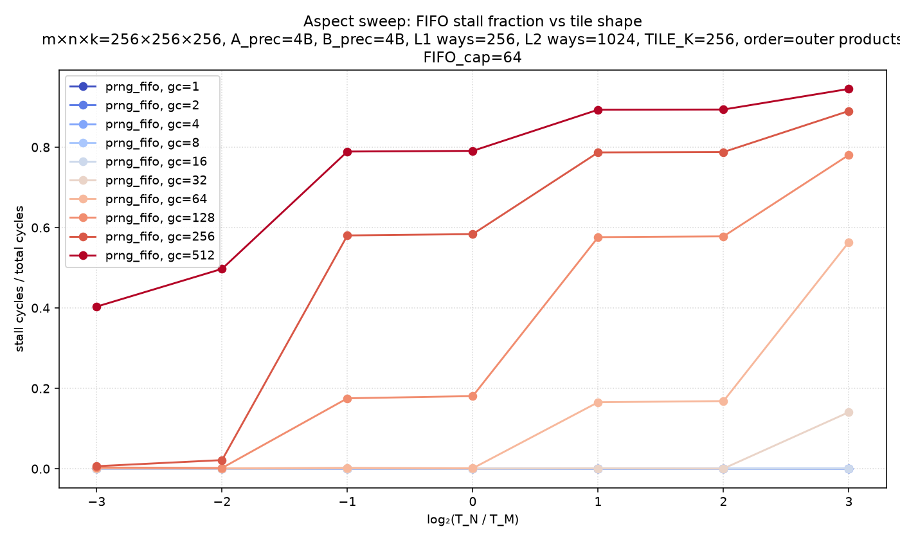
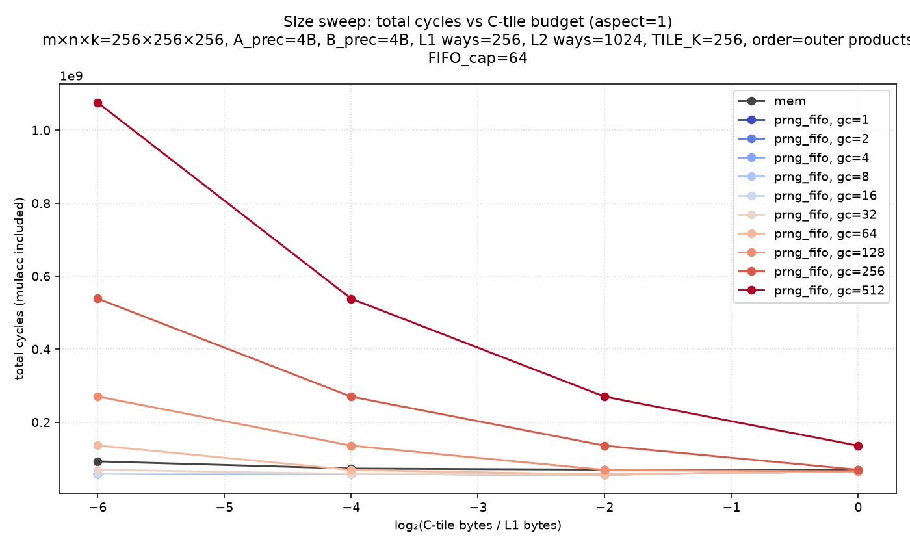
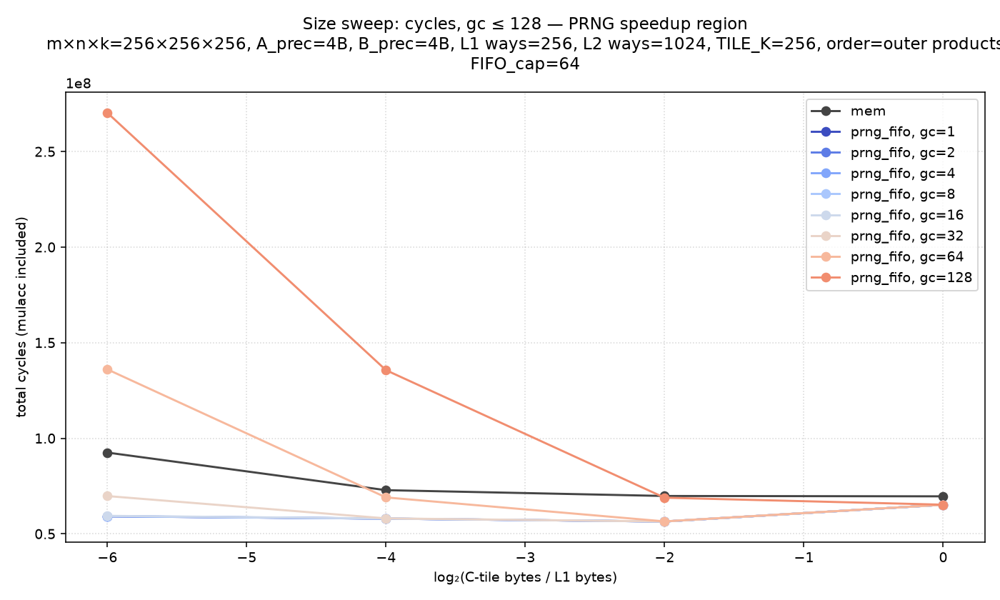
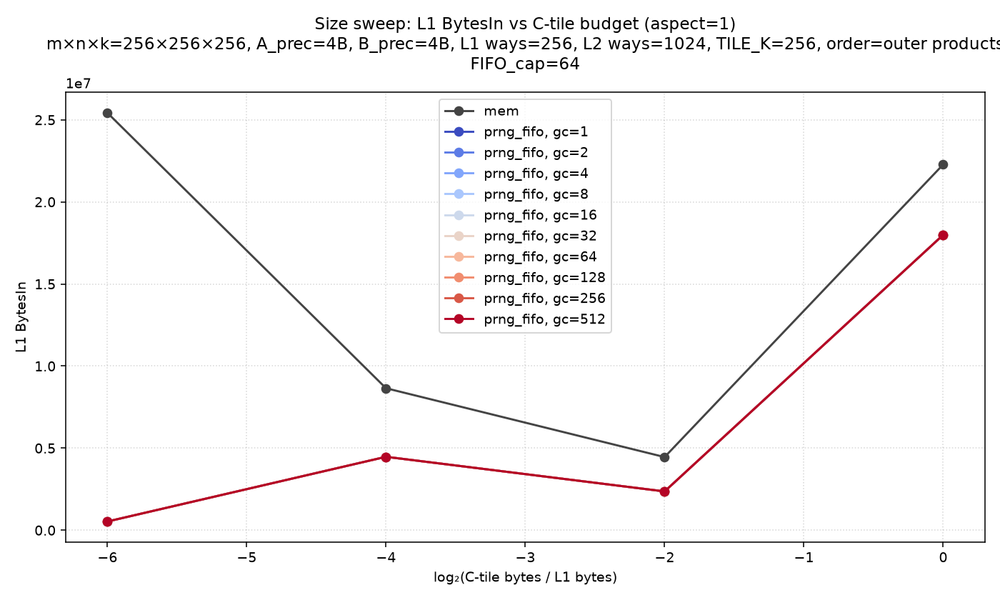
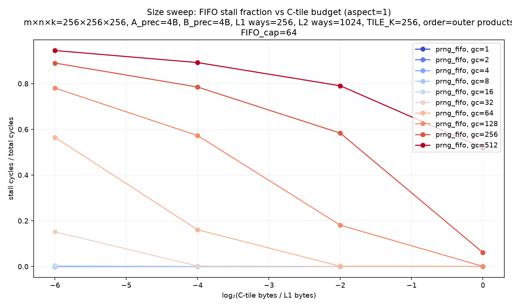
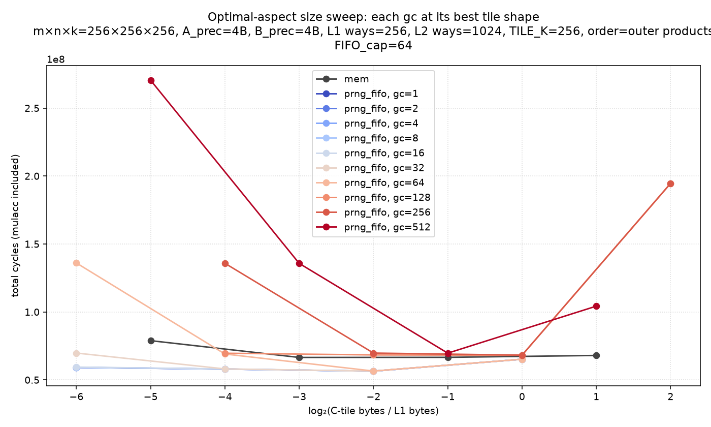
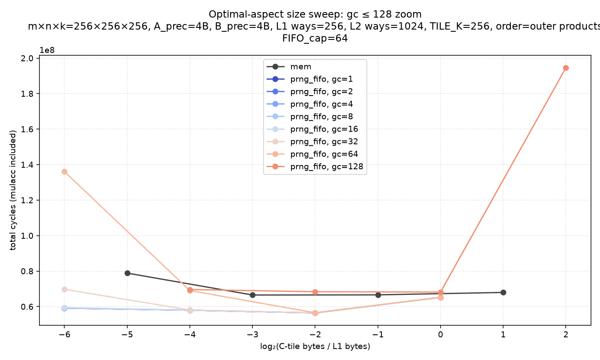

# prng-fifo-tile-sweep

Non-default config: m×n×k=256×256×256, A_prec=4B, B_prec=4B, L1 ways=256, L2 ways=1024, TILE_K=256, order=outer products
FIFO_cap=64

See [WRITEUP.md](WRITEUP.md) for hypotheses and interpretation.

## Aspect sweep (fixed C-tile area, varying T_N/T_M)

| source | 64×8 (log₂=-3) | 64×16 (log₂=-2) | 32×16 (log₂=-1) | 32×32 (log₂=+0) | 16×32 (log₂=+1) | 16×64 (log₂=+2) | 8×64 (log₂=+3) |
|---|---|---|---|---|---|---|---|
| mem | 95,167,104 | 75,080,320 | 66,513,904 | 69,793,152 | 70,361,792 | 71,934,592 | 84,654,784 |
| prng_fifo, gc=1 | 80,971,904 | 68,233,344 | 56,895,996 | 56,433,640 | 57,484,200 | 57,252,840 | 59,168,016 |
| prng_fifo, gc=2 | 80,971,904 | 68,233,344 | 56,895,996 | 56,433,640 | 57,484,200 | 57,252,840 | 59,168,016 |
| prng_fifo, gc=4 | 80,976,000 | 68,235,392 | 56,900,092 | 56,435,688 | 57,488,296 | 57,254,888 | 59,172,112 |
| prng_fifo, gc=8 | 80,984,192 | 68,239,488 | 56,908,284 | 56,439,784 | 57,496,488 | 57,258,984 | 59,180,304 |
| prng_fifo, gc=16 | 81,000,576 | 68,247,680 | 56,924,668 | 56,447,976 | 57,512,872 | 57,267,176 | 59,196,688 |
| prng_fifo, gc=32 | 81,033,344 | 68,264,064 | 56,957,436 | 56,464,360 | 57,545,640 | 57,283,560 | 68,866,360 |
| prng_fifo, gc=64 | 81,098,880 | 68,296,832 | 57,022,972 | 56,497,128 | 68,890,284 | 68,841,704 | 135,675,074 |
| prng_fifo, gc=128 | 81,229,952 | 68,362,368 | 68,988,978 | 68,885,298 | 135,624,768 | 135,710,632 | 269,892,802 |
| prng_fifo, gc=256 | 81,492,096 | 69,735,928 | 135,607,828 | 135,567,792 | 269,842,496 | 269,928,360 | 538,328,258 |
| prng_fifo, gc=512 | 135,710,208 | 135,726,712 | 269,825,556 | 269,785,520 | 538,277,952 | 538,363,816 | 1,075,199,170 |

## Size sweep (square tiles, aspect = 1)

| source | 8×8 (budget=-6) | 16×16 (budget=-4) | 32×32 (budget=-2) | 64×64 (budget=+0) |
|---|---|---|---|---|
| mem | 92,498,192 | 72,831,520 | 69,793,152 | 69,607,584 |
| prng_fifo, gc=1 | 59,177,282 | 57,946,608 | 56,433,640 | 65,199,328 |
| prng_fifo, gc=2 | 59,177,282 | 57,946,608 | 56,433,640 | 65,199,328 |
| prng_fifo, gc=4 | 59,210,050 | 57,954,800 | 56,435,688 | 65,199,840 |
| prng_fifo, gc=8 | 59,275,586 | 57,971,184 | 56,439,784 | 65,200,864 |
| prng_fifo, gc=16 | 59,406,658 | 58,003,952 | 56,447,976 | 65,202,912 |
| prng_fifo, gc=32 | 69,747,522 | 58,069,488 | 56,464,360 | 65,207,008 |
| prng_fifo, gc=64 | 136,026,990 | 69,037,040 | 56,497,128 | 65,215,200 |
| prng_fifo, gc=128 | 270,244,718 | 135,612,160 | 68,885,298 | 65,231,584 |
| prng_fifo, gc=256 | 538,680,174 | 269,829,888 | 135,567,792 | 69,412,896 |
| prng_fifo, gc=512 | 1,075,551,086 | 538,265,344 | 269,785,520 | 135,369,280 |

## Optimal-aspect size sweep (each gc at its best tile shape)

Best aspects from aspect sweep: mem→1/2, gc≤64→1, gc=128,256→1/4, gc=512→1/8

