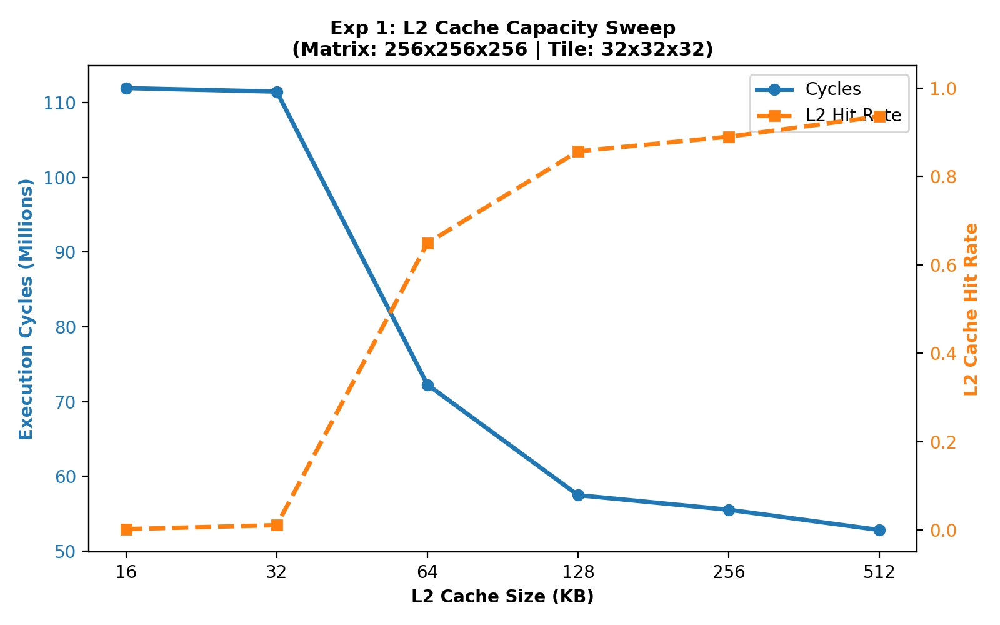
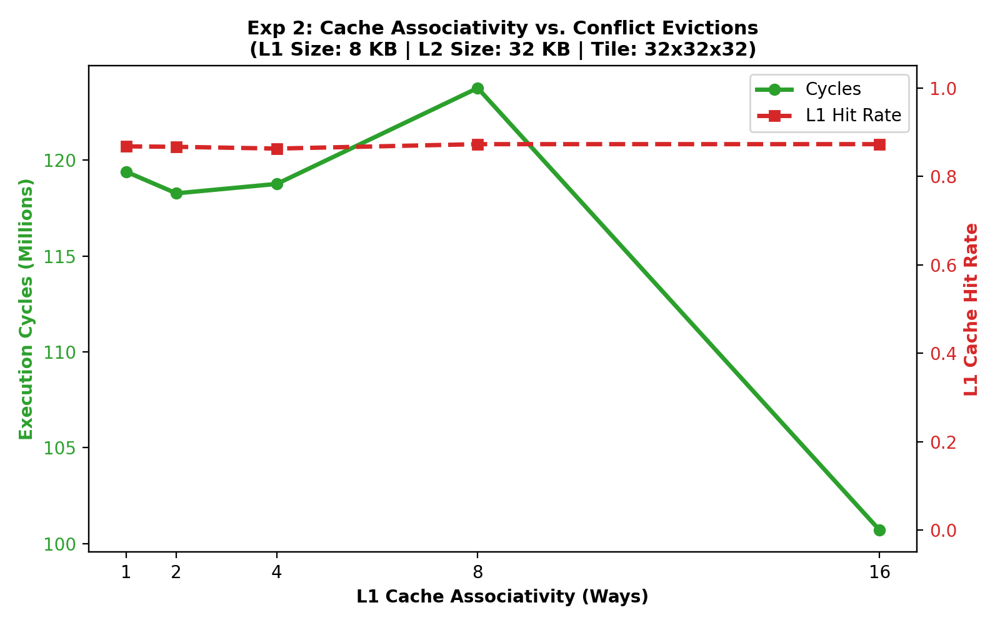
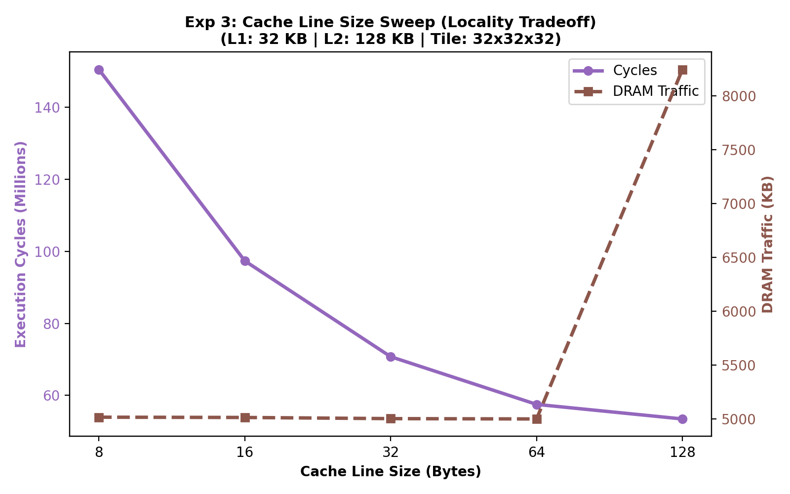
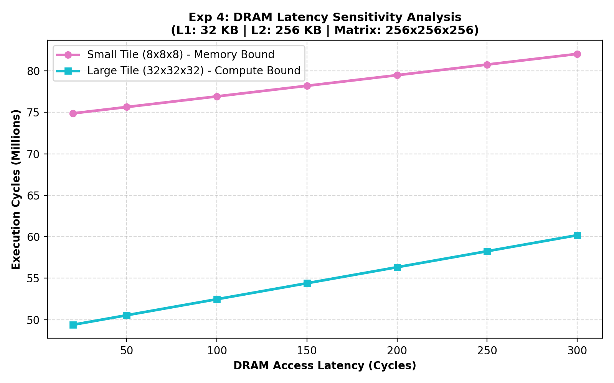
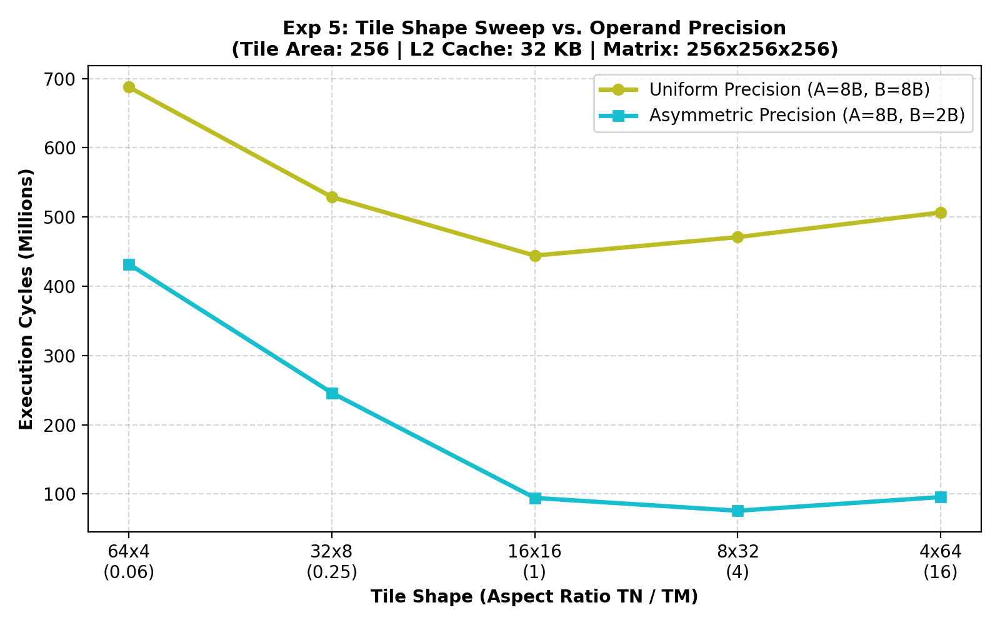

# Basic Architectural Cache Sweeps

This directory contains 5 fundamental sweeps designed to showcase standard cache behavior alongside our mixed-precision tiling results for the mentor.

## Table of Contents
1. [Experiment 1: L2 Cache Capacity Sweep](#experiment-1-l2-cache-capacity-sweep)
2. [Experiment 2: Cache Associativity vs. Conflict Evictions](#experiment-2-cache-associativity-vs-conflict-evictions)
3. [Experiment 3: Cache Line Size Sweep](#experiment-3-cache-line-size-sweep)
4. [Experiment 4: DRAM Latency Sensitivity](#experiment-4-dram-latency-sensitivity)
5. [Experiment 5: The Symmetry of Precision](#experiment-5-the-symmetry-of-precision)

--- 

## 1. Experiment 1: L2 Cache Capacity Sweep

### Experiment 1: L2 Cache Capacity Sweep
This experiment sweeps L2 cache size from 16 KB to 512 KB to demonstrate the transition from capacity thrashing to cache retention.

| L2 Size (KB) | L1 Hit Rate | L2 Hit Rate | DRAM Traffic (KB) | Total Cycles |
| :---: | :---: | :---: | :---: | :---: |
| 16 KB | 0.979 | 0.002 | 35770.5 KB | 111,926,596 |
| 32 KB | 0.979 | 0.011 | 35425.5 KB | 111,451,216 |
| 64 KB | 0.979 | 0.649 | 12509.5 KB | 72,271,696 |
| 128 KB | 0.979 | 0.857 | 5001.0 KB | 57,500,716 |
| 256 KB | 0.979 | 0.890 | 3672.0 KB | 55,550,956 |
| 512 KB | 0.979 | 0.936 | 1792.0 KB | 52,843,756 |

--- 

## 2. Experiment 2: Cache Associativity vs. Conflict Evictions

### Experiment 2: Cache Associativity vs. Conflict Evictions
Sweeping associativity from 1-way (direct-mapped) to 16-way shows how resolving conflict misses directly improves cycles.

| Associativity (L1 / L2) | L1 Hit Rate | L2 Hit Rate | L1 Evictions | L2 Evictions | Total Cycles |
| :---: | :---: | :---: | :---: | :---: | :---: |
| 1-way / 2-way | 0.868 | 0.845 | 1,392,000 | 227,976 | 119,396,836 |
| 2-way / 4-way | 0.867 | 0.851 | 1,408,384 | 220,784 | 118,268,116 |
| 4-way / 8-way | 0.863 | 0.855 | 1,441,152 | 220,784 | 118,759,636 |
| 8-way / 16-way | 0.873 | 0.818 | 1,343,360 | 257,320 | 123,760,816 |
| 16-way / 32-way | 0.873 | 0.892 | 1,343,360 | 151,840 | 100,706,956 |

--- 

## 3. Experiment 3: Cache Line Size Sweep

### Experiment 3: Cache Line Size Sweep
Sweeping cache line size from 8 bytes to 128 bytes shows the tradeoff between spatial locality (fewer misses) and bandwidth bloat (fetching more bytes than used).

| Line Size (B) | L1 Hit Rate | L2 Hit Rate | L1 Fills | L2 Fills | DRAM Traffic (KB) | Total Cycles |
| :---: | :---: | :---: | :---: | :---: | :---: | :---: |
| 8 B | 0.831 | 0.857 | 1,782,296 | 329,304 | 5017.4 KB | 150,491,656 |
| 16 B | 0.916 | 0.857 | 890,336 | 164,568 | 5014.8 KB | 97,354,576 |
| 32 B | 0.958 | 0.857 | 443,768 | 82,112 | 5004.0 KB | 70,745,536 |
| 64 B | 0.979 | 0.857 | 221,296 | 41,032 | 5001.0 KB | 57,500,716 |
| 128 B | 0.989 | 0.780 | 119,456 | 33,480 | 8242.0 KB | 53,454,316 |

--- 

## 4. Experiment 4: DRAM Latency Sensitivity

### Experiment 4: DRAM Latency Sensitivity
Varying the DRAM latency shows that larger tiles reduce DRAM accesses, shielding execution speed from memory delays.

| DRAM Latency | Small Tile (8x8x8) Cycles | Large Tile (32x32x32) Cycles | Speedup (Large vs Small) |
| :---: | :---: | :---: | :---: |
| 20 cycles | 74,871,480 | 49,376,236 | 1.52x |
| 50 cycles | 75,639,480 | 50,533,996 | 1.50x |
| 100 cycles | 76,919,480 | 52,463,596 | 1.47x |
| 150 cycles | 78,199,480 | 54,393,196 | 1.44x |
| 200 cycles | 79,479,480 | 56,322,796 | 1.41x |
| 250 cycles | 80,759,480 | 58,252,396 | 1.39x |
| 300 cycles | 82,039,480 | 60,181,996 | 1.36x |

--- 

## 5. Experiment 5: The Symmetry of Precision

### Experiment 5: The Symmetry of Precision
Sweeping the aspect ratio ($T_N / T_M$) for a fixed tile area ($T_M \cdot T_N = 256$ elements) demonstrates how operand precision dictates the optimal tile shape.

**Uniform Precision (A = 8B, B = 8B)**:
| Tile Shape ($T_M \times T_N$) | Ratio ($T_N/T_M$) | L1 Hit Rate | L2 Hit Rate | DRAM Traffic (KB) | Total Cycles |
| :---: | :---: | :---: | :---: | :---: | :---: |
| 4x64 | 16.0000 | 0.866 | 0.113 | 252496.0 KB | 506,514,048 |
| 8x32 | 4.0000 | 0.867 | 0.066 | 235472.0 KB | 470,942,336 |
| 16x16 | 1.0000 | 0.872 | 0.069 | 219487.0 KB | 444,268,104 |
| 32x8 | 0.2500 | 0.845 | 0.057 | 272351.5 KB | 528,856,916 |
| 64x4 | 0.0625 | 0.820 | 0.000 | 370655.5 KB | 687,585,468 |

**Asymmetric Precision (A = 8B, B = 2B)**:
| Tile Shape ($T_M \times T_N$) | Ratio ($T_N/T_M$) | L1 Hit Rate | L2 Hit Rate | DRAM Traffic (KB) | Total Cycles |
| :---: | :---: | :---: | :---: | :---: | :---: |
| 4x64 | 16.0000 | 0.990 | 0.006 | 20455.0 KB | 95,563,248 |
| 8x32 | 4.0000 | 0.993 | 0.062 | 12384.0 KB | 75,865,076 |
| 16x16 | 1.0000 | 0.987 | 0.115 | 22714.0 KB | 94,369,944 |
| 32x8 | 0.2500 | 0.945 | 0.000 | 107479.0 KB | 246,100,376 |
| 64x4 | 0.0625 | 0.907 | 0.000 | 206807.0 KB | 431,988,888 |

