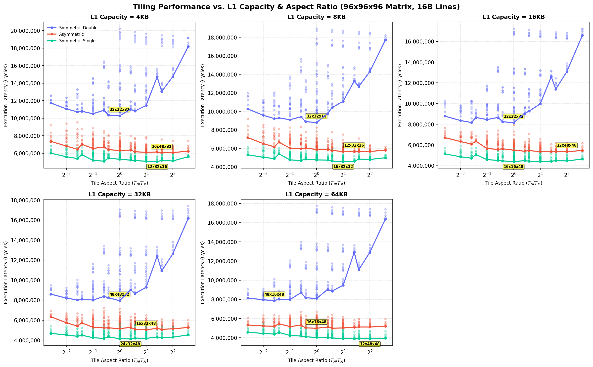

# Empirical L1 Cache Capacity Tiling Sweeps (16B Lines)

This directory contains the results of empirical tile sweeps for a **$96 \times 96 \times 96$ matrix** under a fixed **16B cache line size**, sweeping L1 Cache Capacities $C_{L1} \in \{4, 8, 16, 32, 64\}$ KB and tile dimensions $T_M, T_N, T_K \in \{8, 12, 16, 24, 32, 48\}$.

> [!NOTE]
> **Hardware Parameters:**
> * **Matrix Size:** $96 \times 96 \times 96$.
> * **Cache Line Size:** 16B for both L1 and L2 caches.
> * **L1 Cache:** Swept capacity, 8-way associativity, 4-cycle access, LRU replacement, Write-Back policy.
> * **L2 Cache:** 64 KB capacity, 8-way associativity, 14-cycle access, LRU replacement, Write-Back policy.
> * **DRAM Latency:** 180 cycles.
> * **Register Tile:** $4 \times 4 \times 4$ ($R_M \times R_N \times R_K$), 8-cycle compute (`tmulac`).

## 1. Summary of Optimal Tile Shapes by L1 Cache Capacity

| L1 Capacity | Precision Config | Optimal Tile Shape ($T_M \times T_N \times T_K$) | Ratio ($T_N/T_M$) | Footprint (KB) | L1 Hit Rate | L2 Hit Rate | DRAM Traffic (KB) | Total Cycles |
| :---: | :---: | :---: | :---: | :---: | :---: | :---: | :---: | :---: |
| 4KB | Symmetric Double | 32x32x32 | 1.000 | 24.0 KB | 0.638 | 0.894 | 656.0 KB | 10,271,488 |
| 4KB | Asymmetric | 16x48x32 | 3.000 | 13.0 KB | 0.884 | 0.869 | 267.8 KB | 6,048,904 |
| 4KB | Symmetric Single | 12x32x16 | 2.667 | 4.2 KB | 0.938 | 0.865 | 158.5 KB | 5,046,464 |
| 8KB | Symmetric Double | 32x32x16 | 1.000 | 16.0 KB | 0.881 | 0.772 | 656.0 KB | 8,789,376 |
| 8KB | Asymmetric | 12x32x16 | 2.667 | 5.5 KB | 0.958 | 0.677 | 260.0 KB | 5,648,916 |
| 8KB | Symmetric Single | 16x32x32 | 2.000 | 8.0 KB | 0.954 | 0.771 | 173.2 KB | 4,562,168 |
| 16KB | Symmetric Double | 32x32x32 | 1.000 | 24.0 KB | 0.898 | 0.676 | 656.0 KB | 8,145,952 |
| 16KB | Asymmetric | 12x48x48 | 4.000 | 13.5 KB | 0.952 | 0.711 | 260.0 KB | 5,355,272 |
| 16KB | Symmetric Single | 16x16x48 | 1.000 | 7.0 KB | 0.963 | 0.731 | 156.6 KB | 4,390,160 |
| 32KB | Symmetric Double | 48x48x32 | 1.000 | 42.0 KB | 0.929 | 0.539 | 676.1 KB | 7,941,204 |
| 32KB | Asymmetric | 16x32x48 | 2.000 | 13.0 KB | 0.972 | 0.487 | 260.0 KB | 5,047,984 |
| 32KB | Symmetric Single | 24x32x48 | 1.333 | 13.5 KB | 0.975 | 0.520 | 174.7 KB | 4,123,428 |
| 64KB | Symmetric Double | 48x16x48 | 0.333 | 30.0 KB | 0.954 | 0.197 | 720.8 KB | 7,866,876 |
| 64KB | Asymmetric | 16x16x48 | 1.000 | 9.5 KB | 0.982 | 0.196 | 282.4 KB | 4,994,784 |
| 64KB | Symmetric Single | 12x48x48 | 4.000 | 13.5 KB | 0.988 | 0.159 | 165.0 KB | 3,879,806 |

---

## 2. Details for L1 Capacity = 4KB

### Symmetric Double (4KB)

#### Top 3 Optimal Tile Shapes

| Rank | Tile Shape ($T_M \times T_N \times T_K$) | Ratio ($T_N/T_M$) | Footprint (KB) | L1 Hit Rate | L2 Hit Rate | DRAM Traffic (KB) | Total Cycles |
| :---: | :---: | :---: | :---: | :---: | :---: | :---: | :---: |
| 1 | 32x32x32 | 1.000 | 24.0 KB | 0.638 | 0.894 | 656.0 KB | 10,271,488 |
| 2 | 32x32x48 | 1.000 | 32.0 KB | 0.638 | 0.882 | 696.5 KB | 10,277,824 |
| 3 | 32x24x48 | 0.750 | 27.0 KB | 0.630 | 0.888 | 686.4 KB | 10,364,112 |

#### Bottom 3 Worst Tile Shapes

| Rank | Tile Shape ($T_M \times T_N \times T_K$) | Ratio ($T_N/T_M$) | Footprint (KB) | L1 Hit Rate | L2 Hit Rate | DRAM Traffic (KB) | Total Cycles |
| :---: | :---: | :---: | :---: | :---: | :---: | :---: | :---: |
| 214 | 8x12x16 | 1.500 | 3.2 KB | 0.620 | 0.793 | 1952.0 KB | 19,829,040 |
| 215 | 8x8x12 | 1.000 | 2.0 KB | 0.690 | 0.779 | 1952.0 KB | 19,845,568 |
| 216 | 8x8x16 | 1.000 | 2.5 KB | 0.615 | 0.804 | 1952.0 KB | 20,234,656 |

### Asymmetric (4KB)

#### Top 3 Optimal Tile Shapes

| Rank | Tile Shape ($T_M \times T_N \times T_K$) | Ratio ($T_N/T_M$) | Footprint (KB) | L1 Hit Rate | L2 Hit Rate | DRAM Traffic (KB) | Total Cycles |
| :---: | :---: | :---: | :---: | :---: | :---: | :---: | :---: |
| 1 | 16x48x32 | 3.000 | 13.0 KB | 0.884 | 0.869 | 267.8 KB | 6,048,904 |
| 2 | 12x48x32 | 4.000 | 10.5 KB | 0.885 | 0.874 | 260.0 KB | 6,093,616 |
| 3 | 16x32x32 | 2.000 | 10.0 KB | 0.883 | 0.872 | 268.4 KB | 6,116,296 |

#### Bottom 3 Worst Tile Shapes

| Rank | Tile Shape ($T_M \times T_N \times T_K$) | Ratio ($T_N/T_M$) | Footprint (KB) | L1 Hit Rate | L2 Hit Rate | DRAM Traffic (KB) | Total Cycles |
| :---: | :---: | :---: | :---: | :---: | :---: | :---: | :---: |
| 214 | 48x8x8 | 0.167 | 6.1 KB | 0.784 | 0.949 | 296.0 KB | 9,193,016 |
| 215 | 32x8x8 | 0.250 | 4.1 KB | 0.786 | 0.945 | 331.5 KB | 9,402,428 |
| 216 | 24x8x8 | 0.333 | 3.1 KB | 0.787 | 0.944 | 338.0 KB | 9,541,280 |

### Symmetric Single (4KB)

#### Top 3 Optimal Tile Shapes

| Rank | Tile Shape ($T_M \times T_N \times T_K$) | Ratio ($T_N/T_M$) | Footprint (KB) | L1 Hit Rate | L2 Hit Rate | DRAM Traffic (KB) | Total Cycles |
| :---: | :---: | :---: | :---: | :---: | :---: | :---: | :---: |
| 1 | 12x32x16 | 2.667 | 4.2 KB | 0.938 | 0.865 | 158.5 KB | 5,046,464 |
| 2 | 16x32x16 | 2.000 | 5.0 KB | 0.936 | 0.860 | 175.4 KB | 5,094,240 |
| 3 | 48x32x16 | 0.667 | 11.0 KB | 0.943 | 0.809 | 224.0 KB | 5,100,288 |

#### Bottom 3 Worst Tile Shapes

| Rank | Tile Shape ($T_M \times T_N \times T_K$) | Ratio ($T_N/T_M$) | Footprint (KB) | L1 Hit Rate | L2 Hit Rate | DRAM Traffic (KB) | Total Cycles |
| :---: | :---: | :---: | :---: | :---: | :---: | :---: | :---: |
| 214 | 32x12x8 | 0.375 | 2.9 KB | 0.920 | 0.880 | 272.5 KB | 6,667,860 |
| 215 | 48x8x8 | 0.167 | 3.2 KB | 0.888 | 0.922 | 224.0 KB | 6,843,120 |
| 216 | 32x8x8 | 0.250 | 2.2 KB | 0.912 | 0.890 | 275.5 KB | 6,965,736 |

---

## 2. Details for L1 Capacity = 8KB

### Symmetric Double (8KB)

#### Top 3 Optimal Tile Shapes

| Rank | Tile Shape ($T_M \times T_N \times T_K$) | Ratio ($T_N/T_M$) | Footprint (KB) | L1 Hit Rate | L2 Hit Rate | DRAM Traffic (KB) | Total Cycles |
| :---: | :---: | :---: | :---: | :---: | :---: | :---: | :---: |
| 1 | 32x32x16 | 1.000 | 16.0 KB | 0.881 | 0.772 | 656.0 KB | 8,789,376 |
| 2 | 32x24x16 | 0.750 | 13.0 KB | 0.875 | 0.782 | 656.0 KB | 8,891,648 |
| 3 | 32x16x16 | 0.500 | 10.0 KB | 0.864 | 0.800 | 656.0 KB | 9,095,296 |

#### Bottom 3 Worst Tile Shapes

| Rank | Tile Shape ($T_M \times T_N \times T_K$) | Ratio ($T_N/T_M$) | Footprint (KB) | L1 Hit Rate | L2 Hit Rate | DRAM Traffic (KB) | Total Cycles |
| :---: | :---: | :---: | :---: | :---: | :---: | :---: | :---: |
| 214 | 8x16x32 | 2.000 | 7.0 KB | 0.644 | 0.745 | 1952.0 KB | 18,728,896 |
| 215 | 8x12x32 | 1.500 | 5.8 KB | 0.654 | 0.745 | 1952.0 KB | 18,795,904 |
| 216 | 8x8x32 | 1.000 | 4.5 KB | 0.670 | 0.746 | 1952.0 KB | 18,958,144 |

### Asymmetric (8KB)

#### Top 3 Optimal Tile Shapes

| Rank | Tile Shape ($T_M \times T_N \times T_K$) | Ratio ($T_N/T_M$) | Footprint (KB) | L1 Hit Rate | L2 Hit Rate | DRAM Traffic (KB) | Total Cycles |
| :---: | :---: | :---: | :---: | :---: | :---: | :---: | :---: |
| 1 | 12x32x16 | 2.667 | 5.5 KB | 0.958 | 0.677 | 260.0 KB | 5,648,916 |
| 2 | 16x32x48 | 2.000 | 13.0 KB | 0.919 | 0.807 | 269.6 KB | 5,662,784 |
| 3 | 12x48x32 | 4.000 | 10.5 KB | 0.935 | 0.804 | 260.0 KB | 5,674,264 |

#### Bottom 3 Worst Tile Shapes

| Rank | Tile Shape ($T_M \times T_N \times T_K$) | Ratio ($T_N/T_M$) | Footprint (KB) | L1 Hit Rate | L2 Hit Rate | DRAM Traffic (KB) | Total Cycles |
| :---: | :---: | :---: | :---: | :---: | :---: | :---: | :---: |
| 214 | 48x8x12 | 0.167 | 7.7 KB | 0.788 | 0.940 | 296.0 KB | 8,381,380 |
| 215 | 48x12x8 | 0.250 | 7.7 KB | 0.821 | 0.940 | 296.0 KB | 8,541,628 |
| 216 | 48x8x8 | 0.167 | 6.1 KB | 0.784 | 0.949 | 296.0 KB | 9,192,388 |

### Symmetric Single (8KB)

#### Top 3 Optimal Tile Shapes

| Rank | Tile Shape ($T_M \times T_N \times T_K$) | Ratio ($T_N/T_M$) | Footprint (KB) | L1 Hit Rate | L2 Hit Rate | DRAM Traffic (KB) | Total Cycles |
| :---: | :---: | :---: | :---: | :---: | :---: | :---: | :---: |
| 1 | 16x32x32 | 2.000 | 8.0 KB | 0.954 | 0.771 | 173.2 KB | 4,562,168 |
| 2 | 12x32x32 | 2.667 | 7.0 KB | 0.949 | 0.805 | 158.5 KB | 4,593,248 |
| 3 | 16x24x32 | 1.500 | 6.5 KB | 0.952 | 0.781 | 174.2 KB | 4,629,548 |

#### Bottom 3 Worst Tile Shapes

| Rank | Tile Shape ($T_M \times T_N \times T_K$) | Ratio ($T_N/T_M$) | Footprint (KB) | L1 Hit Rate | L2 Hit Rate | DRAM Traffic (KB) | Total Cycles |
| :---: | :---: | :---: | :---: | :---: | :---: | :---: | :---: |
| 214 | 48x8x8 | 0.167 | 3.2 KB | 0.935 | 0.862 | 224.0 KB | 6,130,296 |
| 215 | 32x8x12 | 0.250 | 2.9 KB | 0.933 | 0.823 | 275.2 KB | 6,142,036 |
| 216 | 32x8x8 | 0.250 | 2.2 KB | 0.942 | 0.813 | 274.8 KB | 6,386,408 |

---

## 2. Details for L1 Capacity = 16KB

### Symmetric Double (16KB)

#### Top 3 Optimal Tile Shapes

| Rank | Tile Shape ($T_M \times T_N \times T_K$) | Ratio ($T_N/T_M$) | Footprint (KB) | L1 Hit Rate | L2 Hit Rate | DRAM Traffic (KB) | Total Cycles |
| :---: | :---: | :---: | :---: | :---: | :---: | :---: | :---: |
| 1 | 32x32x32 | 1.000 | 24.0 KB | 0.898 | 0.676 | 656.0 KB | 8,145,952 |
| 2 | 48x16x32 | 0.333 | 22.0 KB | 0.881 | 0.739 | 610.2 KB | 8,167,328 |
| 3 | 32x24x32 | 0.750 | 20.0 KB | 0.891 | 0.696 | 656.0 KB | 8,249,400 |

#### Bottom 3 Worst Tile Shapes

| Rank | Tile Shape ($T_M \times T_N \times T_K$) | Ratio ($T_N/T_M$) | Footprint (KB) | L1 Hit Rate | L2 Hit Rate | DRAM Traffic (KB) | Total Cycles |
| :---: | :---: | :---: | :---: | :---: | :---: | :---: | :---: |
| 214 | 8x48x48 | 6.000 | 24.0 KB | 0.737 | 0.628 | 1928.2 KB | 17,218,584 |
| 215 | 8x48x8 | 6.000 | 6.5 KB | 0.914 | 0.084 | 2041.3 KB | 17,223,744 |
| 216 | 8x8x8 | 1.000 | 1.5 KB | 0.910 | 0.240 | 1952.0 KB | 17,246,864 |

### Asymmetric (16KB)

#### Top 3 Optimal Tile Shapes

| Rank | Tile Shape ($T_M \times T_N \times T_K$) | Ratio ($T_N/T_M$) | Footprint (KB) | L1 Hit Rate | L2 Hit Rate | DRAM Traffic (KB) | Total Cycles |
| :---: | :---: | :---: | :---: | :---: | :---: | :---: | :---: |
| 1 | 12x48x48 | 4.000 | 13.5 KB | 0.952 | 0.711 | 260.0 KB | 5,355,272 |
| 2 | 12x32x48 | 2.667 | 10.5 KB | 0.954 | 0.689 | 260.0 KB | 5,359,976 |
| 3 | 16x48x48 | 3.000 | 16.5 KB | 0.949 | 0.715 | 269.8 KB | 5,363,504 |

#### Bottom 3 Worst Tile Shapes

| Rank | Tile Shape ($T_M \times T_N \times T_K$) | Ratio ($T_N/T_M$) | Footprint (KB) | L1 Hit Rate | L2 Hit Rate | DRAM Traffic (KB) | Total Cycles |
| :---: | :---: | :---: | :---: | :---: | :---: | :---: | :---: |
| 214 | 48x32x8 | 0.667 | 15.5 KB | 0.928 | 0.801 | 415.3 KB | 7,414,888 |
| 215 | 48x8x8 | 0.167 | 6.1 KB | 0.885 | 0.901 | 296.0 KB | 7,631,816 |
| 216 | 48x48x8 | 1.000 | 21.8 KB | 0.905 | 0.859 | 430.6 KB | 7,941,788 |

### Symmetric Single (16KB)

#### Top 3 Optimal Tile Shapes

| Rank | Tile Shape ($T_M \times T_N \times T_K$) | Ratio ($T_N/T_M$) | Footprint (KB) | L1 Hit Rate | L2 Hit Rate | DRAM Traffic (KB) | Total Cycles |
| :---: | :---: | :---: | :---: | :---: | :---: | :---: | :---: |
| 1 | 16x16x48 | 1.000 | 7.0 KB | 0.963 | 0.731 | 156.6 KB | 4,390,160 |
| 2 | 16x32x48 | 2.000 | 11.0 KB | 0.959 | 0.721 | 176.3 KB | 4,410,620 |
| 3 | 16x16x32 | 1.000 | 5.0 KB | 0.968 | 0.677 | 159.5 KB | 4,417,796 |

#### Bottom 3 Worst Tile Shapes

| Rank | Tile Shape ($T_M \times T_N \times T_K$) | Ratio ($T_N/T_M$) | Footprint (KB) | L1 Hit Rate | L2 Hit Rate | DRAM Traffic (KB) | Total Cycles |
| :---: | :---: | :---: | :---: | :---: | :---: | :---: | :---: |
| 214 | 48x8x8 | 0.167 | 3.2 KB | 0.957 | 0.749 | 224.0 KB | 5,713,152 |
| 215 | 32x12x8 | 0.375 | 2.9 KB | 0.971 | 0.566 | 271.3 KB | 5,731,308 |
| 216 | 32x8x8 | 0.250 | 2.2 KB | 0.971 | 0.572 | 274.5 KB | 5,904,670 |

---

## 2. Details for L1 Capacity = 32KB

### Symmetric Double (32KB)

#### Top 3 Optimal Tile Shapes

| Rank | Tile Shape ($T_M \times T_N \times T_K$) | Ratio ($T_N/T_M$) | Footprint (KB) | L1 Hit Rate | L2 Hit Rate | DRAM Traffic (KB) | Total Cycles |
| :---: | :---: | :---: | :---: | :---: | :---: | :---: | :---: |
| 1 | 48x48x32 | 1.000 | 42.0 KB | 0.929 | 0.539 | 676.1 KB | 7,941,204 |
| 2 | 32x16x48 | 0.500 | 22.0 KB | 0.915 | 0.596 | 659.0 KB | 8,007,876 |
| 3 | 48x16x48 | 0.333 | 30.0 KB | 0.892 | 0.681 | 629.9 KB | 8,020,692 |

#### Bottom 3 Worst Tile Shapes

| Rank | Tile Shape ($T_M \times T_N \times T_K$) | Ratio ($T_N/T_M$) | Footprint (KB) | L1 Hit Rate | L2 Hit Rate | DRAM Traffic (KB) | Total Cycles |
| :---: | :---: | :---: | :---: | :---: | :---: | :---: | :---: |
| 214 | 8x8x8 | 1.000 | 1.5 KB | 0.927 | 0.073 | 1957.8 KB | 17,053,968 |
| 215 | 8x48x12 | 6.000 | 8.2 KB | 0.905 | 0.065 | 2077.2 KB | 17,128,176 |
| 216 | 8x48x8 | 6.000 | 6.5 KB | 0.914 | 0.065 | 2077.6 KB | 17,425,584 |

### Asymmetric (32KB)

#### Top 3 Optimal Tile Shapes

| Rank | Tile Shape ($T_M \times T_N \times T_K$) | Ratio ($T_N/T_M$) | Footprint (KB) | L1 Hit Rate | L2 Hit Rate | DRAM Traffic (KB) | Total Cycles |
| :---: | :---: | :---: | :---: | :---: | :---: | :---: | :---: |
| 1 | 16x32x48 | 2.000 | 13.0 KB | 0.972 | 0.487 | 260.0 KB | 5,047,984 |
| 2 | 16x48x48 | 3.000 | 16.5 KB | 0.969 | 0.505 | 267.2 KB | 5,081,560 |
| 3 | 16x24x48 | 1.500 | 11.2 KB | 0.972 | 0.487 | 260.1 KB | 5,085,140 |

#### Bottom 3 Worst Tile Shapes

| Rank | Tile Shape ($T_M \times T_N \times T_K$) | Ratio ($T_N/T_M$) | Footprint (KB) | L1 Hit Rate | L2 Hit Rate | DRAM Traffic (KB) | Total Cycles |
| :---: | :---: | :---: | :---: | :---: | :---: | :---: | :---: |
| 214 | 48x24x8 | 0.500 | 12.4 KB | 0.965 | 0.437 | 453.1 KB | 6,982,812 |
| 215 | 48x48x8 | 1.000 | 21.8 KB | 0.960 | 0.603 | 471.1 KB | 7,149,564 |
| 216 | 48x32x8 | 0.667 | 15.5 KB | 0.971 | 0.248 | 513.4 KB | 7,196,088 |

### Symmetric Single (32KB)

#### Top 3 Optimal Tile Shapes

| Rank | Tile Shape ($T_M \times T_N \times T_K$) | Ratio ($T_N/T_M$) | Footprint (KB) | L1 Hit Rate | L2 Hit Rate | DRAM Traffic (KB) | Total Cycles |
| :---: | :---: | :---: | :---: | :---: | :---: | :---: | :---: |
| 1 | 24x32x48 | 1.333 | 13.5 KB | 0.975 | 0.520 | 174.7 KB | 4,123,428 |
| 2 | 24x24x48 | 1.000 | 11.2 KB | 0.975 | 0.527 | 171.1 KB | 4,137,884 |
| 3 | 24x16x48 | 0.667 | 9.0 KB | 0.976 | 0.536 | 165.9 KB | 4,179,924 |

#### Bottom 3 Worst Tile Shapes

| Rank | Tile Shape ($T_M \times T_N \times T_K$) | Ratio ($T_N/T_M$) | Footprint (KB) | L1 Hit Rate | L2 Hit Rate | DRAM Traffic (KB) | Total Cycles |
| :---: | :---: | :---: | :---: | :---: | :---: | :---: | :---: |
| 214 | 8x12x8 | 1.500 | 1.0 KB | 0.962 | 0.799 | 152.0 KB | 5,495,104 |
| 215 | 32x48x8 | 1.500 | 8.5 KB | 0.981 | 0.227 | 313.1 KB | 5,575,956 |
| 216 | 8x8x8 | 1.000 | 0.8 KB | 0.964 | 0.799 | 152.0 KB | 5,642,560 |

---

## 2. Details for L1 Capacity = 64KB

### Symmetric Double (64KB)

#### Top 3 Optimal Tile Shapes

| Rank | Tile Shape ($T_M \times T_N \times T_K$) | Ratio ($T_N/T_M$) | Footprint (KB) | L1 Hit Rate | L2 Hit Rate | DRAM Traffic (KB) | Total Cycles |
| :---: | :---: | :---: | :---: | :---: | :---: | :---: | :---: |
| 1 | 48x16x48 | 0.333 | 30.0 KB | 0.954 | 0.197 | 720.8 KB | 7,866,876 |
| 2 | 48x12x48 | 0.250 | 27.0 KB | 0.956 | 0.199 | 723.6 KB | 7,962,868 |
| 3 | 32x16x48 | 0.500 | 22.0 KB | 0.960 | 0.044 | 745.0 KB | 7,987,968 |

#### Bottom 3 Worst Tile Shapes

| Rank | Tile Shape ($T_M \times T_N \times T_K$) | Ratio ($T_N/T_M$) | Footprint (KB) | L1 Hit Rate | L2 Hit Rate | DRAM Traffic (KB) | Total Cycles |
| :---: | :---: | :---: | :---: | :---: | :---: | :---: | :---: |
| 214 | 8x16x8 | 2.000 | 2.5 KB | 0.923 | 0.000 | 2086.0 KB | 17,529,536 |
| 215 | 8x12x8 | 1.500 | 2.0 KB | 0.925 | 0.000 | 2086.0 KB | 17,603,264 |
| 216 | 8x8x8 | 1.000 | 1.5 KB | 0.928 | 0.000 | 2086.0 KB | 17,750,720 |

### Asymmetric (64KB)

#### Top 3 Optimal Tile Shapes

| Rank | Tile Shape ($T_M \times T_N \times T_K$) | Ratio ($T_N/T_M$) | Footprint (KB) | L1 Hit Rate | L2 Hit Rate | DRAM Traffic (KB) | Total Cycles |
| :---: | :---: | :---: | :---: | :---: | :---: | :---: | :---: |
| 1 | 16x16x48 | 1.000 | 9.5 KB | 0.982 | 0.196 | 282.4 KB | 4,994,784 |
| 2 | 16x24x48 | 1.500 | 11.2 KB | 0.982 | 0.164 | 295.9 KB | 4,997,444 |
| 3 | 16x32x48 | 2.000 | 13.0 KB | 0.981 | 0.136 | 307.9 KB | 5,028,300 |

#### Bottom 3 Worst Tile Shapes

| Rank | Tile Shape ($T_M \times T_N \times T_K$) | Ratio ($T_N/T_M$) | Footprint (KB) | L1 Hit Rate | L2 Hit Rate | DRAM Traffic (KB) | Total Cycles |
| :---: | :---: | :---: | :---: | :---: | :---: | :---: | :---: |
| 214 | 48x24x8 | 0.500 | 12.4 KB | 0.981 | 0.097 | 419.3 KB | 6,419,024 |
| 215 | 48x32x8 | 0.667 | 15.5 KB | 0.979 | 0.085 | 464.2 KB | 6,681,084 |
| 216 | 48x48x8 | 1.000 | 21.8 KB | 0.978 | 0.091 | 475.2 KB | 6,703,766 |

### Symmetric Single (64KB)

#### Top 3 Optimal Tile Shapes

| Rank | Tile Shape ($T_M \times T_N \times T_K$) | Ratio ($T_N/T_M$) | Footprint (KB) | L1 Hit Rate | L2 Hit Rate | DRAM Traffic (KB) | Total Cycles |
| :---: | :---: | :---: | :---: | :---: | :---: | :---: | :---: |
| 1 | 12x48x48 | 4.000 | 13.5 KB | 0.988 | 0.159 | 165.0 KB | 3,879,806 |
| 2 | 12x32x48 | 2.667 | 9.8 KB | 0.988 | 0.161 | 162.6 KB | 3,902,038 |
| 3 | 16x48x48 | 3.000 | 15.0 KB | 0.986 | 0.157 | 180.1 KB | 3,916,766 |

#### Bottom 3 Worst Tile Shapes

| Rank | Tile Shape ($T_M \times T_N \times T_K$) | Ratio ($T_N/T_M$) | Footprint (KB) | L1 Hit Rate | L2 Hit Rate | DRAM Traffic (KB) | Total Cycles |
| :---: | :---: | :---: | :---: | :---: | :---: | :---: | :---: |
| 214 | 48x8x8 | 0.167 | 3.2 KB | 0.989 | 0.051 | 245.9 KB | 5,318,392 |
| 215 | 32x12x8 | 0.375 | 2.9 KB | 0.986 | 0.168 | 253.2 KB | 5,319,032 |
| 216 | 32x8x8 | 0.250 | 2.2 KB | 0.987 | 0.171 | 255.3 KB | 5,483,870 |

---

## 3. Aspect Ratio Sensitivity vs. L1 Capacity
The plot below details how the L1 capacity size affects both execution cycles and the shape aspect ratio trend.

