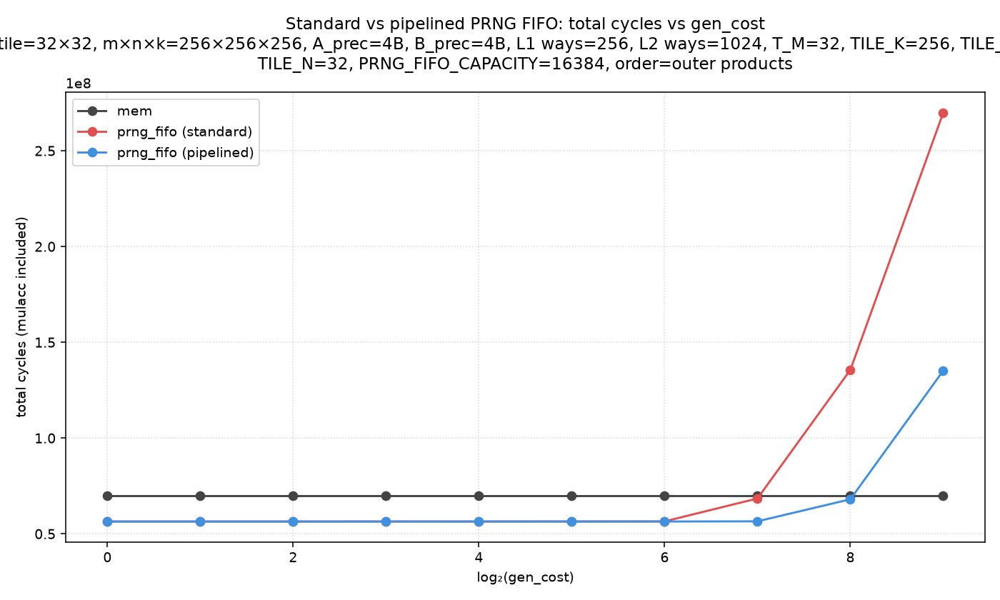
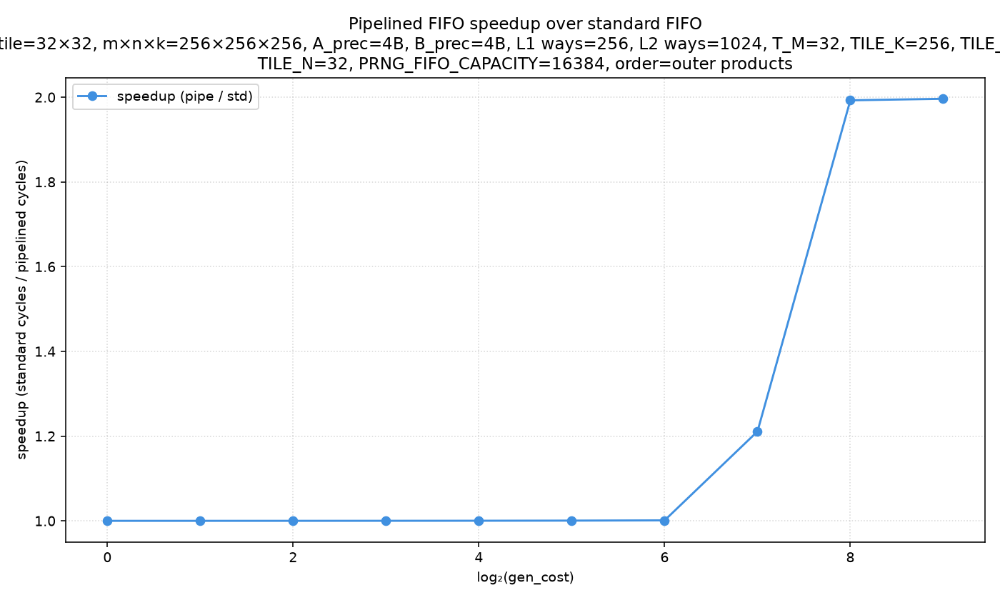
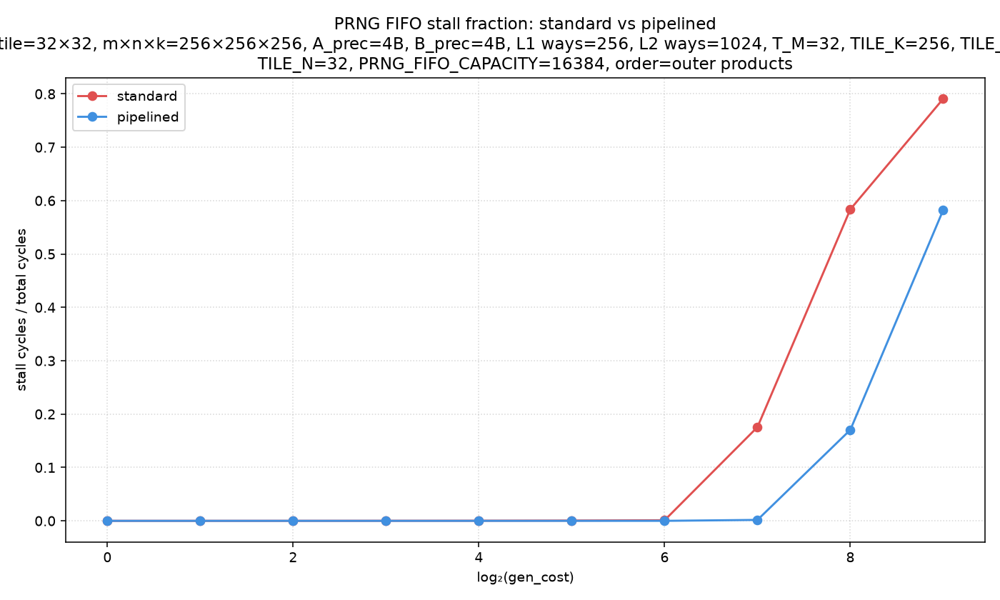

# prng-fifo-pipelined-sweep

Non-default config: m×n×k=256×256×256, A_prec=4B, B_prec=4B, L1 ways=256, L2 ways=1024, T_M=32, TILE_K=256, TILE_M=32
TILE_N=32, PRNG_FIFO_CAPACITY=16384, order=outer products

**Device**: `prng_fifo_pipelined` — dual-buffer design with two parallel
generation engines. While computing C-tile (i,j), the prefill engine
pre-generates tile (i,j+1)'s B elements. At the start of (i,j+1),
a `SWAP_REG` write makes the pre-generated elements available instantly.

Prefill buffer capacity: 16384 elements (= 2 × TN×TK = 2×1024).

## Results

### Speedup summary

| gen_cost | speedup |
|---|---|
| 1 | 1.00× |
| 2 | 1.00× |
| 4 | 1.00× |
| 8 | 1.00× |
| 16 | 1.00× |
| 32 | 1.00× |
| 64 | 1.00× |
| 128 | 1.21× |
| 256 | 1.99× |
| 512 | 2.00× |

**Key finding**: pipelining overlaps B generation with computation, reducing stall cycles by 14× at gc=512 and giving ≈2× total speedup. The benefit saturates for gen_cost below the crossover (~104 cycles/element in the traffic run, ~244 in the cycles run with mulac=8).
