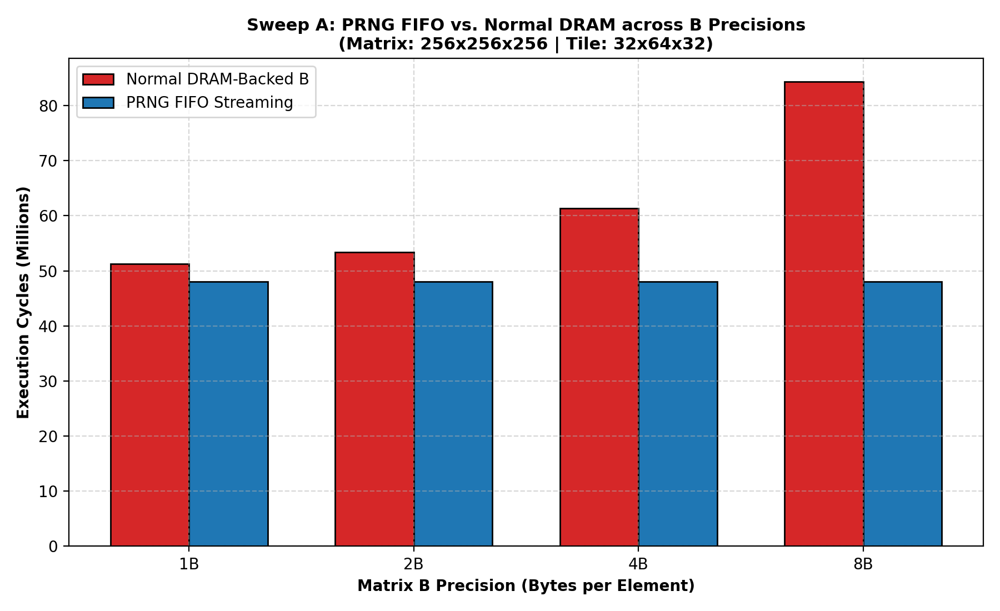
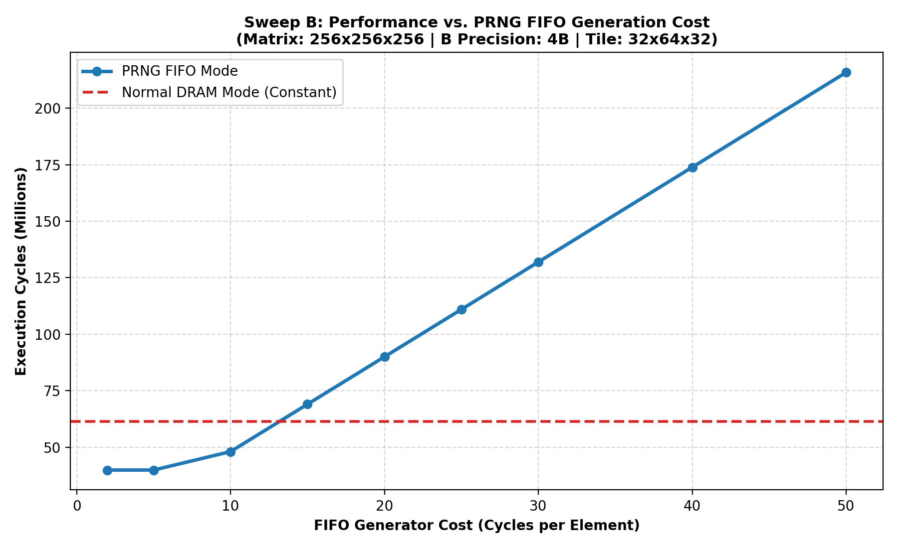
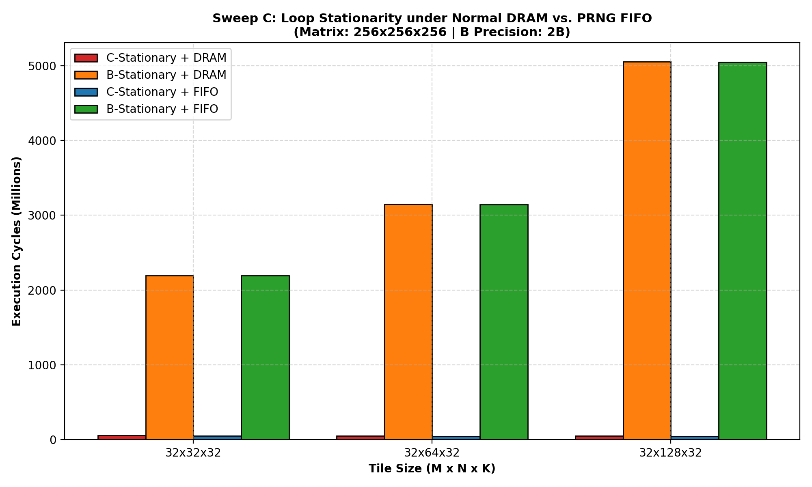
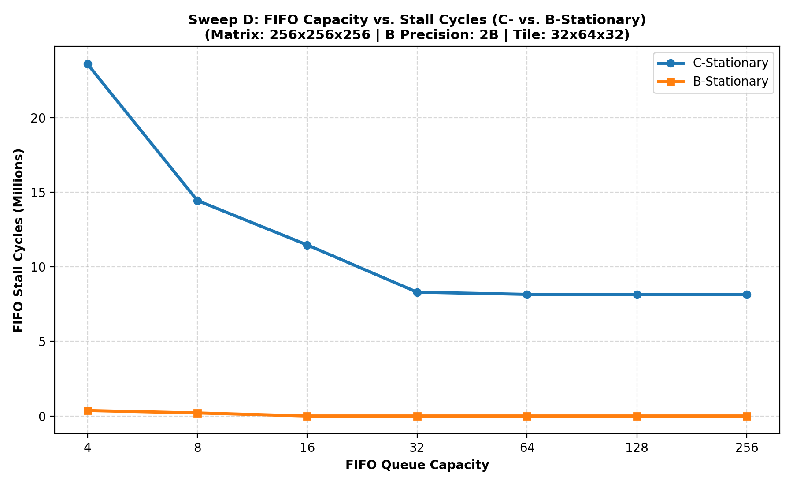

# Advanced Sweeps: PRNG FIFO vs. Normal DRAM-Backed Mode

This directory contains 4 advanced sweeps designed to evaluate the trade-offs between background MMIO PRNG FIFO streaming and standard DRAM cache lines fetching.

## Table of Contents
1. [Sweep A: B Precision Sweep](#sweep-a-matrix-b-precision-sweep)
2. [Sweep B: FIFO Generator Cost Sweep](#sweep-b-fifo-generator-cost-sweep)
3. [Sweep C: Loop Stationarity Sweep](#sweep-c-loop-stationarity-memory-access-method)
4. [Sweep D: FIFO Capacity Sweep](#sweep-d-fifo-capacity-sweep)

--- 

## 1. Sweep A: Matrix B Precision Sweep

### Sweep A: Matrix B Precision Sweep
This sweep compares the cycles and hit rates of Normal DRAM-backed mode against MMIO PRNG FIFO mode across different precision levels of matrix B.

| B Precision | Normal Cycles | FIFO Cycles | FIFO Stall Cycles | L1 Hit Rate (Normal) | L2 Hit Rate (Normal) | Speedup |
| :---: | :---: | :---: | :---: | :---: | :---: | :---: |
| 1B | 51,219,420 | 48,059,152 | 8,158,792 | 0.986 | 0.908 | 1.07x |
| 2B | 53,334,720 | 48,059,152 | 8,158,792 | 0.985 | 0.864 | 1.11x |
| 4B | 61,356,240 | 48,059,152 | 8,158,792 | 0.959 | 0.893 | 1.28x |
| 8B | 84,308,640 | 48,059,152 | 8,158,792 | 0.864 | 0.939 | 1.75x |

--- 

## 2. Sweep B: FIFO Generator Cost Sweep

### Sweep B: FIFO Generator Cost Sweep
This experiment sweeps the FIFO generation cost to identify the "crossover point" where the generator's cost makes it slower than loading from DRAM.

*   **Normal DRAM Cycles (Constant)**: 61,356,240

| Gen Cost (cy/elem) | FIFO Cycles | FIFO Stall Cycles | Stall % | FIFO vs. Normal Ratio |
| :---: | :---: | :---: | :---: | :---: |
| 2 cycles | 39,900,360 | 0 | 0.00% | 0.65x |
| 5 cycles | 39,900,360 | 0 | 0.00% | 0.65x |
| 10 cycles | 48,059,152 | 8,158,792 | 16.98% | 0.78x |
| 15 cycles | 69,030,672 | 29,130,312 | 42.20% | 1.13x |
| 20 cycles | 90,002,192 | 50,101,832 | 55.67% | 1.47x |
| 25 cycles | 110,973,712 | 71,073,352 | 64.05% | 1.81x |
| 30 cycles | 131,945,232 | 92,044,872 | 69.76% | 2.15x |
| 40 cycles | 173,888,272 | 133,987,912 | 77.05% | 2.83x |
| 50 cycles | 215,831,312 | 175,930,952 | 81.51% | 3.52x |

--- 

## 3. Sweep C: Loop Stationarity Sweep

### Sweep C: Loop Stationarity & Memory Access Method
Comparing C-Stationary and B-Stationary policies under Normal DRAM vs. PRNG FIFO.

| Tile Size | Policy & Mode | Total Cycles | FIFO Stall Cycles | L1 Hit Rate | L2 Hit Rate |
| :---: | :---: | :---: | :---: | :---: | :---: |
| 32x32x32 | C-Stationary + DRAM | 55,550,956 | N/A | 0.979 | 0.890 |
| 32x32x32 | B-Stationary + DRAM | 2,194,066,364 | N/A | 0.869 | 0.273 |
| 32x32x32 | C-Stationary + FIFO | 49,627,560 | 7,685,704 | 0.965 | 0.939 |
| 32x32x32 | B-Stationary + FIFO | 2,192,542,205 | 8,192 | 0.868 | 0.273 |
| --- | --- | --- | --- | --- | --- |
| 32x64x32 | C-Stationary + DRAM | 53,334,720 | N/A | 0.985 | 0.864 |
| 32x64x32 | B-Stationary + DRAM | 3,146,615,932 | N/A | 0.870 | 0.200 |
| 32x64x32 | C-Stationary + FIFO | 48,059,152 | 8,158,792 | 0.975 | 0.920 |
| 32x64x32 | B-Stationary + FIFO | 3,144,736,357 | 4,096 | 0.870 | 0.200 |
| --- | --- | --- | --- | --- | --- |
| 32x128x32 | C-Stationary + DRAM | 52,141,072 | N/A | 0.987 | 0.850 |
| 32x128x32 | B-Stationary + DRAM | 5,051,573,828 | N/A | 0.872 | 0.130 |
| 32x128x32 | C-Stationary + FIFO | 47,274,528 | 8,395,336 | 0.980 | 0.905 |
| 32x128x32 | B-Stationary + FIFO | 5,048,993,945 | 2,048 | 0.872 | 0.130 |
| --- | --- | --- | --- | --- | --- |

--- 

## 4. Sweep D: FIFO Capacity Sweep

### Sweep D: FIFO Capacity Sweep
This sweep evaluates the stall cycles for different FIFO capacities under both C-Stationary and B-Stationary dataflow models.

| FIFO Capacity | C-Stationary Cycles | C-Stationary Stalls | B-Stationary Cycles | B-Stationary Stalls |
| :---: | :---: | :---: | :---: | :---: |
| 4 entries | 63,493,320 | 23,592,960 | 3,145,102,117 | 369,856 |
| 8 entries | 54,346,952 | 14,446,592 | 3,144,939,557 | 207,296 |
| 16 entries | 51,368,776 | 11,468,416 | 3,144,736,357 | 4,096 |
| 32 entries | 48,205,456 | 8,305,096 | 3,144,736,357 | 4,096 |
| 64 entries | 48,059,152 | 8,158,792 | 3,144,736,357 | 4,096 |
| 128 entries | 48,059,152 | 8,158,792 | 3,144,736,357 | 4,096 |
| 256 entries | 48,059,152 | 8,158,792 | 3,144,736,357 | 4,096 |

