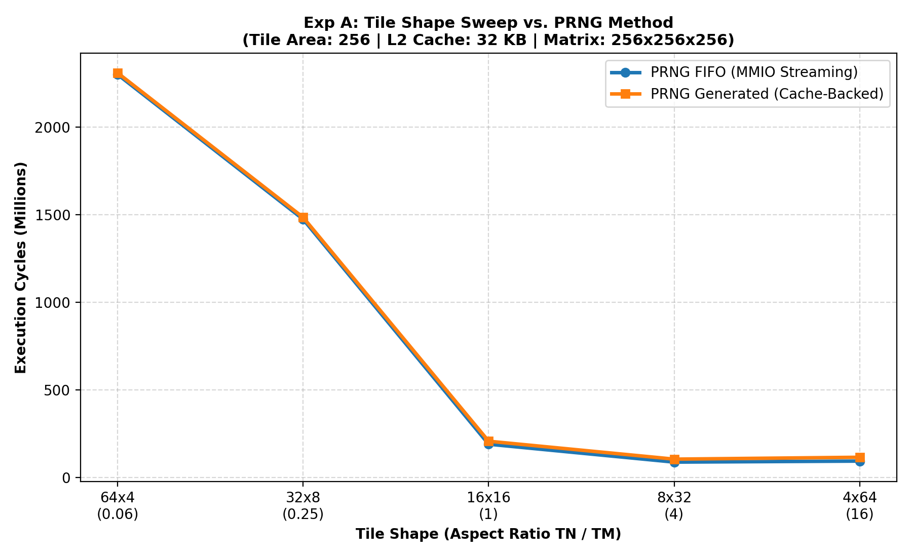
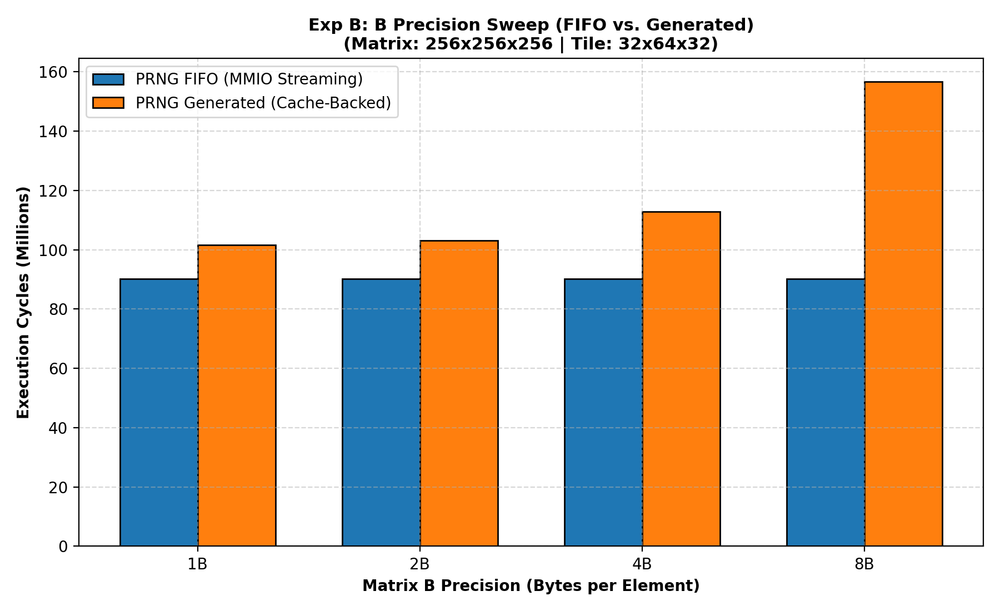
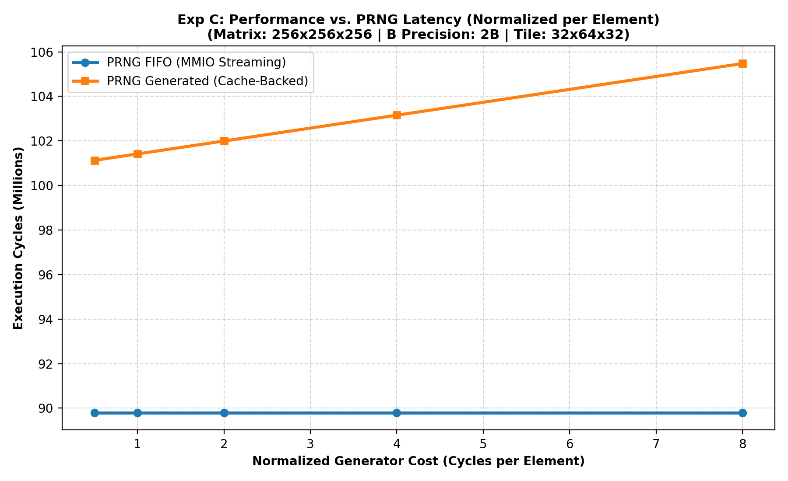
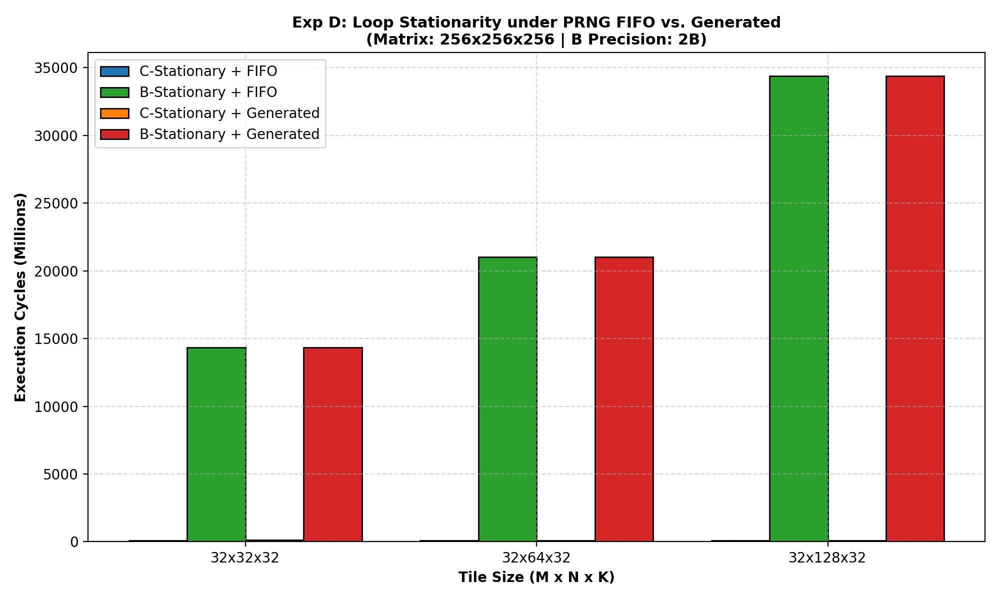

# Advanced Sweeps: PRNG FIFO vs. Cache-Backed PRNG Generated Mode

This directory contains 4 advanced sweeps designed to evaluate the trade-offs between background MMIO PRNG FIFO streaming and standard Cache-Backed PRNG dynamic line generation.

## Table of Contents
1. [Experiment A: Tile Shape Sweep](#experiment-a-tile-shape-aspect-ratio-sweep)
2. [Experiment B: B Precision Sweep](#experiment-b-matrix-b-precision-sweep)
3. [Experiment C: Generator Cost Sensitivity Sweep](#experiment-c-generator-cost-sensitivity-sweep)
4. [Experiment D: Loop Stationarity Sweep](#experiment-d-loop-stationarity--access-policy)

--- 

## 1. Experiment A: Tile Shape Aspect Ratio Sweep

### Experiment A: Tile Shape Aspect Ratio Sweep
Fixed tile area ($T_M \cdot T_N = 256$ elements) and constrained L2 Cache size (32 KB) compares how tile shape aspect ratio affects cache-backed generation vs. MMIO streaming.

| Tile Shape ($T_M \times T_N$) | Ratio ($T_N/T_M$) | FIFO Cycles | Gen Cycles | L2 Hit Rate (Gen) | FIFO Stalls |
| :---: | :---: | :---: | :---: | :---: | :---: |
| 4x64 | 16.0000 | 92,692,912 | 114,539,008 | 0.455 | 6,586,368 |
| 8x32 | 4.0000 | 86,911,850 | 103,884,976 | 0.529 | 6,541,770 |
| 16x16 | 1.0000 | 189,124,256 | 206,252,224 | 0.352 | 243,904 |
| 32x8 | 0.2500 | 1,473,467,936 | 1,484,327,376 | 0.000 | 0 |
| 64x4 | 0.0625 | 2,299,760,704 | 2,309,005,288 | 0.000 | 0 |

--- 

## 2. Experiment B: Matrix B Precision Sweep

### Experiment B: Matrix B Precision Sweep
This sweep compares the scaling of execution cycles as the element precision of Matrix B increases.

| B Precision | FIFO Cycles | Generated Cycles | L1 Hit Rate (Gen) | L2 Hit Rate (Gen) | FIFO Stalls | Speedup (FIFO vs. Gen) |
| :---: | :---: | :---: | :---: | :---: | :---: | :---: |
| 1B | 90,180,352 | 101,578,960 | 0.879 | 0.920 | 379,552 | 1.13x |
| 2B | 90,180,352 | 103,157,040 | 0.864 | 0.920 | 379,552 | 1.14x |
| 4B | 90,180,352 | 112,935,040 | 0.770 | 0.922 | 379,552 | 1.25x |
| 8B | 90,180,352 | 156,668,160 | 0.373 | 0.942 | 379,552 | 1.74x |

--- 

## 3. Experiment C: Generator Cost Sensitivity Sweep

### Experiment C: Generator Cost Sensitivity Sweep
This experiment evaluates the sensitivity of both PRNG modes to generator throughput by sweeping the cost per element.

| Normalized Cost (cy/elem) | FIFO Cycles | FIFO Stall Cycles | Gen Cycles | L2 Hit Rate (Gen) | Ratio (FIFO / Gen) |
| :---: | :---: | :---: | :---: | :---: | :---: |
| 0.5 cycles | 89,800,800 | 0 | 101,128,776 | 0.920 | 0.89x |
| 1.0 cycles | 89,800,800 | 0 | 101,418,528 | 0.920 | 0.89x |
| 2.0 cycles | 89,800,800 | 0 | 101,998,032 | 0.920 | 0.88x |
| 4.0 cycles | 89,800,800 | 0 | 103,157,040 | 0.920 | 0.87x |
| 8.0 cycles | 89,800,800 | 0 | 105,475,056 | 0.920 | 0.85x |

--- 

## 4. Experiment D: Loop Stationarity Sweep

### Experiment D: Loop Stationarity & Access Policy
Comparing C-Stationary and B-Stationary policies under PRNG FIFO and PRNG Generated mode.

| Tile Size | Policy & Mode | Total Cycles | FIFO Stall / Gen Fills | L1 Hit Rate | L2 Hit Rate |
| :---: | :---: | :---: | :---: | :---: | :---: |
| **32x32x32** | C-Stationary + FIFO | 99,006,472 | 267,176 stalls | 0.719 | 0.939 |
| | B-Stationary + FIFO | 14,350,265,900 | 8,192 stalls | 0.053 | 0.158 |
| | C-Stationary + Generated | 111,929,296 | 1,913,368 fills | 0.819 | 0.939 |
| | B-Stationary + Generated | 14,351,004,904 | 75,534,020 fills | 0.054 | 0.158 |
| --- | --- | --- | --- | --- | --- |
| **32x64x32** | C-Stationary + FIFO | 90,180,352 | 379,552 stalls | 0.800 | 0.920 |
| | B-Stationary + FIFO | 21,027,958,912 | 4,096 stalls | 0.037 | 0.111 |
| | C-Stationary + Generated | 103,157,040 | 1,403,864 fills | 0.864 | 0.920 |
| | B-Stationary + Generated | 21,028,726,472 | 109,090,260 fills | 0.038 | 0.111 |
| --- | --- | --- | --- | --- | --- |
| **32x128x32** | C-Stationary + FIFO | 85,756,992 | 436,960 stalls | 0.843 | 0.905 |
| | B-Stationary + FIFO | 34,382,803,760 | 2,048 stalls | 0.023 | 0.070 |
| | C-Stationary + Generated | 98,985,712 | 1,171,288 fills | 0.885 | 0.905 |
| | B-Stationary + Generated | 34,383,611,608 | 176,202,716 fills | 0.024 | 0.070 |

