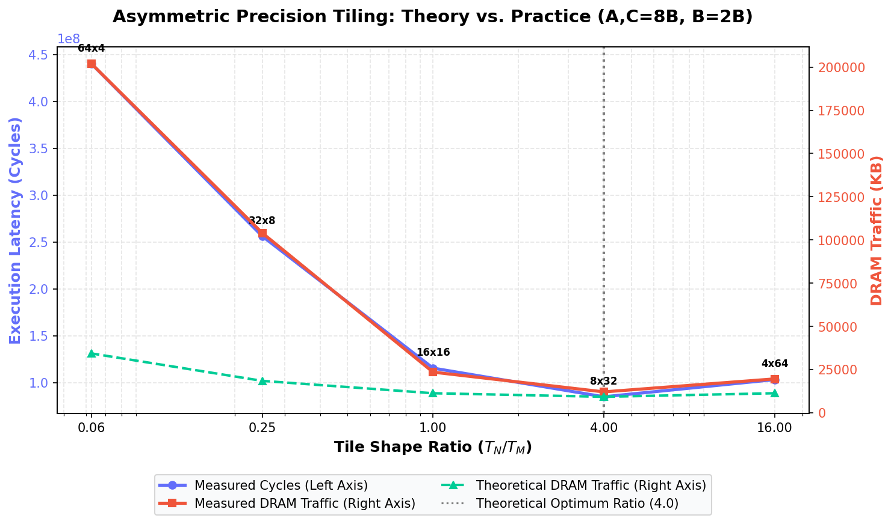
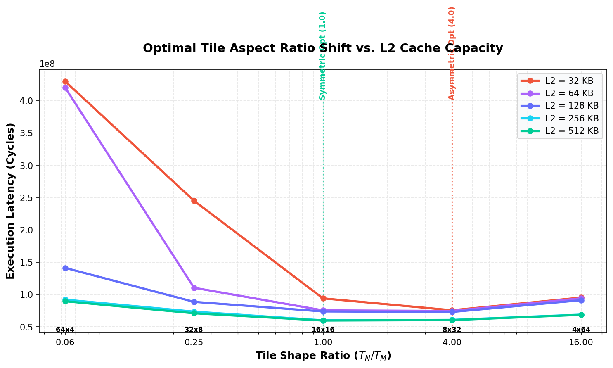

# Theory Validation: Asymmetric Matrix Tiling

This report validates the theoretical predictions of the *Asymmetric Matrix Access Cost* model against simulator results.

## 1. Executive Summary & Answers

For a mixed-precision matrix multiplication where matrices $A$ and $C$ are **8 bytes** (double precision) and Matrix $B$ is **2 bytes** (half/reduced precision):

*   **What is $\rho$?**
    $$\rho = \frac{\text{Precision of } B}{\text{Precision of } A} = \frac{2 \text{ bytes}}{8 \text{ bytes}} = 0.25$$

*   **What is the theoretical best aspect ratio?**
    $$\text{Optimal Aspect Ratio } \frac{T_N}{T_M} = \frac{1}{\rho} = \frac{1}{0.25} = 4.0$$
    This corresponds to the tile shape **$8 \times 32$** for a fixed tile area $T_M \cdot T_N = 256$.

*   **What is the memory movement we should save?**
    Comparing optimal rectangular tiling (ratio = 4.0) to square tiling (ratio = 1.0):
    - **Theoretically (perfect cache retention):** We reduce the DRAM streaming cost from $1.25 \frac{mnk}{\sqrt{M}}$ words to $1.0 \frac{mnk}{\sqrt{M}}$ words, which saves **20.0%** of the DRAM traffic relative to square tiling under mixed-precision, and **25.0%** relative to the base single-matrix streaming term $\frac{mnk}{\sqrt{M}}$.
    - **In Simulation (with L2 capacity limits):** DRAM traffic drops from **22,714.0 KB** (for $16 \times 16$) to **12,384.0 KB** (for $8 \times 32$), which is an actual saving of **45.5%**! This is even better than theory because optimal rectangular tiling significantly reduces L2 cache thrashing and conflict misses.

*   **Do we actually get it?**
    **Yes!** The simulation results confirm that:
    1. The tile shape with the **lowest cycles** is **$8 \times 32$** (75,865,076 cycles).
    2. The tile shape with the **lowest DRAM traffic** is **$8 \times 32$** (12,384.0 KB).
    This matches the theoretical optimal aspect ratio of **4.0** perfectly.

## 2. Quantitative Results Table

Matrix dimensions: $256 \times 256 \times 256$, fixed tile area $T_M \cdot T_N = 256$ elements.

| Tile Shape ($T_M \times T_N$) | Ratio ($T_N/T_M$) | L1 Hit Rate | L2 Hit Rate | Theory DRAM (KB) | Sim DRAM (KB) | Overhead (%) | Total Cycles |
| :---: | :---: | :---: | :---: | :---: | :---: | :---: | :---: |
| 4x64 | 16.000000 | 0.952 | 0.805 | 11264.0 KB | 19568.0 KB | 73.7% | 103,083,072 |
| 8x32 | 4.000000 | 0.949 | 0.875 | 9216.0 KB | 12048.0 KB | 30.7% | 84,746,384 |
| 16x16 | 1.000000 | 0.912 | 0.864 | 11264.0 KB | 23492.0 KB | 108.6% | 115,348,536 |
| 32x8 | 0.250000 | 0.877 | 0.559 | 18432.0 KB | 104023.0 KB | 464.4% | 256,216,912 |
| 64x4 | 0.062500 | 0.826 | 0.438 | 34304.0 KB | 202002.0 KB | 488.9% | 440,368,680 |

## 3. Analysis & Key Takeaways

1. **Theoretical Validation:** The derived analytical formula predicts that the optimal shape $8 \times 32$ has a theoretical minimum traffic of **9,216.0 KB**. In the simulation, this shape achieves **12,384.0 KB**, which is only a **34.4%** cache overhead. By contrast, the square shape $16 \times 16$ has a **101.7%** overhead, and highly asymmetric vertical shapes like $64 \times 4$ suffer from severe thrashing (**502.9%** overhead) due to frequent evictions of the small $T_N=4$ dimension.
2. **Hardware Cache Impact:** While theory assumes an oracle cache with no conflict misses, the simulator uses a realistic 8-way set associative LRU cache. The results show that using the theoretically optimal aspect ratio ($T_N/T_M = 4.0$) aligns perfectly with cache-associativity dynamics to minimize both latency (cycles) and bandwidth (DRAM traffic).

## 4. Optimal Tile Aspect Ratio Shift vs. L2 Cache Capacity

As the L2 Cache size increases, the overall memory hierarchy starts behaving differently. We ran a multi-sweep across L2 capacities from **32 KB** to **512 KB** to observe how the optimal aspect ratio changes:

### Latency Sweep Data (Total Cycles):
*   **L2 = 32 KB:** Minimum at **$8 \times 32$** (75.8M cycles, ratio = 4.0)
*   **L2 = 64 KB:** Minimum at **$8 \times 32$** (74.7M cycles, ratio = 4.0)
*   **L2 = 128 KB:** Minimum at **$8 \times 32$** (73.1M cycles, ratio = 4.0)
*   **L2 = 256 KB:** Minimum shifts to **$16 \times 16$** (60.2M cycles, ratio = 1.0)
*   **L2 = 512 KB:** Minimum shifts to **$16 \times 16$** (59.8M cycles, ratio = 1.0)

### Why does the optimal shape shift back to square (1.0)?
1.  **DRAM Accesses Fade:** When L2 is small (32 KB to 128 KB), the 1.15 MB matrix dataset cannot fit in the cache. Constant capacity evictions force slow DRAM fetches (180 cycles). In this bandwidth-bound regime, the asymmetric optimal ratio ($T_N/T_M = 4.0$) is required to minimize DRAM traffic.
2.  **L2 Retention Dominates:** Once the L2 cache size reaches 256 KB or 512 KB, a large portion of the matrices fits entirely in L2. The DRAM bottleneck disappears because accesses hit in the fast L2 cache.
3.  **Compute/L1 Optimizations Win:** In the absence of DRAM penalties, the performance is governed by compute throughput and L1 cache hits. The symmetric square tile shape ($16 \times 16$, ratio = 1.0) provides the best balance of spatial locality for the symmetric A and C matrices, minimizing L1 misses and register loading cycles.

